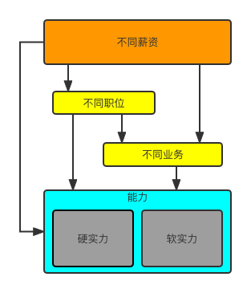

## 项目说明

我总是在想，`我究竟拿时间换了什么？`是金钱？是年龄的增长？还是腰间加厚的脂肪？我不得而知，这是一个哲学的问题，常常让我失眠多梦。2021年12月份，我毅然决然地在疫情期间裸辞了，在家待了几个月之后，我终于有很长时间可以反思自己，回顾自己以往的职业生涯，觉得有很多地方需要在新的工作后改正，我越想越觉得自己没有好好把握住下班后的八个小时。终于，我想不能再这样下去了，于是我决定做点什么……

于是就有了这一个项目。可是当你仔细去搜索一下的时候，你会发现有很多好的项目：

- [JavaGuide](https://javaguide.cn/)
- [Java程序员进阶之路](https://tobebetterjavaer.com/)
- [CS-Notes](http://www.cyc2018.xyz/)
- [JCSprout](https://github.com/crossoverJie/JCSprout)
- [互联网Java进阶面试训练营](https://github.com/shishan100/Java-Interview-Advanced)
- [javaDesign](https://github.com/idaSmilence/javaDesign)
- [interviews](https://github.com/kdn251/interviews/blob/master/README-zh-cn.md)

所以呢，为什么还是会有这么一个项目呢？为什么要重复的去造轮子？那是因为：

- 之前在学校学习的`知识之间没有联系`，你知其然不知所以然！
- `社会上的工作种类五花八门`，你选择的那份工作是否符合你自己的职业发展呢？
- `Java行业需要具备的技能越来越多`，哪些需要你重点掌握，哪些需要你了解即可？
- `已有资料的杂乱无章`，这些资料哪些是基础？哪些可以触类旁通？
- `没有高效的学习方法`，资料摆在你的面前了，你会用它得到一份自己喜欢的工作嘛？

我也当然知道，既然我也要重复造轮子，我就不能跟别人的一样，就要有些差别。可是，可是……可是当我真的动手去做的时候，我发现这是一项浩大的工程，可能需要一年，可能需要两年，可能时间会更长……下面是我最初想要整理的资料清单：

::: info 

:::

我还想整理一些关于找工作一些经验：

::: info
- 不同业务
  - 互联网金融领域
  - 物联网领域
  - ERP领域
  - 办公领域
   - 国企
- 不同岗位
  - 开发工程师
  - 高级开发工程师
  - 架构师
  - CTO
:::

最后形成这样一个`技术观`：

这可把我吓了一跳，但是罗马不是一天建成的，我这样安慰着自己，硬着头皮去做。

废话不多说，我们正式启程……

::: warning
读者需要注意的是，这个项目并不是严格按照上面的清单来写的，上面的清单只是我最初创建这个项目时的一个初步想法，后续有很大地方有所改动。
:::

## 学习方式

::: tip
面向工资找工作（WOJH， Wage-Oriented Job-Huting）。
:::

别人的学习方式我姑且不论，我只说自己的学习方式。面对那么多的技能树，我总的思路是`总——分——总`的学习方式：

- 首先，先明确要学习的内容；
- 其次，搭建一个知识框架；
- 再其次，在知识框架中填入枝枝叶叶；
- 最后，再把所有的东西串起来；

这是学习一个知识的具体过程，但是不要忘了，我们还有一个重大问题：如何抵抗遗忘？我的建议则是：`把功夫下到平时`。换句话来说，就是不要临时抱佛脚，平时刷视频的时间用来读两篇文章。`当你把整个项目看上四五遍的时候，我想你可能就再也忘不掉了`。此外，上面是跟大家分享的我的学习方式，后续的文章，我也尽量按照这种方式来书写。

## 文档结构

本项目预计的项目文档包括下面的内容，后期可能有所改动。

- [**《开发环境手册》**](./linux/)提供了一套Java程序员在开发过程中需要搭建的环境的手册，记录了各种服务器软件的搭建和运维过程
- [**✨ 🎉 《面试前准备》**](./resume/)包含了如何面试前的准备工作、面试过程中、面试后，以及工作过程中的经验
- [**✨🔥《JAVA》**](./java/)Java程序员的技能树，包括市面上一些主流面试中涉及到项目设计的内容、笔者实际开发过程中遇到的一些疑难杂症的解决方案、经典架构设计问题等
- [**《资源共享》**](./share/)一些资源的介绍以及共享方式
- [**《副业之路》**](./slashteen)35岁之前需要做的一些准备以及35岁之后的职业之路再启程

## 公众号

欢迎关注我的同名微信公众号来获取更多信息。

> 公众号作用：文章分享、资源领取、社群连接

---

## 参与贡献

如果你在阅读时发现有些地方有误，也欢迎提[issue](https://github.com/zeanzai/zeanzai.github.io/issues)。

当然也非常欢迎你的贡献：

- 先fork，使自己有修改此仓库的权限；
- 拉取到本地后进行编辑修改；
- 修改后推送到远程分支上；
- 发起pull request的合并请求；

## TODO-list

除了要整理一些Java领域的技能树以外，还有一些其他的内容或新的想法，这里只记录一些跟技能树无关的：

- [x] 迁移之前的文章
- [x] SEO优化，只优化Google Search
- [x] 为每篇文章添加微信公众号的图片【最好是写成组件进行渲染】
- [x] 主页README文档修改
- [ ] 整理百度网盘的资料
- [ ] 微信公众号资料分享相关设置
- [x] 整理网站搭建过程记录文档
- [ ] 给刚毕业的程序员的一些建议
- [ ] 给工作两三年的程序员的一些建议

