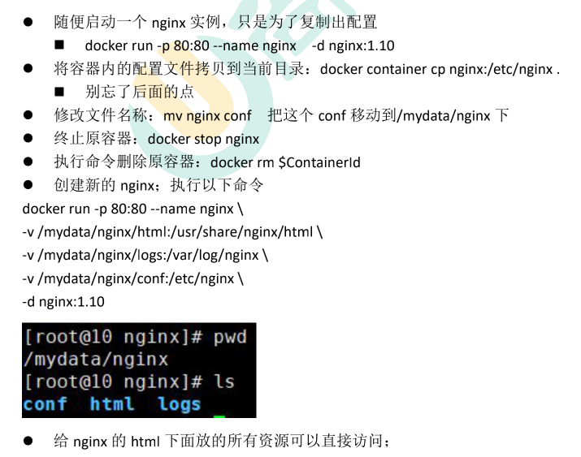

```

docker run -p 80:80 -p 443:443 --name nginx \
-v /mnt/e/backup/html:/usr/share/nginx/html \
-v /mydata/nginx/logs:/var/log/nginx \
-v /mydata/nginx/conf:/etc/nginx \
-d nginx


docker update nginx --restart=always
```




---

<br /><br /><br />


