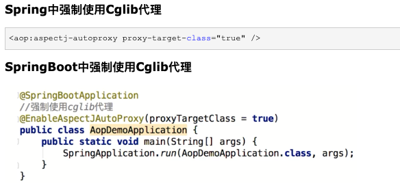

> 1. 实际业务开发过程中遇到的一些问题，引出代理模式
> 2. 代理模式的基本概念、分类、实现原理
> 3. 基于代理模式发展出面向切面编程（AOP）的相关概念
> 4. Spring技术栈中的面向切面编程示例
> 5. AOP的常见应用场景

## 实际业务开发过程中的一些问题 

假设有这样一个场景，有一个 IService 接口，里面有三个方法，然后有三个具体的实现类： ServiceA 、 ServiceB 、 ServiceC ：

1. 如果想要在每一个方法中都添加上统计时间的业务代码，那么我们就需要修改三个具体实现类的每一个方法，这就不符合“开闭原则”；
2. 如果 IService 接口中有很多方法，并且也有很多的具体的实现类，想要实现统计代码耗时的功能，那代码的改动量会更大；
3. 如果上面的接口和具体的实现类均有第三方jar包的形式提供给我们，我们是无法修改源码的；
4. ……

基于上面的问题，我们可以采用继承的方式来解决，即让 ServiceLowA 继承 ServiceA ， ServiceLowB 继承 ServiceB ， ServiceLowC 继承 ServiceC ，然后重写每一个方法的时候添加上统计耗时的代码。这种方式依然不符合“开闭原则”。那我们应该采用那种方式呢？

答案是： 代理模式。

## 代理模式

代理模式（有些地方也称“委托模式”）是GoF23里面的一种，属于结构型模式。它的基本原理是： 提供一个代理类，让原本是对目标方法的直接调用，变成通过代理类的间接调用。从而达到代码的解耦，也有利于附加功能的统计集中管理。

> 一般一个系统当中都会有一些系统服务，例如：日志、事务管理、安全等。这些系统服务被称为：交叉业务。

### 代理模式中的角色：

- 代理类（代理主题）
- 目标类（真实主题）
- 代理类和目标类的公共接口（抽象主题）：客户端在使用代理类时就像在使用目标类，不被客户端所察觉，所以代理类和目标类要有共同的行为，也就是实现共同的接口。


### 代理模式的分类

代理模式的目的在于构建一个代理类对象，但由于代理类对象构建的时机以及交由谁来负责构建代理类对象的不同，导致代理模式具体的实现方式也略微有所差异。

来自[这里](https://juejin.cn/post/6844903744954433544)。

根据`代理对象的字节码的创建时机`来分类，可以分为静态代理和动态代理：

- `静态代理`就是在程序运行前就已经存在代理类的字节码文件，代理类和真实主题角色的关系在运行前就确定了；使用的实现技术是基于jdk-api的，所以需要程序员自行控制代理类的代码逻辑；
- `动态代理`的源码是在程序运行期间由JVM根据反射等机制动态的生成，所以在运行前并不存在代理类的字节码文件；使用一些框架技术，如反射包的proxy、cglib等，不需要程序员自行控制代理类的代码逻辑，只需要程序员关注目标对象及其功能即可。


## 静态代理 


- 代码示例

```
// 实现过程：
//    1. 创建代理类，代理类实现共同接口，并在代理类中持有共同接口的一个代理对象；
//    2. 在代理类中的重写的方法中添加具体的交叉业务代码，完成代码的扩展；
//    3. 使用时，构造一个代理类对象，并传入一个实际的目标类的代理对象，然后再由共同的接口完成方法的调用；

// 创建IService的代理类
public class ServiceProxy implements IService {
    
    private IService target;  //目标对象，被代理的对象

    public ServiceProxy(IService target) {
        this.target = target;
    }
    @Override
    public void m1() {
        long starTime = System.nanoTime();
        this.target.m1();
        long endTime = System.nanoTime();
        System.out.println(this.target.getClass() + ".m1()方法耗时(纳秒):" + (endTime - starTime));
    }
    @Override
    public void m2() {
        long starTime = System.nanoTime();
        this.target.m1();
        long endTime = System.nanoTime();
        System.out.println(this.target.getClass() + ".m1()方法耗时(纳秒):" + (endTime - starTime));
    }
    @Override
    public void m3() {
        long starTime = System.nanoTime();
        this.target.m1();
        long endTime = System.nanoTime();
        System.out.println(this.target.getClass() + ".m1()方法耗时(纳秒):" + (endTime - starTime));
    }
}


@Test
public void serviceProxy() {
    IService serviceA = new ServiceProxy(new ServiceA()); // 创建目标对应的代理对象
    IService serviceB = new ServiceProxy(new ServiceB()); // 创建目标对应的代理对象

    // 由代理对象发起实际的调用
    serviceA.m1();
    serviceA.m2();
    serviceA.m3();
    serviceB.m1();
    serviceB.m2();
    serviceB.m3();
}
```

上面这种方式就是静态代理的实现方式。静态代理的方式实际上应用了“向上转型”的原理，即利用“向上转型”的原理。代理对象的类型和目标对象的类型是在编译期就已经确定了的，因为传入的是 ServiceA 和 ServiceB 的对象，并不是 IService 对象；

::: tip 向上转型 VS 向下转型

向上转型： 类似于 Pet myPet = new Dog();  mypet.speech(); 的方式，就是向上转型，特点是父类对象持有子类对象的引用，即属于父类对象的 myPet 持有子类 Dog 的一个引用。这种方式属于“动态链接”的方式，即被调用的方法类型，在编译期无法确定，只能在运行期才能被确定下来，如编译期并不能确定 mypet 调用的 speech() 方法到底是Pet类中的方法还是Dog类中的方法，只能等到运行期时才能确定下来是Dog类中方法；

如下面的代码： 
```
Pet[] pets = new Pet[2];
pets[0] = new Dog();//多态引用
pets[0].setNickname("小白");

pets[1] = new Cat();//多态引用
pets[1].setNickname("雪球");

for (int i = 0; i < pets.length; i++) {
    pets[i].eat();

    if(pets[i] instanceof Dog){
        Dog dog = (Dog) pets[i];
        dog.watchHouse();
    }else if(pets[i] instanceof Cat){
        Cat cat = (Cat) pets[i];
        cat.catchMouse();
    }
}
```

向下转型

类似于 Dog dog = (Dog) pets[i]; dog.watchHouse(); 的方式，就是向下转型， pets 本身属于Pet类，但是子类的对象持有了一个父类对象的引用。这种方式也属于“动态链接”的方式。

总结：

- 向上转型： 父类 父类对象 = new 子类 ，编译期处理的类型是 父类 的类型，运行期是 子类 的类型，因此编译期不能调用 独属于 子类的方法和变量，这个过程是JVM自动完成的；
- 向下转型： 子类 子类对象 = new 父类 ，编译期处理的类型是 子类 的类型，此时当然可以调用 独属于 子类的方法了，运行期仍然是 父类 的类型。但由于并不是所有的向下转型都是正确的，因此在向下转型的时候有可能会抛出 ClassCastException 异常，因此需要使用 instanceof 来判断“是否属于子类类型” 。
- `静态链接（或早起绑定）`：当一个字节码文件被装载进JVM内部时，如果被调用的目标方法在编译期可知，且运行期保持不变时。这种情况下将调用方法的符号引用转换为直接引用的过程称之为静态链接。那么调用这样的方法，就称为非虚方法调用。比如调用静态方法、私有方法、final方法、父类构造器、本类重载构造器等。
- `动态链接（或晚期绑定）`：如果被调用的方法在编译期无法被确定下来，也就是说，只能够在程序运行期将调用方法的符号引用转换为直接引用，由于这种引用转换过程具备动态性，因此也就被称之为动态链接。调用这样的方法，就称为虚方法调用。比如调用重写的方法（针对父类）、实现的方法（针对接口）。
:::

- 优缺点分析：
  - 优点： 实现简单，不侵入源代码，只需要依赖JDK即可完成；
  - 缺点： 在进行扩展时，需要目标对象和代理对象同时进行修改，具有一定的耦合性；也就是说相比于动态代理，静态代理还是要程序员自行控制代理类代码的编写。

::: tip 下面这些场景就不适合使用静态代理了
虽然静态代理实现简单，且不侵入原代码，但是，当场景稍微复杂一些的时候，静态代理的缺点也会暴露出来。

1. 当需要代理多个类的时候，由于代理对象要实现与目标对象一致的接口，有两种方式：

- 只维护一个代理类，由这个代理类实现多个接口，但是这样就导致代理类过于庞大
- 新建多个代理类，每个目标对象对应一个代理类，但是这样会产生过多的代理类

2. 当接口需要增加、删除、修改方法的时候，目标对象与代理类都要同时修改，不易维护。
:::


## 动态代理-JDK动态代理 

Java动态代理机制的出现，使得Java开发人员不用手工编写代理类，只要简单地指定一组接口及委托类对象，便能动态地获得代理类。代理类会负责将所有的方法调用分派到委托对象上反射执行，在分派执行的过程中，开发人员还可以按需调整委托类对象及其功能，这是一套非常灵活有弹性的代理框架。Java动态代理实际上通过反射技术，把代理对象和被代理对象(真实对象)的代理关系建立延迟到程序运行之后，动态创建新的代理类去完成对真实对象的代理操作(可以改变原来真实对象的方法行为)，这一点成为了当前主流的AOP框架和延迟加载功能的基础。 ———— 引自[这里](https://www.throwx.cn/2018/12/08/java-reflection-dynamic-proxy/)


动态代理主要分为两类： JDK动态代理 和 CGLib动态代理。

### 示例

```
// 需求： 实现上面添加代码耗时的功能
// 实现过程：
//    1. 创建调用处理器，并实现 java.lang.reflect.InvocationHandler 接口，之后在 invoke() 方法中添加具体的交叉业务逻辑；
//    2. 使用时，使用 java.lang.reflect.Proxy#newProxyInstance() 静态方法构造一个代理对象【需要传入三个参数：目标对象、目标方法以及以目标方法的参数】；
//    3. 最后由代理对象发起方法的实际调用
public class CostTimeInvocationHandler implements InvocationHandler {
    private Object target;
    public CostTimeInvocationHandler(Object target) {
        this.target = target;
    }

    /**
    * proxy： 代理对象
    * method： 代理对象需要实现的方法，即其中需要重写的方法
    * args： method所对应方法的参数
    */
    @Override
    public Object invoke(Object proxy, Method method, Object[] args) throws Throwable {
        long starTime = System.nanoTime();
        
        // 调用目标对象的方法
        Object result = method.invoke(this.target, args);
        
        long endTime = System.nanoTime();
        System.out.println(this.target.getClass() + ".m1()方法耗时(纳秒):" + (endTime - starTime));
        return result;
    }
}


@Test
public void serviceProxy() {
    IService serviceA = new ServiceA();
    IService serviceAProxy = (IService) Proxy.newProxyInstance(
      serviceA.getClass().getClassLoader(),
      serviceA.getClass().getInterfaces(),
      new CostTimeInvocationHandler(serviceA));
    
    serviceA.m1();
    serviceA.m2();
    serviceA.m3();

    IService serviceB = new ServiceB();
    IService serviceBProxy = (IService) Proxy.newProxyInstance(
      serviceB.getClass().getClassLoader(),
      serviceB.getClass().getInterfaces(),
      new CostTimeInvocationHandler(serviceB));
    serviceB.m1();
    serviceB.m2();
    serviceB.m3();
}
```

### 原理解析  

jdk为我们的生成了一个叫$Proxy0（这个名字后面的0是编号，有多个代理类会一次递增）的代理类，这个类文件时放在内存中的，我们在创建代理对象时，就是通过反射获得这个类的构造方法，然后创建的代理实例。

我们可以对InvocationHandler看做一个中介类，中介类持有一个被代理对象，在invoke方法中调用了被代理对象的相应方法。通过聚合方式持有被代理对象的引用，把外部对invoke的调用最终都转为对被代理对象的调用。

代理类调用自己方法时，通过自身持有的中介类对象来调用中介类对象的invoke方法，从而达到代理执行被代理对象的方法。也就是说，动态代理通过中介类实现了具体的代理功能。

【在运行时构建一个class字节码数组，并将其转换成一个运行时的Class对象，然后构造其实例】

### 优缺点

动态代理的优势在于可以很方便的对代理类的函数进行统一的处理，而不用修改每个代理类中的方法。
缺点： 代理对象和被代理对象的关系不像静态代理那样一目了然，清晰明了。
只能代理接口，不能代理类。


### 总结

静态代理关键是需要程序员自己构建代理类，这样就会导致代理类的膨胀，还是有一定的耦合性，动态代理就解决了这个问题，它是利用jdk反射包里面的proxy类和invocation接口等，相当于jdk提供了一个代理模式的实现框架，让我们不用关注代理类的构建过程，只需要关注需要实现的额外的功能。

> JDK动态代理的源码解读

## 动态代理-CGLib 


cglib弥补了jdk动态代理的不足，jdk动态代理只能为接口创建代理，而cglib非常强大，不管是接口还是类，都可以使用cglib来创建代理
cglib创建代理的过程，相当于创建了一个新的类，可以通过cglib来配置这个新的类需要实现的接口，以及需要继承的父类
cglib可以为类创建代理，但是这个类不能是final类型的，cglib为类创建代理的过程，实际上为通过继承来实现的，相当于给需要被代理的类创建了一个子类，然后会重写父类中的方法，来进行增强，继承的特性大家应该都知道，final修饰的类是不能被继承的，final修饰的方法不能被重写，static修饰的方法也不能被重写，private修饰的方法也不能被子类重写，而其他类型的方法都可以被子类重写，被重写的这些方法可以通过cglib进行拦截增强

使用CGLib的方式有两种，一种是直接引入相关的jar或者坐标，另一种是结合Spring使用，org.springframework.cglib。

使用方法： 
实现MethodInterceptor接口，在intercept方法中实现代理内容（如日志输出）
使用Enhancer及委托类生成代理类
使用代理类执行函数，就会动态调用intercept方法的实现


```
/**
 * 日志动态代理：cglib实现
 **/
publicclass CglibLogProxyInterceptor implements MethodInterceptor {
    @Override
    public Object intercept(Object object, Method method, Object[] args, MethodProxy methodProxy) throws Throwable {
        System.out.println(" cglib dynamic proxy log begin ");
        Object result = methodProxy.invokeSuper(object, args);
        System.out.println(" cglib dynamic proxy log begin ");
        return result;
    }

    /**
     * 动态创建代理
     *
     * @param cls 委托类
     * @return
     */
    publicstatic <T> T createProxy(Class<T> cls) {
        Enhancer enhancer = new Enhancer();
        enhancer.setSuperclass(cls);
        enhancer.setCallback(new CglibLogProxyInterceptor());
        return (T) enhancer.create();
    }
}

@Test
void testLogProxy() {
    CglibService proxy = CglibLogProxyInterceptor.createProxy(CglibService.class);
    proxy.doAction1();
    System.out.println("############");
    proxy.doAction2();
}
```

另一个使用案例：

```
public class MyProxyByGclib implements MethodInterceptor {
    
    //维护目标对象
    private Object target;
    
   
    public MyProxyByGclib(Object target) {
        this.target = target;
    }
    
    public Object getProxyInstance() {
        //1. 实例化工具类
        Enhancer en = new Enhancer();
        //2. 设置父类对象
        en.setSuperclass(this.target.getClass());
        //3. 设置回调函数
        en.setCallback(this);
        //4. 创建子类，也就是代理对象
        return en.create();
    }

    @Override
    public Object intercept(Object arg0, Method method, Object[] objects, MethodProxy arg3) throws Throwable {
        System.out.println("Begin Transaction");
        //执行目标对象的方法
        Object returnValue = method.invoke(target, objects);
        System.out.println("End Transaction");
        return returnValue;
    }
    
    public static void main(String[] args) {
        //目标对象
        MyServiceImpl myService = new MyServiceImpl();
        //生成代理对象
        MyServiceImpl myProxy = (MyServiceImpl)new MyProxyByGclib(myService).getProxyInstance();
        //调用对象方法
        myProxy.eat();
        myProxy.sleep();
    }

}

```

第三个示例：


CGLib动态代理使用注意事项：
cglib弥补了jdk动态代理的不足，jdk动态代理只能为接口创建代理，而cglib非常强大，不管是接口还是类，都可以使用cglib来创建代理
cglib创建代理的过程，相当于创建了一个新的类，可以通过cglib来配置这个新的类需要实现的接口，以及需要继承的父类
cglib可以为类创建代理，但是这个类不能是final类型的，cglib为类创建代理的过程，实际上为通过继承来实现的，相当于给需要被代理的类创建了一个子类，然后会重写父类中的方法，来进行增强，继承的特性大家应该都知道，final修饰的类是不能被继承的，final修饰的方法不能被重写，static修饰的方法也不能被重写，private修饰的方法也不能被子类重写，而其他类型的方法都可以被子类重写，被重写的这些方法可以通过cglib进行拦截增强


CGLib的其它使用示例：


JDK动态代理与CGLib动态代理的区别：





如果加入容器的目标对象有实现接口,用JDK代理
如果目标对象没有实现接口,用Cglib代理 　　
如果目标对象实现了接口，且强制使用cglib代理，则会使用cglib代理


## 面向切面编程

AOP是指面向切面编程，是计算机科学中的一种程序设计思想，旨在将`交叉切入关注点`与作为业务主体的`核心关注点`进行分离，以提高程序代码的模块化程度。通过在现有代码基础上增加额外的通告（Advice）机制，能够对被声明为“点切入”（Pointcut）的代码块进行统一管理与装饰，比如说：“对所有方法名以set*开头的方法添加后台日志”。该思想使得开发人员能够将与代码核心业务逻辑关系不那么密切的功能（如日志功能）添加至程序中，同时又不降低业务代码的可读性。

它有以下几个概念：

- 连接点 Joinpoint： 在程序的整个执行流程中，可以织入切面的位置。方法的执行前后，异常抛出之后等位置。
- 切点 Pointcut： 在程序执行流程中，真正织入切面的方法。（一个切点对应多个连接点）
- 通知 Advice： 通知又叫增强，就是具体你要织入的代码。
  - 分类：
    - 前置通知：@Before 目标方法执行之前的通知
    - 后置通知：@AfterReturning 目标方法执行之后的通知
    - 环绕通知：@Around 目标方法之前添加通知，同时目标方法执行之后添加通知。
    - 异常通知：@AfterThrowing 发生异常之后执行的通知
    - 最终通知：@After 放在finally语句块中的通知
  - 执行顺序：
    - Spring版本5.3.x以前： 前置通知 > 目标操作 > 后置通知 > 返回通知或异常通知
    - Spring版本5.3.x以后： 前置通知 > 目标操作 > 返回通知或异常通知 > 后置通知
- 切面 Aspect ： 切点 + 通知就是切面。
- 织入 Weaving： 把通知应用到目标对象上的过程。
- 代理对象 Proxy： 一个目标对象被织入通知后产生的新对象。
- 目标对象 Target： 被织入通知的对象。


::: tip 切点表达式

● 用*号代替“权限修饰符”和“返回值”部分表示“权限修饰符”和“返回值”不限
● 在包名的部分，一个“*”号只能代表包的层次结构中的一层，表示这一层是任意的。
  ○ 例如：*.Hello匹配com.Hello，不匹配com.atguigu.Hello
● 在包名的部分，使用“*..”表示包名任意、包的层次深度任意
● 在类名的部分，类名部分整体用*号代替，表示类名任意
● 在类名的部分，可以使用*号代替类名的一部分
  ○ 例如：*Service匹配所有名称以Service结尾的类或接口
● 在方法名部分，可以使用*号表示方法名任意
● 在方法名部分，可以使用*号代替方法名的一部分
  ○ 例如：*Operation匹配所有方法名以Operation结尾的方法
● 在方法参数列表部分，使用(..)表示参数列表任意
● 在方法参数列表部分，使用(int,..)表示参数列表以一个int类型的参数开头
● 在方法参数列表部分，基本数据类型和对应的包装类型是不一样的
  ○ 切入点表达式中使用 int 和实际方法中 Integer 是不匹配的
● 在方法返回值部分，如果想要明确指定一个返回值类型，那么必须同时写明权限修饰符
  ○ 例如：execution(public int ..Service.*(.., int))	正确例如：execution(* int ..Service.*(.., int))	错误

:::


#### 连接点 

连接点表示方法的调用过程，内部包含了方法调用过程中的所有信息，比如被调用的方法、目标、代理对象、执行拦截器链等信息。

上面定义都是一些接口，最终有2个实现。

ReflectiveMethodInvocation
当代理对象是采用jdk动态代理创建的，通过代理对象来访问目标对象的方法的时，最终过程是由ReflectiveMethodInvocation来处理的，内部会通过递归调用方法拦截器，最终会调用到目标方法。

CglibMethodInvocation
功能和上面的类似，当代理对象是采用cglib创建的，通过代理对象来访问目标对象的方法的时，最终过程是由CglibMethodInvocation来处理的，内部会通过递归调用方法拦截器，最终会调用到目标方法。


### 基于AspectJ的编程示例

```
<dependency>
    <groupId>org.springframework.boot</groupId>
    <artifactId>spring-boot-starter-aop</artifactId>
</dependency>


@Retention(RetentionPolicy.RUNTIME)
@Target({ElementType.METHOD})
@Documented
public @interface WebLog {
}

@Aspect
@Component
public class WebLogAspect {

    private final static Logger logger         = LoggerFactory.getLogger(WebLogAspect.class);

    /**
     * 以自定义 @WebLog 注解为切点， 这里事实上是做了简化的，原来的应该是在下面的 doBefore() 方法上添加 
     *    @Before("@annotation(cn.fighter3.spring.aop_demo.WebLog)") 注解的，但是考虑到每个通知上都需要这样写，
     *    因此，干脆把这个 切点表达式 标记成一个方法webLog()，下面的每一个通知只需要写成 webLog() 方法即可。
     **/
    @Pointcut("@annotation(cn.fighter3.spring.aop_demo.WebLog)")
    public void webLog() {}

    /**
     * 在切点之前织入
     */
    @Before("webLog()")
    public void doBefore(JoinPoint joinPoint) throws Throwable {
        // 开始打印请求日志
        ServletRequestAttributes attributes = (ServletRequestAttributes) RequestContextHolder.getRequestAttributes();
        HttpServletRequest request = attributes.getRequest();
        // 打印请求相关参数
        logger.info("========================================== Start ==========================================");
        // 打印请求 url
        logger.info("URL            : {}", request.getRequestURL().toString());
        // 打印 Http method
        logger.info("HTTP Method    : {}", request.getMethod());
        // 打印调用 controller 的全路径以及执行方法
        logger.info("Class Method   : {}.{}", joinPoint.getSignature().getDeclaringTypeName(), joinPoint.getSignature().getName());
        // 打印请求的 IP
        logger.info("IP             : {}", request.getRemoteAddr());
        // 打印请求入参
        logger.info("Request Args   : {}",new ObjectMapper().writeValueAsString(joinPoint.getArgs()));
    }

    /**
     * 在切点之后织入
     * @throws Throwable
     */
    @After("webLog()")
    public void doAfter() throws Throwable {
        // 结束后打个分隔线，方便查看
        logger.info("=========================================== End ===========================================");
    }

    /**
     * 环绕
     */
    @Around("webLog()")
    public Object doAround(ProceedingJoinPoint proceedingJoinPoint) throws Throwable {
        //开始时间
        long startTime = System.currentTimeMillis();
        Object result = proceedingJoinPoint.proceed();
        // 打印出参
        logger.info("Response Args  : {}", new ObjectMapper().writeValueAsString(result));
        // 执行耗时
        logger.info("Time-Consuming : {} ms", System.currentTimeMillis() - startTime);
        return result;
    }

}


@GetMapping("/hello")
@WebLog(desc = "这是一个欢迎接口")
public String hello(String name){
    return "Hello "+name;
}

```

### 注意点

- 相同目标方法上同时存在多个切面时，切面的优先级控制切面的内外嵌套顺序。
  - 优先级高的切面：外面
  - 优先级低的切面：里面
- 使用@Order注解可以控制切面的优先级：
  - @Order(较小的数)：优先级高
  - @Order(较大的数)：优先级低


## 主要应用场景 

记录跟踪：对函数执行前后统一输出日志跟踪执行情况
计时：统一对函数执行用时进行计算（前后时间记录之差）
权限校验：统一在函数执行前进行权限校验
事务：统一对函数作为事务处理
异常处理：对某一类函数执行输出的异常进行统一捕获处理
动态切换数据源：多数据源切换或动态添加数据源


## 总结

1. 代理模式是GoF23里面的一种，属于结构性设计模式；旨在通过构建一个代理对象来完成对目标对象的增强，目的就是为了解耦；
2. 代理模式主要有三个角色的类： 代理类、目标类和公共类；
3. 根据代理类的构建时机来划分，把代理模式划分为两种： 静态代理和动态代理；
4. 静态代理： 在编译期即可生成代理类的字节码文件；基于JDK API来实现，对原有代码的侵入性小、实现过程简单，但扩展时需要同时修改目标类和代理类，具有一定的耦合性；
5. 动态代理： 运行期动态确定代理类；多是基于框架来实现，如jdk反射包下的proxy框架、第三方的CGLib、JavaAssist等，动态代理的优势在于把代理关系或代理对象延迟到运行期；
6. JDK动态代理模式，这种方式实际上是利用了反射包下面的proxy和InvocationHandler接口，为我们的生成了一个叫$Proxy0（这个名字后面的0是编号，有多个代理类会一次递增）的代理类，这个类文件时放在内存中的，我们在创建代理对象时，就是通过反射获得这个类的构造方法，然后创建的代理实例，最后由这个代理实例来完成方法增强；JDK动态代理通过延迟代理关系或代理对象构造过程到运行期，解决了静态代理在扩展时需要同时修改目标类和代理类的扩展性问题，实现了进一步解耦的目的，但是 jdk动态代理只能为接口创建代理，还是具有一定的局限性；
7. CGLib动态代理模式，是基于CGLib来完成的，CGLib是一个强大、高性能的字节码生成库，它用于在运行时扩展Java类和实现接口；本质上它是通过动态的生成一个子类去覆盖所要代理的类（非final修饰的类和方法）。Enhancer可能是CGLIB中最常用的一个类，和jdk中的Proxy不同的是，Enhancer既能够代理普通的class，也能够代理接口。Enhancer创建一个被代理对象的子类并且拦截所有的方法调用（包括从Object中继承的toString和hashCode方法）。Enhancer不能够拦截final方法，例如Object.getClass()方法，这是由于Java final方法语义决定的。基于同样的道理，Enhancer也不能对final类进行代理操作；由于CGLib是对字节码做了增强，因此其性能也比JDK动态代理高；
8. 代理模式逐渐演化出AOP，即面向切面编程的设计思想；AOP包括很多概念，如连接点、切入点、通知（或称增强）、切面等；
9. Spring框架中除支持JDK动态代理模式、CGLib动态代理模式外，还支持AspectJ代理模式；其中JDK动态代理模式、CGLib动态代理模式是Spring AOP支持的，具体使用哪种方式可以自行配置，默认情况下针对接口使用jdk方式，其它的使用cglib方式；而AspectJ代理模式是Spring框架中AspectJ包所支持的，这种方式是SpringBoot支持的默认方式；
10. Spring AOP代理模式 与 AspectJ代理模式 的区别如下： 【重要区别： 一个是为了给某类行为添加共同逻辑，一个是利用代理机制执行某些行为】
11. 
12. 
13. Spring中的哪些功能是基于AOP来完成的：事务、异步、缓存等；
14. 应用AOP的实际业务场景有哪些： 日志、权限校验、执行时间统计、异常处理、动态数据源切换等；


---
<br /><br /><br />

