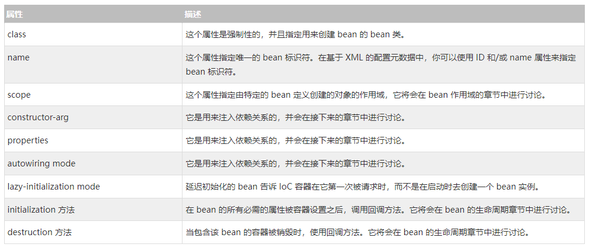
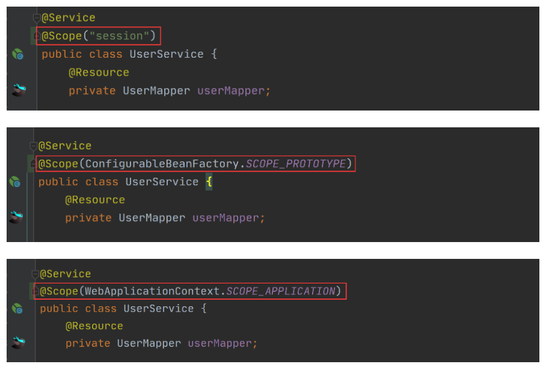
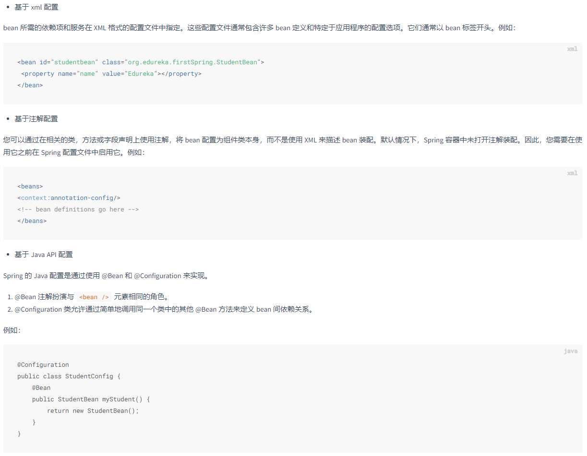
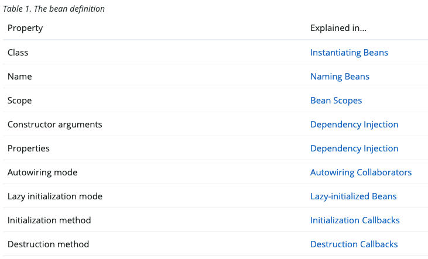

> 容器中保存的内容就是Bean -》 那何为bean -》 如何描述Bean -》 Bean注册到容器的方式 -》 在Bean中使用另一个Bean -》 Bean的装配【何为装配、装配的分类】 -》 Bean的生命周期 


## 何为Bean

## 描述Bean的元信息的方式

### Bean的元信息 

包括bean的状态

## Bean注册到容器的方式 


## 在Bean中使用另一个Bean

## Bean的装配【何为装配、装配的分类】

Spring容器在用到Bean的位置构造出Bean的过程就是装配，比如类A中有依赖了类B，那么Spring容器把类B的一个对象给到A的过程，就是装配。

装配分为两种：
- 手动装配
- 自动装配 

## Bean的生命周期 

## 注解详解 

> autowiring vs resource 
> Configuration vs Component 
> 

## 常见面试题

1. Spring中出现同名bean怎么办？
2. 循环依赖
3. 单例Bean的线程同步问题
4. 


---

## Bean 相关

单个Bean的构造权，通过元信息提供给Spring容器，并由Spring容器进行构造。即Spring容器剥夺了Bean的构造权。

多个Bean之间组合使用，由此产生的依赖关系的装配权，可以由Spring来管理，也可以由开发人员来管理；

### Bean的生命周期 

// TODO 


### Bean的元信息




属性 | 描述
---|---
class | 这个属性是强制性的，并且指定用来创建 bean 的 bean 类。
name | 这个属性指定唯一的 bean 标识符。在基于 XML 的配置元数据中，你可以使用 ID 和/或 name 属性来指定 bean 标识符。
scope | 这个属性指定由特定的 bean 定义创建的对象的作用域，它将会在 bean 作用域的章节中进行讨论。
constructor-arg | 它是用来注入依赖关系的，并会在接下来的章节中进行讨论。
properties | 它是用来注入依赖关系的，并会在接下来的章节中进行讨论。
autowiring mode | 它是用来注入依赖关系的，并会在接下来的章节中进行讨论。
lazy-initialization mode | 延迟初始化的 bean 告诉 IoC 容器在它第一次被请求时，而不是在启动时去创建一个 bean 实例。
initialization 方法 | 在 bean 的所有必需的属性被容器设置之后，调用回调方法。它将会在 bean 的生命周期章节中进行讨论。
destruction 方法 | 当包含该 bean 的容器被销毁时，使用回调方法。它将会在 bean 的生命周期章节中进行讨论。

#### scope

- singleton
  - 描述：该作用域下的 Bean 在 IoC 容器中只存在一个实例：获取 Bean（即通过 applicationContext.getBean等方法获取）及装配 Bean（即通过 @Autowired 注入）都是同一个对象；
  - 场景：通常无状态的 Bean 使用该作用域，无状态表示 Bean 对象的属性状态不需要更新；
  - 备注：Spring 默认选择该作用域，线程不安全，Spring使用ThreadLocal解决线程安全问题；
- prototype
  - 描述：每次对该作用域下的 Bean 的请求都会创建新的实例：获取 Bean（即通过 applicationContext.getBean 等方法获取）及装配 Bean（即通过 @Autowired 注入）都是新的对象实例。
  - 场景：通常有状态的 Bean 使用该作用域。
- request
  - 描述：每次 Http 请求会创建新的 Bean 实例，且创建的Bean实例只对当前 Http 请求有效，Http 请求结束，改Bean实例也被销毁；类似于 prototype。
  - 场景：一次 Http 的请求和响应的共享 Bean。
  - 备注：限定 Spring MVC 框架中使用。
- session
  - 描述：在一个 Http Session 中，定义一个 Bean 实例，不同的 Session 中不共享Bean实例；
  - 场景：用户会话的共享 Bean, 比如：记录一个用户的登陆信息。
  - 备注：限定 Spring MVC 框架中使用。
- application
  - 描述：在一个 Http Servlet Context 中，定义一个 Bean 实例。
  - 场景：Web 应用的上下文信息，比如：记录一个应用的共享信息。
  - 备注：限定 Spring MVC 框架中使用。

设置Bean的Scope属性的方法：

```
<bean id="book02" class="com.spring.beans.Book" scope="singleton"></bean>
<bean id="book02" class="com.spring.beans.Book" scope="prototype"></bean>
<bean id="book02" class="com.spring.beans.Book" scope="request"></bean>
<bean id="book02" class="com.spring.beans.Book" scope="session"></bean>
<bean id="book02" class="com.spring.beans.Book" scope="application"></bean>
```



bean的状态： 

无状态bean和有状态bean

有状态就是有数据存储功能。有状态对象(Stateful Bean)，就是有实例变量的对象，可以保存数据，是非线程安全的。在不同方法调用间不保留任何状态。
无状态就是一次操作，不能保存数据。无状态对象(Stateless Bean)，就是没有实例变量的对象 .不能保存数据，是不变类，是线程安全的。

参考[链接](https://www.cnblogs.com/vipstone/p/16641846.html)


Spring中出现同名bean怎么办？

#### autowiring

no - 这是默认设置，表示没有自动装配。应使用显式 bean 引用进行装配。
byName - 它根据 bean 的名称注入对象依赖项。它匹配并装配其属性与 XML 文件中由相同名称定义的 bean。
byType - 它根据类型注入对象依赖项。如果属性的类型与 XML 文件中的一个 bean 名称匹配，则匹配并装配属性。
构造函数 - 它通过调用类的构造函数来注入依赖项。它有大量的参数。
autodetect - 首先容器尝试通过构造函数使用 autowire 装配，如果不能，则尝试通过 byType 自动装配。


#### lazy-initialization

在bean定义的时候通过lazy-init属性来配置bean是否是延迟加载，true：延迟初始化，false：实时初始化

```
<bean lazy-init="是否是延迟初始化" />

@Lazy 注解
```

### 把元数据提供给 Spring 容器

有三种方式：
- 基于 XML 的配置文件
- 基于注解的配置
- 基于 Java 的配置



```
<bean id="book02" class="com.spring.beans.Book" scope="singleton"></bean>
```


## Bean 配置元信息的方式 

- xml 
- 注解方式 
- SpringAPI方式 
- properties方式

### Bean的依赖注入的方式

- 构造方法
- set方式
- 静态工厂方法
- 实例工厂方法


## Bean

### Bean的元信息



### Bean的作用域 

> 单例模式的线程同步问题
>

### Bean的自动装配方式


autowire 与 resource 的区别；

### Bean的生命周期

### Spring中如何描述Bean

就是说如何把我们创建好的一个个Bean给到Spring容器，这里包括Bean的基本信息以及Bean与Bean之间关系的描述信息等。

- 直接编码方式：我们一般接触不到直接编码的方式，但其实其它的方式最终都要通过直接编码来实现。
- 配置文件方式：通过xml、propreties类型的配置文件，配置相应的依赖关系，Spring读取配置文件，完成依赖关系的注入。
- 注解方式：注解方式应该是我们用的最多的一种方式了，在相应的地方使用注解修饰，Spring会扫描注解，完成依赖关系的注入。


- 配置文件方式 

```
// 在bean.xml中进行描述
<?xml version="1.0" encoding="UTF-8"?>
<beans xmlns="http://www.springframework.org/schema/beans"
       xmlns:xsi="http://www.w3.org/2001/XMLSchema-instance"
       xsi:schemaLocation="http://www.springframework.org/schema/beans
    http://www.springframework.org/schema/beans/spring-beans-4.3.xsd">
    <import resource="其他配置文件的位置" />
    <bean id="bean名称" class="bean完整类名"/>
</beans>

// 使用
@Test
public void test1() {
    //1. bean配置文件位置
    String beanXml = "classpath:beans.xml";
    //2. 创建ClassPathXmlApplicationContext容器，给容器指定需要加载的bean配置文件
    ClassPathXmlApplicationContext context = new ClassPathXmlApplicationContext(beanXml);
    //3. getBeanDefinitionNames用于获取容器中所有bean的名称
    for (String beanName : context.getBeanDefinitionNames()) {
        //获取bean的别名
        String[] aliases = context.getAliases(beanName);
        System.out.println(String.format("beanName:%s,别名:[%s]", beanName, String.join(",", aliases)));
    }
}
```

```
// 配置文件beans.properties中进行配置
car.(class)=com.javacode2018.lesson002.demo1.Car
car.name=奥迪

car1.(class)=com.javacode2018.lesson002.demo1.Car
car1.name=保时捷

car2.(parent)=car1

user.(class)=com.javacode2018.lesson002.demo1.User
user.name=路人甲Java
user.car(ref)=car

// 使用
@Test
public void test2() {
    //定义一个spring容器，这个容器默认实现了BeanDefinitionRegistry，所以本身就是一个bean注册器
    DefaultListableBeanFactory factory = new DefaultListableBeanFactory();

    //定义一个properties的BeanDefinition读取器，需要传递一个BeanDefinitionRegistry（bean注册器）对象
    PropertiesBeanDefinitionReader propertiesBeanDefinitionReader = new PropertiesBeanDefinitionReader(factory);

    //指定bean xml配置文件的位置
    String location = "classpath:/com/javacode2018/lesson002/demo2/beans.properties";
    //通过PropertiesBeanDefinitionReader加载bean properties文件，然后将解析产生的BeanDefinition注册到容器容器中
    int countBean = propertiesBeanDefinitionReader.loadBeanDefinitions(location);
    System.out.println(String.format("共注册了 %s 个bean", countBean));

    //打印出注册的bean的配置信息
    for (String beanName : factory.getBeanDefinitionNames()) {
        //通过名称从容器中获取对应的BeanDefinition信息
        BeanDefinition beanDefinition = factory.getBeanDefinition(beanName);
        //获取BeanDefinition具体使用的是哪个类
        String beanDefinitionClassName = beanDefinition.getClass().getName();
        //通过名称获取bean对象
        Object bean = factory.getBean(beanName);
        //打印输出
        System.out.println(beanName + ":");
        System.out.println("    beanDefinitionClassName：" + beanDefinitionClassName);
        System.out.println("    beanDefinition：" + beanDefinition);
        System.out.println("    bean：" + bean);
    }
}
```

- Java直接编码方式之一： 基于注解（JSR+Spring注解）

```
<context:component-scan base-package="com.atguigu.spring6">
</context:component-scan>

或 

@Configuration
//@ComponentScan({"com.atguigu.spring6.controller", "com.atguigu.spring6.service","com.atguigu.spring6.dao"})
@ComponentScan("com.atguigu.spring6")
public class Spring6Config {
}

// 之后使用

```

- Java直接编码方式之二： 基于SpringAPI方式


- GroovyDSL方式


- 【待定】使用 Spring 官方提供的注解
  - 有哪些注解，这些注解的功能是什么


### 依赖注入的实现方式 

基于Spring的依赖注入的实现方式，意思就是说，现在有一个类A，需要使用别的功能模块中已经开发完成的类B，如何把类B注入到类A中，让类A进行使用。等同于： Bean的实例化 。

- 构造方法

```
public CatDaoImpl(String message){
  this. message = message;
}

<bean id="CatDaoImpl" class="com.CatDaoImpl"> 
  <constructor-arg value=" message "></constructor-arg>
</bean>
```

- setter

```
public class Id {
  private int id;

  public int getId() { return id; }

  public void setId(int id) { this.id = id; }
}

<bean id="id" class="com.id "> 
  <property name="id" value="123"></property> 
</bean>
```

- 实例工厂方式

```
//非静态工厂 
public class DaoFactory { 
   public FactoryDao getFactoryDaoImpl(){
     return new FactoryDaoImpl();
   }
 }
 
public class SpringAction {
  //注入对象
  private FactoryDao factoryDao; 
  
  public void setFactoryDao(FactoryDao factoryDao) {
    this.factoryDao = factoryDao;
  }
}

<bean name="springAction" class="SpringAction">
   <!--使用非静态工厂的方法注入对象,对应下面的配置文件-->
   <property name="factoryDao" ref="factoryDao"></property>
 </bean>
 
 <!--此处获取对象的方式是从工厂类中获取实例方法-->
 <bean name="daoFactory" class="com.DaoFactory"></bean>
 
<bean name="factoryDao" factory-bean="daoFactory" factory-method="getFactoryDaoImpl"></bean>

```

- 静态工厂方式

```
public class DaoFactory { //静态工厂
 
   public static final FactoryDao getStaticFactoryDaoImpl(){
      return new StaticFacotryDaoImpl();
   }
}
 
public class SpringAction {
 
 //注入对象
 private FactoryDao staticFactoryDao; 
 
 //注入对象的 set 方法
 public void setStaticFactoryDao(FactoryDao staticFactoryDao) {
     this.staticFactoryDao = staticFactoryDao;
 }
 
}

//factory-method="getStaticFactoryDaoImpl"指定调用哪个工厂方法
 <bean name="springAction" class=" SpringAction" >
   <!--使用静态工厂的方法注入对象,对应下面的配置文件-->
   <property name="staticFactoryDao" ref="staticFactoryDao"></property>
 </bean>
 
 <!--此处获取对象的方式是从工厂类中获取静态方法-->
<bean name="staticFactoryDao" class="DaoFactory"
  factory-method="getStaticFactoryDaoImpl"></bean>
```

- FactoryBean创建bean对象

```
public class UserFactoryBean implements FactoryBean<UserModel> {
    int count = 1;
    @Nullable
    @Override
    public UserModel getObject() throws Exception { //@1
        UserModel userModel = new UserModel();
        userModel.setName("我是通过FactoryBean创建的第"+count+++ "对象");//@4
        return userModel;
    }
    @Nullable
    @Override
    public Class<?> getObjectType() {
        return UserModel.class; //@2
    }
    @Override
    public boolean isSingleton() { 
        return true; //@3
    }
}

<!-- 通过FactoryBean 创建UserModel对象 -->
<bean id="createByFactoryBean" class="com.javacode2018.lesson001.demo3.UserFactoryBean"/>

//1.bean配置文件位置
String beanXml = "classpath:/com/javacode2018/lesson001/demo3/beans.xml";
//2.创建ClassPathXmlApplicationContext容器，给容器指定需要加载的bean配置文件
ClassPathXmlApplicationContext context = new ClassPathXmlApplicationContext(beanXml);
System.out.println("spring容器中所有bean如下：");
//getBeanDefinitionNames用于获取容器中所有bean的名称
for (String beanName : context.getBeanDefinitionNames()) {
    System.out.println(beanName + ":" + context.getBean(beanName));
}
```

意思就是从Spring容器中获取一个Bean，然后再进行使用。

> 同名Bean的处理办法
> Bean循环依赖的解决方案
> 还有哪些注解可以表示Bean
> Bean的状态


## 配置 

配置元信息
Spring的配置方式有哪些


## 注解详解

● @Autowired注解可以出现在：属性上、构造方法上、构造方法的参数上、setter方法上。
● 当带参数的构造方法只有一个，@Autowired注解可以省略。（）
● @Autowired注解默认根据类型注入。如果要根据名称注入的话，需要配合@Qualifier注解一起使用。

@Resource注解也可以完成属性注入。那它和@Autowired注解有什么区别？
● @Resource注解是JDK扩展包中的，也就是说属于JDK的一部分。所以该注解是标准注解，更加具有通用性。(JSR-250标准中制定的注解类型。JSR是Java规范提案。)
● @Autowired注解是Spring框架自己的。
● @Resource注解默认根据名称装配byName，未指定name时，使用属性名作为name。通过name找不到的话会自动启动通过类型byType装配。
● @Autowired注解默认根据类型装配byType，如果想根据名称装配，需要配合@Qualifier注解一起用。
● @Resource注解用在属性上、setter方法上。
● @Autowired注解用在属性上、setter方法上、构造方法上、构造方法参数上。
@Resource注解属于JDK扩展包，所以不在JDK当中，需要额外引入以下依赖：【如果是JDK8的话不需要额外引入依赖。高于JDK11或低于JDK8需要引入以下依赖。】

```
<dependency>
    <groupId>jakarta.annotation</groupId>
    <artifactId>jakarta.annotation-api</artifactId>
    <version>2.1.1</version>
</dependency>
```

### @ComponentScan、@ComponentScans详解

### @Configuration注解

### 

Web:

@Controller：组合注解（组合了@Component注解），应用在MVC层（控制层）。
@RestController：该注解为一个组合注解，相当于@Controller和@ResponseBody的组合，注解在类上，意味着，该Controller的所有方法都默认加上了@ResponseBody。
@RequestMapping：用于映射Web请求，包括访问路径和参数。如果是Restful风格接口，还可以根据请求类型使用不同的注解：
@GetMapping
@PostMapping
@PutMapping
@DeleteMapping
@ResponseBody：支持将返回值放在response内，而不是一个页面，通常用户返回json数据。
@RequestBody：允许request的参数在request体中，而不是在直接连接在地址后面。
@PathVariable：用于接收路径参数，比如@RequestMapping(“/hello/{name}”)申明的路径，将注解放在参数中前，即可获取该值，通常作为Restful的接口实现方法。
@RestController：该注解为一个组合注解，相当于@Controller和@ResponseBody的组合，注解在类上，意味着，该Controller的所有方法都默认加上了@ResponseBody。
容器:

@Component：表示一个带注释的类是一个“组件”，成为Spring管理的Bean。当使用基于注解的配置和类路径扫描时，这些类被视为自动检测的候选对象。同时@Component还是一个元注解。
@Service：组合注解（组合了@Component注解），应用在service层（业务逻辑层）。
@Repository：组合注解（组合了@Component注解），应用在dao层（数据访问层）。
@Autowired：Spring提供的工具（由Spring的依赖注入工具（BeanPostProcessor、BeanFactoryPostProcessor）自动注入）。
@Qualifier：该注解通常跟 @Autowired 一起使用，当想对注入的过程做更多的控制，@Qualifier 可帮助配置，比如两个以上相同类型的 Bean 时 Spring 无法抉择，用到此注解
@Configuration：声明当前类是一个配置类（相当于一个Spring配置的xml文件）
@Value：可用在字段，构造器参数跟方法参数，指定一个默认值，支持 #{} 跟 ${} 两个方式。一般将 SpringbBoot 中的 application.properties 配置的属性值赋值给变量。
@Bean：注解在方法上，声明当前方法的返回值为一个Bean。返回的Bean对应的类中可以定义init()方法和destroy()方法，然后在@Bean(initMethod=”init”,destroyMethod=”destroy”)定义，在构造之后执行init，在销毁之前执行destroy。
@Scope:定义我们采用什么模式去创建Bean（方法上，得有@Bean） 其设置类型包括：Singleton 、Prototype、Request 、 Session、GlobalSession。
AOP:

@Aspect:声明一个切面（类上） 使用@After、@Before、@Around定义建言（advice），可直接将拦截规则（切点）作为参数。
@After ：在方法执行之后执行（方法上）。
@Before： 在方法执行之前执行（方法上）。
@Around： 在方法执行之前与之后执行（方法上）。
@PointCut： 声明切点 在java配置类中使用@EnableAspectJAutoProxy注解开启Spring对AspectJ代理的支持（类上）。
事务：

@Transactional：在要开启事务的方法上使用@Transactional注解，即可声明式开启事务。


---
<br /><br /><br />

