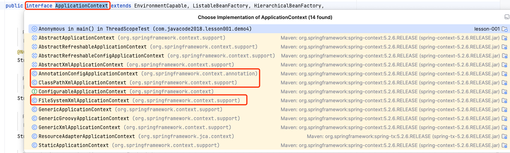

## 容器基本原理 

## 启动流程

## 源码简介

关键api： beanDefinition \ PropertiesBeanDefinitionReader \ BeanFactory \ ApplicationContext \

## 父子容器

## 容器

利用控制反转（IoC）的设计思想，剥夺程序员对Bean的部分控制权，并把这些被剥夺的控制权给到Spring。于是，Spring就要提供管理这些控制权的解决方案，这个解决方案就是容器。

所谓容器，就是说Spring提供了一个类似于数据库的功能，只不过这个功能保存的是JavaBean。

如上图，步骤解析如下：

1. 读取各种各样的配置文件，从中获取各种各样的pojo；
2. Spring容器就从这些配置文件中，获得pojo的文件所在位置，并生成一个 Bean 的注册表；
3. Spring容器会根据 Bean的注册表 实例化Bean，并把实例化后的bean放入 Bean 缓存池里面，以便后续的使用；

> IoC容器的启动源码解析过程：

## 容器 

容器启动过程
父子容器

org.springframework.beans.factory.BeanFactory

org.springframework.context.ApplicationContext

org.springframework.context.support.ClassPathXmlApplicationContext

org.springframework.context.annotation.AnnotationConfigApplicationContext

> BeanFactory VS Application VS FactoryBean

---
   
