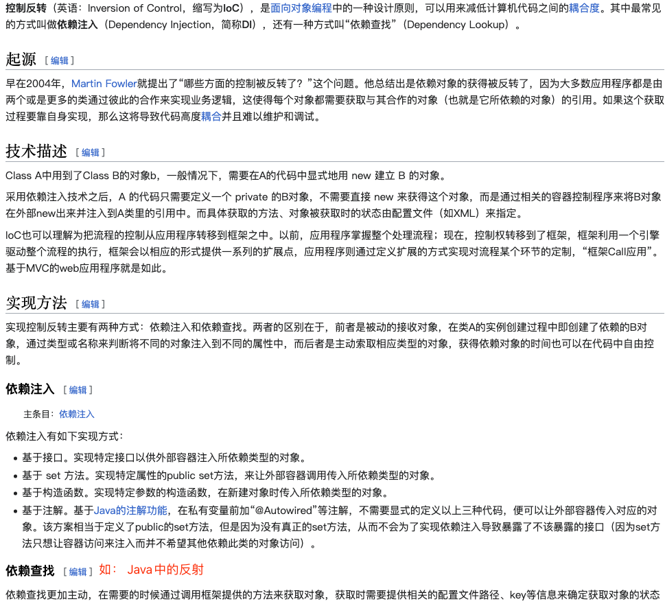
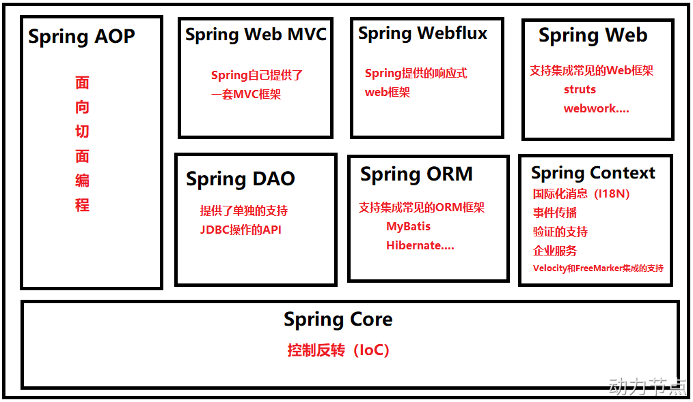
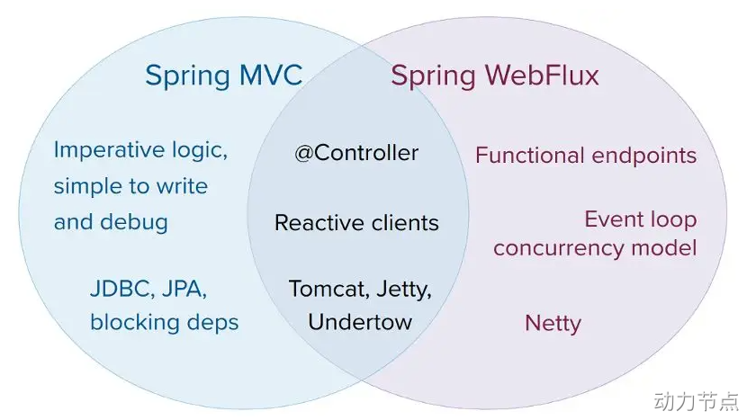
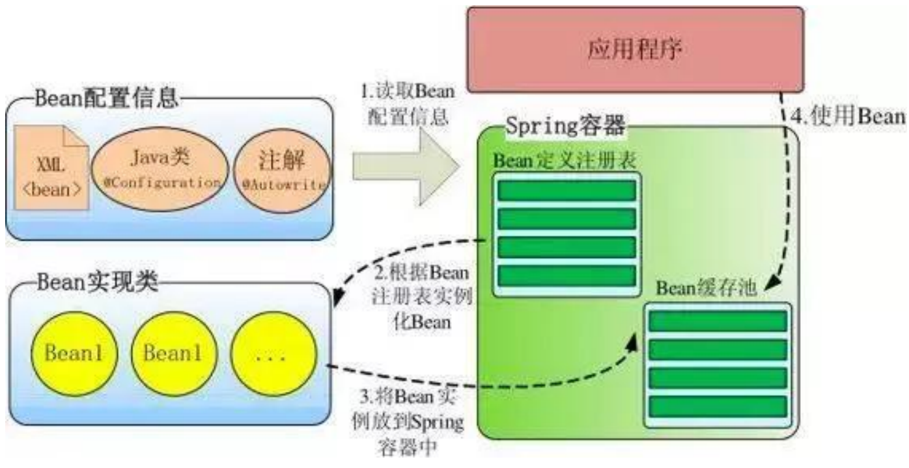

## 背景 

### 前置概念 

### 黎明前的“黑夜”

- 例子1： 从设计模式角度

- 例子2： 构造方法的灵活性

### EJB的困境 

### 总结 

## Spring 

### 特点

### 组件及jar包

### 命名规范 

- Spring产生的背景及其特点
- 组件及其各自作用
- 容器高级视图
- IOC容器的实现（BeanFactory）及其子类
- ApplicationFactory及其子类
- WebApplicationContext功能
- 注解及其作用
- 标准事件分类（5种）
- Bean 
  - 属性
  - 5种作用域
  - 在Spring应用上下文中的生命周期
  - 装配方式（手工装配、自动装配）
  - Bean后置处理器作用及用法
- AOP定义及相关术语、实现方式、基本原理、相关设计模式
- 事务管理、隔离级别、传播机制

> 软件研发过程： 背景描述，需求设计，概要设计，详细设计……因此在学习Spring时，可以把Spring看作是一个业务需求，只不过这个业务需求是要完成对我们写的各种各样的Java类的管理。

- 【背景】EJB开发模式及其弊端
- 【愿景】造一个能帮助程序员管理各种JavaBean组件的容器
- 【实现】Spring框架 
  - 功能特性
  - 简单使用过程
  - 模块及其各自功能特性： Core、Context、AOP、Web、DAO、MVC、ORM
  - 原理 
  - 好处
- Bean相关 
  - 概念： 什么是POJO、组件、Bean等；
  - 元信息：
    - 基本信息
    - 行为信息
    - 依赖信息
    - 延伸 对bean元信息的讲解
  - 描述Bean的元信息的方式
    - xml 
    - Java直接编码
      - 基于注解 
      - 基于SpringAPI方式
    - GroovyDSL方式
    - 【待定】使用 Spring 官方提供的注解
      - 有哪些注解，这些注解的功能是什么
  - 如何实现依赖关系
    - 基于Spring： Spring的自动装配
    - 自行实现： 构造方法，set方法，简单工厂方法、静态工厂方法 
  - Bean的生命周期 
  - 面试题
    - 如何解决循环依赖？
    - Spring中同名Bean的处理方式？
    - 单例Bean的线程同步问题？
    - 为什么要有Bean的生命周期，基于Bean的生命周期能完成什么企业级功能？

## 0.Spring为什么如此重要？

### 前置知识

在没有出现Spring之前，EJB是大型企业级应用的主要技术选型。但EJB有着很大的问题：

1. 整个软件过程中，非业务相关的技术步骤过于复杂与重复。比如每开发一个模块就都需要创建servlet、web.xml等，还需要重量级容器作为支撑等；
2. EJB并没有对Bean的管理和维护设置统一标准，这使得Bean的管理和维护极其混乱；
3. EJB的交叉业务实现过程复杂。比如安全控制、日志记录、事务控制等交叉业务，需要在每个需求中都要进行实现；
4. EJB项目难以测试；
5. ......

> EJB的技术，通俗点讲，就是想方设法实现一个又一个的可复用的JavaBean组件。但是这个过程中需要程序员自行实现，而由于程序员技术素养的差别以及Java语言的灵活性特点，这又导致Bean的实现过程千差万别，最终导致软件系统难以维护。

以上问题，最终抽象并总结起来就是： `Bean的构造权和Bean的依赖关系的控制权` 的归属问题。即传统的软件开发过程中，`Bean的构造权和Bean的依赖关系的控制权`等均由负责开发的程序员来完成，由于每个程序员的专业素养的不同以及Java语言的灵活性，就导致Bean的实现方式各式各样，最终导致软件系统失去控制。

因此，人们就想，能不能造出一种工具，这种工具能让程序员从复杂而又灵活的实现方式中解脱出来。于是Spring应运而生。事实上，随着时间的发展，Spring也逐渐成为Java企业级应用的“事实标准”。

### 实验

1. 模拟传统开发过程，体会过程中遇到的困难；
2. 实现一个简易版的Spring，只完成Bean的注册与获取；
3. 需求变更，要求为每一个接口都提供运行时间的统计功能：
   1. 通过自行编程的方式实现此需求，体会其中的弊端；
   2. 通过JDK代理技术实现此需求，并分析优缺点；
   3. 通过CGLib代理技术实现此需求，并分析优缺点；
4. 体会基于Spring实现上述需求的实现过程，并分析优缺点；

### 丐版Spring

1. [面渣逆袭：Spring三十五问，四万字+五十图详解 ](https://www.cnblogs.com/three-fighter/p/16166891.html)
2. [Spring系列课程（1）— 工厂](https://www.yuque.com/yguangbxiu/note/zxgf4q#rDMTv)

## 类与类之间的关系

> 疑问： Spring的依赖注入中的依赖与UML类图中的依赖关系在语义上是一致的吗？

- Spring提供容器，实现了依赖注入的过程，但对象的构造权和对象关系的维护权，依然可以由程序员自行实现。也就是说对象的创建依然可以由程序员自行维护，这就涉及到采用哪种实现方式为最优解的问题，这个问题换种说话就是：这两种实现方式各自有哪些适用场景，或者说，程序员在业务建模时应当遵守的设计原则有哪些。
- 由UML设计原则知，

- 创建对象的方式及创建对象的时机的选择
  - 构造方法： 
  - set方法 
  - 简单工厂方法 
  - 静态工厂方法 

参考： [Programming.log - a place to keep my thoughts on programming](https://www.cnblogs.com/weidagang2046/archive/2009/12/10/1620587.html)

## EJB的困境

::: tip 前置知识
POJO（Plain Old Java Object, 简单又老的 Java 对象）：不继承任何类、也不实现任何接口、更不遵循任何约定、也不被任何框架侵入的Java对象，理想情况下，POJO是一个只遵循Java语言规范的Java对象；

所谓组件就是一个由可以自行进行内部管理的一个或几个类所组成、外界不了解其内部信息和运行方式的群体。使用它的对象只能通过接口来操作。

Bean的含义是可重复使用的Java组件，并具有以下特点

- 提供默认的构造方法；
- 所有属性的访问范围为private；
- 提供针对属性的get、set方法；
- 实现序列化接口；

简而言之，当一个POJO可序列化，有一个无参的构造函数，使用getter和setter方法来访问属性时，他就是一个JavaBean。（没毛病！）
:::

在没有出现Spring之前，EJB是Java领域大型企业级应用的主要技术选型。但EJB有着很大的问题：

1. 整个软件过程中，非业务相关的技术步骤过于复杂与重复。比如每开发一个模块就都需要创建servlet、web.xml等，还需要重量级容器作为支撑等；
2. EJB并没有对Bean的管理和维护设置统一标准，这使得Bean的管理和维护极其混乱；
3. EJB的交叉业务实现过程复杂。比如安全控制、日志记录、事务控制等交叉业务，需要在每个需求中都要进行实现；
4. 由于框架的复杂性，导致很多业务模块的开发过程并不能很好的遵守设计模式中的 OCP 原则和 DIP 原则，这导致项目模块耦合性较强，耦合性越强，可扩展性就越差；
5. ......

EJB的技术，重点在于想方设法实现一个又一个的可复用的JavaBean组件。但是这个过程中需要程序员自行实现，而由于`程序员技术素养的差别`以及`Java语言的灵活性特点`，这又导致Bean的实现过程千差万别，最终导致软件系统难以维护。

::: tip 设计模式的原则

:::

## 控制反转 

::: tip DIP、IoC、DI、Spring之间的关系

DIP是设计模式中的一种设计原则，不过它属于GoF；
IoC可以看作一种全新的设计模式，但是理论和时间成熟相对较晚，并没有包含在GoF中；
DI是实现了IoC的一种常见的技术实现方式，另一种方式是依赖查找；
而Spring框架就是一个实现了IoC思想的框架；接口注入会使类之间形成一定的依赖关系，产生侵入性，所以Spring不支持接口注入，这不是Spring的缺点，而应该是优点。
:::

## 概念

IoC 与 DI 

控制反转（Inversion of Control，缩写为IoC），是面向对象编程中的一种设计思想，可以用来降低代码之间的耦合度，符合依赖倒置原则。
控制反转的核心是：将对象的创建权交出去，将对象和对象之间关系的管理权交出去，由第三方容器来负责创建与维护。
控制反转常见的实现方式：依赖注入（Dependency Injection，简称DI），狭义上讲，依赖注入就是指对象A依赖于对象B的情况；广义上讲，依赖注入也指某一类对象依赖于某一种特定功能的情况，比如项目中所有的接口中都需要添加安全控制的功能。
通常，依赖注入的实现由包括两种方式：
● set方法注入
● 构造方法注入
而Spring框架就是一个实现了IoC思想的框架。
IoC可以认为是一种全新的设计模式，但是理论和时间成熟相对较晚，并没有包含在GoF中。（GoF指的是23种设计模式）

● 控制反转是一种思想。
● 控制反转是为了降低程序耦合度，提高程序扩展力，达到OCP原则，达到DIP原则。
● 控制反转，反转的是什么？
  ○ 将对象的创建权利交出去，交给第三方容器负责。
  ○ 将对象和对象之间关系的维护权交出去，交给第三方容器负责。
● 控制反转这种思想如何实现呢？
  ○ DI（Dependency Injection）：依赖注入

依赖注入 (Dependency Injection) 和自动装配 (Autowiring) 是 Java 程序开发中常用的两种设计模式，它们的作用是解决对象之间的依赖关系。

依赖注入是一种设计模式，可以将对象的依赖关系从对象本身解耦出来，并使用外部组件来注入依赖关系。这样，对象本身不再需要知道其他对象的细节，也不需要手动创建依赖关系，从而提高了代码的可读性、可维护性和可测试性。

自动装配是 Spring 框架中的一个特性，它可以自动创建并维护依赖关系，使得开发者不需要手动配置。自动装配可以使用 @Autowired 注解或者 XML 配置方式进行配置，它会自动选择合适的 Bean 用于装配。

总的来说，依赖注入是一种设计模式，而自动装配是在依赖注入基础上的一种实现方式，它们的目的都是解决对象之间的依赖关系，但自动装配比依赖注入更易于使用。

## 依赖注入 

一个BeanA依赖了另外一个BeanB，BeanA并没有BeanB的构造权，只有BeanB的使用权，因此Spring需要把构造好的BeanB重新给到BeanA，这个过程就是依赖注入的过程，通俗点讲，就是Spring把创建好的BeanB的对象重新给回BeanA的过程。

Spring容器提供了这几种方式： set、构造方法、静态工厂、实例工厂、Autowiring 方式；

- 按照是否 需要配置Bean之间的依赖信息 ，把依赖注入划分为：手动模式 和 自动模式：
  - 手动模式 - 配置或者编程的方式，提前安排注入规则
    - XML 资源配置元信息
    - Java 注解配置元信息
    - API 配置元信息
  - 自动模式 - 实现方提供依赖自动关联的方式，按照內建的注入规则
    - Autowiring（自动绑定）
- 按照 被依赖者 的
  - setter 
  - 构造方法
  - 静态工厂
  - 实例工厂 

## 防止DI的滥用

> 扩展阅读： 

### 原则一

建模时辨别清楚`对象生命周期`就不难选择采用DI还是创建对象： 

- 依赖关系不需要DI也不需要创建对象；
- 关联关系和聚合关系需要采用DI方式；
- 组合关系需要创建对象方式；

### 原则二

在决定采用DI设计后，马上要考虑的是注入方式问题。DI中注入方式主要有构造函数注入和Setter注入（还有接口注入较少使用，本文不讨论）。“人与身份证的依赖关系”适合采用Setter注入，因为人不是一出生就有身份证，而是到了法定年龄才有，用构造函数注入表达的语义与此相违背。相反“人与父母的依赖关系”则适合采用构造函数注入，因为亲子关系是从人一出生就建立的，用Setter注入必然使得对象创建后有一段时间处于非法状态，按契约式设计的术语即破坏了对象的不变量(invariant)。

## Spring概览

Spring6和Spring5。

### Spring版本命名规范

### Spring特点 

- 轻量级
- 实现了控制反转和容器
- 支持面向切面编程
- 支持事物管理
- 模块化
- ......

### Spring核心组件

- Spring Core模块： 这是Spring框架最基础的部分，它提供了依赖注入（DependencyInjection）特征来实现容器对Bean的管理。核心容器的主要组件是 BeanFactory，BeanFactory是工厂模式的一个实现，是任何Spring应用的核心。它使用IoC将应用配置和依赖从实际的应用代码中分离出来。
- Spring Context模块： 如果说核心模块中的BeanFactory使Spring成为容器的话，那么上下文模块就是Spring成为框架的原因。
这个模块扩展了BeanFactory，增加了对国际化（I18N）消息、事件传播、验证的支持。另外提供了许多企业服务，例如电子邮件、JNDI访问、EJB集成、远程以及时序调度（scheduling）服务。也包括了对模版框架例如Velocity和FreeMarker集成的支持
- Spring AOP模块： Spring在它的AOP模块中提供了对面向切面编程的丰富支持，Spring AOP 模块为基于 Spring 的应用程序中的对象提供了事务管理服务。通过使用 Spring AOP，不用依赖组件，就可以将声明性事务管理集成到应用程序中，可以自定义拦截器、切点、日志等操作。
- Spring DAO模块： 提供了一个JDBC的抽象层和异常层次结构，消除了烦琐的JDBC编码和数据库厂商特有的错误代码解析，用于简化JDBC。
- Spring ORM模块： Spring提供了ORM模块。Spring并不试图实现它自己的ORM解决方案，而是为几种流行的ORM框架提供了集成方案，包括Hibernate、JDO和iBATIS SQL映射，这些都遵从 Spring 的通用事务和 DAO 异常层次结构。
- Spring Web MVC模块： Spring为构建Web应用提供了一个功能全面的MVC框架。虽然Spring可以很容易地与其它MVC框架集成，例如Struts，但Spring的MVC框架使用IoC对控制逻辑和业务对象提供了完全的分离。
- Spring WebFlux模块： Spring Framework 中包含的原始 Web 框架 Spring Web MVC 是专门为 Servlet API 和 Servlet 容器构建的。反应式堆栈 Web 框架 Spring WebFlux 是在 5.0 版的后期添加的。它是完全非阻塞的，支持反应式流(Reactive Stream)背压，并在Netty，Undertow和Servlet 3.1+容器等服务器上运行。
- Spring Web模块： Web 上下文模块建立在应用程序上下文模块之上，为基于 Web 的应用程序提供了上下文，提供了Spring和其它Web框架的集成，比如Struts、WebWork。还提供了一些面向服务支持，例如：实现文件上传的multipart请求。

### Spring容器高层视图

## Spring的组件 

Core
AOP
Transaction

## 参考资料

- 《字节大佬总结的面试题库》
- 《Java小抄》
- [面渣逆袭：Spring三十五问，四万字+五十图详解](https://www.cnblogs.com/three-fighter/p/16166891.html)
- [Java-充电社-Spring教程](http://www.itsoku.com/course/5)
- [Spring](https://docs.spring.io/spring-framework/reference/core/beans/definition.html)
- [Spring6(尚硅谷2023)](https://www.yuque.com/yguangbxiu/note/cfw98m0tg3k6a38d#QCP35)
- [动力节点2022-Spring6](https://www.yuque.com/dujubin/ltckqu/kipzgd)
- [控制反转](https://zh.wikipedia.org/zh-hans/%E6%8E%A7%E5%88%B6%E5%8F%8D%E8%BD%AC)
- [依赖注入中的`依赖`与UML中`依赖关系`在语义上的区别](https://www.cnblogs.com/weidagang2046/archive/2009/12/10/1620587.html)

1. Spring实战（第5版）【文字版】 (克雷格·沃斯) (z-lib.org).pdf
2. Spring高手系列.pdf https://gitee.com/javacode2018/spring-series
3. Spring 5核心原理与30个类手写实战@www.cmsblogs.cn.pdf

- [此文](https://github.com/wuyouzhuguli/SpringAll) 中关于Spring原理部分
- [此文](https://doocs.github.io/source-code-hunter/#/) 中关于Spring原理部分
- [Spring三十五问，四万字+五十图详解！建议收藏！](https://mp.weixin.qq.com/s/Y17S85ntHm_MLTZMJdtjQQ)
 

---

   

