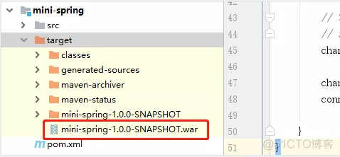
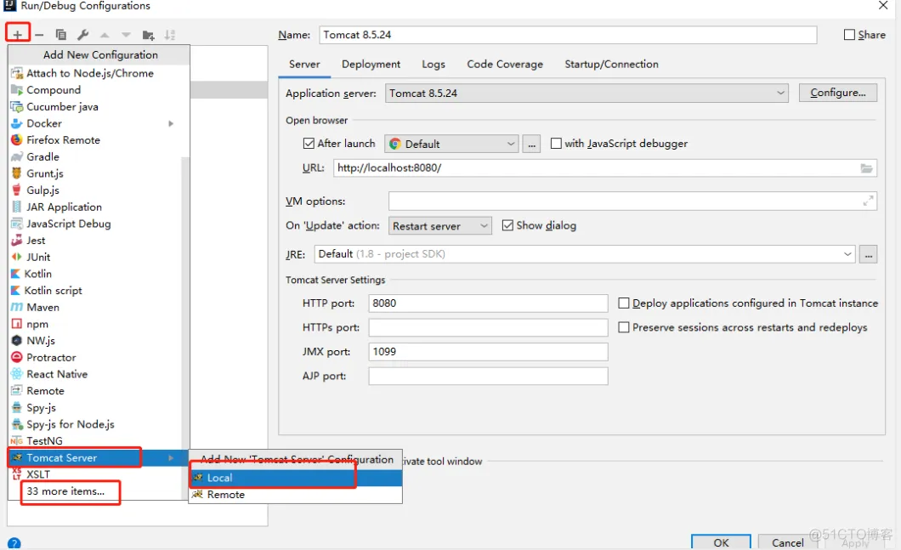
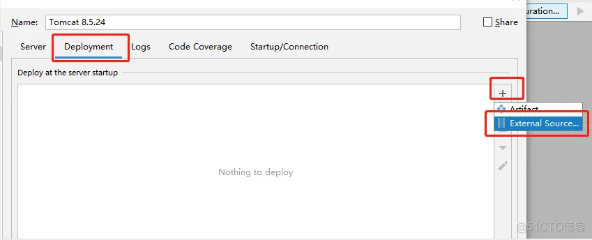
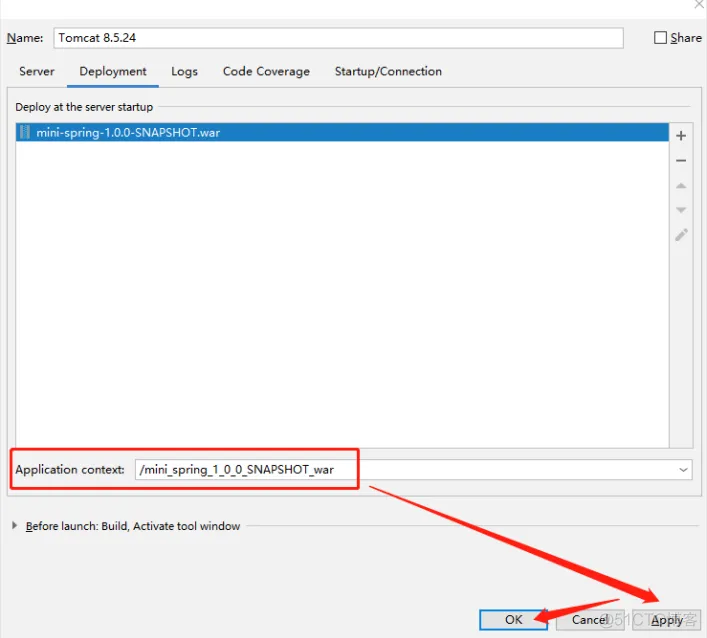

## 基于 Servlet 开发

- 1、pom 文件引入依赖，需要注意的是，package 属性要设置成 war 包，为了节省篇幅，这里没有列出 pom 完整的信息：

```
<packaging>war</packaging> 
<dependencies>
<dependency>
<groupId>javax.servlet</groupId>
<artifactId>servlet-api</artifactId>
<version>2.4</version>
        </dependency>

        <dependency>
            <groupId>org.apache.commons</groupId>
            <artifactId>commons-lang3</artifactId>
            <version>3.7</version>
        </dependency>

        <dependency>
            <groupId>com.alibaba</groupId>
            <artifactId>fastjson</artifactId>
            <version>1.2.72</version>
        </dependency>
    </dependencies>
```
- 2、在 src/main 下面新建文件夹 webapp/WEB-INF，然后在 WEB-INF 下面新建一个 web.xml 文件：

```
<?xml version="1.0" encoding="UTF-8"?>
<web-app xmlns:xsi="http://www.w3.org/2001/XMLSchema-instance"
 xmlns="http://java.sun.com/xml/ns/j2ee" xmlns:javaee="http://java.sun.com/xml/ns/javaee"
 xmlns:web="http://java.sun.com/xml/ns/javaee/web-app_2_5.xsd"
 xsi:schemaLocation="http://java.sun.com/xml/ns/j2ee http://java.sun.com/xml/ns/j2ee/web-app_2_4.xsd"
 version="2.4">
 <display-name>Lonely Wolf Web Application</display-name>
 <servlet>
  <servlet-name>helloServlet</servlet-name>
  <servlet-class>com.lonely.wolf.mini.spring.servlet.HelloServlet</servlet-class>
 </servlet>
 <servlet-mapping>
  <servlet-name>helloServlet</servlet-name>
  <url-pattern>/hello/*</url-pattern>
 </servlet-mapping>
</web-app>
```
这里面定义了 selvlet 和 servlet-mapping 两个标签，这两个标签必须一一对应，上面的标签定义了 servlet 的位置，而下面的 servlet-mapping 文件定义了路径的映射，这两个标签通过 servlet-name 标签对应。

- 3、新建一个 HelloServlet 类继承 HttpServlet：

```
/**
 * 原始Servlet接口编写，一般需要实现GET和POST方法，其他方法可以视具体情况选择性继承
 */
public class HelloServlet extends HttpServlet {
    @Override
    protected void doGet(HttpServletRequest request, HttpServletResponse response) throws ServletException, IOException {
        this.doPost(request,response);
    }

    @Override
    protected void doPost(HttpServletRequest request, HttpServletResponse response) throws ServletException, IOException {
        response.setContentType("text/html;charset=utf-8");
        response.getWriter().write("Hello：" + request.getParameter("name"));
    }
}
```

- 4、执行 maven 打包命令，确认成功打包成 war 包：



- 5、RUN-->Edit Configurations，然后点击左上角的 + 号，新建一个 Tomcat Server，如果是第一次配置，默认没有 Tomcat Server 选项，需要点击底部的 xx more items...：



- 6、点击右边的 Deployment，然后按照下图依次点击，最后在弹框内找到上面打包好的 war 包文件：



- 7、选中之后，需要注意的是，下面 Application Context 默认会带上 war 包名，为了方便，我们需要把它删掉，即不用上下文路径，只保留一个根路径 / （当然上下文也可以保留，但是每次请求都要带上这一部分）， 再选择 Apply，点击 OK，即可完成部署：



- 8、最后我们在浏览器输入请求路径http://localhost:8080/hello?name=双子孤狼，即可得到返回：Hello：双子孤狼。


Spring 5.0 ： 拥抱反应式编程
到目前为止，无论是普通的form-based的MVC，还是Restful风格的Web， 其核心都是Servlet !

Web Container 会维护一个线程池， 当Web请求来了以后，从线程池取一个线程来处理，如果这个请求需要访问数据库，网络，那这个线程就得等着， 这就是所谓同步阻塞的模型。

当请求过多，线程池用光以后，连最基本的请求都无法处理了。为了解决这个问题，Java 世界开始呼唤新的IO模式。

2017年9月发布的Spring 5.0 开始拥抱新的模型：异步非阻塞， 这就是Spring WebFlux。


## 参考链接 


1. https://canvas.zut.edu.cn/courses/2138/pages/jiang-yi-1-spring-ge-javakuang-jia-15nian-de-yan-hua
2. https://blog.51cto.com/u_13929722/3411359


---
<br /><br /><br />

