集合，有些人也称容器，研究这块内容的时候，可以类比研究某一个框架的方法来研究之。

## 1. 概述

先来看一下jdk中集合的类图：

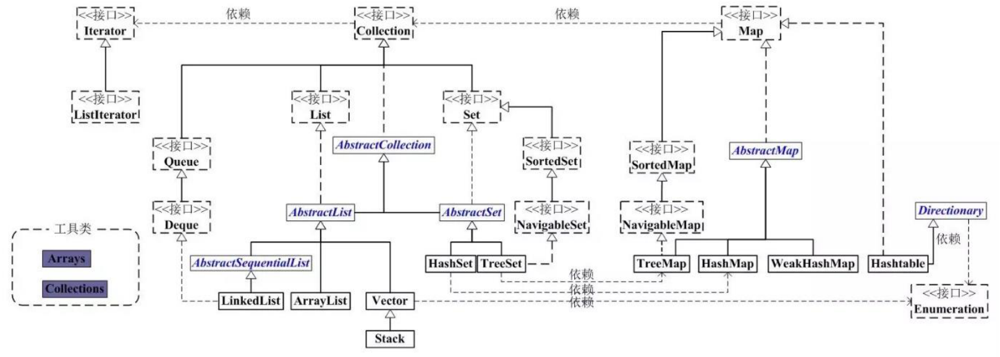

先根据集合大图来看下集合中都包括哪些内容：

- 集合有两个顶级接口
  - Collection
    - 保存单列元素数据
    - 包含两个子接口
      - List： 保存的元素顺序为`有序`
      - Set： 保存的元素顺序为`无序`
    - 具体实现类
      - List接口有： `ArrayList`、 `LinkedList`、 `Vector`（以及Vector的子类 `Stack`）
      - Set接口有： `HashSet`、 `TreeSet`
  - Map
    - 保存双列元素数据， 即保存(key, value)键值对形式的数据元素
    - 具体实现类： `HashMap` 、 `TreeMap` 、 `WeakHashMap` 、 `Hashtable`

## 2. 基本原理

### 2.1. List

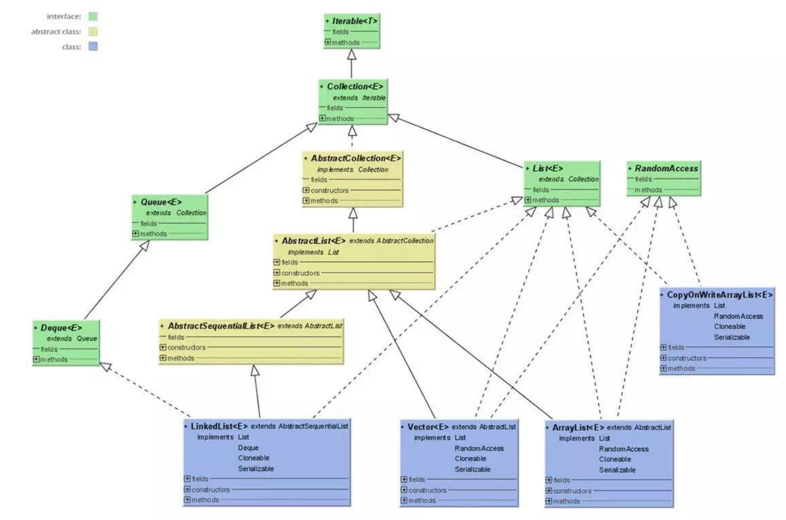

**list具有有序性（存入的顺序与存储的顺序一致），不具备唯一性，元素可以重复，可以插入多个 null 元素，并且每一元素都有索引下标。它包含了 ArrayList 、 Vector 、 LinkedList 三个最重要的实现类。**

#### 2.1.1. ArrayList

- `底层数据结构`
  - Object[] 数组（Java中的数组是引用数据类型，它指向jvm的堆内存中的存放数组元素的开始位置）；
- `默认容量`
  - ArrayList默认最小容量是10，默认最大容量是 MAX_ARRAY_SIZE = Integer.MAX_VALUE - 8 
- `初始化原理`
  - 如果使用无参构造方法，就初始化为 Object[10] ，数组内元素为空，即初始化为 长度为10的空对象数组
  - 如果初始化时一开始指定了容量，则容量为指定的大小 bList = new ArrayList<>(25)， 则 bList 的大小为25
  - 如果通过集合初始化，则容量为集合的大小，如 bList = new ArrayList<>(aList)，其中 aList 的大小为16，则 bList 的大小为16
- `扩容原理`
  - 每次扩容为原来的1.5倍，如果新增后超过这个容量，则容量为新增后所需的最小容量，如 预计本次扩容后容量为30，但是新增的数据容量加上之前的数据容量为45，超过预计扩容后的30，则扩容后的实际容量45
  - 如果增加0.5倍后的新容量超过限制的容量 （也称默认最大容量，即 Integer.MAX_VALUE - 8），则用所需的最小容量与限制的容量进行判断，超过则指定为Integer的最大值，否则指定为限制容量大小
  - 最后通过数组的复制将原数据复制到一个更大(新的容量大小)的数组
- `扩容效率`： 还是很高的
  - 1千需要分配 11次
  - 1万一级需要分配17次
  - 10万 需要分配23次
  - 100万需要分配28次
- `缩容原理`
  - 使用System.copyArrays()方法
- `常用方法`
  - 方法大图
    - 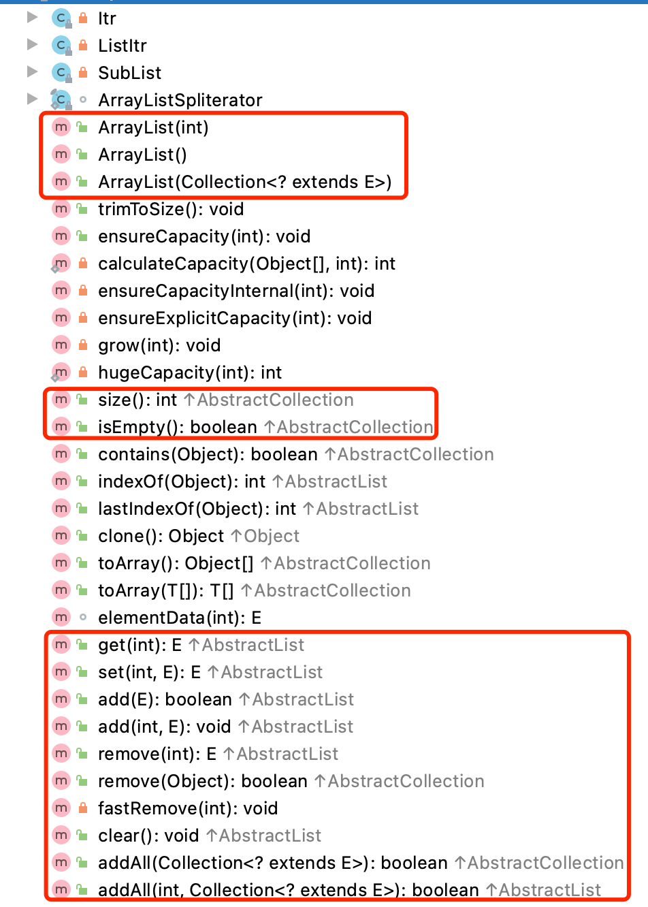
    - 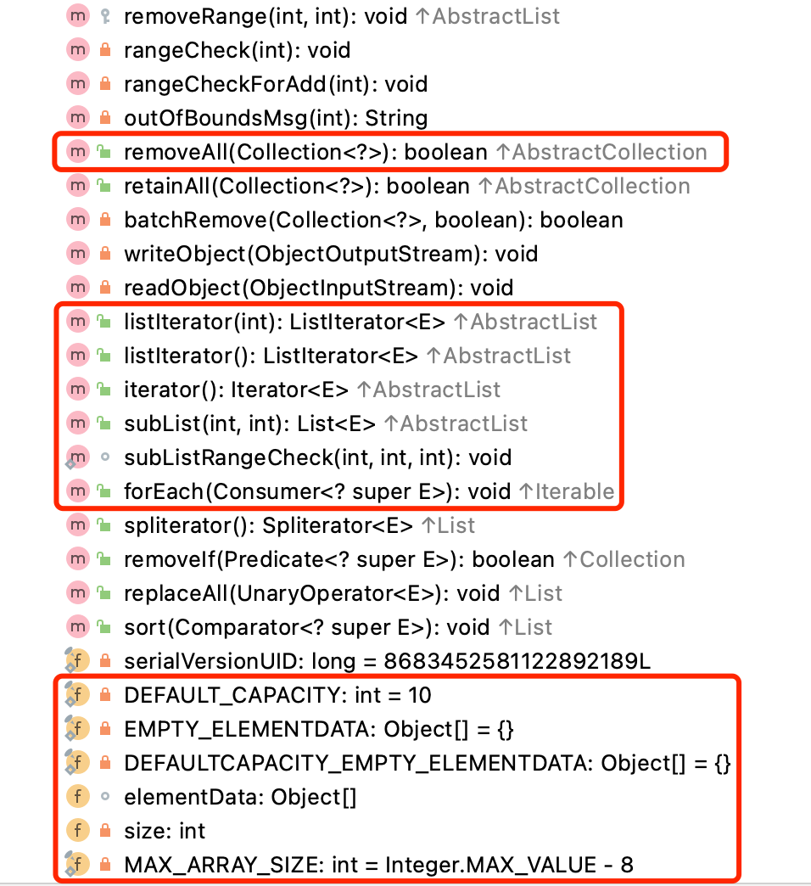
  - 增
    - add(E)： 添加一个元素
    - add(int, E)： 在int位置添加一个元素
    - addAll(Collection<?>)： 往list中插入集合
    - addAll(int, Collection<?>)： 在int位置插入一个集合
  - 删
    - clear()： 删除全部， 底层是把使用for遍历数组，把每一个元素都置为空
    - remove(int)： 删除某下标元素
    - remove(Object)： 删除某元素
    - removeRange(int, int)： 删除连续的一组元素
    - removeAll(Collection<?>)： 传入一个List中包含的集合，删除它
  - 改
    - set(int, E)： 把int位置上的元素设置为E
  - 查
    - get(int)： 根据下标获取元素
  - 遍历
    - for 循环遍历，基于计数器。在集合外部维护一个计数器，然后依次读取每一个位置的元素，当读取到最后一个元素后停止。
    - Iterator 迭代器遍历。 Iterator 是面向对象的一个设计模式，目的是屏蔽不同数据集合的特点，统一遍历集合的接口。Java 在 Collections 中支持了 Iterator 模式。
    - foreach 循环遍历。foreach 内部也是采用了 Iterator 的方式实现，使用时不需要显式声明 Iterator 或计数器。优点是代码简洁，不易出错；缺点是只能做简单的遍历，不能在遍历过程中操作数据集合，例如删除、替换。
    - ListIterator 遍历。 list 和 set 都实现了 Iterator 接口，但是 list 又实现了 ListIterator 接口。
- `由源码得出的其它特点`
  - `内存特点`： 内存规整
  - `操作方法特点`： 增删需要数组拷贝，效率低；修改和查询较快，效率高；
  - `同步特点`： 不支持线程同步，即属于非线程安全的类。但是可以使用 **`Collections.synchronizedList(aList)`** 把ArrayList变成线程安全类，或者直接使用 **`CopyOnWriteArrayList`** 进行线程同步
  - `Fail-Fast机制`：使用modNum来来控制，假设存在两个线程（线程1、线程2），线程1通过Iterator在遍历集合A中的元素，在某个时候线程2修改了集合A的结构（是结构上面的修改，而不是简单的修改集合元素的内容），那么这个时候程序就会抛出 ConcurrentModificationException 异常，从而产生fail-fast机制；这种机制是早期为了平衡集合性能和线程同步而引入的，目的就是为了弥补集合中不支持线程同步的问题
- `最佳实践`：
  - 如果知道集合元素个数，建议使用带参构造方法【ArrayList(int)】进行初始化，这样避免多次扩容缩容影响性能；
  - 因为实现了 RandomAccess 接口，所以建议优先使用 for 遍历元素， 时间复杂度为 O(1)
  - 适合随机查询或遍历，插入和删除较慢；

#### 2.1.2. LinkedList

这里通过类比来学习， LinkedList 与 ArrayList 的区别：

- `存储结构`： ArrayList 是对象数组， LinkedList 是双向列表（1.7之前是双向循环链表，1.7取消了循环），存储同样元素下， LinkedList 空间占用比 ArrayList 多，因为 LinkedList 还要保存指针元素；
- `同步特性`： 二者都不支持线程同步，即非线程安全的
- `插入和删除是否受存储位置影响`
  - ArrayList 受存储位置影响
    - 以 O(1) 的时间复杂度在列表末尾追加（或删除）元素
    - 以 O(n-i) 的时间复杂度在列表第i个位置插入（或删除）数据，因为需要移动i之后的所有数据
  - LinkedList 不受存储位置的影响
    - 以 O(1) 的时间复杂度在列表末尾追加（或删除）元素
    - 以 O(n) 的时间复杂度在列表第i个位置插入（或删除）数据，因为要遍历到第i个位置，然后执行操作
- `是否支持快速随机访问`： ArrayList 支持快速随机访问， LinkedList 不支持，但二者都实现了 ListIterator 接口，而 Set 没有实现

::: tip 补充双向链表与双向循环链表的区别
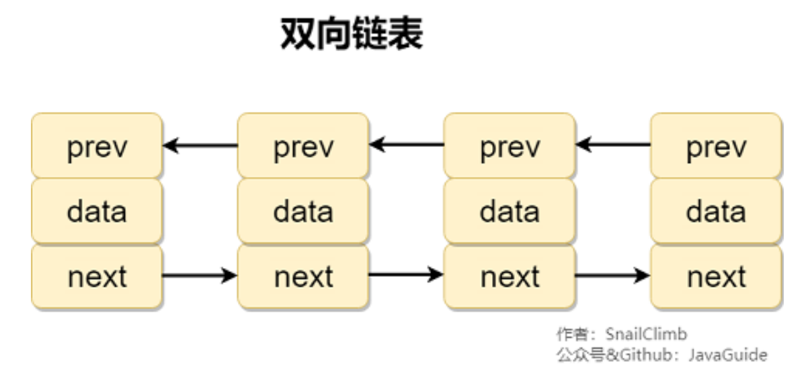

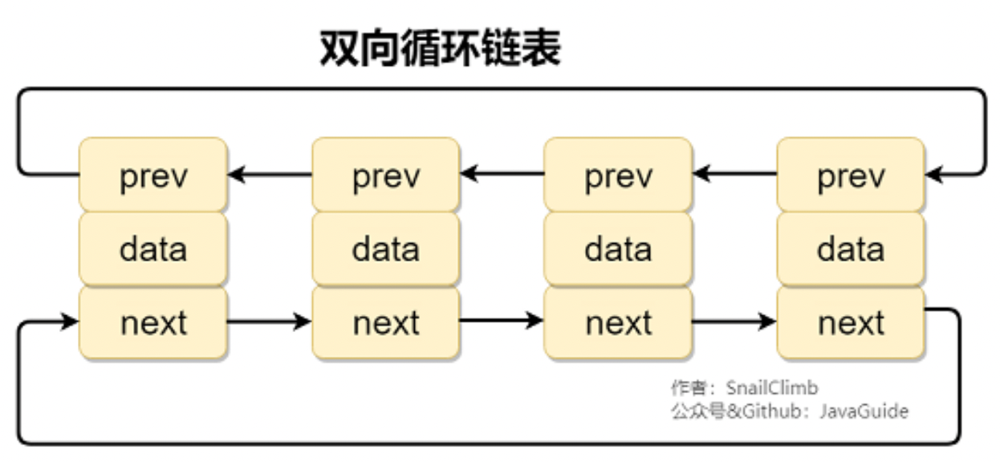
:::

#### 2.1.3. Vector

还是通过类比的方式来学习， Vector 与 ArrayList 的区别：

- 存储结构： 二者都是对象数组
- 同步机制： ArrayList 不支持同步， Vector 支持同步（是Java的古早类，比 ArrayList 多了个 synchronized ，官方已经不建议使用）
- 扩容机制： ArrayList 扩容为原来的1.5倍， Vector 扩容为原来的2倍；
- 迭代器不同： ArrayList 是 Iterator ， Vector 是 Enumerator；

### 2.2. Map

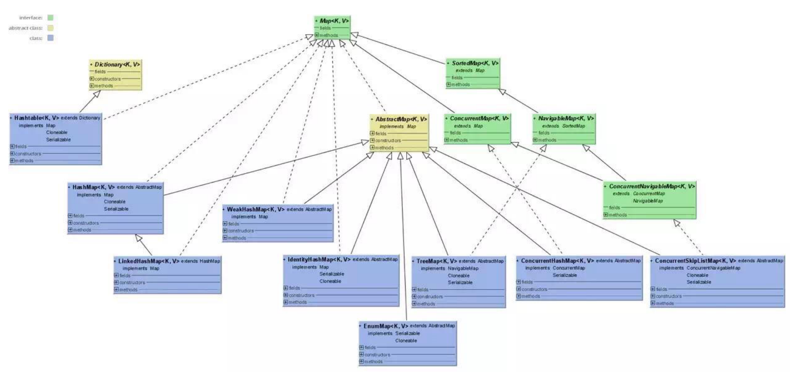

map用来存放键值对。包含了 `HashMap` 、 `Hashtable` 、 `TreeMap` 、 `LinkedHashMap` 、 `WeakHashMap` 几个重要的实现类。键均不可重复，但是值可以重复；

#### 2.2.1. HashMap

前置知识请[参考](../cscore/dsa/hashtable.md)。

- Java7实现
  - `基本数据结构`是： Entry 的数组，而 Entry 中又有一个next引用，指向下一个Entry，整体看起来是一个 数组 + 链表 的数据结构，其实本质上是一个数组；
    - 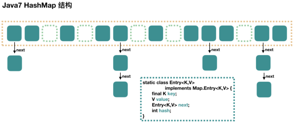
  - `相关属性及默认值` 
    - 初始化容量 DEFAULT_INITIAL_CAPACITY ： 16
    - 装载因子 DEFAULT_LOAD_FACTOR ： 0.75
    - 扩容的阈值 threshold ： capacity * load factor
  - `构造方法`： 有四个初始化构造方法，主要都是给 loadFactor 和 initialCapacity 两个属性的赋值，而底层的数据结构的初始化则是在put值时才进行的初始化；
  - `数据结构`： 数组 + 单向链表
  - `put(pKey, pValue)原理`： 
    - 先对key进行hashcode操作，找到对应的数组位置，将该key对应的Entry（链表节点的数据结构为Entry）放进去数组，具有相同hashcode值得Entry为同一个位置，不同的值以单向链表的方式存放，存放时以插头法存放，多线程条件下，有可能会出现循环链表的情况（我们知道只要put，就有可能扩容，只要扩容，就有大概率需要重新hash，重新hash时，假设线程A在rehash时算出来有一个EntryA指向了EntryB，而线程B在rehash时算出来EntryB指向EntryA，这就导致了一个循环链表），这种情况会导致多线程并发读时出现死锁的情况
  - `get原理`： 先比对hashcode是否相同，相同后使用equals方法判断值是否相同，相同的话就可以获取指定元素，查找的时间复杂度为O(n)
  - `扩容机制`： 扩容为原来的2倍，扩容后会重新计算hashcode的值。
  - `同步特性`： 不支持线程同步，即非线程安全
- Java8实现
  - `相关属性及默认值`
    - 树化最小值： 默认为64， 表示数组在转化成红黑树的过程中，如果数组中长度小于64，会先扩容数组；
  - `hash函数发生变化`：相比在1.7中的4次位运算，5次异或运算（9次扰动），在1.8中，只进行了1次位运算和1次异或运算（2次扰动），分布更加均匀，性能更好
    - 在1.8中，是调用了key的父类Object的hashcode方法获取hashcode，然后用hashcode进行1次位运算和1次异或运算
    - 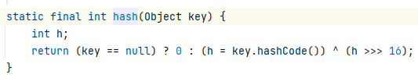
  - `put方法发生变化`：
    - 1.8会多了链表长度的判断，如果链表长度超过8，就会自动转化为红黑树； 如果hash槽的元素个数小于6时，会退化为链表；
    - 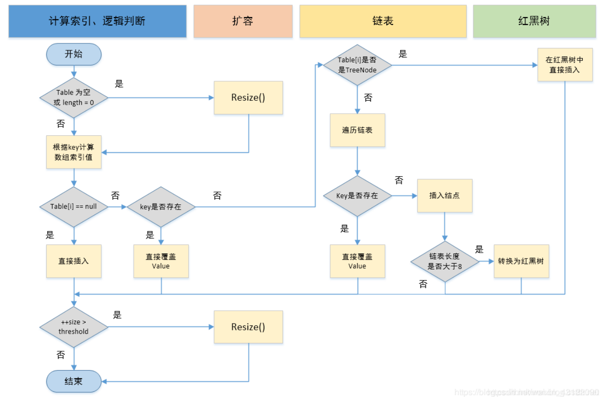
  - `数据结构发生变化`：
    - 数组中的元素由1.7的 entry 变成了1.8的 node 
    - 头插法变成尾插法：解决了循环链表的问题
    - 1.7时数组+单向链表，变成了1.8中的数组 + 单向链表 + 红黑树，优化了hash冲突后的查询效率，单向链表的查询效率是O(n)，而1.8链表长度超过8，就会自动转化为红黑树，红黑树是一种二叉查找树，查询效率为O(logn)，查询效率更高
    - 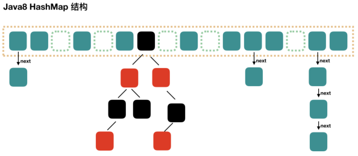
  - `遍历方法`： 都是调用底层的Itrator迭代器
  - `同步特性`： 同样不支持线程同步，同样支持 fast-fail 机制
- 实际应用
  - `初始化可以指定初始化容量，也可以指定负载因子`
    - 指定初始化容量： 如果知道业务的数据量，最好是使用带一个参数的构造函数来初始化hashmap，即制定初始化hashmap的容量，并且这个容量最好是2的幂次方；如果自定义容量不是2的幂次方，程序会通过 tableSizeFor(int cap) 方法初始化容量为2的幂次方（如，初始化容量为7，不是2的幂次方，tableSizeFor(7)方法会找到大于这个初始化容量值最小的2的幂次方8；再如，初始化容量为15，不是2的幂次方，tableSizeFor(15)就会找到大于这个初始化容量值最小的2的幂次方16，再如：tableSizeFor(30)=tableSizeFor(31)=tableSizeFor(32)=32）
    - 指定负载因子： 两个参数的构造函数，除了指定初始化容量外，还指定了负载因子，但是实际中，负载因子默认即可，如果真的有必要，我们可以通过调节负载因子的大小来影响hashmap的行为：
      - 当我们调低负载因子时，HashMap 所能容纳的键值对数量变少。扩容时，重新将键值对存储新的桶数组里，键与键之间产生的碰撞会下降，链表长度变短。此时，HashMap 的增删改查等操作的效率将会变高，这里是典型的拿空间换时间
      - 相反，如果增加负载因子（负载因子可以大于1），HashMap 所能容纳的键值对数量变多，空间利用率高，但碰撞率也高。这意味着链表长度变长，效率也随之降低，这种情况是拿时间换空间
  - `使用任何对象作为key`
    - 是可以使用任何对象作为key的，但是前提是这些对象要实现重写object的hashcode()方法和equals()方法
- 面试题
  - 为什么初始化容量为16？
    - 这应该是一个经验值，可以是8，也可以是32，如果是16且负载因子为0.75的话，根据泊松分布，7是分界岭，小于7（即小于等于6）应该使用链表；大于7（即大于等于8）应该变成红黑树；
  - HashMap 中几个关键属性为什么都用 transient 关键字修饰？
    - 这是为了在序列化时，为了节省空间，只需要把不为空的Node元素序列化即可。
  - 能否使用任何类作为HashMap的key？应该注意什么？
    - 可以，但是这些类要重写hashcode()方法和equals()方法
  - 1.8中为什么HashMap中数组长度要是2的幂次方？
    - 因为put操作时，是用 hashcode 和 （数组长度-1） 做 “与” 运算的出数组下标的，而实际上在计算数组下标位置时，只需要用hashcode对数组长度做除留余数法就可以得到数组下标，而当数组长度为2的幂次方时，用hashcode对数组长度做除留余数法就等价于 hashcode 和 （数组长度-1） 做 “与” 运算，并且“与”运算的性能更好，因此数组长度为2的幂次方。

::: tip 散列表
1. 散列算法： 把一串数据变成固定长度的一种算法
2. 负载因子： 数组中实际的元素个数 / 数组所能容纳的元素个数 ， 负载因子大于0，负载因子越大代表数组元素越多，冲突也就越多，put和get的性能也就越差，但是节省存储空间；负载因子越小代表数组中元素越少，冲突也就越少，put和get的性能也就越好，但是浪费存储空间
:::

#### 2.2.2. Hashtable

这里类比 HashMap 来学习，二者的区别主要有：
  - 默认值不一样： Hashtable 默认初始化容量为 11， 扩容为2n+1； HashMap 默认初始化容量为16， 扩容为2n；
  - 对Null的支持不一样： Hashtable 既不允许null的key，也不允许null的value； HashMap 只允许一个null的key，允许多个null的value；
  - 同步特性不一样： Hashtable 支持线程同步，即线程安全，但是效率很低； HashMap 不支持线程同步，效率略高
  - 基类不同： Hashtable 继承至 Dictionary 类， HashMap 继承至 AbstractMap 类，
  - 迭代器不同： Hashtable 的迭代器是 Enumerator ，它不是 fail-fast 的； HashMap 的迭代器是 Iterator ，支持 fail-fast 机制；
  
#### 2.2.3. TreeMap

- 保存内容： 有序的K-V键值对集合，通过红黑树实现
- 实现： 实现了SortedMap接口和NavigableMap接口
  - 实现 SortedMap 接口让 TreeMap 具有了根据键排序的能力，默认根据key的升序顺序进行排序，也可以根据构造时传入的 Comparator 进行排序； 使用 Iterator 遍历时，得到的记录是排过序的；
  - 实现 NavigableMap 接口让 TreeMap 具有了对集合内元素搜索的能力
- 同步特性： 不支持线程同步，即线程不安全的；

#### 2.2.4. LinkedHashMap

- 保存了记录的插入顺序，新得到的肯定是先插入的，继承自HashMap，因此具有和HashMap一样的查询效率。
- 内部维护了一个双向链表，用来维护插入顺序

#### 2.2.5. WeakHashMap

- WeakHashMap的Entry继承自WeakReference（弱引用类，会在下一次垃圾回收时被回收），主要用来实现缓存。
- Tomcat中的ConcurrentCache使用了WeakHashMap来实现缓存；

### 2.3. Set

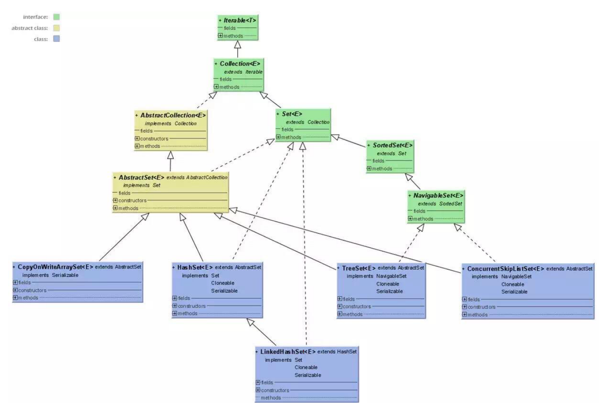

**set具有无序性（存入的顺序与实际存储的顺序不一致），具有唯一性，元素不能重复，只允许插入一个 null 元素。它包含了 HashSet 、 LinkedHashSet 、 TreeSet 三个重要的实现类。** 

每个 Set 的底层实现其实就是对应的 Map：数值放在 map 中的 key 上，value 上放了个 PRESENT，是一个静态的 Object，相当于 place holder，每个 key 都指向这个 object。

#### 2.3.1. HashSet

- `底层实现`： 基于 HashMap 实现， 值放到 HashMap 的key上面， HashMap 的值同一为present； 实现较为简单，基本上都是调用底层 HashMap 的相关方法完成的；不允许存放重复元素；
- 使用add添加元素，存储元素的位置并不是按照存入时的位置，而是按照散列算法求取的的哈希值来存放的，即元素的hashcode方法；hashcode值相等的元素会放到同一个位置上，再使用equals方法判断值是否一致，如果一致就不再存储，如果不一致会在同样的哈希值下顺延；
- `其它特点`：存放位置无序；
- 判断重复性： 先判断hashcode是否相等，如果相等就判断值是否相等，如果两个都相等，那就是重复了

#### 2.3.2. LinkedHashSet

- `底层实现`：继承于 HashSet ，基于 LinkedHashMap 实现，底层使用 LinkedHashMap 保存所有元素，类似于 HashSet 使用 HashMap 保存元素一样，同样可以可以直接调用 HashSet 的方法；
- 可以直接调用 HashSet 的方法，具有HashSet的查找效率，内部使用双向链表维护元素的插入顺序；

#### 2.3.3. TreeSet

- `底层原理`：红黑树实现；查找的时间复杂度为O(logN)；每次新增一个元素时，都会进行排序；
- `其它特点`：有序性
- `备注`：为保证有序性，Integer和String对象使用默认的排序规则，自定义的类则需要实现Comparable接口，并重写compareTo()函数；

### 2.4. queue

queue 作为顶级接口，表示队列。

- ArrayDeque： 用来实现栈，可以先进后出；也可以用来实现队列，先进先出；
- LinkedList： 用来实现双向队列，可以先进先出；
- PriorityQueue： 基于堆结构实现，可以用它来实现优先队列；

## 3. 其他

- Lists工具类： 主要是针对List接口实现的类而提供的工具类。常用的有： Lists.asLists()
- Collections工具类： 主要提供一些通用的方法；
  - Collections.unmodifiableCollection()
  - Collections.synchronizedList()
- Iterator迭代器： 迭代器

## 4. 总结

- 集合与数组的区别
  - 存放的内容不同
    - 数组中可以存放基本数据类型，也可以存放引用类型；但集合中就只能存放引用类型；
  - 长度不同
    - 数组长度确定下来之后不可以改变，集合长度可以动态改变；
- 学习集合容器的方法
  - DSA（数据结构与算法）
    - 在内存空间的存储结构
    - 操作方法及时间复杂度
      - 常规操作： 增、删、改、查
      - 特殊操作： 遍历、排序、替换、分割
  - 线程特性： 是否是线程安全的，如果不是线程安全的，如何保证线程安全？
  - 使用场景（各个实现子类有什么区别，分别适用于哪些业务场景）
- 集合容器： 存放的内容本质上都是引用类型
  - 实现大图
    - 单列集合 Collection
      - 接口，存放元素为单一元素，存放的内容为引用类型；
      - 子接口及各自实现类
        - List
          - ArrayList
          - LinkedList
          - CopyOnWriteArrayList
        - Set
          - HashSet
          - LinkedHashSet
          - TreeSet
        - Queue
          - PriorityQueue
          - ArrayDeque
          - PriorityQueue
    - 双列集合 Map
      - 接口，存放元素为类似于key-value类型的元素，对象引用类型
      - 实现类
        - HashMap
        - ConcurrentHashMap
        - HashTable
        - TreeMap 
  - 容器工具类
    - Collections
      - 同步方法
    - Iterator
    - 排序
    - 序列化

## 5. 参考

- [浅谈ArrayList动态扩容](https://blog.csdn.net/zymx14/article/details/78324464)
- 字节大神的Java笔记.pdf
- Java集合框架常见面试题.pdf
- Java集合面试题52道.pdf
- [HashMap 源码详细分析(JDK1.8)](https://tianxiaobo.com/2018/01/18/HashMap-%E6%BA%90%E7%A0%81%E8%AF%A6%E7%BB%86%E5%88%86%E6%9E%90-JDK1-8/)
- [《吊打面试官》系列-HashMap](https://mp.weixin.qq.com/s/0Gf2DzuzgEx0i3mHVvhKNQ)
- [Java 集合框架看这一篇就够了](https://mp.weixin.qq.com/s/bVOSat47L0Hskfx9akAN6Q)
- [原创 | 万万没想到，HashMap默认容量的选择，竟然背后有这么多思考！？](https://mp.weixin.qq.com/s/ktre8-C-cP_2HZxVW5fomQ)
- [我就知道面试官接下来要问我 ConcurrentHashMap 底层原理了](https://mp.weixin.qq.com/s/My4P_BBXDnAGX1gh630ZKw)
- [JavaFamily](https://github.com/AobingJava/JavaFamily)

测试GitHub