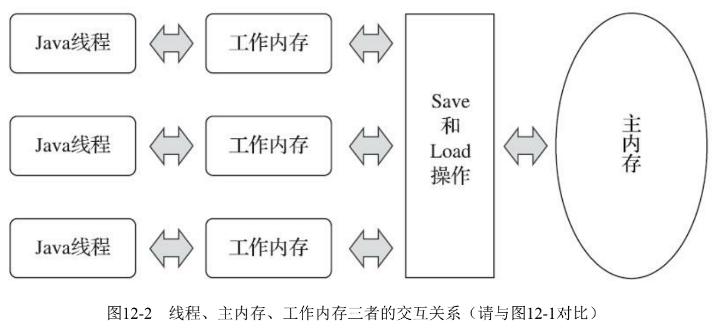
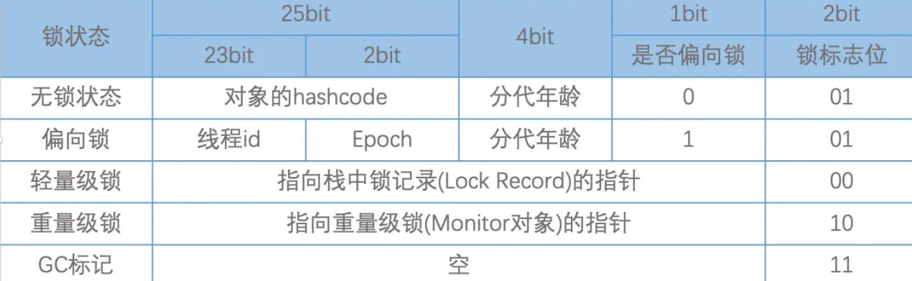
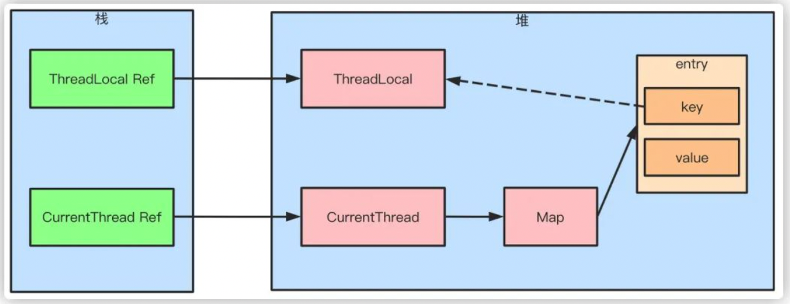
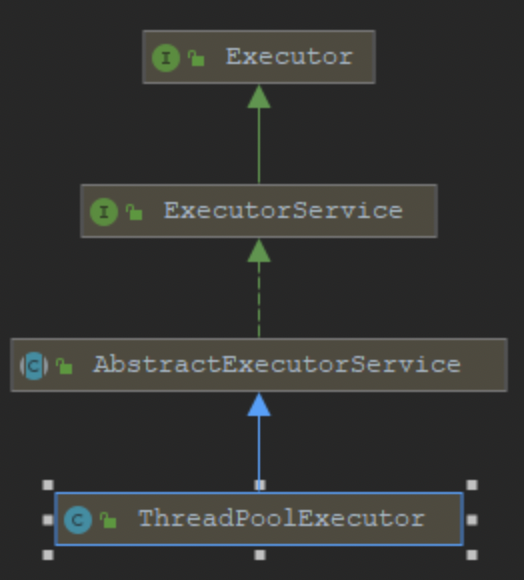
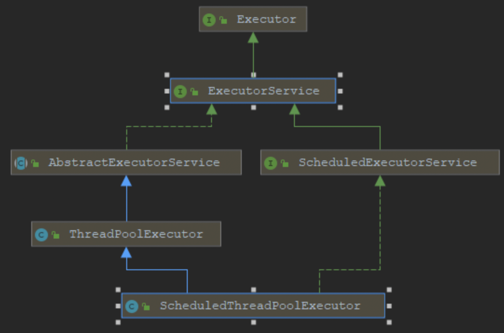
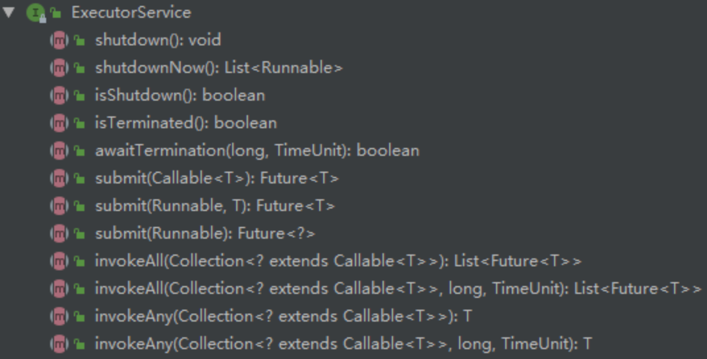

这个章节，主要内容是围绕以下几个方面展开：

1. 线程产生的具体背景
2. java中线程的使用（包括创建方式、使用方式、几种方式的优缺点）
3. 特殊应用实例发生的问题及解决方案（描述具体的问题、微观上解释这种问题出现的原因、分析并抽象出具体概念、具体问题的解决方案等）

> 互联网技术的产生无非就是系统中遇到了某种问题，而针对这些问题需要得到处理，应运而生就产生了一系列的技术。


## 1. 单个线程

### 1.1. 线程的发展

拿一个网络请求来看，一个请求中需要涉及到客户端到服务器端的网络请求中的各种延迟，如果要请求数据库，可能还需要涉及到服务器与服务器之间网络延迟、网络抖动以及读写硬盘的时间延时等。但是我们知道计算机CPU执行指令的速度是很快的（因为是电信号），一个主频为2GHz的CPU，假设一个时间片的时间跨度为20毫秒，那一个时间片上的可以执行的计算次数为20亿/(1000/20)=4000万次。通常的网络请求的延迟及io读写硬盘的时延大多都要远远大于一个CPU时间片的时间跨度，而我们又知道`所谓大多数程序执行的过程，就是从网络设备或存储器（包括硬盘、寄存器、内存等）取出数据，然后把数据传输给CPU，让CPU对数据进行运算，然后再把数据返回给网络设备或存储器的过程`。在这个过程中就涉及到网络请求时延或读写硬盘的时延要远大于CPU时间片的时间跨度的问题，换句话来说，如果运行的程序是单线程的，那在请求网络设备中数据或请求存储器设备中数据时，CPU时间片就会处于空闲状态，这对计算机资源是一个严重的浪费，我们就想，能不能把这个请求过程进行切分，能不能把让空闲状态下的CPU执行其他任务，基于这些问题，就出现了线程，后来随着线程理论的深入发展等，就逐步发展成为现在的多线程体系。

#### 1.1.1. 高速缓存出现的背景

又由于网络设备与存储器读写数据的速度与cpu执行指令的速度相差确实很大，此时就有另外一种思路，能不能在中间添加一个设备，该设备的读写速度虽然比CPU执行指令的速度小，但是比普通存储器的读写速度大，在具体的指令执行时，把指令和数据先存放到这个中间设备中，运行时，直接使用该设备与CPU进行交互，这样执行的效率是不是就比原来使用普通存储器执行的方式要高。所以就出现了高速缓存。

高速缓存出现后，程序执行的方式就变成了，先把数据和指令从普通存储设备中加载到高速缓存中，然后CPU从高速缓存中读取数据和指令进行执行，执行完成后再把高速缓存中的数据写回到普通存储器中。这种情况在单线程场景下是没有问题的，但是多线程场景下，这个时候就涉及到一个普通存储器的期望数据与实际数据不一致性问题，或者说普通存储器中的数据与高速缓存中的数据不一致。那么，如何解决这一问题？

#### 1.1.2. 解决缓存一致性问题

解决缓存一致性问题有两种方式（硬件层面的方式）：一种是`总线上添加Lock锁`的方式；另一种就是`使用缓存一致性协议`。

总线上添加Lock锁的原理是：如果某一个线程访问了共享变量，那么就在总线上添加一个Lock锁，执行完成之后进行解锁，解锁之后其他线程才能操作共享变量。这种方式带来新的问题：总线上添加Lock锁，导致同一时刻其他CPU核心无法访问内存，这就造成了效率低下的问题。

缓存一致性协议最出名的是`Intel的MESI协议`，这个协议的意思是：当CPU写数据时，如果发现操作的变量是共享变量，就会发出信号通知其他CPU把该变量的缓存行置为无效状态，因此其他CPU需要读取这个变量时，就要重新从内存中读取，这样就保证了所读到的数据一定是最新的。

> 用一句话来描述线程的本质就是，线程就是从微观（即操作系统指令集及CPU时间片）的角度尽最大可能的压榨CPU资源的一种产物。

### 1.2. 单线程的创建方式

java中创建单线程有三种方式，一种是继承Thread类，一种是实现Runnable接口，一种是实现Callable接口。

- 继承Thread类

```java
// 创建
public  class MyThread extends Thread{
    @Override
    public void run(){
      // do something
    }
}

// 使用
MyThread m = new MyThread();
m.start();

```

- 实现Runnable接口

```java

//实现runnable
//1 创建一个任务对象
MyRunnable r = new MyRunnable();
//创建一个线程并给他一个任务
Thread t = new Thread(r);
//启动线程
t.start();

```

- 实现Callable接口

```java
class Mycallable implements Callable<T> {
    @Override
    public <T> call() throws Exception {
      return T;
    }
}

Callable<Integer> callable= new MyCallable();
FutureTask<Integer> future = new FutureTask<>(callable);
new Thread(future).start();
Integer j=task.get();
System.out.println("return"+j);
```

- 三种方式的异同
  - 实现Runnable接口方式与继承Thread类的方式的区别
    - 通过创建任务，然后给线程分配任务的方式实现多线程，更适合多个线程同时执行任务的情况
    - 可以避免单继承所带来的局限性
    - 任务与线程是分离的，提高了程序的健壮性
    - 后期学习的线程池技术，接受Runnable类型的任务，不接受Thread类型的线程
  - 实现Callable接口方式，相当于又在实现Runnable接口方式上添加了返回值的过程


### 1.3. 线程的一些操作

- 线程名称的设置与获取
- sleep：让当前线程睡眠，让出CPU，使线程从执行状态变成限时阻塞状态。等待时间结束后，线程不一定会立即执行，线程状态会变成可执行状态。
- interrupt：让当前线程进入阻塞状态。
- join：多个线程进行合并，本质是：线程a需要在合并点进行等待，一直等到b线程执行完，或者等待超时时，才继续执行。
- yeild：此方法相当于让当前线程让出cpu执行权限，让cpu执行其他线程，但是此方法虽然会让当前线程暂停，但是不会阻塞当前线程，只是让线程转入就绪状态，可能当前线程暂停了一下，又立即获得了cpu的执行权限，又开始执行了。
- daemon：线程分为两类，守护线程和用户线程。守护线程指在用户线程执行过程中，在后台提供某些通用服务的线程。GC线程就是守护线程。
- wait：

### 1.4. 线程的相关概念

- `线程的调度`： 在计算机操作系统中，是通过分配时间片来执行指令的，因此涉及到线程的调度。现代操作系统的调度方式有两种，一种是轮询调度方式，一种是抢占式调度方式。轮询调度方式就是把对排队中的线程分别分配一个时间片来执行，而抢占式调度方式，则是根据线程的优先级来确定的，优先级高的就优先分配时间片。java中的线程调度是委托操作系统进行的，但java中可以针对线程的执行顺序设置优先级。
- `线程优先级`： 在Thread类中有一个属性专门标识了线程的优先级，默认是5，最小值是1，最大值是10，数值越大，说明优先级越高。但需要注意的一点是，优先级高的线程不一定就比优先级低的线程执行的快，因为操作系统调度线程完全是随机的。具体调用哪个线程进行执行，只有天知道。
- `线程生命周期`：java中Thread类中有一个内部枚举类State，标识了线程从新建到消亡的各个阶段的状态。State的枚举值有： NEW、 RUNNABLE、 BLOCKED、 WAITING、 TIMED_WAITING、 TERMINATED。
  - NEW： 创建成功但还没有执行Start()方法的线程都处于NEW状态；
  - RUNNABLE： 操作系统中对此状态细分成两种状态，就绪状态和运行状态。在执行了Start()方法后，线程进入就绪状态，如果获得操作系统的运行时间片，就进入运行状态；时间片执行完，线程又进入就绪状态，等待被分配下一个时间片。就绪状态和运行状态统称为RUNNABLE状态。
  - BLOCKED： 阻塞状态
  - WAITINT： 等待状态
  - TIMED_WAITING： 限时等待状态
  - TERMINATED： 线程执行结束，结束有两种可能，一种是正常结束，一种是遇到异常
- `同步和异步`： 纯学术的概念说不太清，但是可以举一个例子来说明一下。现在有这样一个场景，在一个业务处理场景中，如果在代码中我们需要调用一个外围系统的接口取回一些数据，然后把数据进行处理一下，再返回给前端。如果在调用外围系统时，需要阻塞住，非要等到外围系统返回结果才往下执行其他内容，那么这种场景就是同步的场景；如果在这种场景下，调用外围系统时，只是把外围系统的执行过程完成了，并没有非要等着外围系统返回结果才往下进行，那么这种场景就是异步的。`总结来说，同步就是需要排队进行，异步则也需要排队，但是并不是强依赖关系。`
- `并发和并行`： 并发是指，在一段时间内，很多事件在执行；并行是指，在某一个时刻，很多事情都在执行。并行狭义上是指在同一时刻一起执行，广义上是指在某一个时间片段一起执行。
- `死锁`： 死锁就是两个或两个以上的线程因抢占锁而造成的互相等待的现象。
- `线程安全`： 所谓线程安全，就是多线程并发场景下，针对共享数据的访问问题，如果多线程访问共享数据时，共享数据的结果值与多线程访问完共享数据后的期望值一致，则表明共享数据是线程安全的。

### 1.5. 一个单线程的运行实例

```java
public class MyThread extends Thread{

    private static int num;

    @Override
    public void run() {

        // 每个线程执行5次i++操作
        for (int i = 0; i < 5; i++) {
            num++;
            System.out.println(num);
        }
    }

    public static void main(String[] args) {
        // 创建200个线程
        for (int i = 0; i < 200; i++) {
            MyThread t = new MyThread();
            t.start();
        }
    }

}

```

- 运行实例： 有一个实例变量初始值（注意是实例变量，即静态变量，不是普通局部变量）为0，要求使用200个线程，对这个变量分别执行i++操作，每个线程循环执行5次。理论上，五个线程执行完，这个变量应该变成1000，但是我们执行多次，发现这个变量的值始终没有达到1000，结果都比1000要小。
- 出现的问题描述： 对程序进行编译，然后对编译后的class文件进行分析，发现i++操作在字节码中是三个操作：先对i的值进行读取，然后对i执行加1操作，再把加1后的结果进行写入。而程序中只是依次创建200个线程，然后每个线程执行5次，主程序中对创建的200个线程直接提交给操作系统，让操作系统进行调度。我们又知道计算机执行指令时，需要从主存与高速缓存之间进行数据的读写和复制，而多个线程的场景下，由于线程执行是随机的，所以就会产生主存与高速缓存之间的数据不一致性问题。
- 线程安全及线程安全的特性： 在实践过程中，人们发现产生这种期望值与实际运行的结果不一致的情况还有很多，这就引发人们的思考，继而通过软件工程的思想——抽象+具体+实现等，对这类问题进行了总结，这种问题被统称为：线程不安全现象。
  - 下面给出`线程安全的定义`：`在多线程场景下，共享变量的实际运行后的值总能与期望值保持一致，这样的共享变量就可以被成为是线程安全的`。此处要注意几个要点：首先是多线程场景下，其次共享变量是被多线程操作的，最后是结果值与期望值在程序运行多次之后总能保持一致。此外还要说明的一点是这里的“共享变量”在严格意义上是不够准确的。只要是可以被多线程访问并更新的数据都可以看成是“共享变量”。
  - 在研究了线程安全的定义之后，人们又开始思考什么样的变量是具有线程安全特性的，或者说，线程安全的变量具有什么样的特征。于是人们在研究了大量的案例之后，发现线程安全的共享变量具有以下三个特性：
    - `原子性`： 相当于数据库操作中的事务。即对同一变量的多个操作，要么全部执行并且执行过程不被中断，要么就全部都不执行。
    - `有序性`： 编译器在进行编译过程中，为了提高编译效率及代码运行效率，会对代码顺序进行优化，这就是指令重排序。但指令重排不会影响单个线程的执行，但是会影响线程并发执行的结果。要想保证线程安全，就必须要保证编译后的指令的有序性。
    - `可见性`： 可见性是指多个线程访问同一个变量时，一个线程修改了这个变量，则其他线程能够立即看到修改后的值。
  - `原子性`和`有序性`特性针对的是操作或是指令，`可见性`则针对的是共享变量。`总之，要想满足线程安全，即线程并发执行的结果的正确性，就必须要保证原子性、可见性、有序性，三者缺一不可。满足这三个条件的程序的运行结果，我们称之为线程安全。`
- java内存模型——JMM
  - 基于操作系统高速缓存与内存的模型，java虚拟机规范中试图通过定义一种属于java语言的内存模型，来屏蔽异构硬件平台的差异，这种模型就是java内存模型。但是这种内存模型只是规定了执行的指令次序，并没有规定是否使用高速缓存来提高执行速率，也没有规定是否禁止编译器对指令重排序。换句话来说，java的内存模型也是存在缓存一致性问题和指令重排序问题。
  - 
- 满足线程安全特性的条件
  - `满足原子性`： JMM只保证基本读取和赋值操作是原子操作。更大范围内的原子操作就需要使用Sychronized和lock等来进行保证了。若要实现更大范围的原子性操作，可以通过synchronized关键字和Lock来实现。
  - `满足有序性`： volatile也可以保证有序性。除此以外，满足先行发生原则的操作也一定是有序的。
    - 先行发生原则，即不需要任何手段就能够保证操作的有序性。也被称为：happans-before原则，包括：
      1. 程序次序规则。
      2. 锁定原则。
      3. volatile变量原则。
      4. 传递原则。
      5. 线程启动规则。
      6. 线程中断规则。
      7. 线程终结规则。
      8. 对象终结规则。对象的初始化一定先行发生于该对象的finalize()方法的开始。
  - `满足可见性`： java中提供了volatile关键字来保证操作的可见性，当然也可以通过synchronized关键字和Lock来实现。
- 给出理论模型： 程序多次运行的结果与期望值不一致，继而引发人们对线程不安全现象的分析，继而人们总结出线程安全的定义以及满足线程安全的特性，然后人们又思考如何满足线程安全的特性，接着人们开始对整个思考过程进行建模产生JMM模型并在此基础上创造出满足线程安全特性的条件。
- 如何保证i++多线程下运算是线程安全的
  - 使用原子类，如 AtomicInteger 、 AtomicLong 等；
    - 比如我们可以使用 AtomicInteger当中常用的自增方法 incrementAndGet
  - 原子类的实现原理及问题
    - incrementAndGet自增方法实际上使用了 compareAndSet 方法，而 compareAndSet 方法底层是 unsafe 方法， unsafe 方法底层就是cas算法
    - CAS算法实现原理
      - 有三个参数，内存地址V、旧的期望值A、修改后的值B，拿旧的期望值A与内存地址V上的值进行比较，如果相等，就把内存地址V上的值修改为修改后的值B，如果不想等，线程就放弃更新，然后重新获取再次执行CAS；
      - 例如： 原始内存地址V上的值为10，线程1获取到值后进行修改，则A=10，加入线程1想要执行+1操作，那么B就是11，在线程1执行完成后，就会拿V处的值与A的值进行比较，如果相等，就说明原来的共享变量没有被其他线程修改过，因此可以把自己修改后的值更新到V的位置上；如果不想等，则说明原来的共享变量已经被其他线程修改过了，因此就放弃修改操作，线程1会再次读取数据，然后再执行CAS操作
    - ABA问题
      - 在线程1置换V处的值的时候，它并不知道这个值被置换了多少次，也就是虽然此时V的值虽然也等于A的值，但是它并不知道V的值是它之前读取的那个值还是经过其他线程CAS操作很多次之后又变成的值，这就是ABA的问题。
    - 如何解决ABA问题
      - 使用带版本号的原子引用类来解决ABA问题 
        - AtomicMarkableReference
        - AtomicStampedReference ： 常用的是这个类。 该类的compareAndSet()方法的作用是首先 检查当前引用是否等于预期引用，以及当前印戳是否等于预期印戳，如 果全部相等，就以原子方式将引用和印戳的值一同设置为新的值。

### 1.6. 单线程的锁

- volatile关键字 
  - 使用案例
  ```java
  class Singleton{
    private volatile static Singleton instance = null;
     
    private Singleton() {}
     
    public static Singleton getInstance() {
        if(instance==null) {
            synchronized (Singleton.class) {
                if(instance==null)
                    instance = new Singleton();
            }
        }
        return instance;
    }
  }
  ```
  - 内部原理
    - 分析字节码，可以看出volatile关键字转化为了lock指令，这相当于给变量添加了一道内存屏障，这道内存屏障的作用就是当这个变量发生改变时让其他处理器得到的变量变成无效的。
    - 保证可见性
      - 某一线程对volatile变量的修改会同步到主存中，同时也会使已经读到该变量的其他线程的缓存中的值失效，当其他线程发现自己缓存中的值失效时，就会重新从主存中读取新值；
    - 禁止指令重排
      - 编译器或执行器进行指令优化时，不能改变volatile变量在源代码的位置；
      - 当程序执行到volatile变量的读写操作时，其前面的操作的一定是已经全部完成的，且操作的结果一定是对后面的操作可见；其后面的操作肯定还没有进行；
    - 不保证指令的原子性
    - 也不保证共享变量的互斥访问
  - 所引起的问题
    - 总线风暴： volatile依赖总线嗅探机制不断刷新到主内存，而在多处理器架构上，所有的处理器是共用一条总线的，并且所有的处理器都是靠总线与住内存进行数据交互的，这种交互机制本质上是通过主线进行通信的，这种通信的流量就是缓存一致性流量，如果缓存一致性流量超过总线所能承受的最大带宽，就会造成总线风暴。（CAS算法和volatile都会造成总线风暴）
- synchronized关键字
  - 1.6之前是重量级锁，1.6之后对synchronized进行了锁优化，采用了锁粗化、锁消除、偏向锁、轻量级锁等锁的优化手段
  - 不同使用场景下的不同作用
    - 同步方法： 字节码生成的是 ACC_SYNCHRONIZED 
      - 同步普通方法，锁的是当前对象。
      - 同步静态方法，锁的是当前 Class 对象。
    - 同步块： 字节码生成的是 monitorenter 和 moniterexit 
      - 锁的是{}中的对象，这段区域被成为临界区。
  - 监视器锁机制
    - 多线程对应的是Java堆中多个对象，而多线程操作的往往是Java堆中的另外一个对象，多线程运行机制本质上就变成了堆中的多个对象操作堆中的某一个对象，那问题来了，怎么实现这种机制呢？jdk中是给每一个Java对象都创建一个监视器对象（ ObjectMonitor ， 是由C++实现的）来实现这种机制，而且Java对象与 ObjectMonitor 是一一对应的；
    - ObjectMonitor 的数据结构
      - cxq： 临时队列，存放临时的 ObjectWaiter （本质上就是线程）
      - waiteset： 等待队列，对象执行了 wait() 方法后，操作改对象的线程封装成ObjectWaiter进入此队列
      - entrylist： 阻塞队列，对象执行了 notify() 方法后，操作对象的线程被封装成ObjectWaiter进入此队列
      - count： 获得锁的次锁
      - owner ： 获得锁的线程ID
    - 加锁过程： 当一个线程获得锁之后，会把监视器对象的 owner 设置为这个线程的ThreadID，然后count加1；如果再有线程尝试获得锁，就进入EntryList等待；
    - 解锁过程： 当一个线程释放锁时，会把监视器对象的 owner 设置为null，然后count减1，然后再从waitset或entrylist中get一个线程，让这个线程尝试获取锁；
  - synchronized 锁在升级过程中用到了不同的锁机制
    - 
    - 从无锁状态到偏向锁阶段，再到轻量级锁阶段，使用的是Java堆中对象的内存分布中的对象头的不同值来完成同步的；
      - 无锁状态 ：       hashcode +     分代年龄 + 偏向标识（为0） + 锁标志位（为01）
      - 偏向锁状态 ： ThreadID + epoch + 分代年龄 + 偏向标识（为1） + 锁标志位（为01）
      - 轻量级锁状态 ： 指向栈中锁记录（Lock Record）的指针 +        锁标志位（为00）
    - 转化成重量级锁之后，使用的则是对象的监视器锁机制来完成同步的；
      - 重量级锁状态： 指向Java监视器对象（Monitor对象）的指针 +      锁标志位（为00）
  - 锁的升级
    - (1）当没有被当成锁时，这就是一个普通的对象，Mark Word记录对象的HashCode，锁标志位是01，是否偏向锁那一位是0;
    - (2）当对象被当做同步锁并有一个线程A抢到了锁时，锁标志位还是01，但是否偏向锁那一位改成1，前23bit记录抢到锁的线程id，表示进入偏向锁状态;
    - (3) 当线程A再次试图来获得锁时，JVM发现同步锁对象的标志位是01，是否偏向锁是1，也就是偏向状态，Mark Word中记录的线程id就是线程A自己的id，表示线程A已经获得了这个偏向锁，可以执行同步中的代码;
    - (4) 当线程B试图获得这个锁时，JVM发现同步锁处于偏向状态，但是Mark Word中的线程id记录的不是B，那么线程B会先用CAS操作试图获得锁，这里的获得锁操作是有可能成功的，因为线程A一般不会自动释放偏向锁。如果抢锁成功，就把Mark Word里的线程id改为线程B的id，代表线程B获得了这个偏向锁，可以执行同步代码。如果抢锁失败，则继续执行步骤5;
    - (5) 偏向锁状态抢锁失败，代表当前锁有一定的竞争，偏向锁将升级为轻量级锁。JVM会在当前线程的线程栈中开辟一块单独的空间，里面保存指向对象锁Mark Word的指针，同时在对象锁Mark Word中保存指向这片空间的指针。上述两个保存操作都是CAS操作，如果保存成功，代表线程抢到了同步锁，就把Mark Word中的锁标志位改成00，可以执行同步代码。如果保存失败，表示抢锁失败，竞争太激烈，继续执行步骤6;
    - (6) 轻量级锁抢锁失败，JVM会使用自旋锁，自旋锁不是一个锁状态，只是代表不断的重试，尝试抢锁。从JDK1.7开始，自旋锁默认启用，自旋次数由JVM决定。如果抢锁成功则执行同步代码，如果失败则继续执行步骤7;
    - (7) 自旋锁重试之后如果抢锁依然失败，同步锁会升级至重量级锁，锁标志位改为10。在这个状态下，未抢到锁的线程都会被阻塞。

synchronized 与 ReentrantLock 的区别
- 1.6之前 synchronized 是重量级锁，性能要远远差于 ReentrantLock； 1.6之后jdk对 synchronized 进行锁优化后，二者性能相差无几；
- synchronized 为隐式锁，即不需要手动在代码中写加锁、解锁逻辑； ReentrantLock 为显式锁，需要显式地在代码中添加 加锁、解锁逻辑；
- ReentrantLock 还能实现 等待可中断、公平锁、绑定多个条件等功能；


- ThreadLocal
  - ThreadLocal可以理解为线程本地变量，他会在每个线程都创建一个副本，那么在线程之间访问内部副本变量就行了，做到了线程之间互相隔离，相比于synchronized的做法是用空间来换时间。ThreadLocal有一个静态内部类ThreadLocalMap，ThreadLocalMap又包含了一个Entry数组，Entry本身是一个弱引用，他的key是指向ThreadLocal的弱引用，Entry具备了保存key value键值对的能力。弱引用的目的是为了防止内存泄露，如果是强引用那么ThreadLocal对象除非线程结束否则始终无法被回收，弱引用则会在下一次GC的时候被回收。但是这样还是会存在内存泄露的问题，假如key和ThreadLocal对象被回收之后，entry中就存在key为null，但是value有值的entry对象，但是永远没办法被访问到，同样除非线程结束运行。但是只要ThreadLocal使用恰当，在使用完之后调用remove方法删除Entry对象，实际上是不会出现这个问题的。
  - 

## AQS

抽象队列同步器，提供一种多线程访问共享变量的同步器框架。很多同步类都是基于这个框架实现的。例如/Semaphore/CountDownLatch。

- 维护了
  - 一个共享资源变量state，改变量使用volitale修饰；
  - 一个FIFO的虚拟双向队列，用来存储被阻塞的线程node
- 提供了两种访问方式
  - 独占资源访问方式 Exclusive
  - 共享资源访问方式 Share
- 其他自定义同步器需要
  - 实现对共享资源state的获取和释放即可，至于具体线程等待队列的维护（如获取资源失败入队/唤醒出队等），AQS 已经在顶层实现好了
  - 通常只需要实现： tryAcquire(int) - tryRelease(int)  或  tryAcquireShared(int) - tryReleaseShared(int) 两对中的一对即可


[AQS 原理以及 AQS 同步组件总结](https://javaguide.cn/java/concurrent/aqs.html#aqs-%E5%AF%B9%E8%B5%84%E6%BA%90%E7%9A%84%E5%85%B1%E4%BA%AB%E6%96%B9%E5%BC%8F)


## 2. 线程池的使用及原理

### 2.1. 为什么要使用线程池？

直接new一个线程真的不香，原因主要在于创建大量相同的线程会大量的消耗系统内存，甚至会导致系统内存耗尽；同时，大量的线程会竞争CPU的调度，导致CPU过度切换。在阿里巴巴java开发手册中也有提到过为什么不提倡使用当个线程的原因，就是在于上面这两个原因。

那么使用线程池的优点是什么呢？使用线程池有以下几方面的优点：

1. 减少系统开销。减少在创建和销毁线程上所花费的时间和系统资源的开销
2. 提高响应速度。当任务到达之后，任务可以不需要等到线程创建就能被立即执行
3. 提高线程的可管理性。线程是稀缺资源，如果无限制的的创建，不仅会消耗系统资源，还会降低系统性能，使用线程池可以进行统一分配，调优和监控。

### 2.2. java中标准构造器创建线程池的方式

```java
public ThreadPoolExecutor(
   int corePoolSize,
   int maximumPoolSize,
   long keepAliveTime,
   TimeUnit unit,
   BlockingQueue<Runnable> workQueue,
   ThreadFactory threadFactory,
   RejectedExecutionHandler handler)
```

- 参数讲解及运行原理
  - `corePoolSize：` 核心线程数。
  - `maximumPoolSize：` 最大线程数。
  - `keepAliveTime：` 空闲线程存活时间。
  - `unit：` 空闲线程存活时间单位。
  - `workQueue：` 阻塞队列。
    - `LinkedBlockingQueue` ： 是一个基于链表实现的阻塞队列，按FIFO排序任务，可以设置容量（有界队列），不设置容量则默认使用 Integer.Max_VALUE 作为容量（无界队列）。该队列的吞吐量高于 ArrayBlockingQueue。 有两个快捷创建线程池的工厂方法 Executors.newSingleThreadExecutor 和 Executors.newFixedThreadPool 使用了这个队列，并且都没有设置容量（无界队列）。
    - `ArrayBlockingQueue` ： 是一个数组实现的有界阻塞队列（有界队列），队列中的元素按FIFO排序。ArrayBlockingQueue在创建时必须设置大小。
    - `SynchronousQueue` ： （同步队列）是一个不存储元素的阻塞队列，每个插入操作必须等到另一个线程的调用移除操作，否则插入操作一直处于阻塞状态，其吞吐量通常高于 LinkedBlockingQueue 。快捷工 厂方法Executors.newCachedThreadPool所创建的线程池使用此队列。与前面的队列相比，这个队列比较特殊，它不会保存提交的任务，而是直接新建一个线程来执行新来的任务。
    - `PriorityBlockingQueue` ：是具有优先级的无界队列。
    - `DelayQueue` ：这是一个无界阻塞延迟队列，底层基于 PriorityBlockingQueue 实现，队列中每个元素都有过期时间，当从队列 获取元素（元素出队）时，只有已经过期的元素才会出队，队列头部的 元素是过期最快的元素。快捷工厂方法 Executors.newScheduledThreadPool所创建的线程池使用此队列。
  - `threadFactory：` 创建线程的线程工厂。当线程池需要新的线程时，会用threadFactory来生成新的线程；
  - `handler：` 拒绝策略。
    - AbortPolicy ： 使用该策略时，如果线程池队列满了，新任务就会被拒绝，并且抛 出RejectedExecutionException异常。该策略是线程池默认的拒绝策略。
    - DiscardPolicy ： 该策略是AbortPolicy的Silent（安静）版本，如果线程池队列满 了，新任务就会直接被丢掉，并且不会有任何异常抛出。
    - DiscardOldestPolicy ： 抛弃最老任务策略，也就是说如果队列满了，就会将最早进入队列的任务抛弃，从队列中腾出空间，再尝试加入队列。因为队列是队尾进队头出，队头元素是最老的，所以每次都是移除队头元素后再尝试入队。
    - CallerRunsPolicy ： 调用者执行策略。在新任务被添加到线程池时，如果添加失败，那 么提交任务线程会自己去执行该任务，不会使用线程池中的线程去执行 新任务。在以上4种内置策略中，线程池默认的拒绝策略为AbortPolicy，如 果提交的任务被拒绝，线程池就会抛出RejectedExecutionException异 常，该异常是非受检异常（运行时异常），很容易忘记捕获。如果关心 任务被拒绝的事件，需要在提交任务时捕获RejectedExecutionException 异常。
    - 自定义策略 ： 如果以上拒绝策略都不符合需求，那么可自定义一个拒绝策略，实 现RejectedExecutionHandler接口的rejectedExecution方法即可。
- 运行原理
  - 线程池初始化时并没有线程，当来临任务时，开始创建一个线程，如果任务还是不能被及时的完成，就接着创建，直到达到核心线程数。（一旦创建的达到核心线程数后，就会永驻内存，但是要注意并不是指创建线程初期的线程就是核心线程，超过核心线程数之后创建的线程也有可能成为核心线程，最开始创建的线程有可能被销毁）；
  - 如果创建了核心线程数大小的线程后依然有任务涌来，那就把这些任务放到阻塞队列中；
  - 如果阻塞队列满了，依然有任务涌来，那么就接着创建线程，直到达到最大线程数；
  - 如果达到最大线程数后，还有任务涌来，那么就执行拒绝策略；
  - 如果任务执行完成之后，线程池会根据空闲线程存活时间对创建的线程进行销毁，直到线程数量等于核心线程数为止；
- 线程池的操作方法
  - 提交任务
    - execute()
      - void execute(Runnable command);
    - submit()
    ```java
      <T> Future<T> submit(Callable<T> task); 
      <T> Future<T> submit(Runnable task, T result); 
      Future<?> submit(Runnable task);
    ```
    - 二者区别
      - 接受参数不同
      - submit()提交任务后会有返回值，而execute()没有
      - submit()方便Exception处理
  - 钩子方法
    ```java
    //任务执行之前的钩子方法（前钩子） 
    protected void beforeExecute(Thread t, Runnable r) { } 
    //任务执行之后的钩子方法（后钩子） 
    protected void afterExecute(Runnable r, Throwable t) { } 
    //线程池终止时的钩子方法（停止钩子） 
    protected void terminated() { }
    ```
  - 优雅关闭
    - shutdown ： 是JUC提供的一个有序关闭线程池的方法，此方法 会等待当前工作队列中的剩余任务全部执行完成之后，才会执行关闭， 但是此方法被调用之后线程池的状态转为SHUTDOWN，线程池不会再 接收新的任务。
    - shutdownNow ： 是JUC提供的一个立即关闭线程池的方法，此 方法会打断正在执行的工作线程，并且会清空当前工作队列中的剩余任 务，返回的是尚未执行的任务。
    - awaitTermination ： 等待线程池完成关闭。在调用线程池的 shutdown()与shutdownNow()方法时，当前线程会立即返回，不会一直等 待直到线程池完成关闭。如果需要等到线程池关闭完成，可以调用 awaitTermination()方法。

### 2.3. java中快捷工厂创建线程池方式

- 出现这种方式的背景： 正是由于线程池的标准创建模式参数较多，使用时需要对线程池原理了解较深才能熟练使用，因此juc包中又提供了一种快捷创建线程池的方式，这种方式就是快捷工厂创建线程池方式。
- 快捷创建方式
  - Executors.newSingleThreadExecutor()
  - Executors.newFixedThreadPool(int threads)
  - Executors.newCachedThreadPool()
  - Executors.newScheduledThreadPool(int corePoolSize)

### 2.4. 两种方式优劣

快捷工厂创建线程池的方式是不建议使用的，因为有些方式使用的是无界队列，这会导致内存溢出。推荐使用原生方式。

### 2.5. java中线程池框架








> ThreadPoolExecutor 和 ScheduledThreadPoolExecutor 算是我们最常用的线程池类了，从上面我们可以看到这俩个最终都实现了 Executor 和 ExecutorService 这两个接口，实际上主要的接口定义都是在 ExecutorService 中。

### 2.6. 线程池的线程数选取

- IO密集型任务 ： 此类任务主要是执行IO操作。由于执行IO操作的时间较长，导致 CPU的利用率不高，这类任务CPU常处于空闲状态。Netty的IO读写操作 为此类任务的典型例子。
  - 通常需要开CPU核心数两倍的线程。
- CPU密集型任务 ： 此类任务主要是执行计算任务。由于响应时间很快，CPU一直在运 行，这种任务CPU的利用率很高。
  - 线程数等于CPU数就行
- 混合型任务 ： 此类任务既要执行逻辑计算，又要进行IO操作（如RPC调用、数据 库访问）。相对来说，由于执行IO操作的耗时较长（一次网络往返往往 在数百毫秒级别），这类任务的CPU利用率也不是太高。Web服务器的 HTTP请求处理操作为此类任务的典型例子。
  - 最佳线程数目 = (线程等待时间与线程占用CPU时间之比 + 1) * CPU核数

### 2.7. 线程池结合SpringBoot使用

- 方式一：通过@Async注解调用
  - 在Application启动类上面加上@EnableAsync
  - 在需要异步执行的方法上加上@Async注解
- 方式二：使用自定义的线程池
  - 自定义Configuration

---
## 3. 高并发设计模式
### 3.1. 线程安全的单例模式
### 3.2. Master-Worker模式
### 3.3. ForkJoin模式


## 4. 参考

- [早期操作系统的发展阶段(10k字)](https://cloud.tencent.com/developer/article/1462934)
- [Java并发编程：volatile关键字解析](https://www.cnblogs.com/dolphin0520/p/3920373.html)
- [Java内存模型（JMM）总结](https://zhuanlan.zhihu.com/p/29881777)
- [线程池除了常见的4种拒绝策略，你还知道哪些？](https://mp.weixin.qq.com/s?__biz=Mzg2OTA0Njk0OA==&mid=2247485679&idx=1&sn=57dbca8c9ad49e1f3968ecff04a4f735&chksm=cea24724f9d5ce3212292fac291234a760c99c0960b5430d714269efe33554730b5f71208582&token=1141994790&lang=zh_CN%23rd)
- [你需要的并发编程总结](https://juejin.cn/post/6945263312934273055?utm_source=gold_browser_extension)
- [Java 线程池原理及最佳实践（1.5W字，面试必问）](https://mp.weixin.qq.com/s/skBA9RwVBLnw8BYZhcUSrA)
- [凉了！张三同学没答好「进程间通信」，被面试官挂了](https://mp.weixin.qq.com/s?__biz=MzUxODAzNDg4NQ==&mid=2247485318&idx=1&sn=0da0a684639106f548e9d4454fd49904&scene=21#wechat_redirect)
- [Java基础面试16问](https://mp.weixin.qq.com/s/-xFSHf7Gz3FUcafTJUIGWQ)
- [什么是CAS机制？](https://blog.csdn.net/qq_32998153/article/details/79529704)
- [多线程之总线风暴](https://blog.csdn.net/strandtrack/article/details/119599111)
- [这一次，彻底搞懂Java中的synchronized关键字](https://juejin.cn/post/6973571891915128846)


