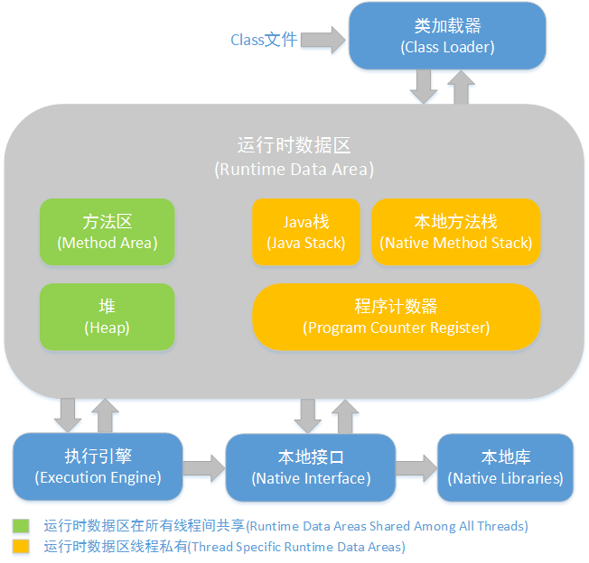
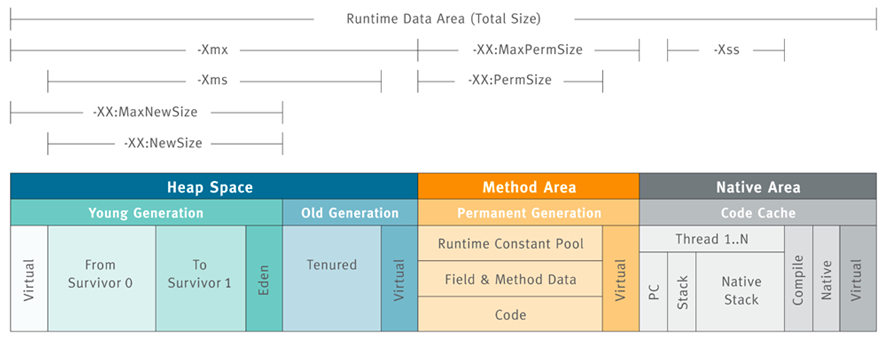
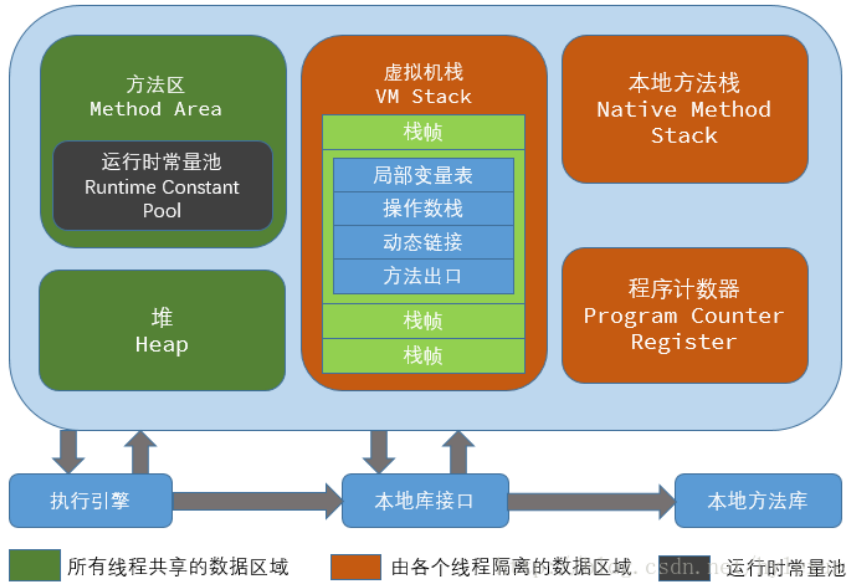
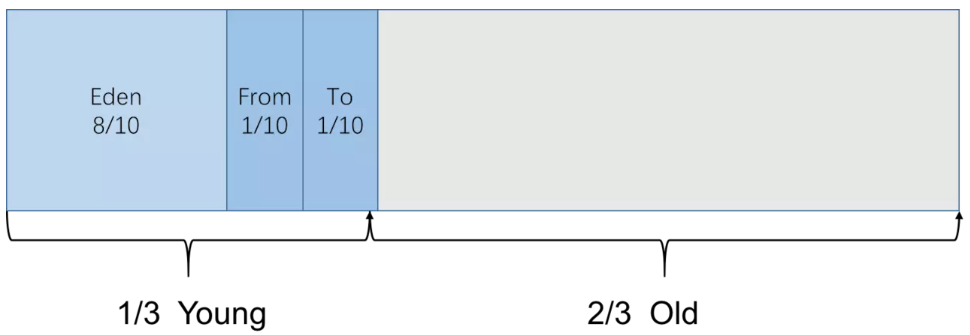

# jvm的内存结构

jvm是面试时的热点内容，其主要考查的方向包括以下几方面内容：

- jvm的运行时数据区的结构及各数据区的控制参数
- 对象分配到运行时数据区的规则
- OOM的产生场景

此章节中，主要介绍java程序在运行时jvm的内存管理的机制，即对象加载到jvm中后，jvm是如何给java应用程序分配数据区域以及java应用程序代码运行时相关的数据区域是如何协同工作的。

## 图解
我从参考资料中截取了我认为最重要的三个模型图：

从第一张图中可以看出：

1. jvm运行时数据区的相关模块以及各个模块是否线程共享等；
2. jvm的模块分为大概两三个：类加载器模块、运行时数据区、执行模块、本地接口模块等；

第二张图则展示了运行时数据区的几个重要的区域的结构以及这几个区域的jvm控制参数等；

第三张图则在第二张图的基础上展示了jvm运行时数据区的详细细节。

## JVM内存结构

本章节中，我们先是从线程的角度去了解jvm内存区域的整体结构，接着我们将了解JVM运行时数据区域，最后我们了解GC主要的作用区域——Java堆的结构。研究的三个部分的范围越来越小。

jvm的内存区域主要包括`线程私有的区域`【程序计数器、本地方法栈、java栈】、`线程共享的区域`【java堆、方法区】、`直接内存`等，**我们平时讨论的是运行时数据区域，也就是除了直接内存以外的其他区域**。

这里，我们提供一种记忆jvm内存模型的方式。我们按照**内存区域是否线程共享**这一原则，将JVM的内存结构划分为三个方面：

- 与线程具有相同生命周期的内存空间
  这部分内存空间也就是我们所说的`线程私有的内存区域`。这部分内存区域的生命周期与线程相同，依赖用户线程的启动或结束而创建或销毁，换句话说：Hotspotvm中每个用户线程都有自己的内存空间，这部分内存空间的存与否跟随JVM线程的生与死对应。

- 与线程不具有相同的生命周期内存空间
  这部分内存空间被称作`线程共享的内存空间`。这部分内存区域会跟随虚拟机的启动或关闭而创建或销毁。`这部分是GC作用的重点区域，也是我们研究的重点区域。`

- 直接内存
  这部分区域，并不是jvm运行时区域的一部分，但是也被频繁使用：jdk1.4后引入的NIO提供了基于通道和缓存的方式，它可以使用本地函数直接分配堆外内存，然后使用DirectByteBuffer对象作为对这块内存的引用，这样避免了java堆中与native堆来回复制数据，有利于提高性能。

**总而言之，线程私有的区域和直接内存区域都是由操作系统直接管理，这使得垃圾回收作用的范围就变得很小了，换句话说，GC作用到的内存区域也就只剩下线程共享的区域了。**

### JVM运行时数据区

按照**具体的实际功能**可以将**JVM的运行时数据区域内存结构**划分为以下几方面的内容，我们也将从`存放内容`、`是否是线程共享`、`OOM的原因及场景`、`控制参数`等方面去研究`运行时数据区`的每一部分内容：

- 程序计数器
  - 特征
    - 一块较小的内存空间
    - 执行java方法时才有值，执行native方法值为空
  - 存放内容：`当前线程所执行的字节码的行号指示器`
  - 是否线程共享：线程私有
  - OOM的原因及场景：唯一一个没有规定任何OutOfMemoryError的区域
  - 控制参数：无
- 虚拟机栈
  - 特征
    - 描述的是`Java方法`执行的内存模型
    - 每个方法被执行的时候都会同时创建一个栈帧（Stack Frame）用于存储局部变量`表`、`操作栈`、`动态链接`、`方法出口`等信息，栈帧跟随方法的调用而创建，随着方法结束而销毁。
      - 局部变量存放了`基本数据`、`类型对象引用`和`returnAddress类型`
    - 每一个方法被调用直至执行完成的过程，就对应着一个栈帧在虚拟机栈中从入栈到出栈的过程
  - 存放内容：由很多方法执行时创建的一个一个的栈帧
  - 是否线程共享：线程私有
  - OOM的原因及场景：如果线程请求的栈深度大于虚拟机所允许的深度，将抛出StackOverflowError异常；如果虚拟机栈可以动态扩展（当前大部分的Java虚拟机都可动态扩展，只不过Java虚拟机规范中也允许固定长度的虚拟机栈），当扩展时无法申请到足够的内存时会抛出OutOfMemoryError异常。
  - 控制参数：参考上图
- 本地方法栈
  - 本地方法栈（Native Method Stacks）与虚拟机栈所发挥的作用是非常相似的，其区别不过是虚拟机栈为虚拟机执行Java方法（也就是字节码）服务，而本地方法栈则是为虚拟机使用到的Native方法服务。虚拟机规范中对本地方法栈中的方法使用的语言、使用方式与数据结构并没有强制规定，因此具体的虚拟机可以自由实现它。甚至有的虚拟机（譬如Sun HotSpot虚拟机）直接就把本地方法栈和虚拟机栈合二为一。与虚拟机栈一样，本地方法栈区域也会抛出StackOverflowError和OutOfMemoryError异常。
  - Hotspotvm直接把本地方法栈和虚拟机栈合二为一
- 堆
  - 特征
    - 是Java虚拟机所管理的内存中最大的一块
    - **是垃圾收集器的主要管理区域**
    - 现在的vm都是使用分代收集算法
      - 可以把java堆分配新生代和老年代，新生代又可以分为eden、s1（from survivor）、s2(to survivor)区域
  - 存放内容：存放对象实例和数组
  - 是否线程共享：是
  - OOM的原因及场景：
    - 在堆中没有内存完成实例分配，并且堆也无法再扩展时
  - 控制参数：-Xmx 和 -Xms
- 方法区
  - HopSpotVM把GC分代收集扩展到方法区，即**使用java堆的永久代（主要是针对永久区中的常量池的回收和类型的卸载，收益很小）来管理方法区**，这样HotSpot收集器就可以像管理java堆一样管理这部分内存，也不用额外开发新的内存管理器了。
  - 存放内容：存储`已被虚拟机加载的类信息`、`常量`、`静态变量`、`即时编译器编译后的代码`等数据
    - 运行时常量池主要存放编译期生成的各种字面量和符号引用
  - 是否线程共享：是
  - OOM的原因及场景：
    - 方法区无法满足内存分配需求
  - 控制参数：参考上图
- java8和元数据
  - 对应于直接内存。
  - 在java8中永久代已经被移除，取而代之的是元数据区（也被称为元空间）。它的位置与永久区的位置完全不同，它并不在虚拟机中，而是在直接在本地内存中，所以，元空间的大小仅受本地内存限制，当然java的垃圾回收也不会作用到这块区域了。

### 对象的探秘

- 对象的创建
- 对象的内存分配
- 对象的访问

### GC时的数据区

java是纯面向对象的语言，这就意味着应用程序中基本都是一个一个的对象，存放类对象的java堆也就成为我们重点要研究的对象，不言而喻的，垃圾回收的作用区域当然也是Java堆了。

#### Java堆的结构

我们将从以下**存放内容**、**占据大小**、**垃圾回收名称及触发条件**等方面去了解堆区域。

- 新生代（Young区域）
  用来存放新生的对象，它占据整个堆的三分之一的空间，在这个区域上面会频繁触发MinorGC进行垃圾回收。新生代又分为Eden区域、ServivorFrom（也被称为S1）、ServivorTo（也被称为S2）三个区。
  - Eden区
    java新对象的出生地（例外：如果新创建的对象占用内存交代，则直接分配到老年代）；当Eden区域内存不够时就会触发MinorGC
  - ServivorFrom（S1）
    上一次GC的幸存者，与Eden区域一同作为这一次GC的被扫描者
  - ServivorTo（S2）
    保留着了一次MinorGC过程中的幸存者

> 注意：在说明部分的内容时，要特别的指出所使用的垃圾收集器。在使用G1垃圾收集器时，Java堆的内存布局发生很大变化，它将整个java堆划分为多个大小相等的独立区域（Region），虽然还保留新生代和老年代的概念，但是二者已经不是物理隔阂了，他们都是一部分（可以不用连续）Region的集合。

- 老年代（Old区域）
  存放的是应用程序中生命周期长的内存对象，它占据整个堆的三分之二的空间。发生在这块区域的垃圾回收被称为MajorGC（或者FullGC）只有在**新生代对象晋升为老年代导致空间不够时**或者无**法找到足够大的连续空间为大对象分配空间时**才会触发。

#### 对象分配规则

- `对象优先分配在Eden区`。如果Eden区没有足够的空间时，虚拟机执行一次Minor GC。
- `大对象直接进入老年代（大对象是指需要大量连续内存空间的对象）`。这样做的目的是避免在Eden区和两个Survivor区之间发生大量的内存拷贝（新生代采用复制算法收集内存）。
- `长期存活的对象进入老年代`。虚拟机为每个对象定义了一个年龄计数器，如果对象经过了1次Minor GC那么对象会进入Survivor区，之后每经过一次Minor GC那么对象的年龄加1，知道达到阀值对象进入老年区。
- `动态判断对象的年龄`。如果Survivor区中相同年龄的所有对象大小的总和大于Survivor空间的一半，年龄大于或等于该年龄的对象可以直接进入老年代。
- `空间分配担保`。每次进行Minor GC时，JVM会计算Survivor区移至老年区的对象的平均大小，如果这个值大于老年区的剩余值大小则进行一次Full GC，如果小于检查HandlePromotionFailure设置，如果true则只进行Monitor GC,如果false则进行Full GC。

## 参考链接

[0] : [Jvm 系列(二):Jvm 内存结构](http://www.ityouknow.com/jvm/2017/08/25/jvm-memory-structure.html)

[1] : [Java虚拟机（JVM）你只要看这一篇就够了！](https://blog.csdn.net/qq_41701956/article/details/81664921)

[2] : [JVM看这一篇就够了](https://blog.csdn.net/qq_21870555/article/details/82967683)

[3] : [《Java虚拟机原理图解》3、JVM运行时数据区](https://blog.csdn.net/luanlouis/article/details/40043991)

[4] : [面试必问之JVM篇](https://www.cnblogs.com/lfs2640666960/p/9297176.html)

