# java中的GC

## 概述

在上一章中，我们了解到程序计数器、虚拟机栈、本地方法栈等线程私有的区域的生命周期都是跟随线程的生命周期的变化而变化的，而java堆和方法区等线程共享的区域的生命周期我们就没有介绍了。

因此，本章的主要内容就是介绍java堆和方法区等线程共享的区域上管理，即java堆和方法区上GC。我们将从以下几个方面进行展开：

- 什么样的对象是垃圾对象（对象回收的原则）
- 回收的原理
- 分析与调优的工具

要特别注意，本章节主要讨论的是java堆和方法区上的GC。

## 什么样的对象能够回收

要想了解GC，首先要了解什么是垃圾对象，或者说是什么样的对象才符合垃圾回收的原则？所谓的垃圾就是在jvm中用不到的内存区域，因为内存资源总是有限的，用不到的内存一定要重新被操作系统收集整理后再次使用。所以，垃圾回收的本质就是对内存空间的重新整理，把符合特定条件的内存区域重新回收，以供操作系统后期再次使用。

而线程私有的内存空间由线程自己管理，那线程共享的区域的管理就需要额外的功能模块来管理了，这个额外的功能模块就是垃圾回收器，又因为线程共享的区域上存储的主要内容是java的类对象和方法。因此我们就要研究什么样的对象才能够被回收。

研究对象是否被回收，只需要研究对象是否被使用即可。换句话来说，就是研究对象是否被引用。目前来说，判断对象是否被引用有两种方式：

**引用计数法**：为每一个对象都创建一个引用计数的属性，如果有其他对象引用这个对象，就为这个对象的引用计数的属性加一，引用释放时计数就减一，计数为0的时候就可以被回收了。这种方式无法解决对象之间相互引用的问题。当然java中也不会使用这种方式来判断对象是否存活了。

**可达性分析法**：引入GCroot概念，如果在GCroot和一个对象之间没有可达路径，那么对象就是不可达的。要注意的是：不可达对象不等价于可回收对象，不可达对象变成回收对象至少要经过两次标记过程，两次标记之后仍然是可回收对象，那将面临回收。

在Java语言中，GC Roots包括：

- 虚拟机栈中引用的对象。
- 方法区中类静态属性实体引用的对象。
- 方法区中常量引用的对象。
- 本地方法栈中JNI引用的对象。

> TODO: 可达性分析法的具体实现过程

由于java虚拟机规范中，没有要求虚拟机在方法区实现垃圾收集，因此方法区的垃圾收集是根据具体的虚拟机实现来确定的。在HotSpot中，方法区就是永久区。永久区的垃圾回收对象是废弃常量和无用的类。

判断一个类是否无用比较苛刻，要同时满足以下3个方面的条件：
- 该类所有的实例都已经回收，也就是 Java 堆中不存在该类的任何实例
- 加载该类的 ClassLoader 已经被回收
- 该类对应的 java.lang.Class 对象没有任何地方呗引用，无法在任何地方通过反射访问该类的方法

## 垃圾回收

垃圾回收由两部分组成，一部分是GC算法，另一部分是实现GC算法的回收器。

### 算法基础

本小节主要研究垃圾回收算法的种类、具体实现原理、适用对象、优缺点等内容。

- 标记-整理算法
  - 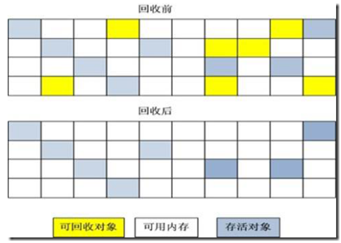
  - 算法分为“标记”和“清除”两个阶段：首先标记出所有需要回收的对象，在标记完成后统一回收掉所有被标记的对象
  - 它是最基础的算法，因为后续所有的算法都是在此算法基础上改进而来的
  - 有两个缺点：一个是效率问题，标记和清除的效率都不高；另一个是空间问题，标记清除后悔产生大量不连续的内存碎片，碎片过多或可因为在分配大对象内存空间时找不到足够连续空间而不得不提前触发垃圾收集动作

- 复制算法
  - 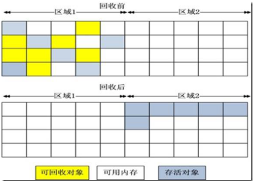
  - 它将可用内存按容量划分为大小相等的两块，每次只使用其中的一块。当这一块的内存用完了，就将还存活着的对象复制到另外一块上面，然后再把已使用过的内存空间一次清理掉
  - 这种算法的代价是要内存空间的浪费，因为有一半空间一直在空闲状态，此外，对于长生存期的对象来说，复制会导致效率降低
  - IBM研究表明，新生代中98%的对象是“朝生夕死”的，因此也没有必要按照1:1的比例来划分内存空间
  - HopSpot中Eden和Servivor的大小比例是8:1，即每次垃圾回收后，新生代可用空间为总容量的90%（80%+10%），这样就只有10%的内存空间被浪费了；
  - 当然，还有一个分配担保，意思就是，如果某次垃圾回收有多余10%的对象，那多余的对象可以由老年代进行担保，即通过担保机制，进入老年代

- 标记-清除算法
  - 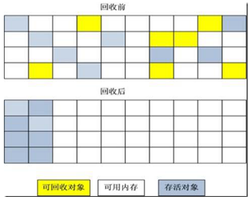
  - 根据老年底的特点，使用标记-清除算法，标记清除跟标记整理的第一个步骤一样，都是标记过程，只不过第二步骤是，将所有存活对象向一端移动，然后清除掉边界以外的内存

- 分代回收算法
  - 把堆分为新生代和老年代，然后根据各个年代的特点采用最适当的收集算法
  - 在新生代中，由于只有少量对象存活，就选用复制算法；老年代中对象存活率高、没有额外空间对其分配担保，就使用标记-清除算法或标记-整理算法

### 回收器

在早起的jdk版本中，我们关注的是清理jvm中所有的垃圾，因此产生了单线程的Serial收集器和Serial Old收集器，这保证了清理时的稳定性与高效性，但这样同样会带来一下问题，如由于清理线程独占系统资源造成用户程序线程暂停而引起全局停顿的问题；后来，我们开始关注系统的吞吐量（即用户应用程序运行时间与总运行时间的比值，吞吐量从某种意义上也体现了全局停顿时间的概念），我们认为要提高系统的吞吐量，因此产生了Parallel Scavenge收集器和Parallel Old收集器；再后来，我们把关注点转移到减少全局停顿时间上，因此产生了跨时代的CMS收集器。

此外，由于在垃圾收集过程中，会产生全局停顿的现象，这就引出我们评判一个垃圾收集器性能好坏的评判标准：我们在评判一个垃圾收集器性能好坏时，本质上讲，我们是在讨论这个垃圾收集器在收集垃圾时所产生的全局停顿时间的长短，即`全局停顿时间越短，垃圾收集器的性能越好`。但是这句话不是绝对的，我们只是提供了一种观察垃圾收集器性能好坏的方法。

下面的内容，我们是从分代的角度去讲述垃圾收集器的种类，当然读者也可以从垃圾收集器的发展阶段中的关注点来划分。本小节中也将主要讲解各种回收器的种类、适用范围、实现原理、优缺点、参数控制等内容。

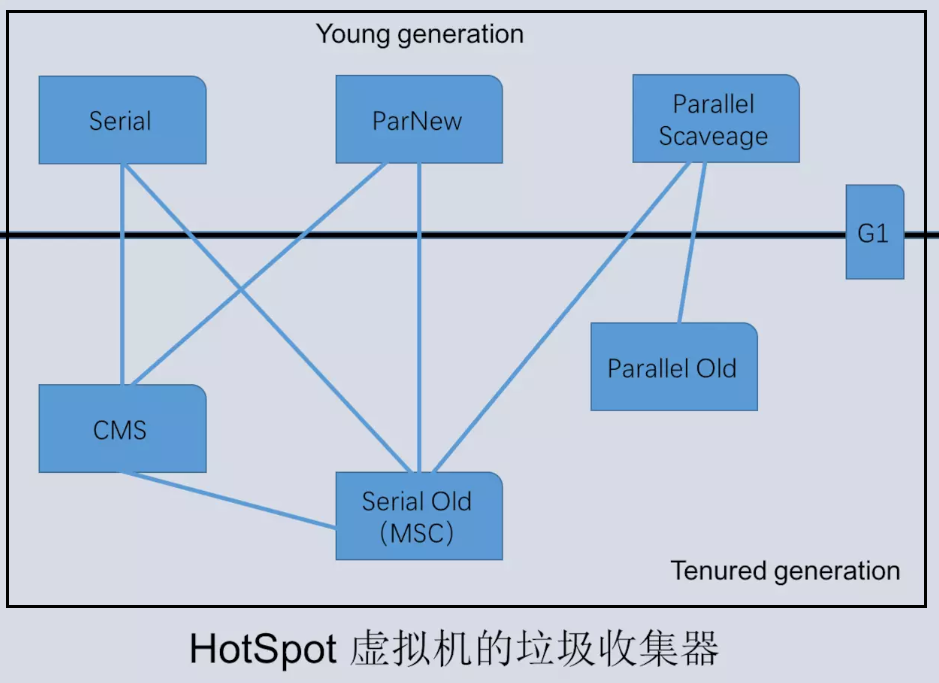

> 上面的图非常重要！
> 说明： 如果两个收集器之间存在连线说明他们之间可以搭配使用。

#### 新生代收集器

- Serial收集器
  - 采用的是复制算法，
  - 只会使用一个CPU或者是一个线程去完成垃圾收集工作，并且在进行垃圾收集的同时，必须暂停其他所有的工作线程，直至垃圾收集结束
  - 使用`-XX:+UseSerialGC`参数控制
  - 是Client模式下默认的新生代的垃圾收集器
  - 优点
    - 单线程的垃圾收集效率较高
    - 稳定性高
    - 多适用到单核
    - 全局停顿时间较少

- ParNew收集器
  - 是serial收集器的多线程版本
  - 是许多运行在server模式下的虚拟机中首选的新生代收集器
  - 默认开启和CPU数目相同的线程数，可以通过`-XX:ParallelGCThreads`参数来限制垃圾收集器的线程数

- Parallel Scavenge收集器
  - 采用的是复制算法
  - 它重点关注的是程序要达到一个可控制的吞吐量（即运行代码时间/(运行代码时间+垃圾收集时间)），因此也叫做吞吐量收集器
  - 使用`-XX:MaxGCPauseMillis`参数来控制最大垃圾收集停顿时间
  - 使用`-XX:GCTimeRatio`参数来直接设置吞吐量大小
  - 使用`-XX:+UseAdaptiveSizePolicy`参数来开启`GC自适应的调节策略`，这个也是与Par New收集器的重要区别

三个新生代收集器所采用的收集算法都是复制算法，并且它们的功能也是逐步完善的。ParNew收集器在Serial收集器的基础上面加上了多线程的功能，Parallel Scavenge收集器又在ParNew收集器的基础上加了控制吞吐量的控制功能。

#### 老年代收集器

- Serial Old收集器
  - 采用标记-整理算法
  - client模式下的默认的老年代垃圾收集器
  - 在server模式下，有两大用途：
    - 在jdk1.5后搭配Parallel Scavenge收集器使用
    - 作为CMS收集器的后备预案

- Parallel Old收集器
  - 采用标记-整理算法
  - 是Parallel Scavenge收集器的老年代版本，言外之意，Parallel Old收集器也同样具有保证吞吐量的功能

- :star: CMS收集器
  - 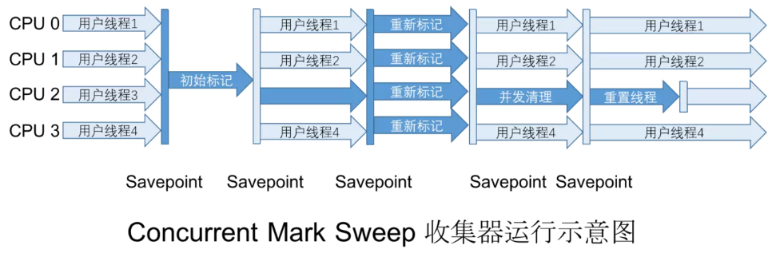
  - 全称：Concurrent mark sweep(CMS)
  - 使用标记-清除算法
  - 是一种以获取最短回收停顿时间为目标的收集器
  - 整个过程分为四个步骤：
    - 初始标记（initial mark）：只是标记GCRoots能直接关联的对象，要暂停所有的工作线程
    - 并发标记（concurrent mark）：进行GCRoots跟踪的过程，和用户线程一起工作，不需要暂停工作线程
    - 重新标记（remark）：修正因用户线程继续运行而导致标记变动的那一部分对象的标记记录，仍需要暂停所有的工作线程
    - 并发清除（concurrent sweep）：清除GCRoots不可达对象，和用户线程一起工作，不需要暂停工作线程
  - 优点：并发收集、低停顿
  - 缺点：对CPU资源敏感、无法收集浮动垃圾、会产生大量空间碎片（可以通过`-XX:+CMSFullGCsBeforeCompaction`参数设置执行多少次不压缩FullGC后，跟着来一次带压缩的。如：这个参数的值为2，就是在执行2次不压缩的FullGC之后，紧接着会再执行1次压缩的FullGC）等

#### :star: 通用收集器
G1收集器（又称：Garbage—First）是目前技术发展的最前沿成果之一，它既可以作用到新生代又可以作用到老年代，因此它也被称为通用收集器。

- 相对于CMS垃圾收集器，它具有以下特点：
  - 基于标记-整理算法，不再产生内存碎片
  - 可以非常精确的控制停顿时间，在不牺牲吞吐量的前提下，实现了低停顿垃圾回收

- 使用范围
  - 面向服务器
  - 针对配备多颗处理器及大容量内存的机器

- G1收集器的几个重要内容
  - G1堆分配
    - G1收集器的java堆的内存布局与其他收集器具有很大的差别，它是将整个java堆划分为多个大小相等的独立区域（Region），虽然还保留了新生代和老年代的概念，但是新生代和老年代已经不再物理隔阂了，他们都是一部分（可以不连续）Region的集合。它是将整个java堆划分为大约2000个大小相等的独立区域（Region），每个独立区域的大小在1Mb到32Mb直接，可以通过`-XX:G1HeapRegionSize`参数（该参数的默认值并不是一定的，它是根据java堆初始化时大小决定的，取值范围为：1M到32M，且要是2的指数）来设置。
    - 图示：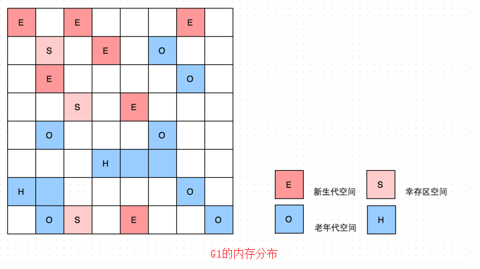
    - 在上图中，我们注意到还有一些Region标明了H，它代表Humongous，这表示这些Region存储的是巨大对象（humongous object，H-obj），即大小大于等于region一半的对象。剩下的区域就是未被分配的空闲区域。

  - 新生代GC
    - 新生代收集跟ParNew类似，当新生代占用达到一定比例的时候，开始触发收集。
    - 图示：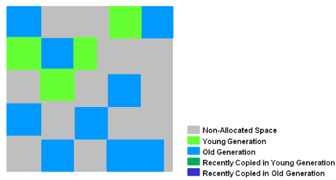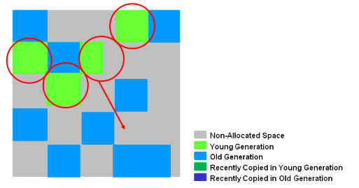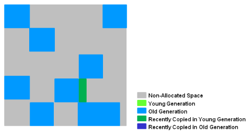
    - 被圈起的绿色部分为新生代的区域(region)，经过Young GC后存活的对象被转移到一个或者多个区域空闲中，这些被填充的区域将是新的新生代；当新生代对象的年龄(逃逸过一次Young GC年龄增加１)已经达到某个阈值(ParNew默认15)，被转移到老年代的区域中。
    - 回收过程是停顿的(STW,Stop-The-Word);回收完成之后根据Young GC的统计信息调整Eden和Survivor的大小，有助于合理利用内存，提高回收效率。
    - 回收的过程多个回收线程并发收集。

  - 老年代GC
    - 和CMS类似，G1收集器收集老年代对象会有短暂停顿。
    - 包括以下几个阶段：
      - 初始化标记阶段：这一阶段会捎带着进行一次新生代的GC，在日志“GC pause (young)(inital-mark)”部分进行展示。
      - 根区域扫描阶段：程序运行过程中会回收survivor区(存活到老年代)，这一过程必须在新生代的GC之前完成。
      - 并发标记阶段：在整个堆中进行并发标记(和应用程序并发执行)，此过程可能被新生代的GC中断。在并发标记阶段，若发现区域中的所有对象都是垃圾，那个这个区域会被立即回收(图中打X)。同时，并发标记过程中，会计算每个区域的对象活性(区域中存活对象的比例)。
      - 重新标记阶段：会有短暂停顿(STW)。再标记阶段是用来收集 并发标记阶段 产生新的垃圾(并发阶段和应用程序一同运行)；G1中采用了比CMS更快的初始快照算法:snapshot-at-the-beginning (SATB)
      - 复制或清除阶段：多线程清除失活对象，会有STW。G1将回收区域的存活对象拷贝到新区域，清除Remember Sets，并发清空回收区域并把它返回到空闲区域链表中。
      - 复制/清除后阶段：回收区域的活性对象已经被集中回收到深蓝色和深绿色区域。
    - 图示：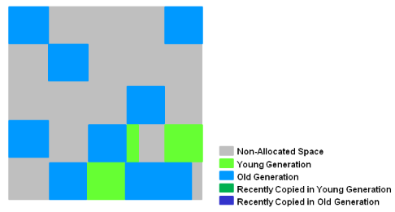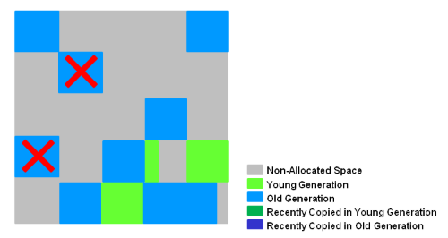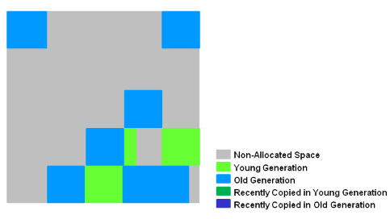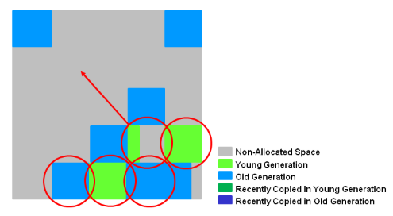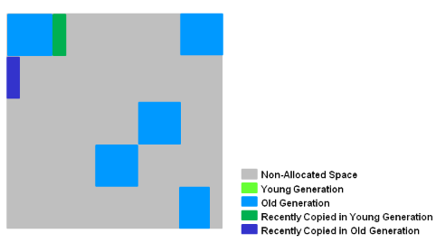

## 安全点和全局停顿
### 安全点
GC的停顿主要来源于可达性分析上，程序执行时并非在所有地方都能停顿下来开始GC，只有在到达安全点时才能暂停。

安全点的选定基本上是以程序“是否具有让程序长时间执行的特征”为标准进行选定的——因为每条指令执行的时间都非常短暂，程序不太可能因为指令流长度太长这个原因而过长时间运行，“长时间执行”的最明显特征就是指令序列复用，例如方法调用、循环跳转、异常跳转等，所以具有这些功能的指令才会产生安全点。

接下来的问题就在于，如何让程序在需要GC时都跑到安全点上停顿下来，大多数JVM的实现都是采用主动式中断的思想。

主动式中断的思想是当GC需要中断线程的时候，不直接对线程操作，仅仅简单地设置一个标志，各个线程执行时主动去轮询这个标志，发现中断标志为真时就自己中断挂起，轮询标志的地方和安全点是重合的，另外再加上创建对象需要分配内存的地方。

### 全局停顿
在新生代进行的GC叫做minor GC，在老年代进行的GC都叫major GC，Full GC同时作用于新生代和老年代。在垃圾回收过程中经常涉及到对对象的挪动（比如上文提到的对象在Survivor 0和Survivor 1之间的复制），进而导致需要对对象引用进行更新。为了保证引用更新的正确性，Java将暂停所有其他的线程，这种情况被称为“Stop-The-World”，导致系统全局停顿。Stop-The-World对系统性能存在影响，因此垃圾回收的一个原则是尽量减少“Stop-The-World”的时间。

## 几种回收器组合使用的原理图

- Serial收集器和SerialOld收集器
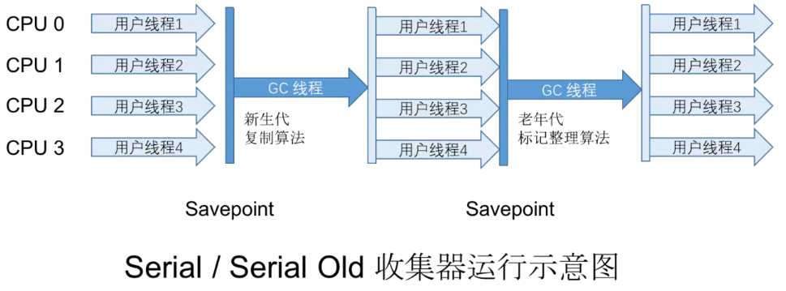

- ParNew收集器与SerialOld收集器
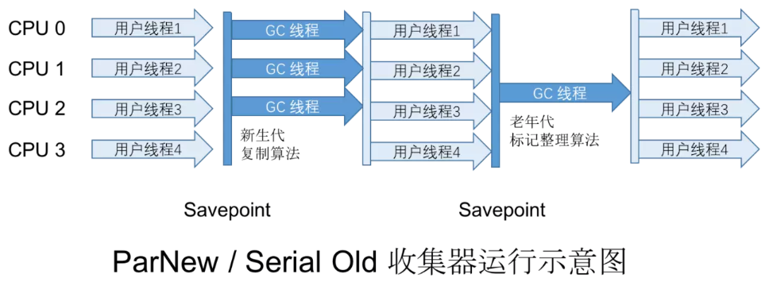

- Parallel Scavenge收集器和Parallel Old收集器
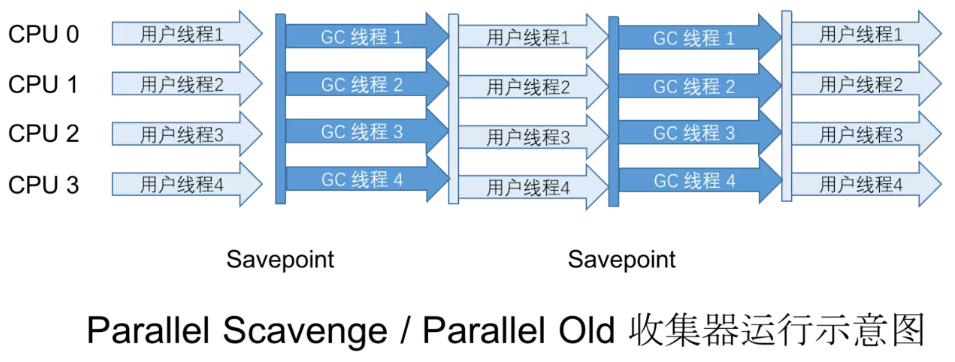

- G1收集器
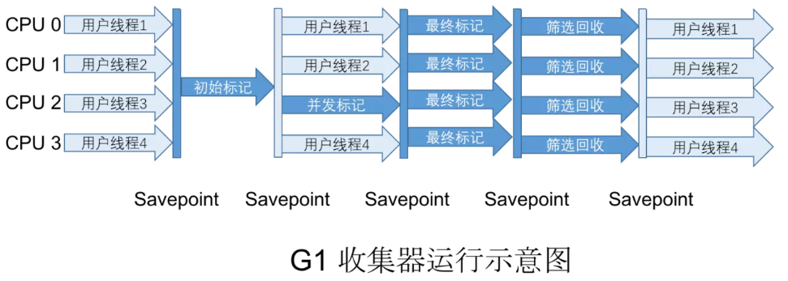

## GC日志分析与调优工具
### 日志分析
- MinorGC日志格式
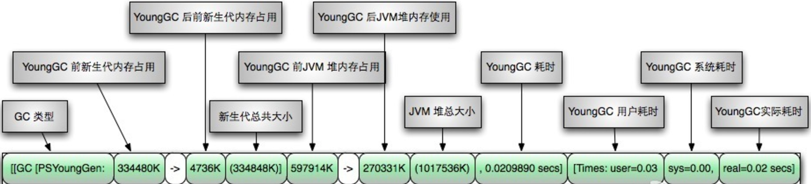

- FullGC日志格式

### 调优工具
调优工具分为两类，一类是jdk自带的，一类是第三方的。

- jps：JVM Process Status Tool,显示指定系统内所有的HotSpot虚拟机进程。
- jstat：JVM statistics Monitoring是用于监视虚拟机运行时状态信息的命令，它可以显示出虚拟机进程中的类装载、内存、垃圾收集、JIT编译等运行数据。
- jmap：JVM Memory Map命令用于生成heap dump文件
- jhat：JVM Heap Analysis Tool命令是与jmap搭配使用，用来分析jmap生成的dump，jhat内置了一个微型的HTTP/HTML服务器，生成dump的分析结果后，可以在浏览器中查看
- jstack：用于生成java虚拟机当前时刻的线程快照。
- jinfo：JVM Configuration info 这个命令作用是实时查看和调整虚拟机运行参数。

- jconsole：Java Monitoring and Management Console是从java5开始，在JDK中自带的java监控和管理控制台，用于对JVM中内存，线程和类等的监控
- jvisualvm：jdk自带全能工具，可以分析内存快照、线程快照；监控内存变化、GC变化等。
- MAT，Memory Analyzer Tool，一个基于Eclipse的内存分析工具，是一个快速、功能丰富的Java heap分析工具，它可以帮助我们查找内存泄漏和减少内存消耗
- GChisto：一款专业分析gc日志的工具

一般，我们在进行调优时，都会对上述工具进行组合使用。

## 线程、工作内存与主内存

### 线程与多线程

###

## 参考资料

[0] : [Jvm 系列(三):GC 算法 垃圾收集器](http://www.ityouknow.com/jvm/2017/08/25/jvm-memory-structure.html)

[1] : [Java虚拟机（JVM）你只要看这一篇就够了！](https://blog.csdn.net/qq_41701956/article/details/81664921)

[2] : [JVM看这一篇就够了](https://blog.csdn.net/qq_21870555/article/details/82967683)

[3] : [JAVA核心知识点整理]()

[4] : 深入理解Java虚拟机——JVM高级特性与最佳实践

[5] : [Java Hotspot G1 GC的一些关键技术](https://tech.meituan.com/2016/09/23/g1.html)

[6] ： [Getting Started with the G1 Garbage Collector](https://www.oracle.com/webfolder/technetwork/tutorials/obe/java/G1GettingStarted/index.html)

[7] ：[JVM GC参数以及GC算法的应用](https://my.oschina.net/hosee/blog/644618)

