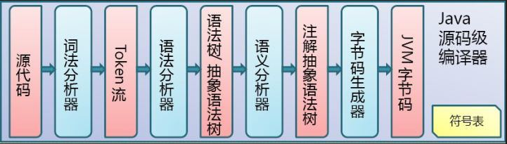
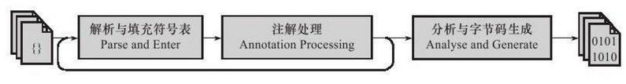
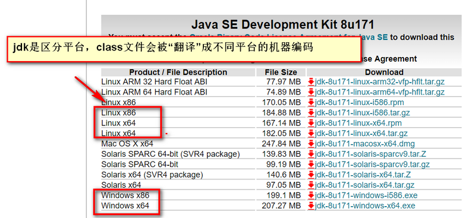
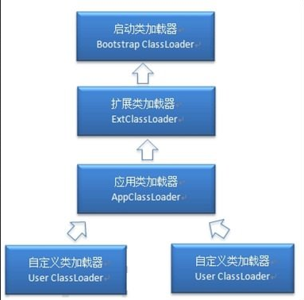
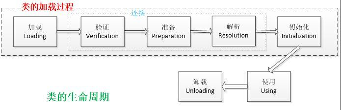
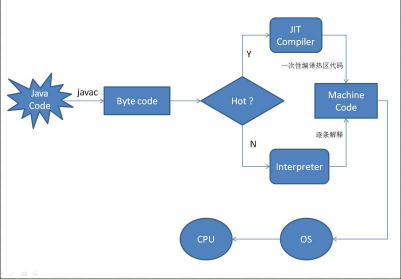
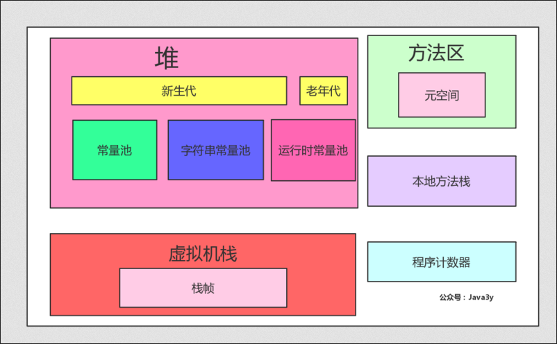
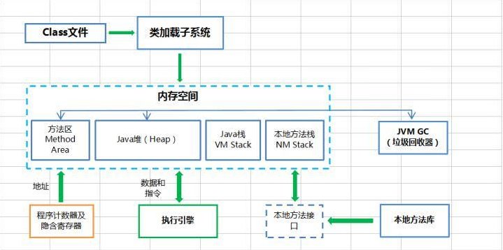
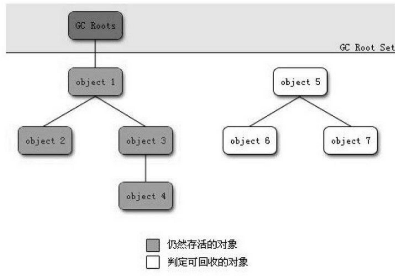

1. 详细jvm内存模型
2. 讲讲什么情况下回出现内存溢出，内存泄漏？
3. 说说Java线程栈
4. JVM 年轻代到年老代的晋升过程的判断条件是什么呢？
5. JVM 出现 fullGC 很频繁，怎么去线上排查问题？
6. 类加载为什么要使用双亲委派模式，有没有什么场景是打破了这个模式？
7. 类的实例化顺序
8. JVM垃圾回收机制，何时触发MinorGC等操作
9. JVM 中一次完整的 GC 流程（从 ygc 到 fgc）是怎样的
10. 各种回收器，各自优缺点，重点CMS. G1
11. 各种回收算法
12. OOM错误，stackoverflow错误，permgen space错误


-[超长JVM总结,面试必备](https://mp.weixin.qq.com/s/jhDgLnKodhmVeoBHp5IFCw)


> 文章地址： https://www.cnblogs.com/lfs2640666960/p/9297176.html

## 简单聊聊jvm

### 先看一个简单的java程序

现在我有一个JavaBean：
```java
public class Java3y {

  // 姓名
  private String name;

  // 年龄
  private int age;

  // 各种get/set方法/toString
  ...
}
```

和一个测试类：

```java
public class Java3yTest {
  public static void main(String[] args) {
    Java3y java3y = new Java3y();
    java3y.setName("Java3y");
    System.out.println(java3y);
  }
}
```
我们在初学的时候肯定用过javac来编译.java文件代码，用过java命令来执行编译后生成的.class文件。

在使用IDE点击运行的时候其实就是将这两个命令结合起来了(编译并运行)，方便我们开发。生成class文件，解析class文件得到结果。

### 编译过程

.java文件是由Java源码编译器(上述所说的java.exe)来完成，流程图如下所示：


Java源码编译由以下三个过程组成：

- 分析和输入到符号表
- 注解处理
- 语义分析和生成class文件


#### 编译时期-语法糖

> 语法糖可以看做是编译器实现的一些“小把戏”，这些“小把戏”可能会使得效率“大提升”。

最值得说明的就是泛型了，这个语法糖可以说我们是经常会使用到的！

- 泛型只会在Java源码中存在，编译过后会被替换为原来的原生类型（Raw Type，也称为裸类型）了。这个过程也被称为：**泛型擦除**。

有了泛型这颗语法糖以后：

- 代码更加简洁【不用强制转换】
- 程序更加健壮【只要编译时期没有警告，那么运行时期就不会出现ClassCastException异常】
- 可读性和稳定性【在编写集合的时候，就限定了类型】

### jvm实现跨平台

至此，我们通过java.exe编译器编译我们的.java源代码文件生成出.class文件了！

这些.class文件很明显是不能直接运行的，它不像C语言(编译cpp后生成exe文件直接运行)。这些.class文件是交由JVM来解析运行！

- JVM是运行在操作系统之上的，每个操作系统的指令是不同的，而JDK是区分操作系统的，只要你的本地系统装了JDK，这个JDK就是能够和当前系统兼容的。
- 而class字节码运行在JVM之上，所以不用关心class字节码是在哪个操作系统编译的，只要符合JVM规范，那么，这个字节码文件就是可运行的。
- 所以Java就做到了跨平台--->一次编译，到处运行！



java源代码（即.java文件）被jvm编译器编译成字节码文件（也就是.class文件），然后字节码文件（.class文件）又被不同平台的jvm解释器解释运行为对应操作系统的二进制码。

> java具有可移植性的原因是什么？
>
> 答：
> 1. java中每种数据类型所占用的存储空间，不会随着机器硬件架构的变化而变化；
> 2. 实现可移植性的关键步骤是java源代码（即.java文件）被jvm编译器编译成字节码文件（也就是.class文件），这种字节码文件是一致的，不会随jvm的变化而变化。换句话来说，不同的平台的jvm将相同的java源代码编译成相同的字节码文件（也就是.class文件）；
> 3. 同一份字节码文件在不同平台的jvm上解释出来的二进制码不同，也就是说同一份字节码文件在不同平台的jvm上解释出来的二进制码就是当前平台上面能用的二进制码。

### class文件和jvm的恩怨情仇

#### 类的加载时机

现在我们例子中生成的两个.class文件都会直接被加载到JVM中吗？？

虚拟机规范则是严格规定了有且只有5种情况必须立即对类进行“初始化”(class文件加载到JVM中)：

- 创建类的实例(new 的方式)。访问某个类或接口的静态变量，或者对该静态变量赋值，调用类的静态方法
- 反射的方式
- 初始化某个类的子类，则其父类也会被初始化
- Java虚拟机启动时被标明为启动类的类，直接使用java.exe命令来运行某个主类（包含main方法的那个类）
- 当使用JDK1.7的动态语言支持时(....)

所以说：**Java类的加载是动态的，它并不会一次性将所有类全部加载后再运行，而是保证程序运行的基础类(像是基类)完全加载到jvm中，至于其他类，则在需要的时候才加载。这当然就是为了节省内存开销。**

#### 如何将类加载到jvm

class文件是通过类的加载器装载到jvm中的！

Java默认有三种类加载器：



各个加载器的工作责任：

1. Bootstrap ClassLoader：负责加载$JAVA_HOME中jre/lib/rt.jar里所有的class，由C++实现，不是ClassLoader子类
2. Extension ClassLoader：负责加载java平台中扩展功能的一些jar包，包括$JAVA_HOME中jre/lib/*.jar或-Djava.ext.dirs指定目录下的jar包
3. App ClassLoader：负责记载classpath中指定的jar包及目录中class

具体的过程：

1. 当AppClassLoader加载一个class时，它首先不会自己去尝试加载这个类，而是把类加载请求委派给父类加载器ExtClassLoader去完成。
2. 当ExtClassLoader加载一个class时，它首先也不会自己去尝试加载这个类，而是把类加载请求委派给BootStrapClassLoader去完成。
3. 如果BootStrapClassLoader加载失败（例如在$JAVA_HOME/jre/lib里未查找到该class），会使用ExtClassLoader来尝试加载；
4. 若ExtClassLoader也加载失败，则会使用AppClassLoader来加载
5. 如果AppClassLoader也加载失败，则会报出异常ClassNotFoundException

其实这就是所谓的双亲委派模型。简单来说：**如果一个类加载器收到了类加载的请求，它首先不会自己去尝试加载这个类，而是把请求委托给父加载器去完成，依次向上。** 这样做的好处：**防止内存中出现多份同样的字节码(安全性角度)**。

**特别说明：** 类加载器在成功加载某个类之后，会把得到的 java.lang.Class类的实例缓存起来。下次再请求加载该类的时候，类加载器会直接使用缓存的类的实例，而不会尝试再次加载。

#### 类加载详细过程

加载器加载到jvm中，接下来其实又分了好几个步骤：

- 加载，查找并加载类的二进制数据，在Java堆中也创建一个java.lang.Class类的对象。
- 连接，连接又包含三块内容：验证、准备、初始化。
  1. 验证，文件格式、元数据、字节码、符号引用验证；
  2. 准备，为类的静态变量分配内存，并将其初始化为默认值；
  3. 解析，把类中的符号引用转换为直接引用。
- 初始化，为类的静态变量赋予正确的初始值。



#### JIT即时编辑器

一般我们可能会想：JVM在加载了这些class文件以后，针对这些字节码，逐条取出，逐条执行-->解析器解析。

但如果是这样的话，那就太慢了！

我们的JVM是这样实现的：就是把这些Java字节码重新编译优化，生成机器码，让CPU直接执行。这样编出来的代码效率会更高。编译也是要花费时间的，我们一般对热点代码做编译，非热点代码直接解析就好了。

> 热点代码解释：一、多次调用的方法。二、多次执行的循环体。

使用热点探测来检测是否为热点代码，热点探测有两种方式：

- 采样
- 计数器

目前HotSpot使用的是计数器的方式，它为每个方法准备了两类计数器：

- 方法调用计数器（Invocation  Counter）
- 回边计数器（Back  EdgeCounter）。

在确定虚拟机运行参数的前提下，这两个计数器都有一个确定的阈值，当计数器超过阈值溢出了，就会触发JIT编译。



#### 回到例子中

按我们程序来走，我们的Java3yTest.class文件会被AppClassLoader加载器(因为ExtClassLoader和BootStrap加载器都不会加载它[双亲委派模型])加载到JVM中。

随后发现了要使用Java3y这个类，我们的Java3y.class文件会被AppClassLoader加载器(因为ExtClassLoader和BootStrap加载器都不会加载它[双亲委派模型])加载到JVM中。

### 类加载完以后JVM干了什么？

在类加载检查通过后，接下来虚拟机将为新生对象分配内存。

#### JVM的内存模型

首先我们来了解一下JVM的内存模型的怎么样的：基于jdk1.8画的JVM的内存模型--->我画得比较细。



简单看了一下内存模型，简单看看每个区域究竟存储的是什么(干的是什么)：

- 堆：存放对象实例，几乎所有的对象实例都在这里分配内存
- 虚拟机栈：虚拟机栈描述的是Java方法执行的内存模型：每个方法被执行的时候都会同时创建一个栈帧（Stack Frame）用于存储局部变量表、操作栈、动态链接、方法出口等信息
- 本地方法栈：本地方法栈则是为虚拟机使用到的Native方法服务。
- 方法区：存储已被虚拟机加载的类元数据信息(元空间)
- 程序计数器：当前线程所执行的字节码的行号指示器


#### 例子中的流程



我来宏观简述一下我们的例子中的工作流程：

1. 通过java.exe运行Java3yTest.class，随后被加载到JVM中，元空间存储着类的信息(包括类的名称、方法信息、字段信息..)。
2. 然后JVM找到Java3yTest的主函数入口(main)，为main函数创建栈帧，开始执行main函数
3. main函数的第一条命令是Java3y java3y = new Java3y();就是让JVM创建一个Java3y对象，但是这时候方法区中没有Java3y类的信息，所以JVM马上加载Java3y类，把Java3y类的类型信息放到方法区中(元空间)
4. 加载完Java3y类之后，Java虚拟机做的第一件事情就是在堆区中为一个新的Java3y实例分配内存, 然后调用构造函数初始化Java3y实例，这个Java3y实例持有着指向方法区的Java3y类的类型信息（其中包含有方法表，java动态绑定的底层实现）的引用
5. 当使用java3y.setName("Java3y");的时候，JVM根据java3y引用找到Java3y对象，然后根据Java3y对象持有的引用定位到方法区中Java3y类的类型信息的方法表，获得setName()函数的字节码的地址
6. 为setName()函数创建栈帧，开始运行setName()函数

从微观上其实还做了很多东西，正如上面所说的类加载过程（加载-->连接(验证，准备，解析)-->初始化)，在类加载完之后jvm为其分配内存(分配内存中也做了非常多的事)。由于这些步骤并不是一步一步往下走，会有很多的“混沌bootstrap”的过程，所以很难描述清楚。

### 简单聊聊各种常量池
在写这篇文章的时候，原本以为我对String s = "aaa";类似这些题目已经是不成问题了，直到我遇到了String.intern()这样的方法与诸如String s1 = new String("1") + new String("2"); 混合一起用的时候我发现，我还是太年轻了。首先我是先阅读了美团技术团队的这篇文章：https://tech.meituan.com/in_depth_understanding_string_intern.html --- 深入解析String#intern，嗯，然后就懵逼了。我摘抄一下他的例子：

```java
public static void main(String[] args) {

  String s = new String("1");
  s.intern();
  String s2 = "1";
  System.out.println(s == s2);

  String s3 = new String("1") + new String("1");
  s3.intern();
  String s4 = "11";
  System.out.println(s3 == s4);

}
```

打印结果是: jdk7,8下false true

调换一下位置后：

```java

public static void main(String[] args) {

  String s = new String("1");
  String s2 = "1";
  s.intern();
  System.out.println(s == s2);

  String s3 = new String("1") + new String("1");
  String s4 = "11";
  s3.intern();
  System.out.println(s3 == s4);

}
```

打印结果为：jdk7,8下false false

文章中有很详细的解析，但我简单阅读了几次以后还是很懵逼。所以我知道了自己的知识点还存在漏洞，后面阅读了一下R大之前写过的文章：http://rednaxelafx.iteye.com/blog/774673#comments ---请别再拿“String s = new String("xyz");创建了多少个String实例”来面试了吧，看完了之后，就更加懵逼了。

后来，在zhihu上看到了这个回答：https://www.zhihu.com/question/55994121 ---Java中new String("字面量") 中 "字面量" 是何时进入字符串常量池的?

结合网上资料和自己的思考，下面整理一下对常量池的理解~~

#### 各个常量池的情况

针对于jdk1.7之后：

- 常量池位于堆中
  - 存放字面量(Literal)：文本字符串等---->用双引号引起来的字符串字面量都会进这里面
  - 存放符号引用(Symbolic References): 类和接口的全限定名(Full Qualified Name)、字段的名称和描述符(Descriptor)、方法的名称和描述符

- 运行时常量池位于堆中
- 字符串常量池位于堆中

> 常量池（Constant Pool Table），用于存放编译期生成的各种字面量和符号引用，这部分内容将在类加载后进入方法区的运行时常量池中存放--->来源：深入理解Java虚拟机 JVM高级特性与最佳实践（第二版）

现在我们的运行时常量池只是换了一个位置(原本来方法区，现在在堆中),但可以明确的是：类加载后，常量池中的数据会在运行时常量池中存放！

```
HotSpot VM里，记录interned string的一个全局表叫做StringTable，它本质上就是个HashSet<String>。
注意它只存储对java.lang.String实例的引用，而不存储String对象的内容。
```

字符串常量池只存储引用，不存储内容！

再来看一下我们的intern方法：

### GC垃圾回收

可以说GC垃圾回收是JVM中一个非常重要的知识点，应该非常详细去讲解的。但在我学习的途中，我已经发现了有很好的文章去讲解垃圾回收的了。

#### JVM垃圾回收简单介绍

在C++中，我们知道创建出的对象是需要手动去delete掉的。我们Java程序运行在JVM中，JVM可以帮我们“自动”回收不需要的对象，对我们来说是十分方便的。

虽然说“自动”回收了我们不需要的对象，但如果我们想变强，就要变秃..不对，就要去了解一下它究竟是怎么干的，理论的知识有哪些。

首先，JVM回收的是垃圾，垃圾就是我们程序中已经是不需要的了。垃圾收集器在对堆进行回收前，第一件事情就是要确定这些对象之中哪些还“存活”着，哪些已经“死去”。判断哪些对象“死去”常用有两种方式：

- 引用计数法-->这种难以解决对象之间的循环引用的问题
- 可达性分析算法-->主流的JVM采用的是这种方式



现在已经可以判断哪些对象已经“死去”了，我们现在要对这些“死去”的对象进行回收，回收也有好几种算法：

- 标记-清除算法
- 复制算法
- 标记-整理算法
- 分代收集算法


# 参考
1. 泛型就这么简单, https://segmentfault.com/a/1190000014120746
2. JVM杂谈之JIT，https://zhuanlan.zhihu.com/p/28476709
3. 深入探讨 Java 类加载器，https://www.ibm.com/developerworks/cn/java/j-lo-classloader/
4. 深入浅出 JIT 编译器, https://www.ibm.com/developerworks/cn/java/j-lo-just-in-time/
5. Java程序编译和运行的过程, http://www.cnblogs.com/qiumingcheng/p/5398610.html
6. Java JVM 运行机制及基本原理， https://zhuanlan.zhihu.com/p/25713880
7. Java Language and Virtual Machine Specifications，https://docs.oracle.com/javase/specs/index.html
8. Java虚拟机（JVM）你只要看这一篇就够了！，https://blog.csdn.net/qq_41701956/article/details/81664921


# 待看内容
https://segmentfault.com/a/1190000018312743
http://www.importnew.com/31126.html


