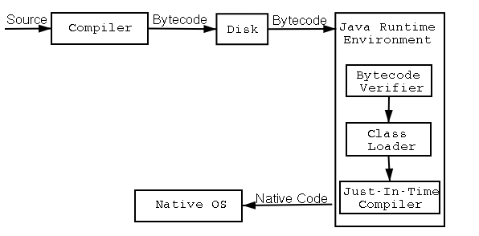
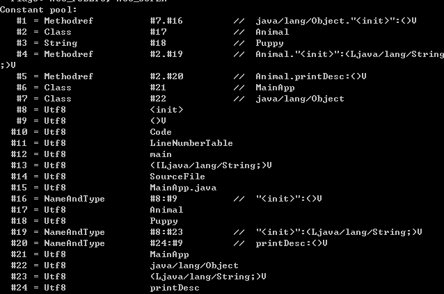
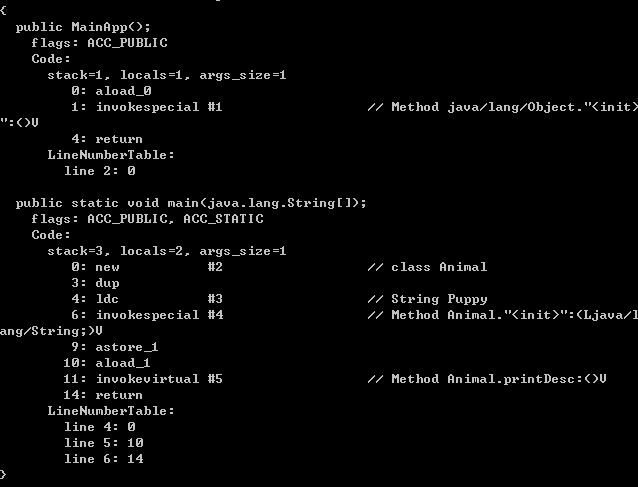

> java程序编译和运行过程， https://www.cnblogs.com/qiumingcheng/p/5398610.html

# java程序编译和运行过程

## 简单概述

Java整个编译以及运行的过程相当繁琐，本文通过一个简单的程序来简单的说明整个流程。如下图，Java程序从源文件创建到程序运行要经过两大步骤：

1. 源文件由编译器编译成字节码（ByteCode）
2. 字节码由java虚拟机解释运行



因为java程序既要编译同时也要经过JVM的解释运行，所以说Java被称为半解释语言（ "semi-interpreted" language）。

## 详细过程

下面通过以下这个java程序，来说明java程序从编译到最后运行的整个流程。代码如下：

```java
//MainApp.java
public class MainApp {
    public static void main(String[] args) {
        Animal animal = new Animal("Puppy");
        animal.printName();
    }
}
//Animal.java
public class Animal {
    public String name;
    public Animal(String name) {
        this.name = name;
    }
    public void printName() {
        System.out.println("Animal ["+name+"]");
    }
}
```


### 第一步：编译过程

创建完源文件之后，程序会先被编译为.class文件。Java编译一个类时，如果这个类所依赖的类还没有被编译，编译器就会先编译这个被依赖的类，然后引用，否则直接引用，这个有点象make。如果java编译器在指定目录下找不到该类所其依赖的类的.class文件或者.java源文件的话，编译器话报“cant find symbol”的错误。

> 编译后的字节码文件格式主要分为两部分：常量池和方法字节码。常量池记录的是代码出现过的所有token(类名，成员变量名等等)以及符号引用（方法引用，成员变量引用等等）；方法字节码放的是类中各个方法的字节码。
>
>
> 下面是MainApp.class通过反汇编的结果，我们可以清楚看到.class文件的结构：





### 第二步：运行过程

java类运行的过程大概可分为两个过程：1、类的加载  2、类的执行。需要说明的是：JVM主要在程序第一次主动使用类的时候，才会去加载该类。也就是说，JVM并不是在一开始就把一个程序就所有的类都加载到内存中，而是到不得不用的时候才把它加载进来，而且只加载一次。

### 详细过程描述

下面是程序运行的详细步骤：

1. 在编译好java程序得到MainApp.class文件后，在命令行上敲java AppMain。系统就会启动一个jvm进程，jvm进程从classpath路径中找到一个名为AppMain.class的二进制文件，将MainApp的类信息加载到运行时数据区的方法区内，这个过程叫做MainApp类的加载。
2. 然后JVM找到AppMain的主函数入口，开始执行main函数。
3. main函数的第一条命令是Animal  animal = new Animal("Puppy");就是让JVM创建一个Animal对象，但是这时候方法区中没有Animal类的信息，所以JVM马上加载Animal类，把Animal类的类型信息放到方法区中。
4. 加载完Animal类之后，Java虚拟机做的第一件事情就是在堆区中为一个新的Animal实例分配内存, 然后调用构造函数初始化Animal实例，这个Animal实例持有着指向方法区的Animal类的类型信息（其中包含有方法表，java动态绑定的底层实现）的引用。
5. 当使用animal.printName()的时候，JVM根据animal引用找到Animal对象，然后根据Animal对象持有的引用定位到方法区中Animal类的类型信息的方法表，获得printName()函数的字节码的地址。
6. 开始运行printName()函数。


```
特别说明： java类中所有public和protected的实例方法都采用动态绑定机制，所有私有方法、静态方法、构造器及初始化方法<clinit>都是采用静态绑定机制。而使用动态绑定机制的时候会用到方法表，静态绑定时并不会用到。本文只是讲述java程序运行的大概过程，所以并没有细加区分。本文的所述的流程非常粗糙，想深入了解的读者请查阅其他资料。存在谬误的地方，请多指正。
```
