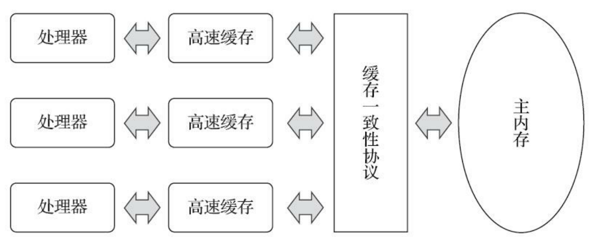
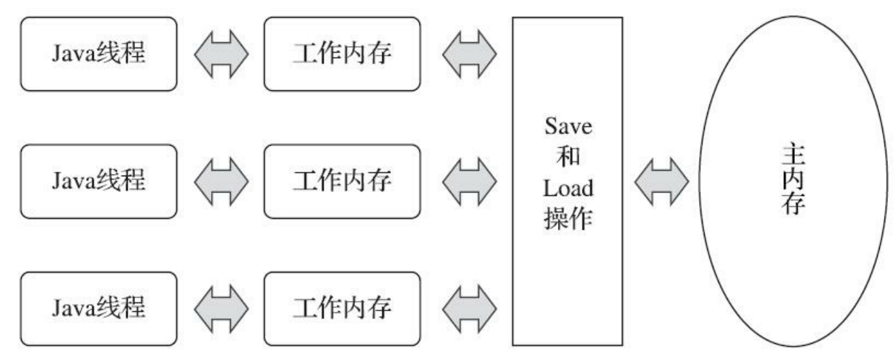

## 1.7中的实现 

- Segment 数组 + HashEntry 数组 + 链表的方式实现；
- Segment 继承了 Reentrentlock ， 里面存放了一个 HashEntry 数组，并且这个数组被 volitale 关键字修饰；
- Put原理
  - 将当前 Segment 中的 table 通过 key 的 hashcode 定位到 HashEntry
  - 遍历该 HashEntry，如果不为空则判断传入的 key 和当前遍历的 key 是否相等，相等则覆盖旧的 value
  - 不为空则需要新建一个 HashEntry 并加入到 Segment 中，同时会先判断是否需要扩容
- Get原理
  - get 逻辑比较简单，只需要将 Key 通过 Hash 之后定位到具体的 Segment ，再通过一次 Hash 定位到具体的元素上。
  - volitale 关键字保证能读到最新的修改值
- 存在的问题
  - 和HashMap一样，同样存在循环链表问题

## 1.8中的实现

- 使用 CAS + synchronized 保证同步性质
- HashEntry 也换成了 Node 
- Put原理
  - 使用当前key的hashcode值定位Node节点，如果为空则利用 CAS 直接写入数据，写入失败就自旋来确保写入成功；
  - 判断 hashcode == MOVED == -1 为真，就进行扩容
  - 如果都不满足，就使用 synchronized 锁写入数据；
- get原理
  - 将key通过hash后定位到node，然后进行比对，同样 volitale 关键字保证能读到最新的修改值

## CAS原理与volatile关键字

compareAndSet(旧值， 期望值， 修改值)： 表示，如果程序获得的旧值与期望值一样，就表示在这个过程中没有其他线程修改改值，就可以把这个值修改为 修改值。它是算法上实现的一种锁，执行效率很高，但是会出现ABA的问题。

ABA的问题是指线程a获取的旧值为A，而期望值是B，这个旧值有可能是其他线程也修改过很多次的，只不过修改后的仍为A而已。解决这个问题的方法可以通过添加时间戳的方式进行避免，或者是添加版本号的方式进行避免。在jdk中，原子类就解决了ABA的问题。

我们在来说一下 volatile 关键字。说 volatile 关键字之前要先说一下操作系统的内存模型。计算机操作系统的内存模型存在的根本原因是内存存取数据的速度与指令执行的速度是数量级上的差异，其本质目的也是为了弥补这种数量级的差异，尽量使内存存取数据的速度接近于指令执行的速度，这样就可以达到最大限度压榨CPU运算能力的效果了。

操作系统内存模型： 

人们在操作系统内存模型的基础上演变出来java内存模型JMM： 

volatile 关键字修饰的变量，赋值之后多执行了一个“lock addl$0x0，(%esp)”操作，则会在生成的字节码附近生成一个内存屏障，这个内存屏障能够保证在这个屏障之前的指令不会指令重拍到内存屏障之前。这就标志着 volatile 关键字具有禁止指令重排（即保证有序性）的特性。而 addl$0x0，(%esp) 作用是把本处理器的缓存写入主内存，这就保证了 volatile 关键字的可见性。但 volatile 并不保证操作的原子性。

## synchronized关键字

字节码上会生成 monitorenter 和 monitorexit 两个指令，

JVM 使用了锁升级的优化方式，就是先使用偏向锁优先同一线程然后再次获取锁，如果失败，就升级为 CAS 轻量级锁，如果失败就会短暂自旋，防止线程被系统挂起。最后如果以上都失败就升级为重量级锁。

## ReentrantLock

与 synchronized 关键字的区别，
- ReentrantLock 基于语言实现的，synchronized 基于jdk指令实现的
- ReentrantLock 还具有 等待可中断 、 实现公平锁 、 绑定多个条件的特点

// TODO

