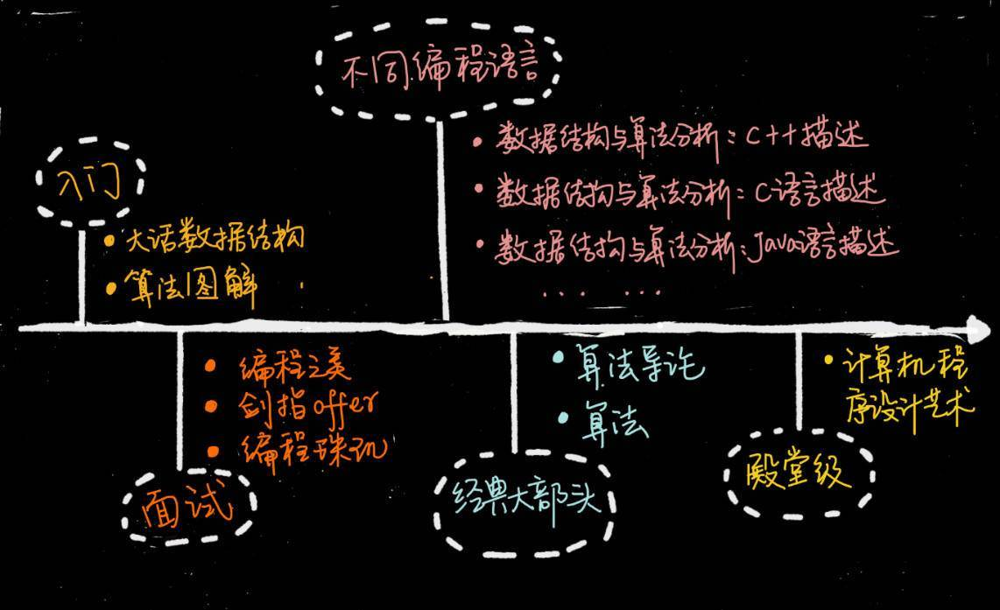

## 概述
- 数据结构概述
  - 什么是数据结构
    - 数据之间的组织形式
  - 存储结构：在计算机中的实际存储结构
    - 顺序存储结构：数据元素存储的位置是连续的，即两个元素之间没有空白存储空间
    - 链式存储结构：数据元素存储的位置是离散的，元素与元素之间可能会存在空白存储空间
    - 两种方式的区别
      - 连续和分散
      - 查找快与慢
      - 增删快与慢
  - 逻辑结构
    - 集合结构（并行关系）：在一块存储空间中，元素与元素之间的关系时散列的，没有其他关系；
    - 线性结构（一对一关系）
    - 树形结构（一对多关系）
    - 图形结构（多对多关系）
- 算法概述
  - 定义：计算机处理问题的步骤
  - 特性
    - 输入
    - 输出
    - 有穷性：算法的步骤是有限的
    - 确定性：总能够得到确定的结果
    - 可行性：在计算机上面是可以运行的
  - 基本要求
    - 正确性：要求所采取的算法的求解结果是正确的
    - 可读性：对人来说是可以理解的
    - 健壮性：对错误的输入也能够得到相对应的结果
    - 时间复杂度：要求所使用的时间尽可能小
    - 空间复杂度：要求所使用的存储空间尽可能小
  - 备注
    - 算法没有最好的，只有最适合的。
- 研究内容
  - 研究一种数据结构时，我们在研究什么？
  - 我们在研究：
    - 存储在计算机中的逻辑结构
    - 操作集

## 线性结构（重点）
- 数组
  - 存储图示
  - 基本使用
    - 创建
    - 获取长度
    - 访问元素
    - 遍历
    - 修改
    - 往不可变数组中添加一个元素
      - 需要创建一个原来的数组长度+1长度的新数组
    - 删除
      - 创建一个原来数组长度-1长度的新数组
  - 面向对象的数组（创建、删除、修改、增加、显示、遍历等）
  - 查找算法
    - 线性查找
    - 二分法查找（BinarySearch）：对已知顺序的数组进行排序
- 栈
  - 存储图示（一个木桶，先进后出）
  - 操作集
    - push
    - pop
    - 查看栈顶元素peek
    - 判断栈是否为空
- 队列
  - 存储图示（先进先出）
  - 操作集
    - 入队
    - 出队
    - 判空
- 单链表
  - 存储图示
  - 操作集
    - next
    - isLast
    - getData
    - 追加
    - 删除下一个节点
    - 插入一个新节点
- 循环链表
  - 存储图示
  - 操作集
    - 与单链表相似
- 双链表
  - 存储图示
  - 操作集
    - after
- 递归
  - 斐波那契数列
  - 汉诺塔

## 排序算法
- 概述
  - 算法的优劣
    - 事后统计法
    - 事前分析估算法
  - 时间复杂度
    - 语句频度：T(n)
    - 一般情况下，算法中的基本操作语句的重复执行次数是问题规模n的某个函数，用T(n)表示，若有某个辅助函数f(n)，使得当n趋近于无限大时，T(n)/f(n)的极限为不等于0的常数，则称f(n)是T(n)的同数量级函数。记作T(n)=O(f(n))，称O(f(n))为算法的渐进时间复杂度，简称时间复杂度。
    - 平均时间复杂度
    - 最坏情况时间复杂度（研究重点）
  - 空间复杂度
- 排序算法
  - 交换排序
    - 冒泡排序
    - 快速排序
p22
  - 插入排序
    - 直接插入排序
    - 希尔排序
  - 选择排序
    - 简单选择排序
    - 堆排序
  - 归并排序
  - 基数排序
- 对比

## 树结构

- [树](https://javaguide.cn/cs-basics/data-structure/tree.html#%E4%BA%8C%E5%8F%89%E6%A0%91%E7%9A%84%E5%88%86%E7%B1%BB)
- https://zhuanlan.zhihu.com/p/90255760
- https://juejin.cn/post/6844903519632228365#comment
- https://zhuanlan.zhihu.com/p/273829162
- https://www.cnblogs.com/maybe2030/category/709561.html
- http://learn.lianglianglee.com/%E4%B8%93%E6%A0%8F/%E9%87%8D%E5%AD%A6%E6%95%B0%E6%8D%AE%E7%BB%93%E6%9E%84%E4%B8%8E%E7%AE%97%E6%B3%95-%E5%AE%8C/09%20%20%E6%A0%91%E5%92%8C%E4%BA%8C%E5%8F%89%E6%A0%91%EF%BC%9A%E5%88%86%E6%94%AF%E5%85%B3%E7%B3%BB%E4%B8%8E%E5%B1%82%E6%AC%A1%E7%BB%93%E6%9E%84%E4%B8%8B%EF%BC%8C%E5%A6%82%E4%BD%95%E6%9C%89%E6%95%88%E5%AE%9E%E7%8E%B0%E5%A2%9E%E5%88%A0%E6%9F%A5%EF%BC%9F.md

## 哈希表

## 图

## 其他

- [如何系统地学习数据结构与算法？](https://zhuanlan.zhihu.com/p/137041568)

