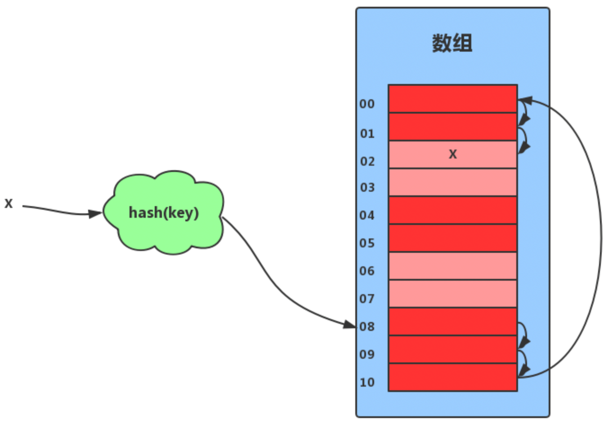
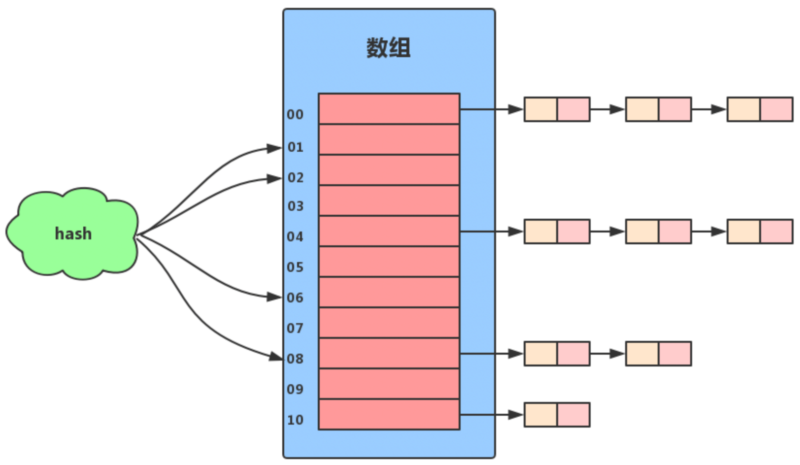

## 背景

早期计算机的存储是连续存储的，查找起来只需要顺序遍历然后一个一个比对即可。但是如果存放的数据没有规律，并且还是按照顺序存储的方式进行存放，这时想要查询一个数据时，压根不知道存放的位置是多少。于是人们就想，能不能根据要存放的内容，设计一种算法，根据算法就可以知道位置？

于是人们首先想如何让存放的内容跟地址有所绑定呢？此时出现了散列算法以及散列算法的冲突解决算法。

散列算法以及散列算法的冲突解决算法完美解决了存放内容与地址的绑定关系，但是人们又开始分析：如何解决hash冲突，空间利用率，引入装载因子……

其他内容： 
- 扩容与缩容的过程
- 散列函数的选择
- 装载因子的选择

## 基本原理

### 散列函数——解决长变短的问题

一些文章介绍散列表的时候，直接贴出一个概念，说散列算法就是将一个数组映射成固定长度的算法。这种说法直接套用了数学的概念，相当于把数学中的函数的概念引了进来。这样说倒也合理。

那有哪些散列函数呢？

- 直接定址法
- 数字分析法
- 平方取值法
- 折叠法
- 除留余数法
- 随机数法
- ……

这些散列函数都具有两个特点：

- 确定性： 对同一个值，散列函数运算多次的结果都是一样的，也就是说同一个值的散列运算结果是确定的；
- 不确定性： 对同一个运算结果，对应的原始输入可能有多个，也就是说同一个运算结果，它的原始输入是不确定的；

这里老王带你体会一个，然后再举一反三，这些散列函数都大差不差，本质都一样。我们拿除留余数法举例。我们先对一块区域进行编号，编号为1到10，现在有1k个数据，那么编号为245的数据应该存放到哪个位置呢？我们就用 245%10 = 5，结果就是编号为245的数据应该存放到地址为编号5的位置。现在又有一个编号为385的数据，那这个数据的存放地址呢？同样是 385%10 = 5，一样存放到地址为编号5的位置。

上面这个例子中 245%10=5， 不管它运算多少次，结果都是5，这就是它的确定性；而385%10也是等于5的，说明对于同一个运算结果5， 它的原始输入可能不一样，这就是不确定性。

其实上面这些散列函数都是这样一个效果，具体选择哪一种算法，要看具体的业务场景，具体来分析。而除留余数法是最好理解的，举一反三。

245 和 385 经过运算之后结果都是5，这就说明有了冲突。那我们应该怎么解决冲突呢，往下看……

### 散列冲突及空间结构（Hash冲突）——解决散列冲突的问题

散列冲突是指不同的输入经过散列运算后，可能会有同一个输出。目前最常见的是两种：

一种是开放寻址，说白了，就是先运算出一个地址，如果这个地址上有数据，就往下面一个地址顺移，如果下面一个地址还有数据，那就接着往下顺移……直到找到一个没有数据的位置。这种方式有一个问题，那就是如果这块区域已经满了，就会造成循环寻址的情况。

另一种是拉链法，这种方式是先运算出一个地址，而这个地址并不保存数据，而是保存一个指针或者是引用，这样这个地址上就可以保存多个运算结果一样的数据了。

### Hash槽

Hash槽就是散列表的数组+链表的实现方式中的数组元素所在的位置。可以想象一下HashMap的实现原理： HashMap 的数组部分就是Hash槽，一个Hash槽可以放很多元素，因为这个槽可以拖着一个链表或红黑树。

### 装载因子

装载因子是散列表的健康状况的指标。装载因子越大，说明存放的数据越多，空闲位置也就越少，散列冲突也就越大，散列表的性能也就越差；相反，装载因子越小，说明空闲位置越少，散列冲突也就越小，散列表的性能也就越好。计算公式如下：

装载因子 = 存放的数据个数 / 散列表的长度

装载因子为大于0的数，可以为整数，也可以为小数，也可以大于1。比如拉链法中同一个地址上保存了很多数据，数据个数可能会远远大于散列表的长度。

### 扩容与缩容

在实际使用过程时，散列表的长度并不是一成不变的。这就涉及到扩容和缩容，而只要扩容或缩容，就一定涉及到重新计算地址的过程。在jdk中的HashMap和Redis集群中增删节点信息等都涉及到散列表的扩容和缩容，实际上，分布式应用系统中，散列表也是支持高可扩展性的一种常见的数据结构。关于分布式中一致性hash算法，可以参考老王的另一篇[文章](../../distribute/hash.md)。

## 应用场景

- Java中的HashMap类
- Redis中的字典数据结构

## 参考

- [Redis数据结构——字典](https://www.laoyu.site/2018/%E6%8A%80%E6%9C%AF%E5%AE%9E%E8%B7%B5/redis/Redis%E6%95%B0%E6%8D%AE%E7%BB%93%E6%9E%84%E2%80%94%E2%80%94%E5%AD%97%E5%85%B8/)
- java集合面试题52道.pdf

