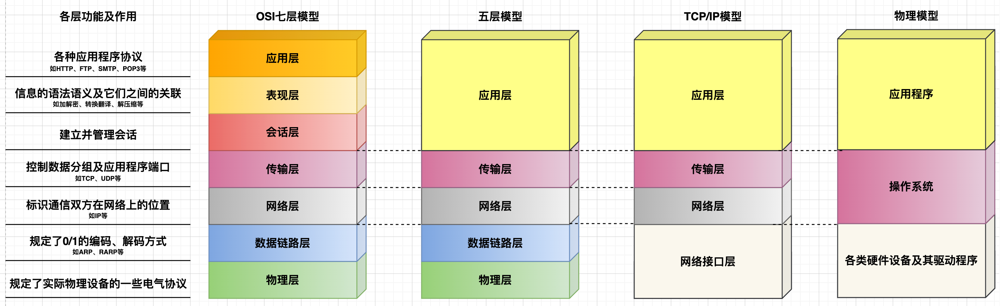
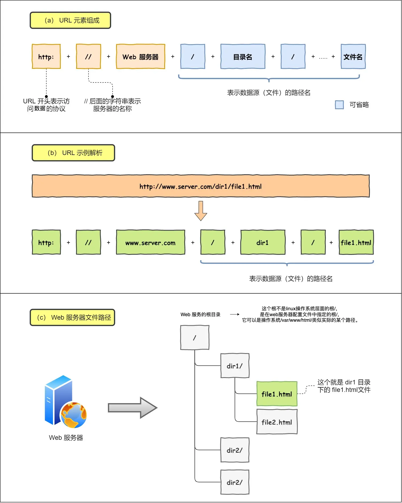
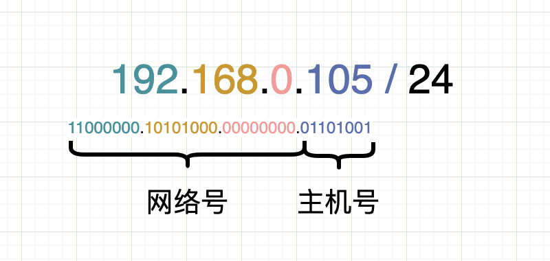

## 提纲

见本章节Readme文档。

## 七层协议及每层的作用、五层协议、TCP/IP四层模型的关系

- 所谓`通信`，就涉及到信息的发送方和信息的接收方，因此，对于发送方发送出去的消息是如何进行控制的（如加密、压缩、分组等控制手段），只要能够让接收方接收到的信息进行反向操作（解密、解压缩、合并分组等反向控制手段），那么就可以达到信息的“可靠”传递。至于接收方接收到信息后如何处理，则需要通信双方事先规定好信息的控制手段，这些信息的控制手段就被称为`协议`。
- 计算机网络，就是解决信息在互联网上进行传递的一门学问，核心就是各种各样的协议。
- `协议`： 说白了，就是一组规则，代表着某个物体所遵循的标准；协议的制定只遵循一个标准，那就是“通信双方都认可”，这就意味着“是个人就可以制定协议”，但实际上前人制定的TCP/IP已经非常完善，我们在学习过程中只需要“站在巨人的肩膀”上即可。
- `OSI（Open System Interconnection， 开放系统互连参考模型）`是国际标准化组织（ISO）制定的一个用于计算机或通信系统间互联的标准体系。可以理解为一个“形而上”的标准，中看不中用。它严格规定了每一层所承担的任务，由上至下：
  - 应用层： 管理各种应用程序使用网络的规则，包括HTTP、FTP、SMTP、POP3、DNS等；
  - 表现层： 管理信息的语法语义以及它们之间的联系；
  - 会话层： 建立并管理会话；
  - 传输层： 控制数据分组及应用程序端口，协议内容有： TCP、UDP等协议；
  - 网络层： 控制数据在网络上的传输过程，协议内容包括： IP、ARP、RARP等协议；
  - 数据链路层： 规定0/1的编码、解码方式等；
  - 物理层： 规定各类网络设备的电气特性；
- 人们在实践过程中，发现上面三层（应用层、表现层、会话层）都可以由应用程序自行控制，因此就发展出了`五层协议`，即把OSI中的应用层、表现层和会话层三层合并成一层——应用层。
- 随着硬件设备的发展，人们又发现在实际的使用过程中并不需要过多的关注OSI中数据链路层和物理层，再加上传输层（TCP和UDP协议）以及网络层（IP、ARP、RARP等协议）的发展，于是人们再次把OSI的数据链路层和物理层进行简化，就形成了现在的“事实标准”——`TCP/IP四层模型`，这个模型也是我们研究的`重点`。
- 为便于理解，笔者把TCP/IP四层模型在现实中的实现过程对应到计算机各个组件上，如上图中的物理模型。

## TCP/IP四层模型

主要包括应用层、传输层、网络层和网络接口层。其中的协议包括： HTTP 、 TCP和UDP、 IP协议。

### 应用层

#### 常见的应用层软件

- 浏览器，如Chrome（谷歌浏览器）、Safari、IE；
- 邮件客户端
- 各类开发工具客户端，如navicat、RedisDesktop、postman、

我们以在浏览器中访问某一个链接来从上至下来说明各个阶段的概念。

#### URL

各类常见的应用层软件中都有一个URL的东西，以浏览器访问某个网址为例，URL分为以下几个部分：

- 请求协议
- 主机位置，包括主机名称和端口号
- 资源位置，即要访问的资源在服务器上的文件路径

::: tip URI vs URL
- URI：(Uniform Resource Identifier) 是统⼀资源标志符，可以唯⼀标识⼀个资源，相当于要访问资源的“身份证号”。
- URL：(Uniform Resource Location) 是统⼀资源定位符，可以提供该资源的路径，相当于要访问资源的“家庭住址”。
:::

在这个过程中，请求协议有很多，包括HTTP、FTP、POP3、SMTP等，浏览器访问某个链接使用的是HTTP协议，我们在Chrome中F12打开控制台，可以看到：

#### HTTP协议

- URI VS URL
- HTTP
  - HTTP报文格式、
  - 请求方法
  - 响应码
  - HTTP迭代过程（1.0-〉1.1->2.0->HTTPS）
- DNS（地址解析协议）过程

### 传输层

- TCP报文格式
- 可靠性体现
- 粘包问题及解决方案
    
#### TCP 三次握手

- 目的： 为了建立可靠的双向通道，使客户端和服务端同时具有发送和接收的能力；
- 过程：
- SYN洪泛攻击及其解决方案
  - 洪泛攻击
  - 解决方案
- 为什么不能是两次？
  - 原因是网络上的数据传输有一定的延迟性，服务端就有可能会接收到已经失效的数据分组，如果采用两次握手的过程，服务端接收到失效的数据分组后就会创建一个新的链接，然后等待客户端发送消息，这就造成了资源的浪费。有了第三次客户端的确认后，服务端由于没有接收到第三次握手的确认，因此等待一段时间后就会自动释放资源；
- 为什么不能是四次？
  - 三次就够了，四次就资源浪费了；

#### TCP 四次挥手

- 目的： 释放已经完成通信的客户端和服务端的资源；
- 过程： 
- 为什么要四次挥手？
  - 原因是通信是双向的，客户端发送完数据后要关闭客户端资源，服务端接收完数据后也需要关闭服务端资源；第一次挥手是客户端发送完数据信息后，通知服务端关闭自身资源；第三次挥手是服务端接收完数据后，通知客户端关闭自身资源；
  - 三次握手
    - 过程
    - 为什么不能是两次或四次？
    - 洪泛滥问题及其解决方案
  - 四次挥手
    - 过程 
    - 为什么需要四次？
      - 单向通道问题
      - 服务端可能还有部分数据未接收完毕

### 网络层

- IP报文格式
- 网络号、主机号、IP地址、子网掩码、网关

- 多网卡选择过程
- IP协议转发流程（MAC-端口映射表、路由表）
- IPv4 VS IPv6

### 网络接口层

- 网卡
- 集线器
  - 在OSI的位置： 属于物理层
  - 作用：比如两个人打游戏，只需要把两个人的网口互联即可，但是如果需要三个人呢，那A的电脑就要同时链接B和C的电脑，同理，如果四个呢，五个呢，这就要求A的电脑同时具有很多个网口。此时集线器就出现了，它的作用是提供多个网口，让机子上的网口进行互联。`集线器的主要作用是，让一个网口中发送出来的请求信息无脑地广播给集线器的其他端口。`
  - 为什么要广播： 广播的原因是为了找到MAC地址，A要想与B通信，那么就必须要知道B的MAC地址。
- 交换机
  - 在OSI的位置： 属于数据链路层
  - 集线器的问题：集线器有一个问题，那就是如果所有的网口同时发起广播信息，那么集线器就会产生一种广播风暴，如A需要广播给其他端口，与此同时，B、C、D也需要广播给其他端口，那么集线器就需要产生广播风暴的问题。并且仔细观察会发现，A广播给B的过程，在B广播时也会发生一次B广播给A的情况，这事实上也是一种资源浪费。因此，为了解决这个问题，就出现了交换机。
  - 交换机作用： 因为广播事实上就是为了寻找MAC地址，因此交换机里维护了一个端口号与MAC的映射表。这个映射表中保存了，连接上交换机的所有端口，与这些端口所对应的主机的MAC地址。由此就可以解决集线器广播风暴的问题。例如，A要与B通信，也就是A要获取B的MAC地址，于是A就发送一个信息到交换机上，然后交换机就会根据A中包含的MAC地址，然后转发给这个MAC地址所对应的端口。`交换机的作用是根据MAC地址进行转发，它本身并不具备MAC地址。`
- 路由器
  - 在OSI的位置： 属于网络层
  - 交换机的问题： 交换机上所有的PC可以通过端口和MAC映射表直连，但是交换机的端口总归是有限的，因此就会出现交换机连接交换机的情况，而网络接口层的报文中的目的MAC则是最终的接收主机的物理地址，我们假设A可以通过两个交换机汇总起来的映射表来查找B的转发端口，但是世界上有那么多的电脑，不可能全部通过交换机连接到一起的。由此产生了路由表。
  - 作用： 路由器的作用就是把多个设备划分成不同的网络，以解决交换机中不能穷尽MAC地址的问题，说白了，就是使用IP和MAC地址唯一确定一台主机。它本身是具有MAC地址的。

### 一次网络请求在硬件设备上的传输过程

## 一次网络请求的过程

## 网络传输过程中的安全措施

- 安全问题类型解决方案
  - HTTPS过程
  - TCP洪泛滥攻击
  - DDos攻击、跨域请求、XSS攻击、注入攻击

## 套接字

例如一台PC机上，有很多个应用，如Tomcat、MySQL、邮箱客户端、浏览器等；这些都属于应用程序，但是主机上可能就只有一个网卡设备；那怎么让这些应用程序都使用同一个网卡设备呢？应用程序就需要使用IP+端口的方式。

套接字（socket）是一个抽象层，应用程序可以通过它发送或接收数据，可对其进行像对文件一样的打开、读写和关闭等操作。套接字允许应用程序将I/O插入到网络中，并与网络中的其他应用程序进行通信。网络套接字是IP地址与端口的组合。

我们将一个小区比作一台计算机，一台计算机里面跑了很多程序，怎么区分程序呢，用的是端口，就好像小区用门牌号区分每一户人家一样。手机送到小明家了，怎么进去呢？从大门进啊，怎么找到大门呢？门牌号呀。不就相当于从互联网来的数据找到接收端计算机后再根据端口判断应该给哪一个程序一样吗。小明家的入口就可以用小区地址+门牌号进行唯一表示，那么同样的道理，程序也可以用IP+端口号进行唯一标识。那么这个程序的入口就被称作Socket。

[用大白话解释什么是Socket](https://zhuanlan.zhihu.com/p/260139078)

## 参考

- [javaDesign](https://github.com/idaSmilence/javaDesign)
- 《Java面试小抄V1.0.pdf》
- 《Java面试小抄V2.0.pdf》
- 《字节大佬总结的面试资料.pdf》
- [经典面试题：在浏览器地址栏输入一个 URL 后回车，背后发生了什么](https://cloud.tencent.com/developer/article/1793846)
- [25 张图，一万字，拆解 Linux 网络包发送过程](https://mp.weixin.qq.com/s/TpLuyYoLp3x5ODCTI7HQ4w)
- [HTTPS 详解一：附带最精美详尽的 HTTPS 原理图](https://segmentfault.com/a/1190000021494676?u_atoken=d6711e9e-dc2d-43f0-a819-4ab7836a9c2b&u_asession=015lll-xAhJhWi-_IJYFkWxdU4vFG9aCefjVuKte0BeMtJXoSG3DAFvbu70sMtfjp3X0KNBwm7Lovlpxjd_P_q4JsKWYrT3W_NKPr8w6oU7K9eow9p5QJkIGLilVG6S6oRkGMSrTOhD_XUpDR5CwHm22BkFo3NEHBv0PZUm6pbxQU&u_asig=05YU5dtK69lipJR4PlqM8ouSkUbdFOwfw--lli_thxngX4HLEN8GLe_rcYMYyiU7yxIZDugEmudCOb2Lu3dDX2faqb4QtpVf0wOhu8JLoI7FS2cGKbY0lvE7fflYhexLiCgLNPgl43Jb6jbn0v4g5KAXh4ixyOHD93GskhI9Hh9Yj9JS7q8ZD7Xtz2Ly-b0kmuyAKRFSVJkkdwVUnyHAIJzdxeBiXBBmd5cV0MDDXwULsqyMc_RM4SztNjunBdu-2XhQ3oUrcZv4kkkaTSIPALCO3h9VXwMyh6PgyDIVSG1W827G8fbWbXGj0TzqyuL0LS32TG907D-0gWFGobKr9p4upJq0IyO3xPyjU7aTwH-HcZ_tlfIran0r43ozchadDUmWspDxyAEEo4kbsryBKb9Q&u_aref=0334X4bWzSwmxDUJZibalNVn3sA%3D)
- [键入网址到网页显示，期间发生了什么？](https://xiaolincoding.com/network/1_base/what_happen_url.html#孤单小弟-http)
- [硬核图解！30张图带你搞懂！路由器，集线器，交换机，网桥，光猫有啥区别？](https://mp.weixin.qq.com/s/6eQ00Wzss61XUTO8xeL3iA)

---

## 深入理解加密、解密

### 总述

> 甲把文件发送给乙，乙收到文件，有几个问题需要搞明白。

- 文件内容不能被别人偷窥，也不能被被人篡改；
- 需要确定文件是由甲发过来的，而不是由其他人发过来的；
- 需要确定甲的签名是甲自己签名的，而不是别人签名的；
- 需要确定文件时间是甲和乙都认可的，或者说确定文件时间是不能被甲否认的；

对整个加密过程，可以类比想像成现实生活中把信件发送给别人的过程，每一个环节都有可能出现问题。`整个发送的过程就是不断解决这些问题的过程`——这就是整个信息安全的主要指导思想。

需要思考的问题有：

1. 如何防止文件被窥？（加密）
2. 如何确定文件是由甲发送？（加签名）
3. 如何确定文件没有被篡改？（取摘要）

在`加密`、`加签名`、`取摘要`过程中，又引入新的问题：

1. 如何保证甲的公钥是甲的公钥？（引入CA中心）
2. 如何防止甲的私钥丢失？（引入强因素认证）
3. 如何防止甲否认发送时间？（引入DTS）

### 概念理解

- 什么是对称加密

  所谓对称加密就是使用同样的字串，对数据进行加密和解密。

- 什么是非对称加密

  非对称加密，就是把公钥分发给其他人，私钥只有自己知道，私钥能解密被公钥加密的内容，公钥也能解密由私钥加密的内容。

- 什么是散列算法

  也称哈希算法。散列表的基本思想是将关键字（key）通过散列函数映射到表中的一个位置，在查找的时候只要通过关键字就可以直接获取对应位置的值。那么主要的问题就是如何设计散列函数和如何在不同的关键字映射到同一位置的时候处理冲突。注意我们现在讨论的存放的仅仅是关键字，实际情况存放的是关键字+值。

- 什么是摘要

  使用散列算法对一段字符串进行操作，得到的结果就是摘要。其特点是，无法通过摘要信息获取任何一点关于明文的信息。接收方只能通过同样的散列算法对字符串进行操作，通过对比摘要信息是否一致来证明文件是否被篡改。

- 什么是签名

  利用非对称加密算法中的私钥能解密被公钥加密的内容，公钥也能解密由私钥加密的内容的原理，对要发送的内容，使用自己的私钥对某一字符串进行加密，如果接收方能够使用发送方的公钥解密出改字符串，则证明此文件是由接收方发送的。

- 什么是ca机构

  ca机构是颁发数字证书的、受信任的第三方机构，它承担着公钥体系中公钥合法性检验的责任。

- 什么是数字证书
  - 定义： 数字证书即ca机构发放的，最简单的数字证书包含公开密钥、名称及证书授权中心的数字签名，一般情况下还包含证书的有效时间、序列号、颁发机构信息等。
  - 作用： 数字证书的作用是证明证书中列出的用户合法拥有证书中列出的公钥，即是用户信息和公钥一一绑定。

- 什么是强认证机制

  强认证机制就是只有身份拥有者才知道的因素。例如，银行卡密码，不存储于别的地方，只有自己才知道；再比如指纹、虹膜等生物信息；再比如由认证中心颁发的与身份绑定的U盾等。

- 多因素认证

### 加解密过程

下面的场景之间的关系是递进的，即在解决了一个问题的同时又引入了新的问题，场景二解决了场景一引入的新问题……

#### 场景一——防文件被偷窥

> 使用对称加密算法加密明文，使用非对称加密算法加密密钥。

甲的过程：

- 甲使用对称加密算法中的密钥（串a）对文件进行加密，生成串b
- 甲使用非对称加密算法中乙的公钥对对称加密算法用到的密钥（串a）进行加密，生成串c
- 甲把串c和串b一块发给乙，即甲把加密后的密文和加密后的密钥一并发送给乙

乙的过程：

- 乙使用非对称加密算法中的私钥对串c进行解密，得到甲加密文件是用到的串a
- 乙使用串a对串b进行解密，得到明文

`潜在问题`：黑客执行甲的步骤，然后把串c和串b发给乙，乙同样会得到明文，但是这个明文与期待中的明文是不一样的，即文件被篡改。那如何防止文件被篡改？

#### 场景二——防文件被篡改

> 利用非对称加密算法中，公钥能解开同为一对的私钥加密的密文的原理（使用甲才拥有的私钥加密，这个过程就是签名的过程），来证明文件是由甲发送过来的，而非别人，即文件没有被篡改。

甲的过程：

- 甲使用对称加密算法中的密钥（串a）对文件进行加密，生成串b
- 甲使用非对称加密算法中乙的公钥对对称加密算法用到的密钥（串a）进行加密，生成串c
- 甲使用散列算法对文件进行取摘要操作，然后使用自己的私钥进行加密，生成串d，这个串d就是甲的签名
- 甲把串d、串c和串b一块发给乙

乙的过程：

- 乙使用非对称加密算法中的私钥对串c进行解密，得到甲加密文件是用到的串a
- 乙使用串a对串b进行解密，得到明文
- 乙使用甲的公钥对串d（即甲的签名）进行解密，得到明文摘要
- 乙使用同样的散列算法对明文进行取摘要，与上一步得到的明文摘要进行对比，相同即可认为是文件内容没有被修改

`潜在问题`：在乙的解密过程中，乙使用甲的公钥对串d进行解密，如何确保一定是甲的公钥呢？

#### 场景三——防身份被冒用

> 通过公认的第三方机构来验证公钥与公钥持有者的信息的原理来证明改公钥就是公钥持有者的。

甲的过程：

- 甲使用对称加密算法中的密钥（串a）对文件进行加密，生成串b
- 甲使用非对称加密算法中乙的公钥对对称加密算法用到的密钥（串a）进行加密，生成串c
- 甲使用散列算法对文件进行取摘要操作，然后使用自己的私钥进行加密，生成串d
- 甲拷贝一份自己的数字证书的拷贝
- 甲把串d、串c和串b以及数字证书的拷贝一块发给乙

乙的过程：

- 乙使用非对称加密算法中的私钥对串c进行解密，得到甲加密文件是用到的串a
- 乙使用串a对串b进行解密，得到明文
- 乙使用甲的公钥对串d进行解密，得到明文摘要
- 乙使用同样的散列算法对明文进行取摘要，与上一步得到的明文摘要进行对比，相同即可认为是文件内容没有被修改
- 乙校验数字证书的签名来验证数字证书的有效性（ca中心会广播给域内任何一台主机一个字符串，这个字符串就是ca的签名数据，校验时只需要对比数字证书中的ca的签名是否与自己本地存储的ca中心的签名是否一致即可），如果校验通过，则可以相信数字证书中包含的公钥所属者

`潜在问题`：甲虽然把合同发送给乙，但是甲拒不承认在签名（数字签名就相当于书面合同中的文字签名）显示的那一刻签署过此文件，把此过错归咎于电脑。

#### 场景四——防时间被篡改

> 取大家公认的第三方服务提供的时间作为可信时间。

具体过程：

- 甲把要发送的文件加上时间戳，然后用哈希编码形成摘要，再把摘要发送给DTS；
- DTS再对收到文件添加时间戳，再进行签名，然后返回给甲；
- 甲把时间戳（包括加了时间戳的文件的摘要、DTS收到文件的时间和日期、DTS的签名）连同之前的所有信息一并发送给乙，因此具有不可否认性；

`潜在问题`：整个连贯的场景中，涉及到的重中之重是甲的私钥，如果甲的私钥丢失，整个过程就变的不可信，不安全。那如何保证私钥的安全？

#### 场景五——防私钥丢失

- 使用强认证机制；

---
   

