# TCC模式

## 1.空回滚和悬挂问题的分析

这一节，我们来看下生单链路中，引入Seata TCC后可能会导致的一些问题，在TCC分布式事务中，最常见的问题莫过于空回滚和悬挂了，Seata TCC分布式事务也是如此。

我们先来结合着上节课的生单链路，了解下什么是空回滚和悬挂：

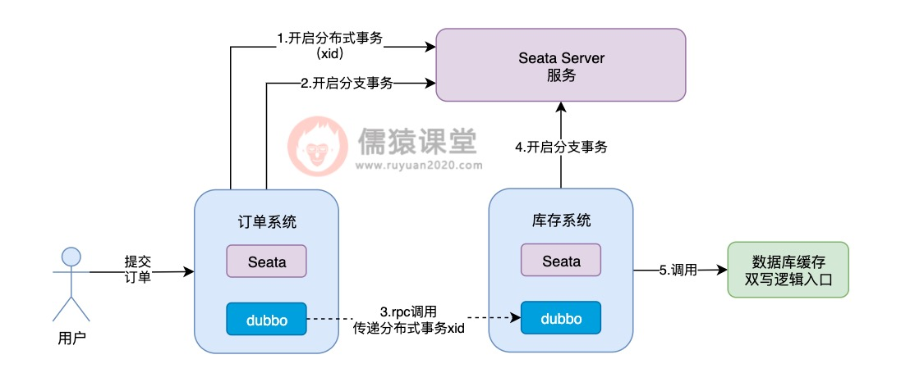

可以看到，当用户提交订单时，订单系统向Seata Server发送一个请求，开启一个分布式事务，并获取分布式事务对应的xid，然后订单系统通过dubbo，向库存系统发送一个rpc请求并传递相应的xid，请求锁定库存。

库存系统收到订单系统发送过来的xid，会在xid对应的分布式事务下，开启一个分支事务，然后调用系统中数据库缓存双写的逻辑。

在Seata TCC分布式事务中，会依次执行每个接口中的try方法，对一些资源进行预留，比如我们这里锁定库存，根据前面的约定，try方法中就是先扣减销售库存：

而第一个可能出现的问题，就是在调用try方法时，可能因为网络不通畅等原因，导致try方法调用时阻塞住，一直卡在半路当中，此时，销售库存的数据，当然也就没来得及扣减成功。

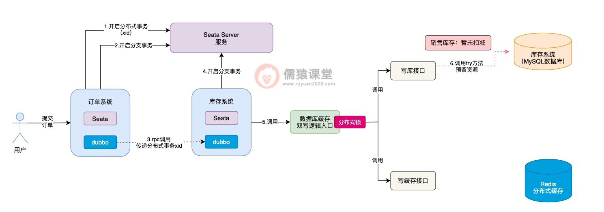

这个时候，Seata TCC可能还误以为写库接口中的try方法，已经执行成功了，这个时候，Seata TCC还没等到写库接口的try方法执行成功，就开始执行写缓存接口中的try方法：

可以看到，在执行写缓存接口中的try方法时，倘若是出现了任何异常的情况，根据我们前面分析的，此时，出现异常的方法，就会原地进行本地事务回滚，Seata TCC同时也会调用写库接口中的cancel方法进行回滚。

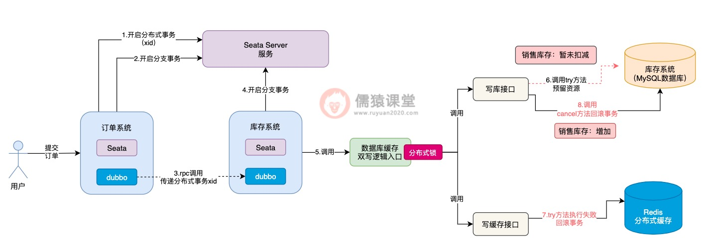

现在最大的问题在于，写库接口中的try方法，前面因为网络不通畅等问题，还没来得及执行成功，此时，Seata TCC就要调用写库接口的cancel方法进行回滚，对销售库存进行增加，这样就会导致销售库存，莫名其妙多出了一些库存数据，整体的库存数据就不一致了。

像这样由于网络不通畅等原因，导致在try方法都还没有执行成功的前提下，就直接执行cancel方法进行回滚的现象，我们称为空回滚，而try方法一直阻塞卡住而不能执行的现象，一般也被称为是悬挂，不管是空回滚还是悬挂，这个两个问题的出现，根据我们刚分析的，都存在一定的概率，导致库存数据的不一致。

## 2.Seata TCC中的幂等性问题分析

除了可能会导致空回滚和悬挂之外，Seata TCC的引入同样也会导致幂等性问题的发生：

可以看到，倘若各个接口的try方法，现在都执行成功了，接下来，Seata TCC就会依次调用各个接口中的confirm方法，完成核心的业务逻辑。

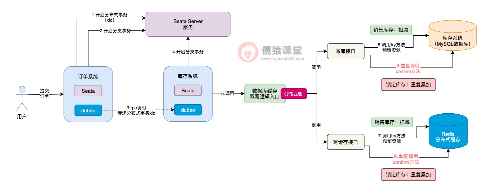

Seata TCC底层，一旦发现所有接口的try方法都执行成功，就会依次调用各个接口confirm方法，如果confirm方法执行失败，Seata TCC底层就会重复调用接口的confirm方法，务必确保每个接口的confirm方法，一定能执行成功。

这样的话，confirm方法就会存在一定的概率被重复调用，如图，一旦confirm方法被重复调用，锁定库存的数据就有可能被重复累加，进而导致库存数据的不一致性问题发生，所以，这算是Seata TCC分布式事务中，一个比较典型的幂等性问题了。

相应的，如果Seata TCC操作出现异常，也会导致幂等性问题的发生：

可以看到，如果写缓存接口的try方法执行失败了，写库接口这里，相应的会调用cancel方法进行回滚操作，而cancel方法的调用和confirm方法的规律是类似的，Seata TCC底层也有可能会出现重复调用，导致销售库存重复累加，进而导致库存数据的不一致性问题发生。

所以，我们可以看到，在Seata TCC分布式事务中，不论是调用confirm方法还是调用cancel方法，都存在一定的概率重复调用，也就是说confirm方法调用和cancel方法调用，都存在幂等性的问题。

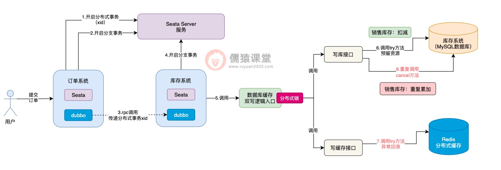

## 3.如何解决空回滚、悬挂以及幂等性问题呢？

我们先来分析下空回滚和悬挂的问题，看下有没有好的解决方案。
首先，空回滚和悬挂问题发生的主要原因，在于try方法都还没有执行成功，cancel方法就被调用了，导致平白无故就多补偿了一次，库存数据当然就会不一致性，所以，要是cancel方法在开始执行时，就能知道try方法是否执行成功了，问题不就好办多了吗。

基于这样的设想，我们可以在内存中设计一个缓存，比如，我们可以通过Map这样的数据结构来实现，Map中的key为接口名称、分布式事务的xid和以及商品的sku组成，表示当前是哪个接口类，在哪个Seata分布式事务中，对哪个商品sku进行锁定库存操作。

而Map中的value值，则可以用于存放具体的操作状态，比如try操作开始执行时，可以在缓存中设置“TRY_START”字符串，表示当前try方法开始执行了；而当try方法执行成功之后，可以将该value值设置为“TRY_SUCESS”字符串，表示当前try方法已经执行成功了。

接下来，我们结合着生单链路，来看下具体是如何结合缓存，来解决空回滚和悬挂问题的：

首先，在cancel方法刚开始执行时，首先到缓存中检查一下，通过接口名称+xid+sku拼接成一个key，到Map缓存中查询一下，先看下能够获取到try方法执行过的痕迹。

如果try方法都还没有执行，得到的value结果肯定就为null，此时，cancel方法中的逻辑就直接取消执行，避免空回滚逻辑的执行。

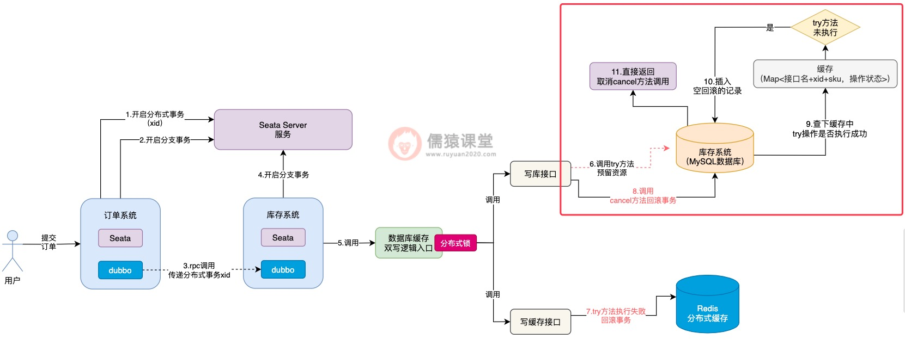

并且，因为当前try方法都还没有开始执行就调用cancel方法了，空回滚的问题就已经发生了，所以，我们可以事先在数据库中自定义一张表，专门用来存放空回滚的记录。

空回滚发生的同时，我们可以在数据库中，及时插入一条空回滚的记录，这样，接下来一旦try方法由于网络而恢复执行了，就可以利用数据库的空回滚记录，控制try方法的执行了，我们具体来看下：

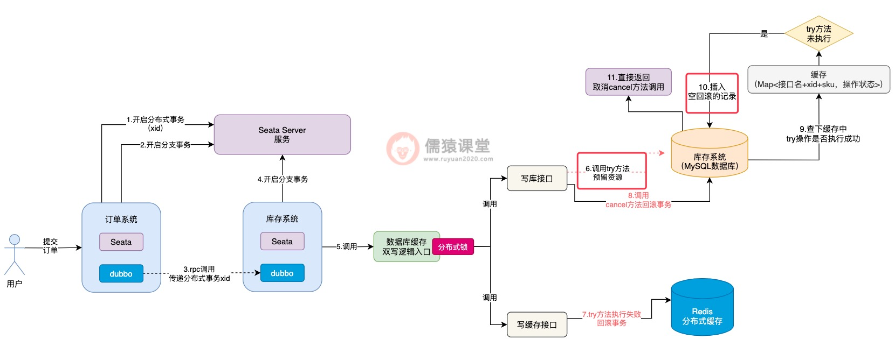

可以看到，try方法执行时，首先会到数据库中检查一下，如果发现当前已经出现空回滚了，try方法就算恢复网络也不会被允许实际的去执行了，直接就取消try方法的执行了，通过以上这套思路，空回滚和悬挂的问题也就解决了。

空回滚和悬挂的问题解决了之后，confirm方法和cancel方法的幂等性问题，自然也就简单多了，前面我们分析过，当try方法开始执行时，会在缓存中以接口名称+xid+sku拼接的字符串为key，以“TRY_START”为value，一旦try方法执行完毕，value值就会被更新为“TRY_SUCESS”。

如果出现多个请求，重复调用confirm方法或者是cancel方法，首先得要检查下缓存中的value，是否为“TRY_SUCESS”，只有当try方法被执行了，且try方法还执行成功了，才允许执行confirm或cancel方法，否则，直接取消当前的方法。

毕竟，try方法都还没有执行成功，贸然就执行confirm方法和cancel方法，肯定是会存在问题的，这也是前面幂等性问题的核心。

而当confirm方法或cancel方法都执行完毕之后，缓存中的try方法执行标识也会及时清理掉，下一次有重复的请求过来时，缓存中就找不到try方法执行的痕迹了，confirm或者cancel方法也就不会被重复执行了，幂等性问题同样也就得以解决了。

## 4.总结

这一节，我们分析了在引入Seata TCC分布式事务后的生单链路中，什么是空回滚和悬挂问题。
其实，空回滚主要是try方法由于网络问题，一直都还没有开始执行，阻塞在了半路上，也就是出现了悬挂；此时，其他的Seata TCC分支链路如果恰好又出现了故障，就会导致在try方法还没有执行的前提下，就执行cancel方法，进行空回滚补偿，所以，一般都是因为悬挂而导致了空回滚的发生。

另外，如果所有接口的try方法都执行成功了，Seata TCC可能存在重复调用confirm方法或cancel方法的象，当然，Seata TCC的初衷，还是为了保证在try方法都执行成功的前提下，confirm方法或者cancel方法务必得要执行成功，因为，也带来了幂等性问题的风险。

最后，我们通过引入一个Map数据结构的缓存，及时记录当前try方法的执行情况，并且，当空回滚发生时，及时在数据库表中，记录空回滚的记录，这样，一旦发生了空回滚的问题，try方法在执行时也能及时感知到，避免了错误执行下去。

并且，正是因为我们添加了缓存，来记录try方法的执行状态，所以，只有当try方法执行成功后，才允许执行confirm方法或cancel方法，一旦执行完confirm或cancel方法，就会及时在缓存中清除try方法执行的记录，所以，confirm方法或cancel方法，能够保证只允许执行一次，完美解决了confirm和cancel方法重复执行的幂等性问题。

接着，订单系统在锁定库存时，就会调用库存系统的接口，此时，订单系统底层会通过dubbo，向库存系统发送一个远程的rpc网络请求，并将分布式事务的xid也传递过去。

## 5. 生单链路核心执行流程的回顾

首先，我们来回顾下引入Seata TCC分布式事务后，生单核心链路的执行流程，想必大家现在已经很熟悉了：

当用户提交订单时，订单系统会先向Seata Server服务，发起一个开启新的分布式事务的请求，并获取分布式事务对应的唯一标识xid，然后，订单系统本身也会开启一个本地数据库的分支事务。

库存系统接收到订单系统的rpc请求之后，也会在本地开启一个分支事务：

可以看到，库存系统在本地开启一个分支事务之后，紧接着，就会调用数据库缓存双写的入口逻辑，从这里开始，我们就进入到了Seata TCC分布式事务的运行范围之内了。

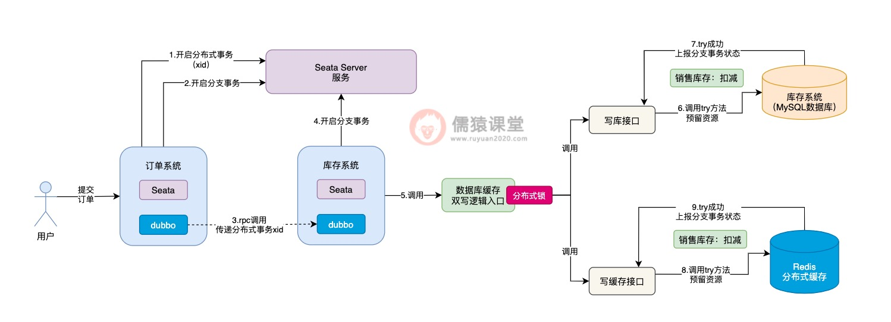

可以看到，首先会依次调用写库接口和写缓存接口的try方法了，当所有接口的try方法都执行成功之后，注意，此时并不是立即依次执行各个接口的confirm方法，而是顺着生单链路的执行流程，继续执行其他分支的事务。

和之前一样，订单系统获取本地锁执行落库生单操作，然后插入相应的回滚日志，最后获取全局锁提交分支事务，并释放本地锁。

比如，接下来该轮到订单系统的Seata分支事务执行了：

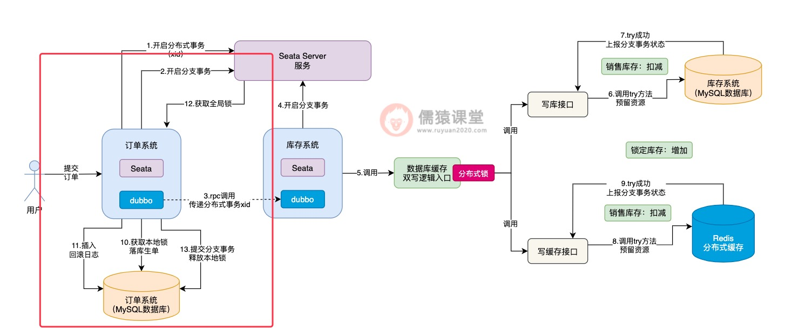

当生单链路中的所有分支事务都执行完成之后，接下来，就会提交整体的Seata分布式事务了：

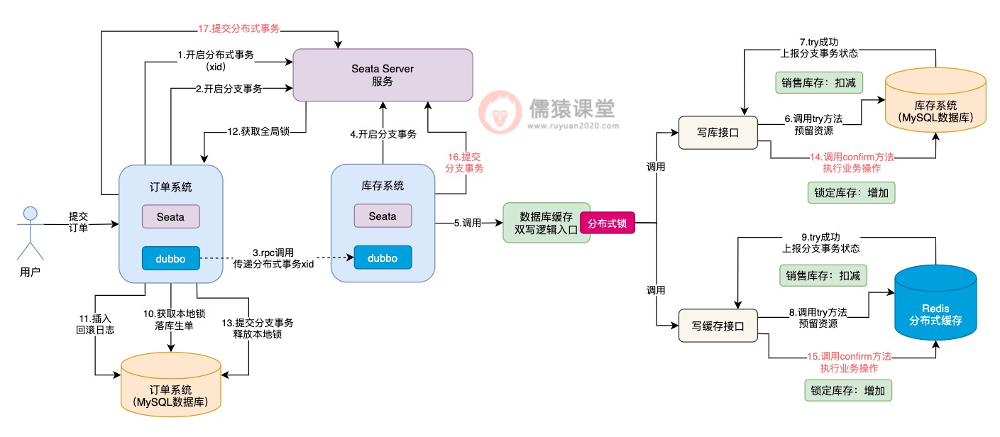

可以看到，Seata分布式事务提交时，才会依次的去调用库存系统对应的Seata TCC分布式事务的confirm方法，提交库存系统的分支事务，最后，完成整体分支事务的提交。

可以看到，当Seata TCC分布式事务开始执行时，首先会添加一把分布式锁，然后开始执行各个接口的try方法，当所有接口的try方法都执行成功之后，分布式锁也就释放了，然后继续执行其他Seata分支事务了。

## 6.Seata TCC异步提交导致数据不一致

我们结合生单链路来看一下：

分析到这里，想必大家已经看出一些端倪了，也就是说Seata TCC分布式事务在执行时，依次执行完各个接口的try方法之后，并不是一气呵成执行各个接口的confirm方法，而是得要等到整体的Seata分布式事务提交时，才会依次执行各个接口的confirm方法，相当于Seata TCC分布式事务的提交阶段，是异步执行的了。

此时，如果当前正在执行的分布式事务，如果还没来得及执行confirm方法，此时，如果其他分布式事务过来执行锁定库存操作，大家觉得try方法的执行会出问题吗？答案是不会的。

如图，可以看到在调用数据库缓存双写逻辑前，首先得要获取一把分布式锁：

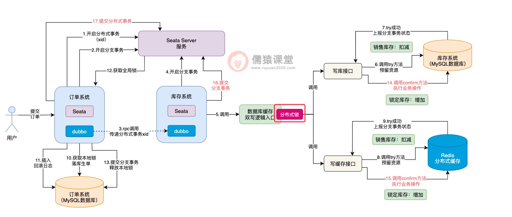

即使前一个分布式事务，已经将分布式锁释放了，但是，如果其他多个分布式事务过来执行各个接口的try方法，分布式锁还是能够保证多个分布式事务，顺序地执行各个接口的try方法的，所以，各个接口try方法的执行，还是可以保证并发安全性的。

问题就出在各个接口的confirm方法的执行，比如在当前数据库中，某个商品的库存数据的售库存为10，锁定库存为0：

可以看到，假如当前分布式事务1先执行写库接口的try方法后，销售库存扣减1从10变为9，然后，分布式事务1释放分布式锁后，继续去执行落库生单操作，库存的锁定操作，现在还差confirm方法累加锁定库存的操作。

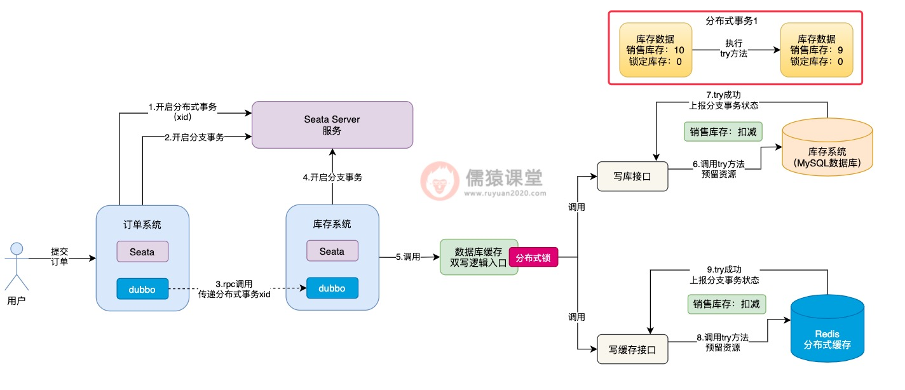

可以看到，假设此时分布式事务2，在分布式事务1初步锁定库存的基础上，获取相同的一件商品的库存数据，也就是销售库存为9，锁定库存为0，这个时候，分布式事务2获取到的库存数据中，锁定库存数据就出问题了。

这个时候，如果另一个分布式事务过来执行，就会出现问题了：

其他分布式事务过来，按理说正确获取到的库存数据，应该是上个分布式事务，已经锁定库存操作完毕的数据，而不是锁定库存逻辑执行一半的库存数据，所以，分布式事务2基于错误的数据，进行try方法以及后续的confirm方法的执行，就会出现数据不一致性的问题了。

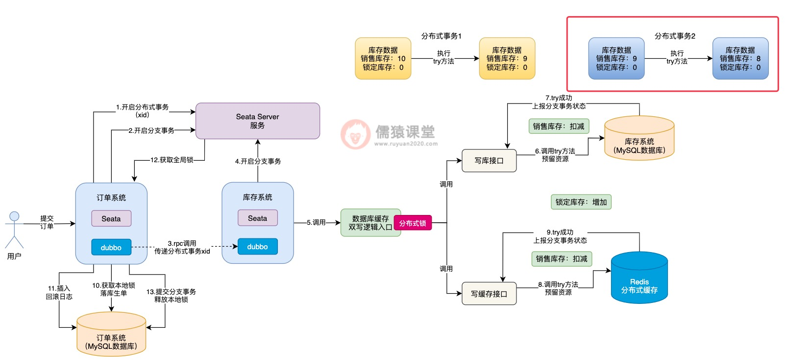

为了让其他分布式事务执行try方法时，能获取到正确的库存数据，我们可以在confirm方法调用结束后，随即插入一条库存数据的操作日志：

## 7.引入库存操作日志来解决数据不一致问题

现在的问题，关键在于一个分布式事务还没有来的及执行confirm方法，还没有完整的将整个分布式事务提交，其他分布式事务可能就会获取到错误的库存数据，那这个问题到底该怎么解决呢？

可以看到，我们可以预先在数据库中，定义一张库存数据的操作日志表，当confirm方法执行完毕之后，插入一条操作日志。

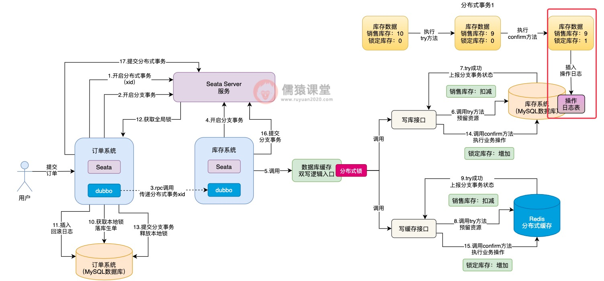

然后当其他分布式事务来执行时：

可以看到，虽然分布式事务2在执行try方法时，获取到的库存数据中的销售库存数量是正确的，但是锁定库存的数量是错误的，正确的锁定库存数量应该为1。

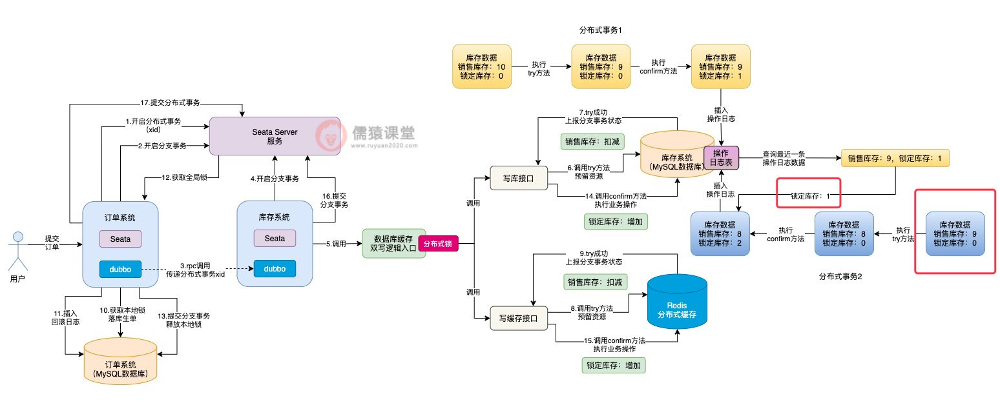

此时，当分布式事务2在执行confirm方法时，就不能基于错误的锁定库存数据0，来进行库存的累加操作，而得要先从库存操作日志表中，获取最近最新插入的一条库存记录，查询最近提交的分布式事务修改后的最新锁定库存数据。

而分布式事务1执行confirm方法后，锁定库存的数量为1才是正确的，分布式事务2查询到这条数据后，基于正确的锁定库存数据进行confirm方法的执行，最终得到锁定库存数据结果2，才是正确的数据。

相应的，分布式事务2执行完confirm操作提交时，也会插入一条相应的库存操作日志，方便其他分布式事务执行时获取，这样的话，Seata TCC异步提交导致的数据不一致问题也就解决了。

为了解决Seata TCC异步提交而导致的数据不一致问题，我们引入了库存数据的操作日志来解决这个问题，也就是在每次执行confirm方法之后，都会往库存日志表中，插入一条库存数据变更的日志。

## 8.总结

这一节，我们首先回顾了一下之前基于Seata和Seata TCC的生单核心链路逻辑，然后，基于生单链路的执行流程，我们发现了一个问题，也就是Seata TCC的try方法和confirm方法的执行，其实是异步的，所以，库存数据这块，在多个分布式事务同时执行时，可能就会出现数据不一致的问题。

生单链路的一系列问题，包括涉及多个数据库的数据不一致问题、锁定库存时因为全局锁而导致的并发瓶颈问题、引入Seata TCC分布式事务后的空回滚，悬挂，confirm方法和cancel方法重复执行的幂等性问题以及Seata TCC异步提交而导致的数据不一致等一系列技术问题，我们都已经悉数解决了。

虽然其他的分布式事务在执行try方法时，拿到的锁定库存数据是有问题的，但是，在具体执行confirm方法时，可以从库存日志表中，查询最近最新的一条库存操作日志，从日志中获取最新的库存数据，这样的话，锁定库存数据不一致的问题也就得到解决了。

从下一节开始，我们顺着生单链路的执行流程，继续来看下生单链路之后的订单预支付和支付回调链路中，业务流程是怎样的，并且可能会遇到哪些技术问题。