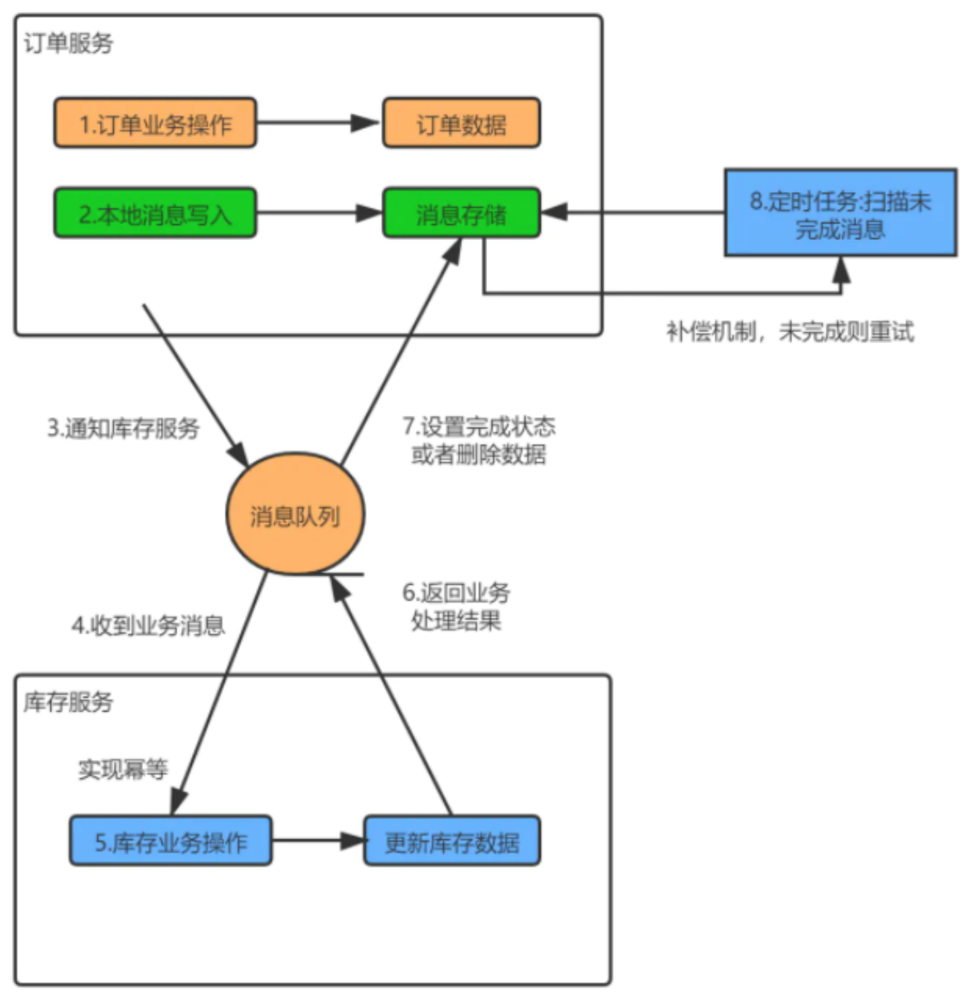
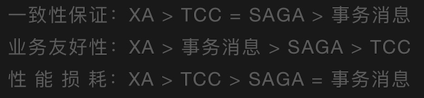

## 分布式事务

本文主要从以下几个方面来讲述分布式事务的相关内容：

1. 分布式事务的背景
2. 七种分布式方案（`XA规范`、`2PC理论`、`SAGAS方案`、`3PC`、`TCC方案（异步确保型、补偿型）`、`本地消息表方案`、`最大努力通知方案`、`可靠消息最终一致性方案`）的原理、优缺点、所出现的问题、适用的场景、技术的细节
3. 分布式事务Seata的使用

学习的主要方法是`带着问题去学习`，具体步骤如下：
1. 先了解分布式事务出现的背景，要知道一种新的技术或者新的理论的出现，一定是为了解决某个问题而产生的，不可能平白无故产生；
2. 了解人们在解决分布式事务这个问题的过程中都提出了哪些解决方案，每个解决方案的具体原理是怎样的，这每一个解决方案是否又引入了新的问题，这些新的问题是什么，为了解决这些引入的新的问题，人们又提出了哪些解决方案；
3. 在实际的生产环境下如何实践分布式事务，不同方案之间的适用场景有哪些；

### 分布式事务出现的背景

我们先来解释三个名词：

- 数据库事务： 是从数据库层面来解决事务的，它是由实现数据库的具体技术来保证的，比如MySQL的innodb引擎中的事务实现；
- 本地事务： 是由应用程序来保证的。比如一个应用场景中要往A表中插入一条数据，然后再从B表中删除一条数据，此时插入和删除是两条SQL，并且这两条数据都是由应用程序分别发起的，因此要跟数据库交互至少两次，这就没有办法使用数据库事务机制来保证事务了，因此就需要由应用程序来保证事务，于是在Spring中我们可以使用事务注解的形式来保证事务；
- 分布式事务： 则是由更高一层次的事务框架协议来保证；

为什么会出现分布式事务？分布式事务是出现在分布式系统中的。假设有一个业务场景，如`流量充值业务`，我们系统中有这么几个模块：转账模块、流量管理模块、积分模块，主要的业务场景是：转账成功后，需要修改用户的流量，并修改用户的积分。那在这个流量充值业务中，我们就需要做到这几个操作全部成功，如果遇到异常也要全部失败，不能出现转账成功了，但是流量没有充值成功，也不能出现流量充值成功了，但是积分没有成功，也就是说要保证这三个操作，要么全部成功，要么全部失败。那么，这样一个针对不同的数据源的组合操作，就是分布式事务。本质上，分布式事务有一个特点： 跨应用程序执行事务操作。

### XA理论

起先X/Open组织提出了一种XA规范，就是一套务虚的理论。在这个理论中定义了几个角色，一个是AP，就是我们的应用；一个是TM，就是事务管理器；一个是RM，就是资源管理器；一个是CRM，就是通信资源管理器，可以理解为消息中间件，但是可以没有。说白了就是TM定义了一套跟RM进行通信和交互的接口规范，然后通过接口来通知RM，来一块做一下提交或回滚，其基本原理就是这样的。其原理基本就是：
1.AP告诉TM，说我要发起一个全局事务了；
2.然后TM就会往RM中分别发送一条消息，然后RM就进行事务的提交或回滚；

XA理论只是一种务虚的理论，意思就是它提出了一个实现分布式的一个标准而已。

### 2PC

2PC理论，就是基于XA规范做的一种具体的实践，说白了就是两阶段提交，先有一个准备阶段，然后告诉所有的RM，先准备一下，要开始做事务了；然后TM收到消息后开始发起提交阶段的请求，告诉所有的RM，开始提交。但是如果TM在发送准备阶段的提交请求时，收到了某一个RM的异常响应，那么整个事务就立马失败了；如果在提交阶段也收到RM的异常响应，也会立马失败，然后回滚已经执行的事务。准备阶段实际上是利用了commit和rollback机制，即TM直接发送给所有的RM，让RM执行操作，这个时候可以认为数据库中是已经有数据变更的；在提交阶段，TM根据收到的上一阶段的消息汇总后得出是否允许提交的结论，再去告诉所有的RM执行commit或rollback操作。

2PC是有问题的，在准备阶段RM收到消息后，会对资源进行锁定，如果下一次收到提交的消息中间有很长时间，这就造成了数据库系统的`并发量下降`；此外还会出现`单点故障`的问题，TM是一个单点，如果出现单点故障问题，就完了；此外也会出现`状态丢失`的情况，如对TM做了备份，在主TM宕机后，重新选举从TM时，之前TM发送的状态，新的TM是不知道的；还会`发生脑裂`的问题，如果在TM切换过程中，有些RM收到了提交消息，有些没有收到提交消息，这也是不行的。基于这些问题的考量，又引入了3PC理论。

2PC比较适合单体应用中跨多个库的分布式事务，而且这种方式是严重依赖数据库层面来搞定分布式事务的，并发度很低。但微服务中，我们是不允许微服务交叉访问数据库的，我们一般要求必须通过调用对应的服务来操作服务底层的数据库。

### SAGAS方案

由于2PC阶段中，最后TM通知每一个RM进行提交事务时，如果涉及到很多的操作，那么这个TM的执行操作会很长，因此基于这个问题的解决，又提出了SAGAS方案，其核心思想就是把长事务拆分成短事务。

这种方案并发度较高，但是需要定义补偿操作，开发量较大，此外次方案一致性较弱，可能会出现一个事务执行成功，另外一个事务执行失败的问题。

### 3PC

三阶段提交方案：
一阶段：TM给RM发送cancommit消息，根据响应消息判断各RM是否正常；
二阶段：TM给RM发送precommit消息，告知各RM准备相关的sql及请求链接等；
三阶段：TM给RM发送docommit消息，通知各RM进行提交；

这个方案解决了2PC方案中的TM异常时会导致整个事务不成功的问题，同时也不会锁定资源很久导致并发度下降的问题。此外，如果TM在第三阶段中发生了异常，事务也是有可能成功的，因为RM会在收到precommit消息后，一段时间后如果TM宕机，RM也会自动提交，因为收到的precommit的消息的响应是正常的。

但是这种方案也还是有问题的，如果发生脑裂问题进行TM的切换过程中，RM根据超时机制判定TM不可用，自己提交了事务，但是事实上TM切换后是要发送cancel消息的，因此这也是一种问题。

### TCC

就是try-confirm-cancel事务机制，在try阶段对转账金额进行锁定，confirm阶段先往本地数据库中插入要锁定的金额的记录，然后调用b银行的扣减金额的接口，再调用c银行的增加金额的接口；cancel阶段就先把c的金额给减掉，然后把b的金额再加回去。通俗一点讲就是try阶段准备各服务所需要的资源或对某些资源进行锁定，confirm就是进行各服务的提交，cancel阶段就是进行补偿，把原来成功的事务进行回滚。

TCC就是针对要求数据强一致性时才会使用到这种方案，因为这种方案要求写额外的补偿事务的代码，这不利于代码的维护。一般情况下，只有在要求转账这些涉及到钱的一些业务操作时才会使用这种方案，否则，不会采用这种方案的，因为补偿的业务代码非常复杂，也不利于系统的维护。

### 本地消息表方案

本地消息表方案是国外ebay搞的一套方案，其原理大概是这样的：
1.服务a先往自己本地表中插入一条消息数据，然后执行业务操作，再往mq中发送事务消息；
2.服务b接收到消息后，先去查一下本地消息表中是否有改消息id，如果有就丢弃，如果没有就往自己本地表中插入一条消息数据，然后执行业务操作，完成后更新消息数据，再调用a接口更新a的消息数据状态；

假设b没有接收到数据，a也会有一个定时任务，去查自己本地消息表中未处理过的消息数据，然后再发送给mq中让b去处理，重复这个过程直到b调用a的接口完成了a的消息状态的更新。

但是这种方案严重依赖本地消息表，如果碰到高并发的场景，那应该怎么处理呢？这种场景下肯定是不行的。

### 最大努力通知方案

这种方案是基于本地消息表方案的一种延伸，把写本地消息表的过程也通过mq或内存队列的方式进行削峰，它中间多了一个尽最大努力通知的服务。基本过程是：a服务执行完业务操作后，往mq中发送一条消息，尽最大努力通知服务接收到这条消息后，往本地消息表中添加一条数据，然后调用b服务接口以求完成业务操作，b完成业务操作之后调用尽最大努力通知服务的接口修改本地消息记录的状态。此外，尽最大努力通知服务也会有一个定时任务，会定时查询本地消息表中的消息状态，如果查到未结束的消息，就接着调用b服务接口以完成业务操作，重复n次后就结束。

这种方式通过引入尽最大努力通知的服务来避免了本地消息表高并发场景下流量高峰的情况，让这个服务单独处理本地事务消息，并通过定时任务的方式尽最大努力通知到另外的服务进行业务动作。

### 可靠消息最终一致性方案

这种方式直接把弃用本地消息表，直接使用mq组件的消息事务机制。其基本原理大概是：
1.a服务先发一个prepare消息给mq，如果失败，就直接放弃操作；
2.如果成功，a服务就会进行业务操作，操作完成后，如果操作状态为成功，往mq中发送confirm消息；如果操作状态为失败，就回滚mq中的消息；
3.此时b服务收到mq的confirm消息，然后执行本地业务操作；

这个过程中有几个问题：
1.如果a服务发了prepare消息给mq，但是没有发送confirm消息，那么mq会轮训prepare消息，然后回调a服务的接口，询问a的业务操作是否成功，a再去查自己的表看业务操作是否成功，如果成功mq自动生成confirm消息，如果失败就回滚消息；
2.如果b服务对同一个confirm消息接收到了多次，那么此时b服务就需要做接口幂等性保证，可以每次执行一个confirm消息就创建一个zk的node节点，消费同一个消息，创建node节点会失败；也可以在每消费一个confirm消息就在redis中添加一个key，每次消费前先去查一下这个key是否存在这两种方案来保证接口幂等性；
3.如果b服务接收到confirm消息后执行失败了，那应该怎么办呢，这需要b服务一直重试，直到成功；或者是通知a进行回滚，再或者是事后通过报警信息、日志信息等进行手动业务补偿。

这种方式是国内通用的处理方案。或者是基于rocketmq实现，或者是自己基于这种思想实现。

### 总结

不建议在系统中过多使用分布式事务的。因为在真正的业务系统中代码层面造成的bug问题是少之又少的，我们可以采用报警机制、日志记录、快速定位、排查和解决问题、处理数据的方式进行处理这些因为分布式事务造成的问题。因为如果采用分布式事务的方式，代码复杂度肯定会增加，并且由于引入分布式事务造成的代码bug可能会比没有采用分布事务产生的bug还要做。

我们只需要定期的对出错的数据进行代码人工补偿即可。采用的方式就是写一个补偿程序，对错误数据进行回滚、修复等。

这种事后人工补偿的方式所花费的成本要少的多得多。

### 附言

分布式事务中除了上述所涉及到的分布式事务以外，还有另外一种不一致的问题：就是当做一些涉及到多个服务模块的组合操作时，我们可以通过上述方式进行分布式事务的控制，分布式事务解决了动作发生时刻所产生的不一致性问题，但是分布式系统中还有一种原因也会造成分布式系统中数据不一致性的问题。那就是，如果a系统和b系统中都存了一些公共信息，而b系统中又是以a系统中的为主，那如果a系统修改了b系统，如果不做任何动作，那么就会造成a系统和b系统的数据不一致性。

此时的方式大概有三种：

> 前提：我们在设计分布式系统时，要求每一个微服务只能对应一个数据库，如果一个微服务要修改不属于自己的数据库中的数据，要通过调用其他微服务接口的方式进行修改，坚决不允许直连数据库进行修改。

1. 如果对一致性要求不那么严格，可以使用定时任务的方式：即b系统中设置一个定时任务，通过不断轮询的方式来获取更新，就是通过拿着b系统中的关键信息去a系统中获取数据后再更新到b系统中，但是这种方式需要轮询所有数据（因为不确定那些数据做了修改），再加上如果多个系统都依赖a系统的数据，那么每个依赖系统中都需要设置定时任务，对于开发人员来说补偿的工作量不小。除此以外，在a系统修改数据之后与定时任务执行之前之间数据肯定是不一致的。

2. 如果对一致性比较严格，还可以采用关键系统异步通知的方式，即a系统修改关键数据时，同时调用b系统接口，通知b系统更新数据。但是这种涉及到a系统的改造工作。当然也可以采用异步通知的方式，即系统中引入消息机制，a系统修改数据时，往消息队列中放松一条消息，然后b系统消费数据即可，但是这种方案由于引入了消息机制，导致系统的复杂度升高，相对应的可用性降低。

3. 如果对一致性要求非常严格，可以采用只在b系统中保存关键数据的id信息，b系统每次使用a系统中的数据时，就采用调用接口的方式即可。但是这种方式也有问题，即a系统如果出现异常情况，这会造成b系统无法获取到关键数据的其他信息。

4. 如果是早期系统，在设计时，大多情况都采用第二种方式，异步调用的方式。

选取准则： 根据不同方式的特点，看业务情况进行选择。

## Seata的AT、TCC、SAGA和XA事务模式

- [阿里终面：分布式事务原理](https://mp.weixin.qq.com/s?__biz=Mzg2OTA0Njk0OA==&mid=2247494827&idx=1&sn=aa5d7401d53b1ca61b5e49462262bd22&chksm=cea1a360f9d62a761dff15a682f69fcacdd5b70a8afc4e1114cc7f6704b31d9aa3ad82ae5233&token=2092405348&lang=zh_CN#rd)
- [聊一聊分布式事务](https://mp.weixin.qq.com/s?__biz=Mzg5Mjc3MjIyMA==&mid=2247544315&idx=1&sn=1918fe3e5435e2ffd88aa29b76c2e35b&source=41#wechat_redirect)
- [消息队列之事务消息，RocketMQ 和 Kafka 是如何做的？](https://juejin.cn/post/6867040340797292558)
- [微服务中的分布式事务方案](https://jeremyxu2010.github.io/2020/03/%E5%BE%AE%E6%9C%8D%E5%8A%A1%E4%B8%AD%E7%9A%84%E5%88%86%E5%B8%83%E5%BC%8F%E4%BA%8B%E5%8A%A1%E6%96%B9%E6%A1%88/#heading-3)

