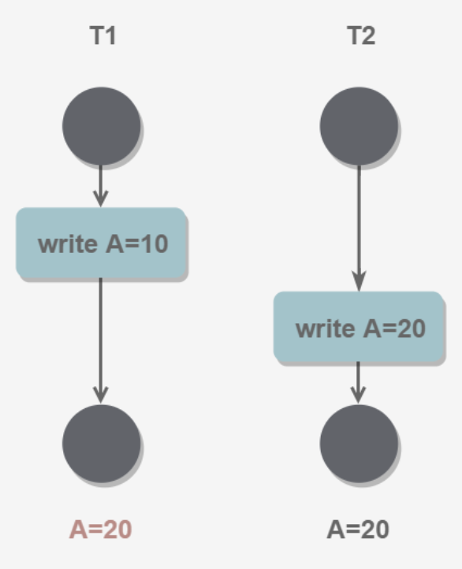
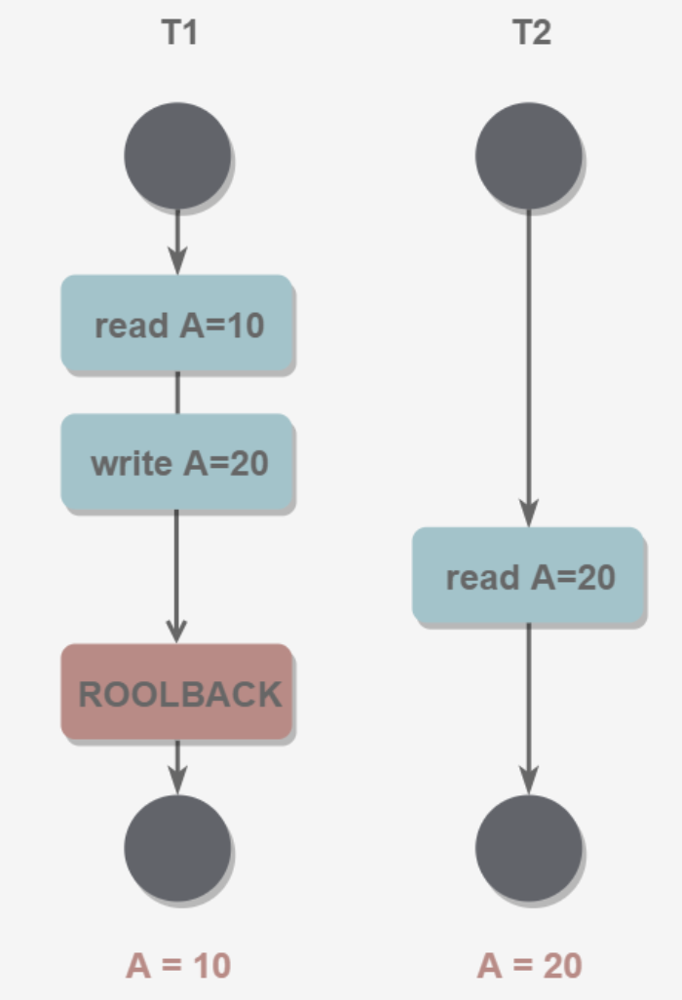
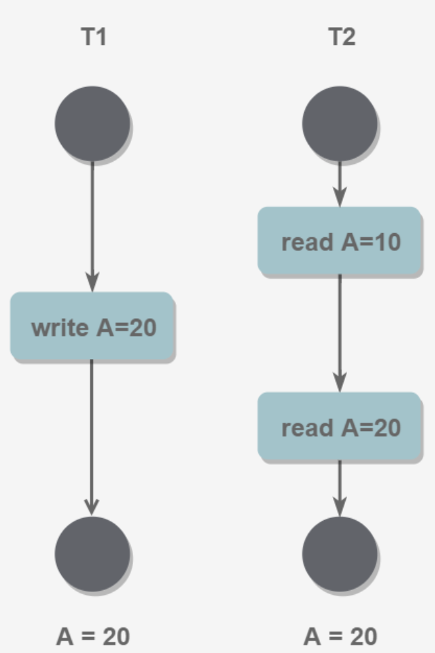
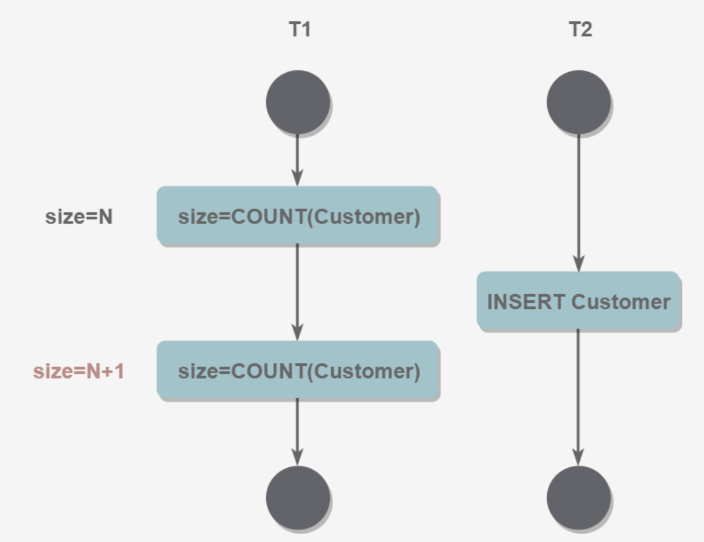
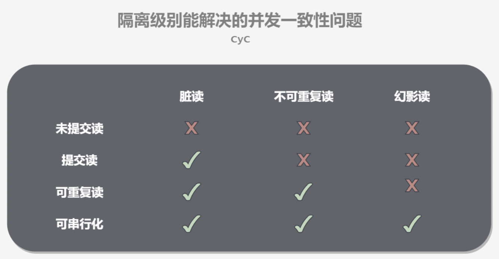
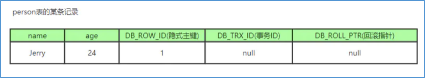
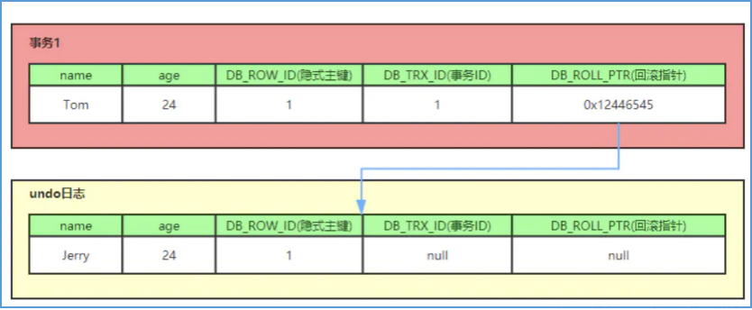
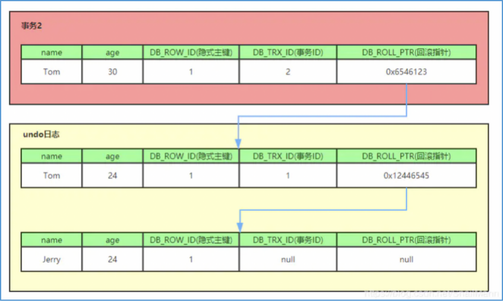

## 1. 数据库名词解释


|| DDL | DML  |  DCL  |  TCL
|---|---|---|---|---|
|含义| 数据定义语言（Data Definition Language，DDL）|数据操纵语言（Data Manipulation Language, DML）|数据控制语言 (Data Control Language, DCL) |事务控制语言 (Transaction Control Language, TCL) |
|功能|定义数据库对象|访问数据|控制用户的访问权限|管理数据库中的事务|
|核心指令|CREATE、ALTER、DROP| INSERT、UPDATE、DELETE、SELECT|GRANT、REVOKE|COMMIT、ROLLBACK|

## 2. SQL


::: tip 命令行(CLI)语法格式中常用符号的含义
尖括号< >：必选参数，实际使用时应将其替换为所需要的参数

大括号{ }：必选参数，内部使用，包含此处允许使用的参数

方括号[ ]：可选参数，在命令中根据需要加以取舍

小括号( )：指明参数的默认值，只用于{ }中

竖线|：用于分隔多个互斥参数，含义为“或”，使用时只能选择一个

省略号…：任意多个参数

:::

::: warning
CLI语法格式适用于大多数命令行场景，如Linux命令行、Redis命令行等。

:::


### 2.1. 重要但不常用SQL

::: tip 
常用SQL，如CRUD，这里就不再赘述。只写一些重要但是不常用的一些SQL。
:::

- DISTINCT 用于返回唯一不同的值。它作用于所有列，也就是说所有列的值都相同才算相同。
- LIMIT 限制返回的行数。可以有两个参数，第一个参数为起始行，从 0 开始；第二个参数为返回的总行数。
  - ASC ：升序（默认）
  - DESC ：降序
- LIKE
  - %
  - _
- JOIN
- UNION
- ORDER BY
- GROUP BY
- 索引操作
- 事务操作
- 权限控制

> https://juejin.cn/post/6844903790571700231

> Transact-SQL编程规范： https://bbs.csdn.net/topics/320152900

## 3. 理论先行


### 3.1. 事务及其特性

要了解事务，就要先了解一下原子操作。

所谓的原子操作就是指数据库系统中不能再切分或细化的操作，这个操作的概念基本类同于操作系统中的操作原语的概念，但是又有不同。操作原语是一段用机器指令编写的完成特定功能的程序，执行过程中具有不可中断性，数据库系统中的原子操作也具有同样的性质。除此以外，数据库系统的原子操作与操作系统的原语又有不同。操作系统的原语只是说明了指令不可中断，即完成某项功能的一个原语可能由多个cpu指令功能完成，这个过程中，这些CPU指令执行要么全部执行成功，要么全部执行失败，不存在一些CPU指令执行成功，一些CPU指令执行失败的情况。数据库系统的原子操作也是由一组指令组成，也具有要么全部执行成功，要么全部执行失败，不存在中间状态的特性，这个不存在中间状态的特性就是数据库系统的原子性特性。数据库系统中的四个基本操作——增、删、改、查就可以看作是数据库系统的原子操作。市面上几乎所有的数据库系统都保证了这四个基本原子操作。

> 原语是一段用机器指令编写的完成特定功能的程序,在执行过程中不允许中断。

`所谓事务，就是一组原子操作的组合操作`。人们研究好了数据库的原子操作后，分析出原子操作具有不可中断的特性，利用同样的思路，人们又开始分析事务具有什么样的特性。人们研究后发现，事务需要具有以下几个特性：


1. `原子性（Atomic）`，即这组原子操作，要么全部都成功，要么全部都失败，不能存在一部分成功，一部分失败的情况；但是在执行这组原子操作时，有可能会产生中断。这个中断是操作系统层面的中断。`【事务中所有的操作，要么全部成功，要么全部失败，不存在中间状态】`

2. `隔离性（Isolation）`，即在这组原子操作执行要么全部执行成功要么执行失败得出结果前，这组操作的任何一个中间状态都不能被其他操作所看到。`【事务提交之前，事务的操作的中间状态对其他事务不可见】`

3. `一致性（Consistency）`，即在这组原子操作得出执行结果之前和得出执行结果之后，数据的状态一定是一样的，换句话说，就是在这组原子操作得到执行结果之前，对数据库中的某一个数据的查询的所有的操作的结果都是一样的；得到执行结果之后，对数据库中的某一个数据的状态的查询的所有的操作结果也都是一样的。`【事务提交之前，所有事务对同一数据的读取结果是一致的，事务提交之后，所有事务对同一数据的读取结果也是一致的】`

4. `持久性（Durability）`，如果这组原子操作涉及到对数据库的修改，那么在这组原子操作得出结果之后，如果成功，就一定会保存到数据库中。即便是在执行这组原子操作过程中，突遇断电的这种极端情况，也能通过一些措施保证数据被保存下来。`【事务对数据的修改将会永远保存到数据库中，不会丢失】`

以上就是ACID的四种特性，`只要满足这四种特性的任何一组操作，都被成为事务。`

::: note 注意

事务的这些特性是所有数据库系统要求满足的标准，但是不同的数据库实现可能对事务的这些特性的保证并不一定都满足，那么就需要由数据库的使用者对这些特性进行保证。

:::


### 3.2. 并发一致性问题

我们知道了数据库中的四个原子操作是每个实现了数据库基本原理的数据库都具有的特性，并且我们也知道这四个原子操作在单线程情况下是不会出现数据不一致的情况的，所以本着“理论先行”的原则，我们要分析一下在多线程场景下对数据库系统的操作所引发的一系列问题。


1. 丢失修改： 当一个线程要修改数据库中的某一个数据a时，由于还未提交到数据库进行持久化，此时另外一个线程也修改了数据a，那么在第一个线程提交后，数据库会丢失第一个线程的修改内容。



2. 读脏数据： 当一个线程修改了数据a但是还未提交，此时另外一个线程读取a修改后的值，但是之后第一个线程又回滚了操作，那么此时第二个线程就读取了a的脏数据。



3. 不可重复读： 第一个线程先读取了数据a，但是此时另外一个线程修改了数据a，那么第一个线程又读取了一次数据a，此时第一个线程读取同一个数据的两次结果却不相同。



4. 幻影读： 一个线程读取了某个范围的值，此时另外一个线程修改了这个范围内的值，那么第一个线程再次读取这个范围的值，就会得到与第一次读取内容不同的结果。



可以把上述四种并发一致性问题总结一下，划分为以下三种类型：

1. 读-读： 不会发生并发一致性问题；
2. 写-写： 会发生丢失更改的问题；
3. 读-写： 会发生读脏数据、不可重复读和幻影读的并发问题；

### 3.3. 隔离级别

为什么要有隔离模式？就是因为并发度和锁粒度之间需要有一个权衡，根据不同的考量，把这种权衡划分等级，然后就有了隔离模式的说法。

并发度越高，锁住的数据就不能太多，锁粒度就要越细；并发度越低，锁住的数据会越多，锁的粒度就要越粗；

1. 读未提交（Read Uncimmitted）： 事务b能读取到事务a未提交的修改；可以理解为事务b能够看到事务a的内部操作，事务b的读操作发生在事务a已经开始，但是处于未提交的状态，也就是说事务b能读到事务a的中间状态；所以，读未提交并不能解决脏读的问题，因为可能读到事务a的中间状态；

2. 读已提交（Read Committed）： 事务b只能读取事务a已经提交的修改；可以理解为事务b无法看到事务a的内部操作，必须要等事务a完成提交之后才能看到事务a对数据的修改，事务b的读操作发生在事务a已经提交的状态，也就是说事务b只能读到事务a的结束状态；所以，读已提交解决了脏读的问题；

3. 可重复读（Repeatable Read）： 事务b多次读取同一个数据的结果是一样的；事务b的读操作发生在事务a开始之前，事务b读取的数据也是从事务a开始之前创建的快照中读取的，也就是说事务b只能读到事务a的之前状态；所以，可重复读解决了能够重复读的问题；

4. 串行化（Serialization）： 事务b和事务a串行化发生，要么事务a先执行成功，之后执行事务b；要么事务b先执行成功，之后再执行事务a；事务b的读操作必然会发生在事务a已经提交的状态，但是在事务b发生读操作之前，有可能还有其他事务也在对此数据进行操作，那事务b发生读操作之前一定是要等早于事务b开始的所有事务操作完成后才开始；所以，串行化能解决所有读写并发问题。

因此也就得出隔离级别不同，解决的读写并发一致性问题也就不同。



> 大多数数据库系统的默认隔离级别都是READ COMMITTED（但MySQL不是)，InnoDB存储引擎默认隔离级别REPEATABLE READ。


::: tip
在计算机的发展过程中，我们没有办法说是先有理论还是先有实现，就像人类历史长河中，我们没有办法知道，在我们遇到问题的时候，到底是人们先解决了问题后再去总结结论；还是先对问题进行细致分析后找出对应的理论，再根据理论去解决实际的问题。

因此，我们也没有办法告诉你是先出现了隔离级别的概念，还是先有下面一个章节的实现过程。我们姑且就按照理论先行的原则来讨论吧。
:::

## 4. 实现

理论已经有了，如何去实现这些理论呢？注意这里说的是MySQL数据库。

### 4.1. 封锁协议

- 锁的类型：
  - 表锁：锁定整张表（意向锁是mysql内部使用的，不需要用户干预）
    - 意向共享锁（Intention Share Lock，IS锁）： 如果事务想要读取一个表中的某行数据，那么就必须先要获取这个表的IS锁；
    - 意向排它锁（Intention eXclusive，IX锁）： 如果事务想要对某个表中的某行数据进行更新，那么就必须先要获取这个表的IX锁；
  - 行锁：锁定某行数据
    - 共享锁（Share，S锁）： 一个事务对数据加了S锁，可以对数据进行读取，但不能更新，加锁期间可以对数据加S锁，但不允许加X锁；
    - 排它锁（eXclusive，X锁）： 一个事务对数据加了X锁，就可以对数据进行读取和更新，但是加锁期间不允许加任何锁；
- 封锁协议：使用锁的过程中，处理上述基本的使用规则外，还需要遵循其他规则，如何时加锁、何时释放锁、持锁时间等，这些规则统称为封锁协议；
  - 四级封锁协议的关系：层级包含关系，二级包含一级，三级包含二级、一级，四级包含三级、二级、一级；
  - 一级封锁协议（对应未提交的隔离级别，读解决了丢失更新问题）
    - 修改数据前先加X锁，直到事务结束时释放
  - 二级封锁协议（对应提交读的隔离级别，解决了丢失更新和脏读问题）
    - 读取数据前先加S锁，读取完后释放
  - 三级封锁协议（对应可重复读的隔离级别，解决了丢失更新、脏读和不可重复读问题）
    - 读取数据前先加S锁，直到事务结束时释放
  - 四级封锁协议（对应串行化的隔离级别，解决了丢失更新、脏读、不可重复读和幻影读问题）
    - 直接锁表，直到事务结束

::: tip 上面再次验证了： 封锁粒度与并发度的关系
- 封锁粒度越小，系统开销越多，并发度就越高；
  - 锁的各种操作（包括获取锁、释放锁、检查锁的状态等），会造成系统消耗
- 封锁粒度越大，系统开销越少，并发度就越低；
:::

### 4.2. MVCC原理

事实上数据库中每一个表中都除了我们能看到的字段外，还有另外的几个隐藏字段，这些字段主要用于版本的记录，包括了：

- db_trx_id： （6字节）事务id，记录了最后一次修改这条数据的事务的id；
- db_roll_pointer： （7字节）回滚指针，指向了这条数据的上一个版本；
- db_roll_id：（6字节）隐藏的自增id，如果当前表没有主键，数据库引擎就自动为db_row_id产生一个聚簇索引；
- delet_flag： 删除标记，标记这条数据是否已经被删除；

每一个修改或新增操作都会往undo日志里面记录一条数据，可以把数据表中的数据内容加上三个隐藏字段所组成的记录看作是undo日志。undo日志由隐藏字段中的回滚指针串起来，这就形成了版本链。

例如，往person表中添加一条数据，则隐藏的三个字段我们分别标记为下图所示。



此时我们再对这条数据进行修改，把名称修改为Tom，那么原来的记录就进入undo日志中，并且新的记录产生，隐藏的三个字段也会对应变化



我们又对数据进行修改，把age修改为30，则第二次修改的记录进入undo日志，并生成新的记录，且隐藏的三个字段的值如下图所示。




如上面三个图所示，每次事务提交完成后，都会在undo日志中添加一条记录数据，这些记录数据通过回滚指针链接起来，就形成了整个记录的版本链。

实际上，版本链和undo日志是数据库系统针对回滚操作所采用的一种机制。后来在研究如何解决读写并发一致性问题时，我们又发现版本链和undo日志也可以用到读写并发一致性问题的解决上。

### 4.3. Read view

我们知道，数据库系统会对数据的生命周期有一个记录，这个记录就是undo日志。里面记录了每一次对数据的增加、修改和删除。换句话来说，数据库中的一条数据实际上是有很多条的，那我们挑选哪一条作为我们读操作的响应数据呢？此时，我们想到，对要开始读操作的数据库取几个关键指标，然后根据这几个指标来判断我们取的这条数据能不能作为读操作的响应就可以了呗。换句话来说，我们获取要进行读操作的那个时刻的系统的状态来依次判断我们从undo日志中取得数据是否已经过时。那读操作发生的那个时刻的系统的状态我们就成为读视图。这也是为什么要有读视图的原因。

所谓的读视图，就是在事务进行读操作时，产生的数据库系统的快照，这个快照就相当于读时刻的一个现场。由于数据库系统一直在发生变化，因此我们选择某一个时刻数据库系统的状态作为我们读操作的一个判断。就是拿当前数据记录中的三个隐藏字段与快照中的字段做对比，来判断当前记录是否可以可以被读到。

假设数据库中有好几个事务正在进行操作，那么在某一时刻，我想要读取一条数据，我并不知道数据库中的这条数据到底是不是最新的，那我怎么办？我就需要划定这一时刻，怎么标注这一时刻呢？就需要找一下这个时刻的几个特征，来进行标注。也就是说满足这几个特征的这个时刻，就是我要开始读操作的时刻。那这里就有两个问题：第一是用哪些特征来标注这一时刻？第二是怎么判断这一时刻的数据是否是满足不同隔离模式的条件的？

我们就想，如果我们拿系统某一时刻的特征，与我们要进行读的数据做一下对比，那我们是不是就可以判断我们要读的这个数据是不是满足我们的条件了？

读视图具有三个属性内容：

- creator_trx_id： 记录了创建当前快照的事务的id；
- low_limit_id： 记录了当前数据库系统中最大的事务id+1；
- up_limit_id： 记录了当前数据库系统中正在活跃的事务的最小id；
- trx_ids： 记录了当前数据库系统中所有活跃（未提交）的事务的版本号的集合；

读视图就是用来做判断的条件的，对比的对象就是用来返回给读操作的那一行数据。因此判断条件也是由用来返回给读操作的那一行数据的三个隐藏列与读视图的几个属性进行对比。

判断过程：

```
If(db_trx_id == creator_trx_id){
  // 此时这条记录可以使用
  // 如果要用来读的那条数据的db_trx_id等于创建当前快照的事务的id，说明这条数据是由进行读操作的事务产生的，当然就可以使用了；
} else if(db_trx_id > up_limit_id) {
  // 此时这条记录是可以使用的
  // 因为要用来读的那条数据的db_trx_id大于当前数据库系统中正在活跃的事务的最小id，说明这个快照是在所有活跃事务开始之前创建的，当然可以进行读操作了；
  // 此时是可重复读级别
}
If(db_trx_id >= low_limit_id ){
  // 此时数据不可使用
  // 说明 db_trx_id 的记录是产生当前快照的那一时刻的所有事务提交之后产生的记录，当然就不可用
} 
if(trx_ids.contains(db_trx_id)){
  // 说明 db_trx_id 的记录是活跃事务创建的记录，所以不可使用

} else {
  // 说明 db_trx_id 的记录是活跃事务已经提交的记录，可以使用
  // 此时是已提交读级别
}
```


当前读满足未提交读的隔离级别，这种读方式不能解决脏读的问题；快照读满足根据创建快照的不同时机来分别满足已提交读和可重复读的隔离级别，这种读方式分别能解决脏读数据但是不能解决不可重复读问题和既能解决脏读数据问题又能解决不可重复读问题；把事务串行化，就可以解决所有问题。

此时有了上面的这个过程之后，我们的关注点就转向快照创建的时机，如果快照创建在要进行读操作的事务之前，那么此时系统就满足可重复读的隔离模式；如果快照创建在要进行读操作的事务之后，并且读操作的事务id大于等于当前系统中最大事务id，那么此时的数据是不可用的，要判断当前创建快照的事务与进行读操作的事务的id

- 当前读的操作
  - select lock in share mode (共享锁)
  - select for update (排他锁)
  - update (排他锁)
  - insert (排他锁)
  - delete (排他锁)
  - 串行化事务隔离级别中的读操作


### 4.4. 间隙锁

- 引言
  - 为解决MVCC不能解决幻影读的问题，又引入了间隙锁的概念


## 5. 数据库对不同读写问题的解决

> mysql在早期版本中是使用myism存储引擎的，这种存储引擎是不支持事务的；而mysql的后来版本中加入了innodb的存储引擎，这种存储引擎中加入了MVCC机制，使得mysql开始支持事务的不同隔离级别的；

 
下面，我们将讲述数据库解决这些读写并发一致性问题时的具体实现。

针对丢失更新的问题，我们引入加锁的方式进行解决，即通过引入排它锁和乐观锁的方式进行控制（排它锁就是通过锁定某条数据，在当前事务未提交之前，其他事务无法获取当前事务的修改权；乐观锁认为不一定会产生丢失更新的问题，让系统自行并发运行，如果出现异常，就把异常抛给使用者，让使用者自行处理）。

解决完丢失更新的问题后，我们就会发现剩下的都是读写操作中遇到的问题了。针对读写操作过程中引发的并发一致性问题，我们就采用不同的读写问题提出不同的解决方案的方式来解决。

针对脏读数据问题，就是因为数据库系统没有做事务的控制机制，因此就导致了脏读问题；而要想解决脏读数据问题和不可重复读问题，我们引入MVCC机制，实现在不加锁的情况下实现并发读写的效果，而MVCC机制中又引入了快照读的概念；最后要想解决幻影读的问题，我们由引入串行化事务的机制，使每个事务都串行化执行，最终解决幻影读的问题。

根据MVCC实现原理，我们引入MVCC中的三个重要内容：版本链、undo日志和读视图，通过判断要读取的数据的事务id与当前快照的四个属性之间的关系得到当前数据是否可用，并由此倒推得到快照的产生时机的不同，所解决的读写并发一致性问题也不同，再倒推得到事务级别的控制方式——控制快照产生的时机。


---

## 6. SQL优化

### 6.1. SQL分析工具

慢sql查询日志
explain分析工具


- [后端程序员必备：书写高质量SQL的30条建议](https://mp.weixin.qq.com/s?__biz=Mzg2OTA0Njk0OA==&mid=2247486461&idx=1&sn=60a22279196d084cc398936fe3b37772&chksm=cea24436f9d5cd20a4fa0e907590f3e700d7378b3f608d7b33bb52cfb96f503b7ccb65a1deed&token=1987003517&lang=zh_CN%23rd)
- [一条SQL语句执行得很慢的原因有哪些？](https://mp.weixin.qq.com/s?__biz=Mzg2OTA0Njk0OA==&mid=2247485185&idx=1&sn=66ef08b4ab6af5757792223a83fc0d45&chksm=cea248caf9d5c1dc72ec8a281ec16aa3ec3e8066dbb252e27362438a26c33fbe842b0e0adf47&token=79317275&lang=zh_CN%23rd)
- [一条SQL语句在MySQL中如何执行的](https://mp.weixin.qq.com/s?__biz=Mzg2OTA0Njk0OA==&mid=2247485097&idx=1&sn=84c89da477b1338bdf3e9fcd65514ac1&chksm=cea24962f9d5c074d8d3ff1ab04ee8f0d6486e3d015cfd783503685986485c11738ccb542ba7&token=79317275&lang=zh_CN%23rd)


## 7. 优化经验总结


---

## 8. 面试题

- [2022年MySQL最新面试题 - 前言](https://manbucoding.com/travel-coding/mysql/%E5%89%8D%E8%A8%80.html)


## 9. 参考

- [数据库系统原理](http://www.cyc2018.xyz/%E6%95%B0%E6%8D%AE%E5%BA%93/%E6%95%B0%E6%8D%AE%E5%BA%93%E7%B3%BB%E7%BB%9F%E5%8E%9F%E7%90%86.html)
- [MVCC多版本并发控制](https://www.jianshu.com/p/8845ddca3b23)
- [三级封锁协议](https://www.jianshu.com/p/0b4cc2802f6b)
- [mysql中的锁](https://www.cnblogs.com/axing-articles/p/11415058.html)
- [MVCC--多版本并发控制机制](https://www.cnblogs.com/axing-articles/p/11415763.html)
- [Standard 命令行格式规范](https://knowte.velne.win/posts/standard/code/cli/)
- [命令行语法字符](https://ftpdocs.broadcom.com/cadocs/0/CA%20ARCserve%20%20Backup%20r16-CHS/Bookshelf_Files/HTML/cmndline/cl_cmd_line_syntax_char.htm)
- [命令行语法格式中常用符号的含义](https://www.cnblogs.com/uakora/p/11809501.html)
- [括号中的可选、必选表示](https://blog.csdn.net/raoqin/article/details/8875089)


