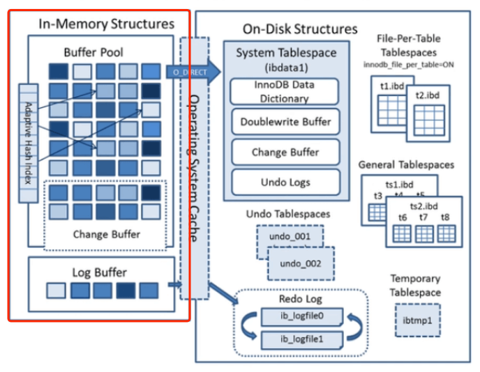
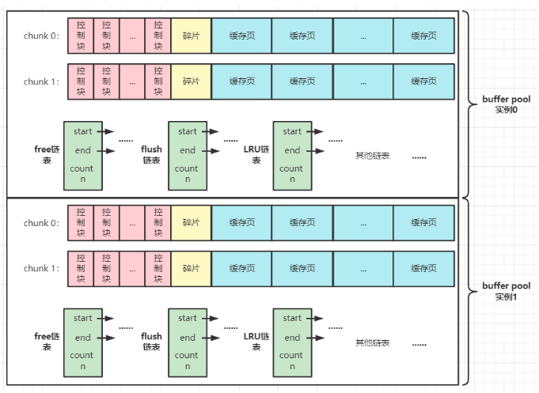
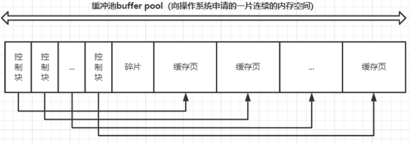
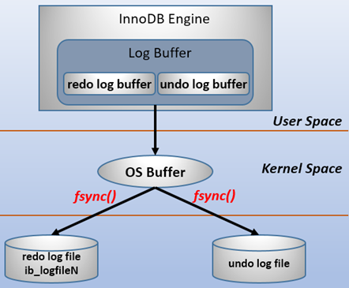
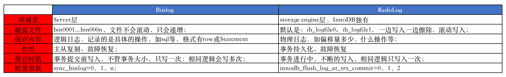

- Buffer Pool
  - change pool 以外的区域
    - 创建、划分区域、对数据的管理、扩容、并发、参数配置 【`可以类比Java中对HashMap的理解`】
  - change pool 区域
    - 存放内容、使用过程、配置参数
- Log Buffer
  - 存放内容、配置参数 
  - RedoLog 
    - 存放内容、一条更新语句的操作过程、与binlog实现两阶段提交
  - UndoLog 
    - 存放内容、MVCC多版本并发控制实现原理、事务原子性实现原理、事务持久性实现原理


## Buffer Pool 



`整个mysql使用的内存区可以划分为多个Buffer Pool ，一个Buffer Pool 可以分为多个块（chunk），每个chunk包含有多个page。`

### 缓冲池的创建

MySQL启动时，就会根据配置参数，操作系统申请的一块连续的内存空间，作为 Buffer Pool 缓冲池。存在的目的是为了提高数据访问速率，利用了高速缓存与磁盘的访问速度差异特性。

### 缓冲池动态扩容

5.7.5之前就只是连续的内存空间，要想增加 Buffer Pool 的大小，就需要重新申请一个比原来 Buffer Pool 还要大的连续空间，然后把数据拷贝过去，这样系统开销过大；5.7.5之后新加了 Buffer Pool 分块的 chunk 特性，让运行期间动态调整 Buffer Pool 的大小成为可能，动态调整 Buffer Pool 时，只需要额外增加几个chunk，然后链入原有 Buffer Pool 形成新的 Buffer Pool 即可。


### 缓冲池的管理 

缓冲池管理的基本单位是`缓存页`，缓存页在逻辑上与物理磁盘上的数据文件中的数据页对应，默认大小是16K。一个 chunk 块中包含多个`缓存页`以及控制缓存页的`描述信息`（如页所属的表空间号、页号、页在缓存中的地址、下一页的指针等）。

由于`描述信息`的存在，一个设置成128M的 chunk ，最后可能变成130M，多出来的就是`描述信息`的大小。



此外，MySQL还把缓存页进行分类： 

- `free page` ： 还没有使用到的缓存页；
- `clean page` ： 已经存入数据但是还没有修改过的缓存页；
- `dirty page` ： 已经存入数据并且数据也已经被修改过的缓存页  ；  

并且MySQL还把这些缓存页的`描述信息`链起来形成三个链表：

- `free list` - 管理 free page ； 
- `flush list` - 管理 dirty page 并在某个时刻对该链表的脏页进行刷盘，按脏页的修改时间排序，更新操作早的脏页先被刷盘； 
- `lru list` - 正在使用的内存页链表，里面包含 clean page 和 dirty page，也就是说 lru list 中的页包含 flush list 中的所有脏页，使用最近最少使用算法；加载新缓存页和修改一个缓存页，都把它的描述信息调到LRU链表的头部，让不经常修改的往后排；

缓冲池根据功能划分，还包括： 多个数据页（data Page）、多个索引页（index Page）、多个undo页、多个写缓冲区（change page，简称 CB）、多个自适应哈希索引和其他信息（如锁信息、字典信息）等。

普通的 lru 算法遵循新数据从链头加入，链表满了需要释放时，就从链尾弹出。这里采用的 LRU 算法是优化后的算法。主要有以下优化点：

- `添加了一个innodb_old_blocks_pct参数，把lru链分为两段。链头到midpoint的位置存放热数据，称为热端；midpoint到链尾的位置存放冷数据，称为冷端；淘汰数据时只淘汰冷端数据。 `默认值为：37 ，表示冷数据占37%；预读进缓冲池的数据统一都先放到冷端；这样可以有效解决缓冲池预读了不常用的页或扫描（全表扫描、索引扫描、大范围查询）操作查到大量数据，导致热数据被（全部或部分）刷走的问题；
- `对冷端数据进入热端添加了一个innodb_old_blocks_timee参数设置，让冷端数据经过innodb_old_blocks_time时间（这段时间内再次被访问不会进入热端）之后才能进入热端数据。`这样可以有效解决一些不常用的页数据在短时间内被多次访问，让系统误认为它是热数据从而将其放入热点数据的问题；
- `减少热页在链表上的移动`。热端数据并不是访问一次就移动到链头，而是热端数据后3/4的页被访问时，才移动到链头；这样有效解决了热页的频繁移动问题；
- 还有一些其他优化。

### 数据页的访问

InnoDb访问某页时，不是直接从磁盘读取，而是先从缓冲池（的lru链表）读取页；如果没命中缓存，就从磁盘读取页到缓冲池缓存，下次读到相同的页则直接从缓冲池读取，从而减少磁盘IO。

问题是怎么知道我要查询的页是否在buffer pool呢，难道要对lru链表一个个页遍历？遍历是不可能遍历的，这辈子都不可能遍历的。

其实学过lru算法的小伙伴们都知道，lru算法的实现需要 链表 和 哈希表两个结构。

innodb是通过 `页所在表空间号 + 页号` 来定位一个页的，所以缓存一个页时，系统除了将该页的控制块链入lru链表之外，还会将 `该页的表空间号 + 页号` 作为`key`，`页的控制块地址`作为`value`写入到哈希表中。

所以当要访问某个页时，根据该 `表空间号+页号` 即可得知页在不在buffer pool，在buffer pool的哪个地方。

### 缓冲区的预热

Mysql重启时，BP中的热数据会清空，为此mysql提供了缓冲池预热功能，当关机时会把内存中的热数据写入到 ib_buffer_pool 文件中，保存的数据占 lru 的比例可由参数控制，mysql启动时会自动加载热数据到缓冲池。预热功能默认开启。

### 缓冲区的预读

磁盘IO按页读取，查询某条记录不是只读取这条记录，而是读取这条记录所在的整个页并缓存。

### 缓冲区的并发

- Q1： buffer pool并发访问的时候需要加锁吗 ？
  - 多线程访问一个BufferPool，必然是要加锁的。比如，先加锁，然后加载数据页到缓存页，更新free链表，更新lru链表，再释放锁，接着下一个线程再执行一系列的操作。
- Q2： buffer pool并发访问加锁影响性能吗？
  - 大部分情况下，线程都是查询或者更新缓存里的数据，操作都是发生在内存的，微秒级，包括更新free、flush、lru链表都是内存操作，速度极快。但是有些情况下，需要读取从磁盘读取数据到缓存页，发生了一次磁盘IO，耗时就长一些，后面排队的线程自然就多等一会。
- Q3： 多个buffer pool优化并发能力
  - 多个buffer pool类似于分段加锁，降低了锁的冲突，多核多线程访问就成倍的提高了性能。每一个缓存页，只会放在其中一个buffer pool里面。

### 三个链表动态的运行过程

Buffer Pool在运行中被使用的时候，实际上会频繁的从磁盘上加载数据页到他的缓存页里去，然后free链表、flush链表、lru链表都会在使用的时候同时被使用。

比如数据加载到一个缓存页，free链表里会移除这个缓存页，然后lru链表的冷数据区域的头部会放入这个缓存页。

然后如果你要是修改了一个缓存页，那么flush链表中会记录这个脏页，lru链表中还可能会把你从冷数据区域移动到热数据区域的头部去。

如果你是查询了一个缓存页，那么此时就会把这个缓存页在lru链表中移动到热数据区域去，或者在热数据区域中也有可能会移动到头部去。

你一边不停的加载数据到缓存页里去，不停的查询和修改缓存数据，然后free链表中的缓存页不停的在减少，flush链表中的缓存页不停的在增加，lru链表中的缓存页不停的在增加和移动。

另外一边，你的后台线程不停的在把lru链表的冷数据区域的缓存页以及flush链表的缓存页，刷入磁盘中来清空缓存页，然后flush链表和lru链表中的缓存页在减少，free链表中的缓存页在增加。

### 写缓冲 Change Buffer

Change Buffer 是缓冲池 Buffer Pool 的一部分，它默认占整个缓冲池的25%，最大允许占用50%，可以通过`innodb_change_buffer_max_size`参数进行设置，也可以根据写操作的量级来调整，`理论上写操作越频繁，Change Buffer带来的性能提升越明显`。

`其存在目的是为了提高修改数据的性能`。我们在修改数据时，如果缓冲区不存在这条数据，就需要把这条数据所在的页读到缓冲区，之后再对缓冲池中的数据进行修改。这样无形中就增加了磁盘IO，InnoDB 为了提升性能，设计出了 change buffer ，大概原理就是： 每次修改数据时，先把修改后的结果放到 change buffer 中，后续再进行刷盘。

修改数据时分为两种情况：
- `修改的数据所在的页在lru链上`，InnoDB 就会直接在缓冲池中修改这个页，并把这个页变成脏页链入flush list中，但是不会马上刷盘，这里不会用到change buffer；
- `修改的数据所在的页不在lru链上`，此时按理说应该先从磁盘读取要修改的页，然后放到缓冲池中，然后再修改，之后再刷盘的，但是InnoDB没有这样做，而是先把修改操作记录到change buffer中，当下次查询时，InnoDB发现lru链上没有这条数据，InnoDB就会从磁盘读取改数据页，之后再与change buffer中的更改进行合并后才链入lru。如果一段时间后，都没有查询这个修改的页，InnoDB的后台线程就会定时把change Buffer的更改合并到磁盘页中。
- 有个例外，在修改唯一性约束字段时，由于InnoDB要做唯一性校验，因此必须要读取磁盘，把数据读到缓冲池之后，再在lru链上的页内修改数据，不会在change buffer中操作。


### 参数配置
  

```
[server] 
innodb_buffer_pool_instances = 8 # 代表了有几个buffer pool
innodb_buffer_pool_size = 8589934592 # 代表了buffer pool总共占用多少字节，默认是一个 chunk 的大小，即 134217728 b = 131072 kb = 128 m ;
innodb_buffer_pool_chunk_size = 8589934592 # 调整 chunk 的大小，默认一个 chunk 为128M
```

innodb_page_size： BP缓冲区大小（单位是页），建议将其设为总内存的 60% ~ 80%
innodb_old_blocks_pct： midpoint离链尾的百分比，默认37.5%
innodb_old_blocks_time ： 新页需要隔多长时间才能进入lru链表的热端
innodb_buffer_pool_instances ： Buffer Pool的个数，建议设为多个
innodb_buffer_pool_dump_at_shutdown ： 关闭服务时保存热数据
innodb_buffer_pool_dump_pct： 保存热数据的比例。
innodb_buffer_pool_load_at_startup： 开机时载入热数据


## Log Buffer 

Log Buffer中主要是 RedoLog 和 UndoLog 的数据页。本质上还是属于InnoDB的一种缓存，为了提高性能。`其中 RedoLog 日志被称为重做日志，也被称为事务日志`。


### IO模型 



由上面IO模型可知：
- LogBuffer属于用户态内存区域。在内存中划分一部分区域给用户使用，那这部分就被称为用户态（或用户空间）内存，LogBuffer 和 BufferPool 都属于用户态内存；内核态（或内核空间）是指给操作系统使用的这部分内存区域；
- 内存区域易失性决定着用户态内存的易失性。内存中保存的数据需要经由操作系统IO调用，写入到磁盘才能完成持久化，所以用户态内存也需要写入到磁盘文件以完成持久化；
- 用户态内存数据持久化到磁盘文件有两种方式：
  - 说明： 上图中的 fsync() 就是操作系统层面的IO操作，作用是把OS Buffer中数据写入磁盘文件；
  - 一种方式是直接使用用户线程，略过操作系统读写文件的IO线程，直接读写磁盘文件，如架构大图中的O_Direct；
  - 另一种方式就是用户线程调用操作系统的IO线程需要调用操作系统的IO操作，如LogBuffer的持久化方式；

### LogBuffer刷盘参数配置

log buffer 用来缓存要写入log文件的数据（redo和undo）。 `innodb_flush_log_at_trx_commit` 参数控制日志刷新的行为和周期，默认为1。log日志刷盘有3种策略：

- innodb_flush_log_at_trx_commit=0 ： 提交事务时，事务日志从 log buffer 写入 OS cache ，之后由主线程以1s/次的频率执行刷盘（即每隔1s调用一次 fsync ），数据库故障或主机宕机则丢失1秒数据。
- innodb_flush_log_at_trx_commit=1 ： 事务提交时，事务日志从 log buffer 写入 os cache， 并立刻刷盘（即立刻调用 fsync ），mysql服务故障或者主机宕机不会丢失数据，但如果事务频繁，则会频繁发生磁盘IO。
- innodb_flush_log_at_trx_commit=2 ： 事务提交时，事务日志直接写入 os cache，每隔1秒刷盘（刷盘时机由操作系统配置），刷盘动作交由操作系统完成，mysql服务故障不会丢失数据，因为数据已经进入操作系统缓存，与mysql进程无关了，主机宕机则丢失1秒数据。


### Redolog 

::: tip 
有了Buffer Pool之后，为什么还要有Log Buffer中的Redo Log呢？
Buffer Pool里面保存的是从磁盘刷进缓存的数据页以及客户端对数据操作后的写缓存页，而RedoLog中记录了关于事务的相关内容；


既然binlog中记录了对数据的修改，那是不是就可以使用binlog进行数据恢复，为什么还要有UndoLog呢？
:::

- 作用： 
  - 重做日志，也就事务日志，记录数据库中的事务，对数据页的物理操作，如偏移量是多少、做了什么操作等；
- 特点：
  - 满足幂等性： 多次操作得到同一结果的行为只记录一次；
  - 满足事务持久性： 把客户端对数据库的操作写入Log Buffer中的RedoLog中，并持久化到磁盘文件中，完成对事务的持久化；
  - 不是事务结束时写入的，而是在事务进行过程中，不断被写入重做日志文件中；
  - 落盘时机与事务完成的状态是无关的，只与配置的LogBuffer刷盘频率参数和刷盘触发条件有关；
  - RedoLog磁盘文件大小是固定大小，默认是配置一个分组两个文件（ ib_logfile0 和 ib_logfile1 ），先写 ib_logfile0，写满后，接着写 ib_logfile1 ，再写满后，就覆盖 ib_logfile0 最早的日志，也就是滚动记录的，有一个类似于hash环的数据结构，记录着写的位置（write-pos）和擦除位置（ checkpoint ）； write-pos 先于 checkpoint ，二者之间就是事务日志，开始位置到checkpoint之间是已经擦除的空闲空间；
  - 只要事务写入磁盘空间，就可以被擦除了；
  - 可以用来进行故障恢复；
- 为什么不直接写磁盘？
  - 浪费：如果只修改了一小部分数据，就直接修改磁盘，会造成不必要的IO开销，造成浪费； 
    - redo日志记录的变更内容少，只记录事务涉及到的数据行（具体是数据行所在的表空间ID、页号、页内偏移和更新后的值），而不是记录行所在的整个页。
  - 随机IO： 一个事务可能会修改多个数据页，那么直接落盘，就会造成多次随机IO；
    - redo行记录是顺序写入磁盘的（顺序IO），直接按照日志产生时的顺序追加到redo日志文件的末尾即可，顺序IO比随机IO快很多。
- 配置参数：
  - innodb_log_group_home_dir ： 配置 日志组 所在的文件目录
  - innodb_log_files_in_group ： 配置 每个日志组 中的文件数量，默认是2，ib_logfile0 和 ib_logfile1为默认的一个组
  - innodb_log_file_size ： 指定重做日志文件的大小
- 刷盘 
  - 就是把LogBuffer中的RedoLog写入到磁盘文件中；
  - 刷盘时机： 不是在事务提交时写入，而是在事务执行过程中不断写入的；
  - 刷盘条件： 
    - a. log buffer空间不足时（log buffer的空间剩余约50%左右就会刷盘）；
    - b. 事务提交后的某个时刻刷盘，具体看刷盘策略，可能会在事务提交时马上刷盘、也可能是每秒一次的频率刷盘；
    - c. 关闭服务器时；
    - d. 做checkpoint时会把 redo文件从 checkpoint lsn开始的一部分undo日志刷盘（从flush链表刷盘脏页到数据页，然后修改 checkpoint lsn）；
- 故障恢复
  - 简单来说，就是把日志文件中的事务状态为活跃状态的日志，恢复到MySQL中；


::: tip 补充说明
WAL： Write-Ahead Logging，它的关键点就是先写日志，再写磁盘。
crash-safe： 故障恢复，即可以保证即使数据库发生异常重启，之前提交的记录都不会丢失。
:::





### Undolog 

略。


<br /><br /><br />


