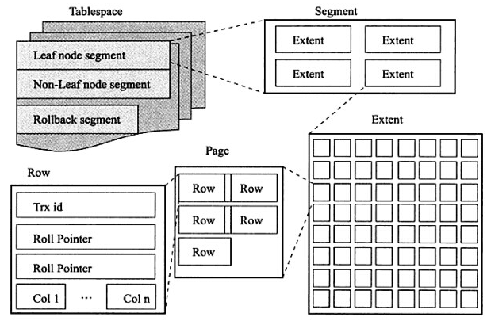
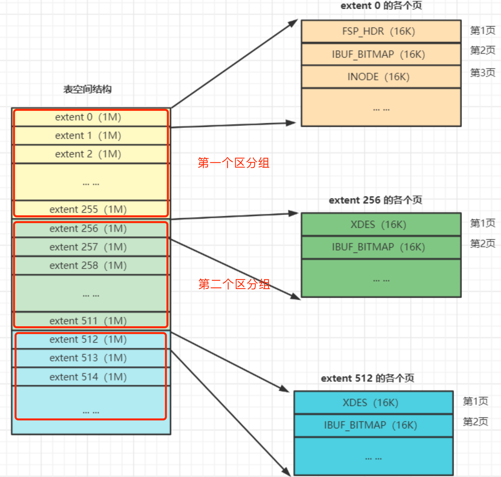
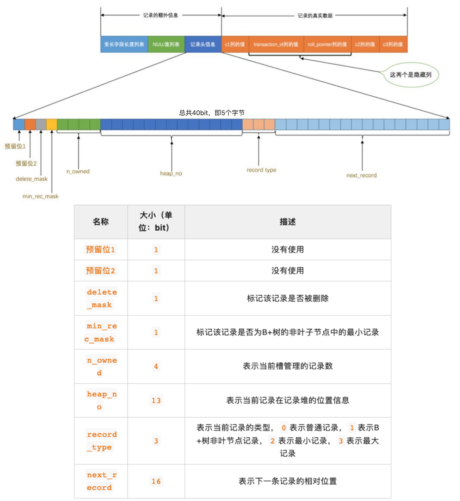
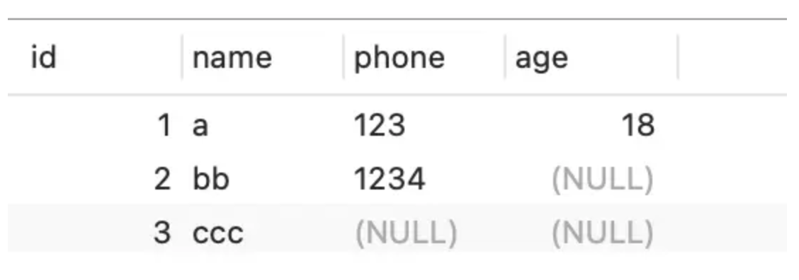
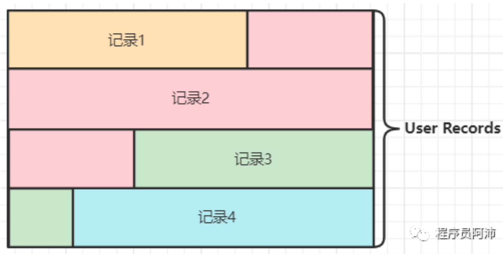
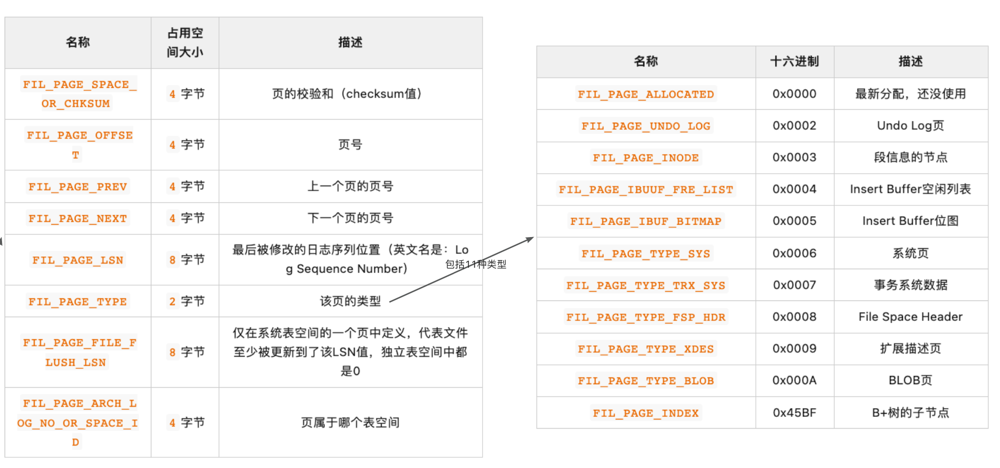
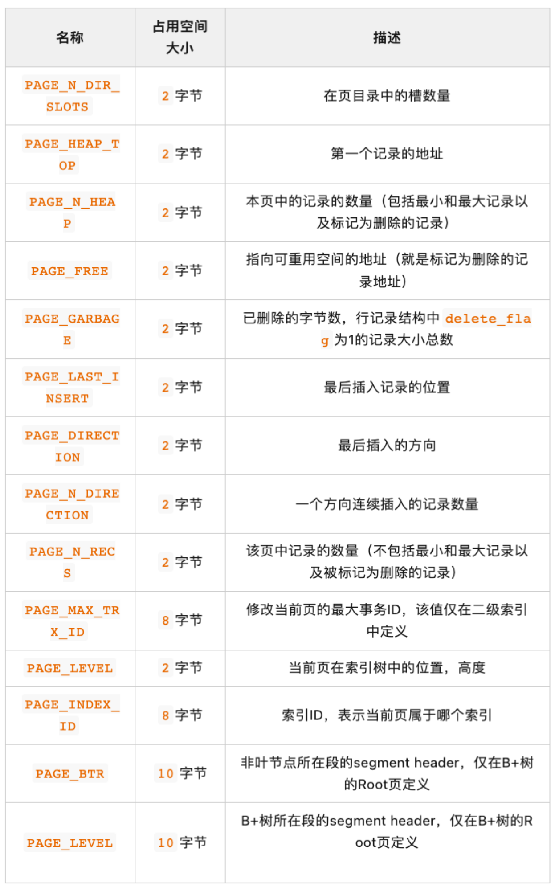
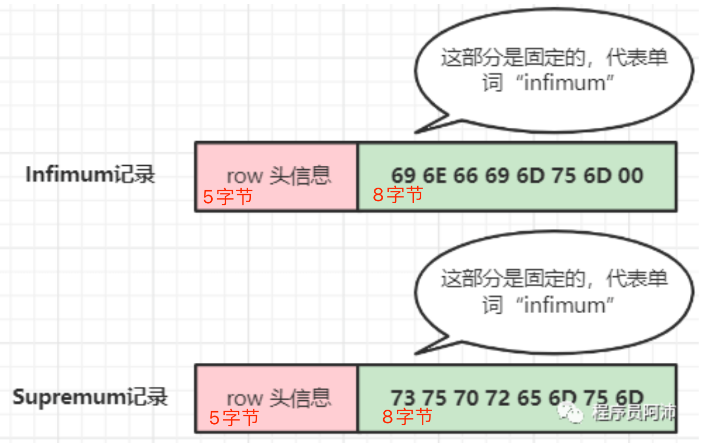
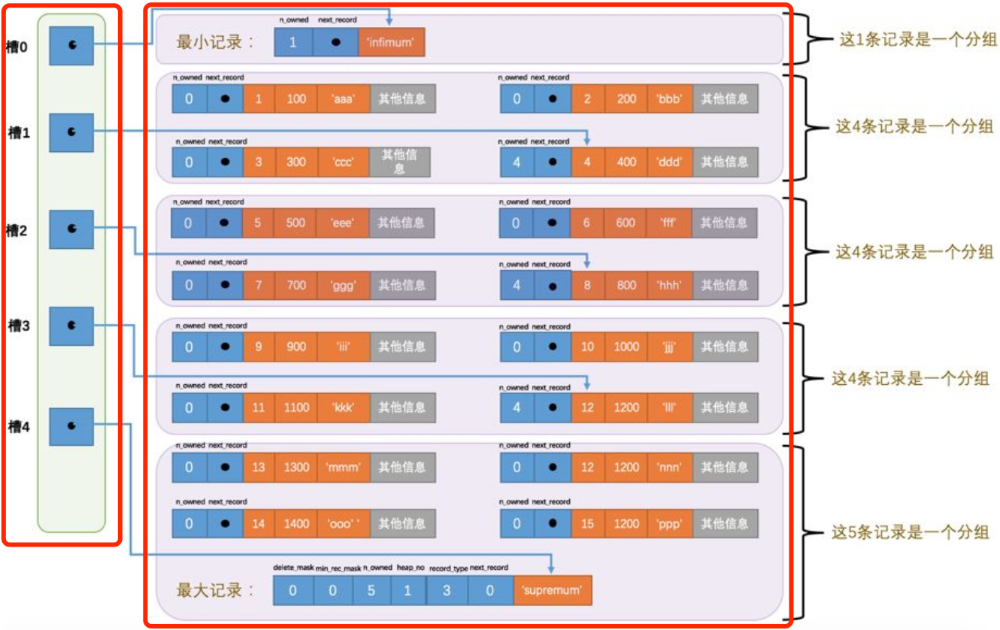

## 磁盘上的文件


一个表空间具有一个唯一的表空间ID，表空间根据数据存放的类型不一样，划分为： 
- 系统表空间
- 独立表空间
- undo表空间
- 通用表空间
- 临时表空间

> schema： schema在数据库中表示的是数据库对象集合，它包含了各种对像，比如：表，视图，存储过程，索引等等。


## 表空间、段、区、页、行




- 从上图可知：
  - 每个独立表空间都对应磁盘上的一个物理文件，命名形式为{table_name}.ibd；
  - 从用户数据记录保存的角度来看，InnoDB又把保存到B+树上叶子节点和非叶子节点上的数据所在的区（或零散页）进行分组，划分为叶子节点段、非叶子节点段、回滚段等；
  - InnoDB中的一个索引至少包含两个段： 叶子节点段 和 非叶子节点段 
    - 但为了解决部分表数据可能达不到一个区的存储空间，所以为了减少空间浪费，用户记录数据插入表的过程就变成了：
      - 一开始向表插入数据，B+树的段从某个碎片区以单个页面为单位申请存储空间；
      - 当某个段已经占用了32个碎片区页面之后，会以完整的区为单位申请存储空间，原先占用的碎片区页面不会被复制到新申请的完整的区中；
    - 因此从逻辑上讲，段在物理空间上并不连续，它只是用来保存用户数据的一种空间划分概念，在物理上是由表空间上的若干个零散页和一系列完整的区组成的；
  - 本质上来讲，表空间本质上就是一个存放各种页的页面池，一页大小为16k，页号用4字节表示，因此一个表空间可以有 2^32 = 65535个页，一个表空间最大可以达到 2^32 * 16KB = 64TB；
  - 64个连续的页组成一个区，即extent，一个区的大小为1MB；
  - InnoDB存储引擎有表空间、段、区等结构，目的在于：让逻辑上相邻的页面在物理上也相近，从而减少磁盘IO所带来的时间消耗；并在此基础上尽可能减少大单位分配存储空间造成的空间浪费；



- 从上图可知
  - 256个区组成一个区分组，一个区分组的大小为256MB；
  - 一个表空间有多个区分组，每个区分组的第一个区比较特殊：
  - 第一个区分组的第一个区的前3页比较特殊。如上图中第一个分组中的extent0的前3页，第一页保存了表空间的控制信息和本区分组内所有区的控制信息，第二页保存了change Buffer 的控制信息；第三页保存了零散页的控制信息，一个Inode节点中保存了32个 fseg extent，可以看做是一个段，并且一个表空间中有85个Inode，这就说明了一个表中最多能有（85-1）/2=42个索引；
  - 之后的每一个区分组的第一个区的前两页比较特殊。如上图中第二个区分组的extent0的前2页，第一页保存了本区分组内所有区的控制信息，第二页保存了change buffer的控制信息；


## Row的组织形式

InnoDB 提供了 4 种行格式，分别是 Redundant、Compact、Dynamic和 Compressed 行格式。

Redundant 是很古老的行格式了， MySQL 5.0 版本之前用的行格式，现在基本没人用了。
由于 Redundant 不是一种紧凑的行格式，所以 MySQL 5.0 之后引入了 Compact 行记录存储方式，Compact 是一种紧凑的行格式，设计的初衷就是为了让一个数据页中可以存放更多的行记录，从 MySQL 5.1 版本之后，行格式默认设置成 Compact。
Dynamic 和 Compressed 两个都是紧凑的行格式，它们的行格式都和 Compact 差不多，因为都是基于 Compact 改进一点东西。从 MySQL5.7 版本之后，默认使用 Dynamic 行格式。
Redundant 行格式我这里就不讲了，因为现在基本没人用了，这次重点介绍 Compact 行格式，因为 Dynamic 和 Compressed 这两个行格式跟 Compact 非常像。

所以，弄懂了 Compact 行格式，之后你们在去了解其他行格式，很快也能看懂。



先从整体的视角来来分析一下：
- 数据库表中的每一行数据对应于数据页上的一个User Record，即对应数据页上的一条『用户记录』；
- 数据页上的每一条『用户记录』就是一行，一行的结构主要分为两部分内容：
  - 行描述信息（即上图中「记录的额外信息」部分）： 用来描述此行数据的元数据【元数据：描述数据的数据】，主要包括三部分内容：「变长字段长度列表」、「Null值列表」、「记录头信息」
  - 行数据信息（即上图中「记录的真实数据」部分）： 包括两部分内容，一个是数据的真实信息，就是数据库表中一行数据的每一列的数据值；另一部分是数据的隐藏信息，包括「C1列的值」、「事务id」、「回滚记录id」；

下面来分析每一部分内容，先说结论：
- 行描述信息（即上图中「记录的额外信息」部分）
  - 变长字段长度列表`是以变长字段顺序的逆序方式方式存储的，存储的内容为变长字段的长度`，具体使用多少字节来表示一个变长字段的长度，规则如下。 
  - Null值列表`是以Null值逆向位图加高位补0的方式存储的`，具有有没有这部分内容是根据创建表时是否约束了列可不可以为空，如果表中约束了所有列都不为空，那就没有这部分内容。
  - 记录头信息是以5字节（40位）特殊格式存储的，单独说。
- 行数据信息（即上图中「记录的真实数据」部分）
  - 隐藏部分包括「C1列的值」、「事务id」、「回滚记录id」；
  - 真实行数据；

这里我们使用一个表中的数据进行说明，这样更加直观。我们先在数据库中创建一个名为： t_user 的表， ddl 如下： 

```
CREATE TABLE `t_user` (
  `id` int(11) NOT NULL,
  `name` VARCHAR(20) DEFAULT NULL,
  `phone` VARCHAR(20) DEFAULT NULL,
  `age` int(11) DEFAULT NULL,
  PRIMARY KEY (`id`) USING BTREE
) ENGINE = InnoDB DEFAULT CHARACTER SET = ascii ROW_FORMAT = COMPACT;
```

注意，上面建表语句中选择了字符集为『ascii』，这个字符集的规则是每个字符只占一个字节，而 name 列数据类型为 VARCHAR(20) 表示最多存储20个字符，也就是长度最多为20个字节，而20用一个字节就可以保存了。所以 变长字段所允许的最长字符M 与 字符集规定的字符占用长度W 的乘积就是这一列所能存放的数据的最大长度，如果1字节能表示出这个最大长度，那么，表示变长字段列表中每一个变长字段的长度的内容就占1个字符。

并往里面插入三条数据，结果如下图：



下面我们根据具体表信息，并参照上面结论来解释一下『行描述信息』部分是如何存储的。

上面创建的表中只有 name 、 phone 两列为变长字段列，因此在变长字段长度列表部分是按照 name 列、 phone 列两列的逆序排列的，存储的内容就是这两列的字段长度；此外，这两个字段都允许为空，因此在Null列表中，按照列的逆序排列后，为Null的那个位就置为1，不为空的就置为0，同时如果不足8位，那就在高位补0。

那么第一行数据，根据字符集规则可知 name=a 占用长度为 1 个字节， phone=123 占用长度为 3 个字节，且这一行中并没有Null值，因此这一行的存储格式大概是这样的：


同理，第二行和第三行的数据依次为：


记录头具有特定的格式，具体格式如上图。这里特别说一下几个：

- delete_mask： 标识这行记录是否已经被删除了；
- min_rec_mash： 与页间查找有关，后面会说；
- n_owed：与页内行的分组有关，下面会说；
- head_no： 行记录是一条条紧密地排列着的。因此User records区【页结构中的区域】的数据结构是一个堆，也就是说，行记录事实上是保存在数据堆上的，这个字段标识了这行记录在堆上的编号，如下图

- record_type： 标识这行记录的存储数据的类型，0-普通数据记录，1-B+树非叶子节点行记录，2-表示最小记录，3-最大记录；
- next_record： 下一行记录的 next_record 和 cid列 的中间位置，这样读取数据时，往左是行的描述信息，往右是行的真实数据信息，这也是为什么『变长字段长度列表』部分和『Null值列表』部分按照字段逆序方式排列的原因；同时，也可以看出多行数据是通过这个字段链起来了，所以相邻行记录之间是通过`单向链表`方式进行链接的。


根据记录头中的 next_record 字段，我们可知，多行数据是通过这个字段链接到一起，形成一个单向链表。

数据行总结：
1. 一行数据主要分为两部分内容： 行描述信息 和 真实数据信息。
2. 行描述信息 部分包括变长字段长度列表、Null值列表【叫Null值位图更合适些】、记录头；
3. 真实数据信息 部分包含隐藏数据信息和真实列值信息；
4. 行与行之间是通过记录头中 next_record 字段链接起来的，多行数据链接成一个单向列表；

## Page的组织形式


先整体说一下页的组织形式：
- 一页数据为16k，是InnoDB管理数据的基本单位，事实上可以把页划分为四个结构
  - 38字节的 `File Header` 区
  - 56字节的 `Page Header` 区
  - 8字节的 `File Trailer` 区 
  - 剩余部分的 `数据堆` 区
- 页具有一定的格式，这个格式就是页的组织形式；

下面具体说一下每一部分的内容。

### File Header

文件头，页的描述信息，主要包含以下内容。



### Page Header 

页头，页的状态信息等，主要包含以下内容：



### File Trailer

文件结尾，校验页是否完整。

### 数据堆区

数据堆区是按照数据行的方式进行分配空间的，并规定第一行记录和第二行记录分别为最小值记录和最大值记录，这两行记录的格式与普通行记录的数据格式一致，只不过是真实数据部分保存的是两个单词，并且记录头信息中的heap_no值分别为0和1，即： 



之后就是一般的数据行信息了，并且这些数据行是紧凑排列的。为了更方便的检索数据，InnoDB在数据堆区靠近堆末尾的区域，以逆序的方式增加了一块区域，并且里面保存的内容为主键，这块区域就是页目录Page Directory，页目录在逻辑上就是一个有序数组，数组中的元素称为槽（Slot），每个槽占2字节。即： 


所以，数据堆 区域的数据组织形式就变成了：
- 页内的所有未被删除的记录（包括Infimum 和 Supremum）按照索引顺序被划分位几个组，组内的记录也是按索引值升序排的。每个组的最大的记录是“组长”，组内的其他记录是“组员”，组长头信息的 n_owned 属性表示组内有多少记录；
- 将每个组的组长的页内地址（即组长的真实数据开始位置与页中第0个字节的距离）提取出来，按顺序存储到靠近页尾部空间的页目录的槽中；




## 其他 

了解完了一行数据以及一页数据的组织形式之后，那就需要了解他们之间的组织形式。

### 多行数据的组织形式

通过记录头中的 next_record 字段指向下一行记录，把多行数据串起来，形成一个单向链表。

### 多行数据在单页上的组织形式

整体来说，多行数据存放到一个页的数据堆区域。


### 多个页之间的组织形式

多个页之间的组织形式，是通过双向链表的方式链接起来了，并且从整个数据库表空间的角度来看，页数据对应于B+树上的节点，也就是说，B+树上的一个节点就是一个数据页。


### 页内数据记录的查询

从数据页的结构中，我们可以了解到数据记录之间是通过单向链表的方式把一个页内的数据串起来的。为了方便在页内进行查询，InnoDB先是把页内所有记录都进行分组，之后又在页内靠近页尾的用户记录区域划分出一小块区域作为页目录，页目录实际上就是一个数组，数组中每一个元素（slot）都链接着一组记录。这样我们每次在页内查找数据时，我们就可以先去页目录上定位到数据记录的分组，然后再从分组信息中找到对应的数据记录。


## 查找一条数据的过程

查找一条数据的过程大概是这样的：
1. 先定位到数据页
2. 然后根据数据页中的页目录定位到槽
3. 在根据槽去找对应的数据记录分组
4. 最后一一比对

其实在这个章节中，上面这个说法大概反映了查找一条数据记录的真实过程，但是实际上复杂的多，具体细节后续章节再介绍吧。


## 总结


## 参考

- https://github.com/jeremycole/innodb_diagrams/tree/master
- [PolarDB 数据库内核月报 － 2019 / 10](http://mysql.taobao.org/monthly/2019/10/01/)
- https://github.com/asdbex1078/MySQL/blob/master/mysql-storage-engines/innodb/1.3.3.InnoDB%E7%A3%81%E7%9B%98%E7%BB%93%E6%9E%84%E2%80%94%E2%80%94%E8%A1%A8%E7%A9%BA%E9%97%B4.md
- https://juejin.cn/book/6844733769996304392/section/6844733770046636040?enter_from=course_center&utm_source=course_center
- https://www.zbpblog.com/blog-386.html


<br /><br /><br />


