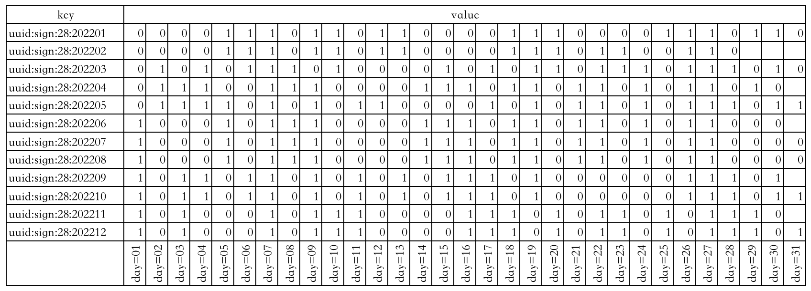
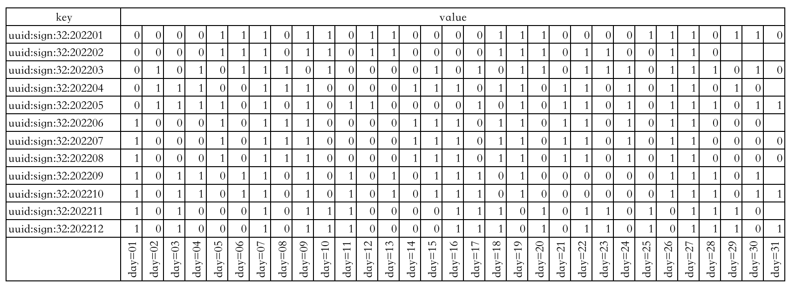
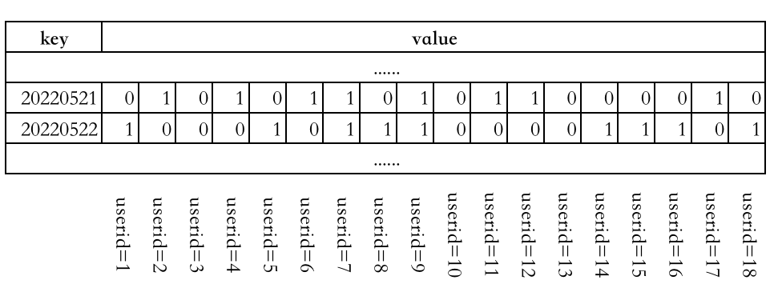

> 这里，我们介绍一下Redis`值对象`所支持的数据类型。所谓`值对象`所支持的数据类型，是从业务角度来讲的，如String，是指使用Redis的业务，需要保存到Redis中的数据的类型为String，而不是指别的其他。同理List，是指使用Redis的业务场景中，保存到Redis的数据的数据类型是List，也不是指其他。
>
> 说白了，`键对象`就是一个字符串，相当于对保存的值起了个名字。
> 
> 读者要对这一点很清楚。


## 前言

3.2版本是一个重要的稳定版本，有很多的更新，详见[这里](http://antirez.com/news/104)。

目前已知的可以支持的数据类型有： String 、 List 、 Set 、 Zset 、 GEO 、 HyperLogLog 、 Stream 等几种数据类型。

在学习本章节时，要了解一种值对象的应用场景、使用方法（如何用的问题）、内部数据结构（数据结构及转化条件）。

## String 

### 保存内容

- 字符串存储
- 数字

### 使用场景 

- 任何需要存储字符串的场景都可以
- 特殊场景：页面存储、session集中式存储、数字运算等

### 命令示例

- CLI命令
  - 单键操作
    - get
    - getrange
    - getset
    - set
    - setrange
    - setnx
    - append
    - strlen 
  - 多键操作
    - mset
    - msetnx
    - mget
  - 数字操作
    - incr
    - decr
    - incrby
    - decrby
    - incrbyfloat
    - decrbyfloat
- 外部API操作
  - jedis

|命令|	描述|	时间复杂度|
|---|---|---|
set key value [ex seconds] [px milliseconds] [nx	xx]	| 设置值	|O(1)
get key		| 获取值	| 	O(1)
del key [key ...]		| 删除key		| O(N)(N是键的个数)
mset key [key value ...]		| 批量设置值	| 	O(N)(N是键的个数)
mget key [key ...]		| 批量获取值		| O(N)(N是键的个数)
incr key		| 将 key 中储存的数字值增一		| O(1)
decr key		| 将 key 中储存的数字值减一		| O(1)
incrby key increment		| 将 key 所储存的值加上给定的增量值（increment）		| O(1)
decrby key increment	key 	| 所储存的值减去给定的减量值（decrement）		| O(1)
incrbyfloat key increment		| 将 key 所储存的值加上给定的浮点增量值（increment）	| 	O(1)
append key value		| 如果 key 已经存在并且是一个字符串， APPEND 命令将指定的 value 追加到该 key 原来值（value）的末尾		| O(1)
strlen key		| 返回 key 所储存的字符串值的长度。		| O(1)
setrange key offset value		| 用 value 参数覆写给定 key 所储存的字符串值，从偏移量 offset 开始		| O(1)
getrange key start end		| 返回 key 中字符串值的子字符		| O(N)(N是字符串的长度)

### 底层数据结构 

底层数据结构为SDS，但是根据保存的数据的类型以及数据长度，分为三种：
- int： 存储的是整数且长度小于20字节
- embstr： 存储的是字符串且长度小于等于44字节
- raw： 存储的是动态字符串，且长度大于44字节且小于512Mb
  - redis 2.+ 是 32 字节
  - redis 3.0-4.0 是 39 字节
  - redis 5.0 是 44 字节

## List 

List的数据结构，适合保存`可以重复的、有序的数据集合`。

### 使用场景 

- lpush+lpop=Stack（栈）
- lpush+rpop=Queue（队列）
- lpush+ltrim=Capped Collection（有限集合）
- lpush+brpop=Message Queue（消息队列）

### 命令示例

- lpush
- lrange
- rpush
- lpop
- rpop
- lindex
- linsert
- lset
- ltrim
- llen
- lrem

|命令|	描述 | 时间复杂度|
|---|---|---|
BLPOP key [key …] timeout	 | 删除，并获得该列表中的第一元素，或阻塞，直到有一个可用	 | O(1)
BRPOP key [key …] timeout	 | 删除，并获得该列表中的最后一个元素，或阻塞，直到有一个可用 | 	O(1)
BRPOPLPUSH source destination timeout	 | 弹出一个列表的值，将它推到另一个列表，并返回它;或阻塞，直到有一个可用 | 	O(1)
LINDEX key index	 | 获取一个元素，通过其索引列表	 | O(N)
LINSERT key BEFORE	AFTER pivot value | 在列表中的另一个元素之前或之后插入一个元素	 | O(N)
LLEN key	 | 获得队列(List)的长度 | 	O(1)
LPOP key	 | 从队列的左边出队一个元素	 | O(1)
LPUSH key value [value …]	 | 从队列的左边入队一个或多个元素	 | O(1)
LPUSHX key value	 | 当队列存在时，从队到左边入队一个元素	 | O(1)
LRANGE key start stop	 | 从列表中获取指定返回的元素 | 	O(S+N)
LREM key count value	 | 从列表中删除元素 | 	O(N)
LSET key index value	 | 设置队列里面一个元素的值	 | O(N)
LTRIM key start stop	 | 修剪到指定范围内的清单	 | O(N)
RPOP key	 | 从队列的右边出队一个元	 | O(1)
RPOPLPUSH source destination	 | 删除列表中的最后一个元素，将其追加到另一个列表 | 	O(1)
RPUSH key value [value …]	 | 从队列的右边入队一个元素 | 	O(1)
RPUSHX key value	 | 从队列的右边入队一个元素，仅队列存在时有效	 | O(1)

### 底层数据结构 

- Redis3.2版本以前： 内部编码方式有两种
  - ziplist（压缩列表）：当列表的元素个数小于 `list-max-ziplist-entries` 配置（`默认512个`），同时列表中每个元素的值都小于 `list-max-ziplist-value` 配置时（`默认64字节`），Redis会选用ziplist来作为列表的内部实现来减少内存的使用。
  - linkedlist（链表）：当列表类型无法满足ziplist的条件时，Redis会使用linkedlist作为列表的内部实现。
- Redis3.2版本开始， 使用 quicklist 代替了 ziplist 和 linkedlist 
- Redis 5.0 设计了新的数据结构 listpack，沿用了压缩列表紧凑型的内存布局，最终在最新的 Redis 版本，将 Hash 对象和 Zset 对象的底层数据结构实现之一的压缩列表，替换成由 listpack 实现


## Set 

保存不可重复的、无序的元素集合。

### 使用场景 

- 任何用来去重的场景和保证数据唯一性的场景
- 求交差并补集合
- 我关注的、关注我的

### 命令示例 

- sadd
- smembers
- scard
- sismember
- smove
- srem
- spop
- srandmember
- sinter
- sinterstore
- sunion
- sunionstore
- sdiff
- sdiffstore

|命令|	描述 | 时间复杂度|
|---|---|---|
SADD key member [member …]	 | 添加一个或者多个元素到集合(set)里 | 	O(N)
SCARD key	 | 获取集合里面的元素数量 | 	O(1)
SDIFF key [key …] | 	获得队列不存在的元素	 | O(N)
SDIFFSTORE destination key [key …]	 | 获得队列不存在的元素，并存储在一个关键的结果集	 | O(N)
SINTER key [key …]	 | 获得两个集合的交集	 | O(N*M)
SINTERSTORE destination key [key …]	 | 获得两个集合的交集，并存储在一个关键的结果集	 | O(N*M)
SISMEMBER key member	 | 确定一个给定的值是一个集合的成员	 | O(1)
SMEMBERS key	 | 获取集合里面的所有元素 | 	O(N)
SMOVE source destination member | 	移动集合里面的一个元素到另一个集合	 | O(1)
SPOP key [count]	 | 删除并获取一个集合里面的元素	 | O(1)
SRANDMEMBER key [count]	 | 从集合里面随机获取一个元素	
SREM key member [member …]	 | 从集合里删除一个或多个元素 | 	O(N)
SUNION key [key …]	 | 添加多个set元素	 | O(N)
SUNIONSTORE destination key [key …] | 	合并set元素，并将结果存入新的set里面	 | O(N)
SSCAN key cursor [MATCH pattern] [COUNT count] | 	迭代set里面的元素	 | O(1)

### 底层数据结构

- `intset` ： 当集合中的元素都是整数且元素个数小于 `set-maxintset-entries` 配置（默认512个）时，Redis会选用intset来作为集合的内部实现，从而减少内存的使用。
- `hashtable` ： 集合类型无法满足intset的条件时，Redis会使用hashtable作为集合的内部实现。

## SortedSet（zset）

保存`不可重复、具有顺序`的元素集合，保存的元素不能重复，但是分数可以重复。

### 使用场景 

- 微博中的热搜等场景

### 命令示例 

- zadd
- zrange
- zrem
- zscore
- zrangebyscore
- zrank
- zcard
- zcount
- zincrby
- zrevrank
- zremrangebyrank
- zremrangebyscore
- zinterstore
- zunionstore

|命令 | 	描述 | 时间复杂度|
|---|---|---|
BZPOPMAX key [key …] timeout | 	从一个或多个排序集中删除并返回得分最高的成员，或阻塞，直到其中一个可用为止	 | O(log(N))
BZPOPMIN key [key …] timeout | 	从一个或多个排序集中删除并返回得分最低的成员，或阻塞，直到其中一个可用为止 | 	O(log(N))
ZADD key [NXXX] [CH] [INCR] score member [score member …] | 	添加到有序set的一个或多个成员，或更新的分数，如果它已经存在	 | O(log(N))
ZCARD key	 | 获取一个排序的集合中的成员数量 | 	O(1)
ZCOUNT key min max	 | 返回分数范围内的成员数量	 | O(log(N))
ZINCRBY key increment member	 | 增量的一名成员在排序设置的评分	 | O(log(N))
ZINTERSTORE	 | 相交多个排序集，导致排序的设置存储在一个新的关键 | 	O(NK)+O(Mlog(M))
ZLEXCOUNT key min max	 | 返回成员之间的成员数量	 | O(log(N))
ZPOPMAX key [count]	 | 删除并返回排序集中得分最高的成员 | 	O(log(N)*M)
ZPOPMIN key [count]	 | 删除并返回排序集中得分最低的成员	 | O(log(N)*M)
ZRANGE key start stop [WITHSCORES]	 | 根据指定的index返回，返回sorted set的成员列表	 | O(log(N)+M)
ZRANGEBYLEX key min max [LIMIT offset count]	 | 返回指定成员区间内的成员，按字典正序排列, 分数必须相同。	 | O(log(N)+M)
ZREVRANGEBYLEX key max min [LIMIT offset count]	 | 返回指定成员区间内的成员，按字典倒序排列, 分数必须相同	 | O(log(N)+M)
ZRANGEBYSCORE key min max [WITHSCORES] [LIMIT offset count] | 	返回有序集合中指定分数区间内的成员，分数由低到高排序。	 | O(log(N)+M)
ZRANK key member	 | 确定在排序集合成员的索引 | 	O(log(N))
ZREM key member [member …]	 | 从排序的集合中删除一个或多个成员	 | O(M*log(N))
ZREMRANGEBYLEX key min max | 	删除名称按字典由低到高排序成员之间所有成员。	 | O(log(N)+M)
ZREMRANGEBYRANK key start stop | 	在排序设置的所有成员在给定的索引中删除	 | O(log(N)+M)
ZREMRANGEBYSCORE key min max | 	删除一个排序的设置在给定的分数所有成员	 | O(log(N)+M)
ZREVRANGE key start stop [WITHSCORES]	 | 在排序的设置返回的成员范围，通过索引，下令从分数高到低	 | O(log(N)+M)
ZREVRANGEBYSCORE key max min [WITHSCORES] [LIMIT offset count]	 | 返回有序集合中指定分数区间内的成员，分数由高到低排序。	 | O(log(N)+M)
ZREVRANK key member	 | 确定指数在排序集的成员，下令从分数高到低	 | O(log(N))
ZSCORE key member	 | 获取成员在排序设置相关的比分	 | O(1)
ZUNIONSTORE	 | 添加多个排序集和导致排序的设置存储在一个新的关键	 | O(N)+O(M log(M))
ZSCAN key cursor [MATCH pattern] [COUNT count] | 	迭代sorted sets里面的元素	 | O(1)

### 底层数据结构

- `ziplist` ： 当数据比较少时，有序集合使用的是 ziplist 存储的，有序集合使用 ziplist 格式存储必须满足以下两个条件：
  - 元素个数小于`zset-max-ziplist-entries（默认 128个）`
  - 所有元素成员的长度要小于`zset-max-ziplist-value（默认 64字节）`
- `skiplist` ： 如果不能满足以上两个条件中的任意一个，有序集合将会使用 skiplist 结构进行存储。


## Hash 

### 使用场景 

::: note 思考题
1. redis中存储对象有几种方式？
    - 第一种：
      - set user:1:name zhangsan
      - set user:1:age 12
    - 第二种： value为序列化后的对象信息
      - set user:1 serialize(userInfo)
    - 第三种： 使用字典
      - hset user:1 name zhangsan age 12
2. 假如hashtable数组上的链表元素有很多，那么rehash过程中，这些链表元素是怎么rehash到ht[1]上的？
3. hashtable扩容时，为什么 BGSAVE 或 BGREWRITEAOF 命令执行时的负载因子要比没有执行这两个命令时的负载因子大？
:::


### 命令示例 

- hset
- hsetnx
- hmset
- hget
- hmget
- hdel
- hincrby
- hkeys
- hvals
- hgetall
- hincrbyfloat
- hexists
- hlen


|命令 | 	描述 | 时间复杂度|
|---|---|---|
HDEL key field [field …]	 | 删除一个或多个Hash的field	 | O(N) N是被删除的字段数量。
HEXISTS key field	 | 判断field是否存在于hash中	 | O(1)
HGET key field	 | 获取hash中field的值	 | O(1)
HGETALL key	 | 从hash中读取全部的域和值 | 	O(N) N是Hash的长度
HINCRBY key field increment	 | 将hash中指定域的值增加给定的数字	 | O(1)
HINCRBYFLOAT key field increment	 | 将hash中指定域的值增加给定的浮点数	 | O(1)
HKEYS key	 | 获取hash的所有字段 | 	O(N) N是Hash的长度
HLEN key	 | 获取hash里所有字段的数量 | 	O(1)
HMGET key field [field …]	 | 获取hash里面指定字段的值 | 	O(N) N是请求的字段数
HMSET key field value [field value …]	 | 设置hash字段值 | 	O(N) N是设置的字段数
HSET key field value	 | 设置hash里面一个字段的值 | 	O(1)
HSETNX key field value	 | 设置hash的一个字段，只有当这个字段不存在时有效 | 	O(1)
HSTRLEN key field	 | 获取hash里面指定field的长度	 | O(1)
HVALS key	 | 获得hash的所有值	 | O(N) N是Hash的长度
HSCAN key cursor [MATCH pattern] [COUNT count]	 | 迭代hash里面的元素

### 底层数据结构

- `键值对数量小于512【hash-max-ziplist-entries配置（默认512个）】` && `所有键值对的key和value的长度都小于64字节【所有值都小于hash-max-ziplist-value配置（默认64字节）】` 时使用ziplist；
- 否则就使用 hashtable 
  
## Bitmap

Bitmap即位图，是一串连续的二进制数组（只有0和1），可以通过偏移量定位元素。适用于数据量大且使用二值统计的场景。

### 内部实现 

是基于String类型实现的，只不过是String的值为二进制字节数组。

### 适用场景 

#### 统计考勤

比如有这么几个业务场景：
1. 需要统计某一用户在某一月份的出勤情况；
2. 统计某一用户的全年出勤情况

具体实现可能是这样的： 以具有月份意义的字符串作为key，然后以这个月份具有的天数作为偏移量，出勤为1，缺勤为0。这样就相当于为每一个用户都创建12个key，每一个key所使用的Bit位不超过31个（一个月份最多有31天），也就是说最多使用365个bit位就可以表示一个用户的全年出勤情况。如下图表示用户id=28的用户全年的出勤情况：



下图表示用户id=32的用户的全年出勤情况：



如，id=13的用户在202206月份的25日出勤了，那么就可以：

```
SETBIT uuid:sign:13:202206 24 1
```

同样地，id=26的用户在202207月份的18日缺勤，则可以记录为：

```
SETBIT uuid:sign:26:202207 17 0
```

那么获取id=20的用户在202209月份8日的出勤情况，则可以使用命令：

```
GETBIT uuid:sign:20:202209 7
```

也可以统计id=20的用户在202209月份的出勤天数：

```
BITCOUNT uuid:sign:20:202209
```

甚至可以统计id=100的用户在202206月份的首次打卡情况【1表示弹出第一个元素】：

```
BITPOS uuid:sign:100:202206 1
```

统计某一用户的全年出勤情况，则可以通过分别获取每一月的出勤情况，然后做一个汇总即可。

#### 统计登陆情况

在很多web应用中，有时会遇到要统计用户登陆情况的业务场景，我们就可以把日期作为key，把用户的id作为偏移量。





例如，userid=4的用户在20220521这一天登陆了，就使用下面的命令在Redis中记录一下：

```
SETBIT 20220521 3 1 
```

说明： 
- 20220521 为key； 
- 3为偏移量，具有业务意义，表示userid=4的偏移量； 
- 1为字节数组中的元素，表示登陆；

同样的，可以使用下面命令获取userid=6的用户在20220522这一天的登陆情况：

```
GETBIT 20220522 5 
```

比如统计id=45的用户，在七日内的登陆情况，就相当于统计七个bitmap中偏移量为45的位置上的值，我们只需要把这七个bitmap中偏移量为45的bit值统计出来，然后再创建一个bitmap专门存放这个结果即可实现业务需求。


## HyperLogLog

HyperLogLog 是 Redis 2.8.9 版本添加的数据结构，它用于高性能的基数（去重）统计功能，也就是说，这种数据结构可以统计一个集合内所有不重复的元素个数。它的缺点就是存在0.81% 的误差。但是误差可以通过设置辅助计算因子进行降低。

### 命令示例 

```
// 添加元素
127.0.0.1:6379> pfadd key "redis"
(integer) 1
127.0.0.1:6379> pfadd key "java" "sql"
(integer) 1

// 统计不重复的元素
127.0.0.1:6379> pfadd key "redis"
(integer) 1
127.0.0.1:6379> pfadd key "sql"
(integer) 1
127.0.0.1:6379> pfadd key "redis"
(integer) 0
127.0.0.1:6379> pfcount key
(integer) 2

// 合并
127.0.0.1:6379> pfadd k "java" "sql"
(integer) 1
127.0.0.1:6379> pfadd k2 "redis" "sql"
(integer) 1
127.0.0.1:6379> pfmerge k3 k k2
OK
127.0.0.1:6379> pfcount k3
(integer) 3

```

### 底层数据结构 

HyperLogLog存储数据时，相当于使用一个或多个hash算法，把计算出的hash值保存成类似位图的数据结构，然后在使用时，只需要利用同样的算法计算出所有的key即可。使用位图的方式让Redis使用更少的内存空间来存储大量的key。这种方式比使用set、list等要非常节省空间。


### 适用场景 

可以用于统计诸如PV、UV的业务场景中。

## GEO 

可以`保存地理位置信息`并`对地理位置信息进行操作`，是3.2以后提供的新特性。可以完成类似于“搜索附近”的功能，如在地图上定位到某一个景点，GEO这种数据结构可以完成搜索附近美食的功能。

### 命令示例 

- geoadd
- geopos
- geodist
- georadius
- geohash
- zrem

### 底层数据结构 

- 并没有设计新的底层数据结构，而是直接使用SortedSet作为底层实现；
- 具体实现： 
  - 先对二维地图做区间划分，并对区间进行编码；之后判断实际的地理位置在哪一个区间上，然后使用这个区间的编码作为SortedSet的权重信息；
  - 举例说明： 如 某一个地理位置为（112.23E，32.89N），它在划分后的编码为5的区间上，那么就把5作为SortedSet的权重；

## Stream 

就是Redis实现的一种消息中间件的数据结构。先了解一下消息中间件的概念：

::: tip 消息中间件的准备知识
1. 为什么会有消息中间件？
   解耦、削峰、异步、高性能；
2. 有哪些概念？
   消息、生产者、消费者、主题、channel等；
:::

### 使用Redis早期版本作为消息中间件

- 发布订阅机制 
  - publish
    - 返回0~n的整数，表示有多少个消费者接收到了消息
  - subscribe 
    - 可以订阅多个channel
    - 命令会一直阻塞，等待接收消息
  - psubscribe 
    - 可以订阅主题，只能订阅一个主题
    - 发布订阅模式，这种方式有两个问题
      - 无法持久化消息，Redis重启后，消息会丢失；
      - 发后即忘的，如果消费者没有收到消息，就会再也接受不到消息了；
- List ： 就是使用lpush+rpop来完成
  - 比发布订阅机制的：
    - 优点
      - 可以持久化消息
      - 可以积压消息
    - 缺点
      - 不能重复消费
      - 消费时还需要遍历所有的消息列表
      - 没有主题订阅的功能
- ZSet 
  - 比发布订阅机制的：
    - 优点
      - 支持持久化
      - 比list查询更方便，可以使用score属性来完成遍历
    - 缺点
      - 不能存储相同消息，也就是消息不能重复
      - 不能完成消息队列的有序性
      - 没有弹出功能

上面这三种方式，都只能保存单值，如果想要保存一个对象，就需要先对其序列化。Redis5.0之后引入Stream，就是为了更加完美的实现消息队列。它具有以下特性：
- 支持消息的持久化
- 支持自动生成全局唯一id
- 支持ack确认消息
- 支持消费组模式等

### 保存内容 

### 命令示例 

- xadd
- xread： 循环阻塞读取消息
- xrange
- xlen
- xdel  
- del
- xgroup 
  - xgroup delconsumer
  - xgroup destroy
- xreadgroup 
- xack 
- xpending 
- xinfo 
  - xinfo stream
  - xinfo groups
  - xinfo consumers

1. 生产消息

```
// 往消息队列中插入消息
> XADD mymsgqueue * name zeanzai 
"1654254953808-0"
```

- XADD 中的 * 表示让 Redis 为插入的数据自动生成一个全局唯一的 ID
- XADD 中的 name 表示键， zeanzai 表示值 
- XADD 的输出结果中，1654254953808为以毫秒为单位计算的当前服务器的时间；-0表示第1条消息信息；

2. 消费消息 
   
```
// 单个消费者消费
// 消费消息队列中的消息， 消费 1654254953807-0 后续的所有消息
> XREAD STREAMS mymsgqueue 1654254953807-0
1) 1) "mymsgqueue"
   1) 1) 1) "1654254953808-0"
         1) 1) "name"
            1) "zeanzai"

// 阻塞消费消息队列中的消息， $ 表示读取最新的消息
> XREAD BLOCK 10000 STREAMS mymsgqueue $
(nil)
(10.00s)
```

- XREAD 中的 1654254953807-0 表示从这条信息的下条信息开始消费
- XREAD BLOCK 10000 中的 block 10000 表示在消费时，阻塞10s时间。


```
// 多个消费者形成一个消费组进行消费
// 为某一个消息流设置多个消费组，并标识消费消息的位置
// 创建一个名为 group1 的消费组，0-0 表示从第一条消息开始读取。
> XGROUP CREATE mymsgqueue group1 0-0
OK

// 创建一个名为 group2 的消费组，0-0 表示从第一条消息开始读取。
> XGROUP CREATE mymsgqueue group2 0-0
OK

// 让消费组里面的某一个消费者消费消息
// 注意： 一个消息只能由消费者组内的一个消费者消费；但是可以由多个消费组的多个消费者消费；
// 消费组 group1 内的消费者 consumer1 从 mymq 消息队列中读取所有消息的命令如下：
// 命令最后的参数“>”，表示从第一条尚未被消费的消息开始读取。
> XREADGROUP GROUP group1 consumer1 STREAMS mymsgqueue >
1) 1) "mymq"
   2) 1) 1) "1654254953808-0"
         2) 1) "name"
            2) "zeanzai"

```

3. 消费者确认消费

```
> XACK mymsgqueue group2 1654254953808-0
(integer) 1

// 查看某一个消费组已经消费，但是还没有确认的消息列表
> XPENDING mymsgqueue group2
1) (integer) 3
2) "1654254953808-0"  # 表示 group2 中所有消费者读取的消息最小 ID
3) "1654256271337-0"  # 表示 group2 中所有消费者读取的消息最大 ID
4) 1) 1) "consumer1"
      2) "1"
   2) 1) "consumer2"
      2) "1"
   3) 1) "consumer3"
      2) "1"
```

消息确认消费的原理： Redis会把每一个消费过的消息保存到PENDING list中，直到消费者使用XACK命令确认消息消费成功。


### Stream与主流MQ对比

可从消息的可靠性、持久性、有序性、解决重复消费、高可用、消息积压等方面去理解。

- 有序性： 单个消费者时，消费顺序天然有序；多个消费组时，在消费组内有序，消费组间无序；
- 持久性： Redis对Stream具有有序性；
- 解决重复消费问题： Stream为每一个消息都设置了全局唯一id，保证消息的唯一性，重复消费问题可以通过ack机制及消费端应用自行处理；
- 高可用问题（消息丢失问题）： 生产者由生产者端应用自行处理；消息队列则由Redis保证，可能会出现消息丢失问题，因为AOF每秒写盘、主从切换时也可能会丢失部分数据；消费者可以通过确认机制达到高可用性；
- 消息积压问题： Stream可以设置固定长度，当消息队列超过最大长度后，redis会删除旧消息数据，这样是有可能造成消息丢失的；

选择Redis作为消息中间件的应用场景：业务比较简单、对丢失数据不够敏感、且消息积压概率较小，可以使用Redis作为消息中间件。其他情况，还是建议使用专门的消息中间件产品。


---
<br /><br /><br />


