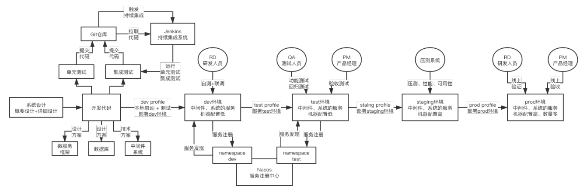

::: tip 本文首发于微信公众号⌜天晴小猪⌟。微信搜索：天晴小猪，后台回复关键字获取⌜免费电子书⌟和⌜整套面试资料⌟。文章末尾有二维码，欢迎扫描关注。
:::

## 《01_我们为什么要使用复杂的微服务架构？》

### 巨石应用的弊端

传统的单体应用的软件开发过程是很多开发人员共同负责一个巨石应用，比如在平安企业网银团队中，起先的企业网银就是一个巨石应用，每次版本过程中可能涉及到多个开发团队开发多个功能，他们的版本管理使用的是git，每个需求有一个对应的开发分支，所有做这个需求的人员都需要在这个分支上进行开发，每个版本过程有一个release分支，即当月所有的需求分支全部都合并到此次投产版本的release分支上。这就涉及到一些问题：

1.每次合并代码后，很容易产生冲突，比如一些功能配置文件，由于开发过程中，多个团队可能都需要修改，那版本管理员在合并代码时，就会涉及到冲突。每次花在解决冲突上的时间就很长；

2.由于模块之间相对耦合，某一个需求修改后上测试环境，另外一个需求虽然不需要把第一个人的需求代码合并到自己的分支上之后再提交上测试，但是测试人员需要评估影响范围，即第一个需求上测试后，在第二个需求的代码也合并到release分支后上测试环境后，会不会对第一个需求产生影响，如果产生影响，就需要进行回归测试；

假如软件过程的方式是每个开发有自己的独立的开发分支，那这样就更麻烦了。就会涉及到下面这些问题：

1.后面一个人上测试环境的人，需要等待前一个上测试的人上完测试之后，把前一个人的代码合并到自己的分支上，然后再上测试。这样后面一个人需要处理合并请求；同样，测试人员需要对前一个人的已经测试完成的需求，再次进行回归一遍。

总之，如果采用单个开发单个分支的方式，势必会产生不断处理合并请求，不断进行回归测试的过程。

从软件开发整个流程的角度来讲，单体应用过程中，由于多个开发成员共同维护一套代码，就导致在各个软件过程中都会出现各种各样的问题：

1.对于版本管理员来说，频繁的代码提交很容易产生很多的代码冲突，工作量也会增加；

2.对于开发人员来说，版本分支需要相互合并，要等到固定的发版时间才能上测试；

3.对于测试人员来说，频繁的代码提交每次都需要进行全量回归，增加了额外的工作内容；

4.对于整个架构来说，如果架构需要重构用到新的技术，那就需要全体成员都需要学习新技术，这就带来了新的人力成本；

### 微服务架构的好处

对于微服务来讲，由于团队管理形式与单体应用的管理形式不同，这就导致了代码的管理方式也是不一样的。对微服务来讲，团队内成员一般是五人以内，代码合并的弊端就不会很明显，这就节省了很多的时间；每次发布新版本时，测试团队也不需要再次进行全量回归，只需要回归新版本所涉及到的微服务即可，这也会大大减少测试人员的工作内容，此外，版本管理员的权利可以下放到具体的开发团队，从而减少人力成本，如果后期使用容器等相关云服务的技术时，也不会涉及到过多的重构成本，因为微服务与容器是天然融合的。

总之，微服务大大减少软件过程中的额外人力及管理成本；使用微服务就可以非常友好的解决这些问题。

### 微服务架构的缺点

当然，微服务也有缺点：

1.对运维人员来讲：由于微服务多与容器进行融合部署，这就需要企业运维团队学习新的运维知识，对企业而言可能需要增加相关的运维成本；运维人员还需要额外部署微服务需要的基础设施，如日志中心、服务注册中心、配置中心、监控中心等；

2.对开发人员来讲：巨石应用时期，架构师在搭建了服务架构后，开发人员只需要关注业务即可，也就是说只需要开发人员熟悉业务相关的技术即可，但是引入微服务后，由于微服务相关组件较为丰富，架构团队在搭建了基础框架后，不仅要求开发人员熟悉业务开发，还要求开发人员对相关组件的使用及原理特别熟悉；

3.对压测人员来讲：需要测试的接口比原来要较多；

4.对于架构人员来讲：需要根据旧有技术改造、团队组织形式、学习成本等角度，选用高效便捷符合业务场景的架构应用模型，尤其是需要对微服务边界进行限制，不然很容易造成不同部门之间的推诿；

5.对企业而言：可能需要增加额外的经济成本，后期可能还需要有额外的跨部门的沟通成本；

### 总结

1.巨石应用的弊端有那些？（3点）

2.微服务的优点（3点），缺点（3点）

## 《02_国内BAT互联网大厂的微服务架构演进路线》

## 《03_海外硅谷互联网大厂的微服务架构演进路线》

## 《04_目前国内公司的主流微服务技术栈介绍》

### 国内外主流微服务架构演进路线

国内的微服务架构的演进路线基本是自研。但是后来阿里开源了一套dubbo+zookeeper的技术栈，国内众多中小型公司开始拥抱dubbo+zookeeper；后来美国的Netflix公司的微服务架构也开源了，并且他开源的这一套的微服务模型被Spring官方进行整合了，整合成SpringCloud的技术栈，于是国内的一些中小型公司又开始拥抱Netflix的SpringCloud。随着近期阿里也基于自己公司实践的微服务架构整出一套SpringCloud-Alibaba，再加上Netflix的那套微服务更新速度较慢，参考文档为英文对国人不够友好等原因，国内的一众公司又开始拥抱SpringCloud-alibaba了。

部分公司开始尝试推行spring cloud alibaba技术栈+国内开源的组件（apollo、CAT）+ Prometheus + ELK + Spring Cloud Gateway（Nginx+lua、Kong、Zuul、API网关自研）

个人认为，SpringCloud-alibaba由于它经历过事实实践、加上更新较快、文档丰富并且文档对国人较为友好等原因，再加上国内其他互联网公司也相继开源了自己公司的微服务产品，如携程的Apollo、大众点评的cat等，加上其他国外的优秀开源项目，比如Prometheus，ELK，Spring Cloud Gateway，等等，逐渐形成了以国内开源技术为核心的微服务技术体系。

### 微服务技术栈介绍

RPC组件、注册中心、配置中心、日志中心、API网关、熔断/降级/限流、链路监控、自动化部署、分布式事务、监控中心、安全认证

### SpringCloud-alibaba VS SpringCloud-Netflix

- 注册中心：nacos -> eureka
- RPC框架：dubbo -> feign+ribbon
- 分布式事务：seata -> 无
- 限流/熔断/降级：sentinel -> hystrix
- API网关：无 -> zuul

### 总结

- 业界主流微服务技术架构演进过程（3个阶段及个人认识）
- 微服务技术栈主要组件的介绍（10个）
- 业界两套微服务技术架构的对比

## 《05_C2C电商社会化治理平台项目介绍》

## 《06_C2C电商社会化治理平台面向的痛点介绍》

## 《07_C2C电商社会化治理平台的解决方案介绍》

## 《08_C2C电商社会化治理平台整体架构设计》

## 《09_C2C电商社会化治理平台的微服务拆分设计》

总结

1.通过介绍C2C电商项目中遇到的非法上传商品内容、非法评论、非法社交等活动场景，前期的解决方案是人工监控和审核这些非法场景；后来随着数据量及用户的不断提升，导致人工成本逐渐上升，后来就引入了社会化治理平台。

2.引入社会化治理平台后需要对社会化治理平台进行功能分析、使用场景设计等，即完成概要设计内容，也就是社会化治理平台需要具备什么样的功能，如何被其他已有的服务进行使用等。

3.解决了这些问题后，开始对此社会化治理平台进行功能拆分，按照不同的功能边界进行划分，划分出三个不同的微服务模块：举报服务、评审员服务、奖励服务等。

总结：
1. 这个需求的分析过程是怎样的？（分析有什么问题、针对这些问题如何进行代码实践、代码实践过程中应该怎么划分系统或服务边界）

## 《10_为什么微服务化的系统架构必须要有注册中心？》

服务a调用服务b时，有这么几种情况：
1.服务b是单个服务实例，那么服务a调用服务b时，就需要在代码里面以硬编码方式配置服务b的服务地址，这里的服务地址可以是ip也可以是域名，如果是域名的话，如果每次服务b的实际ip发生改变，就需要刷新dns，以同步域名和ip的指向，这样调用就不会出现问题；
2.服务b是多个服务实例，在调用的时候，服务a还是需要在代码层面以硬编码的方式配置服务b的服务地址，由于是多个服务实例，在服务b的上层可能还需要放置一个负载均衡器，例如nginx，但是如果增删服务b的实例时，就需要重新配置nginx的配置文件，当然也可以使用nginx+lua进行弹性扩展；

但是这种方式终归是不够友好的，因为都需要在服务a中对服务b的地址进行配置。

如果添加了注册中心，ng+lua的工作就可以由注册中心接收。每次服务启动时，服务a和服务b就同步会注册到注册中心，当服务a调用服务b时，服务a只需要在代码里面引用服务b的服务名称，在具体执行过程中，服务a就会根据服务b的服务名称从注册中心中找到服务b的具体实例的地址，然后再发送请求即可。（当然，这个过程是简化了的过程，服务a可能还有客户端的负载均衡组件）。

总之，添加注册中心的目的是为了管理服务与具体实例地址之间的关系。注册中心除了服务注册与发现的基本功能外，还包括服务上下线、服务健康监控、服务路由等。

总结：
1.遇到什么样的问题了？这些问题的解决方案是什么？这些解决方案又有那些问题？
2.

## 《11_ZooKeeper、Eureka、Consul、Nacos的选型对比》

### CAP理论

所谓cap理论就是指在分布式系统中，如果要做到分布式系统不会出现问题，就需要保证分布式系统满足一些条件，而这些条件就被研究人员抽象出来，总结成三个问题：即CAP理论。
C：一致性，由于分区的问题，网络不够稳定时，就会导致不同网络区域内的数据不一致的情况，满足C的分布式系统要求，在系统异常情况下，数据要达到最终一致性的目标；

A：可用性，就是当分布式系统中出现异常，每个节点都要可用，即可以对外提供服务；

P：分区容错性，由于网络不可信，节点与节点之间可能会出现网络异常问题导致无法通信，这就会导致系统无法提供正常的服务。此时，分区容错性就要求，在网络异常情况下，单个节点也是要可以提供正常服务的。

CAP原理说，一个数据分布式系统不可能同时满足C和A和P这3个条件。所以系统架构师在设计系统时，不要将精力浪费在如何设计能满足三者的完美分布式系统，而是应该进行取舍。由于网络的不可靠性质，大多数开源的分布式系统都会实现P，也就是分区容忍性，之后在C和A中做抉择。

### 各种注册中心的对比

Zk：满足CP，不满足A，主要是因为其原理是，leader+follower的工作方式，leader进行写，follower进行读，当leader写完时，会同步follower数据，此时所有的数据变成最终一致，但是当leader发生异常时，剩余的节点会自动选举一个leader，在选举过程中，会造成整个注册中心的短暂不可用；

Eureka：满足AP，不满足C，其主要原理是使用peer-to-peer的机制，每一个节点的地位相同，其中一个节点发生异常时，另外的节点同样可以对外提供服务，但是它是异步复制的，所以随机读取两个节点时，可能会造成读取的数据不一致的现象。

Consul：基于raft算法的CP模型。

Nacos：基于raft算法的CP模型，同时也支持配置成类似eureka的AP；

### 总结

早起zk和dubbo是标配，后来SpringCloud火了之后大家又开始使用Eureka和Consul，但是不管是ap还是cp，其实在生产环境中，两种都有人在用，但是未来还是推荐使用Nacos，因为Nacos的功能还是比较全面的，包括了雪崩保护、自动注销、SpringCloud集成、Dubbo集成、K8S集成、监听支持、多数据中心、跨注册中心同步等。

## 《12_SpringCloudAlibaba之Nacos注册中心架构原理》

## 《13_深入Nacos服务注册中心的内核原理》

## 《14_基于Nacos实现高可用服务注册中心部署》

可以开三个应用服务实例来并设置不同的端口来模拟三台物理机来实现高可用部署。伪集群。

## 《15_为什么微服务化的系统必须通过RPC框架进行通信？》

所谓RPC框架，即远程调用框架。在服务与服务之间调用时，如果不使用rpc框架进行调用，假如服务a调用服务b，那就需要服务a使用Apache组件或jdk原生的http组件，此时需要对http进行配置，如请求头、请求体、状态码等；同样地，服务b也需要对响应头、响应体、状态码进行配置，这样服务a才能顺利调用服务b。假如，两个服务之间的通信协议不一致，可能还要涉及到请求报文与响应报文的定义，这是非常繁琐的。

引入RPC框架后，服务a只需要关注业务处理即可，不需要关注底层的http的具体调用过程。简化了代码的开发过程。

此外，如果是不同协议之间的调用，RPC框架也能屏蔽不同协议之间的差异，使开发人员无感的进行服务调用。

## 《16_Feign+Ribbon、Dubbo、gRPC的选型对比（上）》

## 《17_Feign+Ribbon、Dubbo、gRPC的选型对比（下）》

## 《18_Dubbo RPC框架集成Nacos注册中心》

## 《19_基于Dubbo开发C2C电商社会化治理平台人群服务（上）》

## 《19_基于Dubbo开发C2C电商社会化治理平台人群服务（上）》

## 《20_基于Dubbo开发C2C电商社会化治理平台任务服务（上）》

## 《21_基于Dubbo开发C2C电商社会化治理平台权益服务（下）》

## 《22_基于Dubbo开发C2C电商社会化治理平台基础服务》

## 《23_微服务化的C2C电商社会化治理平台如何进行全链路测试？》

应该叫软件交付过程或许更合适一些。

1.系统设计阶段
系统设计阶段包括概要设计、详细设计、简要设计等阶段。在概要设计阶段需要完成技术架构、业务架构、业务流程、技术方案、部署方案等设计。详细设计需要完成接口定义、数据库表结构设计、交互流程设计、业务建模、关联系统影响分析、安全设计、并发设计等设计。简要设计需要完成关键代码的实现设计、主要类的设计、主要数据库表结构的设计等。

设计完成后，需要把系统设计的成果拿出来交给团队或其他专业人员，如架构师团队等人员进行评审。评审合格后开始进入下一个阶段。

2.代码开发阶段
代码开发阶段主要是研发人员依据系统设计阶段的成果进行代码实现，把方案具体实施出来，这个过程大多数情况下是CRUD及调用接口的过程，当然如果涉及到中间件的使用，还需要写一些公共代码及设计一些公共代码所要用到的数据库表结构，甚至还要写一些公共类库等。

多数软件交付过程并不是等所有的功能全部开发完成后，再一次性部署，大多情况下是开发一部分功能自测完成后，并交付测试人员测试完成即可部署上线，然后在进行迭代过程。在这个过程中公共代码及公共表结构甚至类库都需要经过不断的迭代才能逐步的定下来。

假如开发人员开发的是迭代需求，那么这个过程可能还需要涉及到安全设计的评审、sql脚本的评审等。

3.本地自测阶段
本地自测阶段是开发人员完成功能模块的编码后进行的。开发人员在自己本地，完成对各自功能代码的自测，这需要书写自测代码，可以使用自测的技术框架（平安使用的是天狼星，直接可以使用maven插件进行自测代码的生成，开发人员只需要书写mock数据即可，并完成规定的代码覆盖率）。一般情况来说功能代码与自测代码的比例可能要占到1:1.2的时间比例，即开发人员可能使用1天就能开发完功能点，但是写自测代码时就需要1.2天的工作量。所以一般小型公司大多数不会有本地自测的阶段，或者是本地自测阶段形同虚设，只有那些资本雄厚的公司才会有专门的团队负责开发自测框架，使用自动化的代码生成工具生成自测代码，开发人员只需要关注mock数据及代码覆盖率即可。

当然，如果功能点中还涉及到接口联调，那么就需要开发团队单独部署一套服务，专门提供关联系统的接口模拟功能，这样来说整个单元自测功能就算完成了。但但多数情况下，本系统的开发人员会连同关联系统的开发人员进行接口联调，未完成开发工作的关联系统开发人员可以针对接口写一些挡板数据，以便配合接口调用方完成接口自测。

4.持续集成阶段
我们在软件开发过程时，工作模式大多是，我们把自己的代码推送到版本库中，然后由版本经理完成分支合并，把开发人员的代码合并到完成的功能分支中去，然后开发人员再次进行版本开发推送、版本经理再次进行合并，于是功能分支就不断完善，这个过程就是持续集成阶段。

一般情况下，我们会使用自动化集成工具进行这个过程，多数是jekins，其工作原理是：当我们把代码推送到版本库上时，版本库软件会采用类似于钩子的方法，调用jenkins工具的接口，然后Jenkins的工具就会自动的跑该版本的流水线，让流水线跑完并全部都成功后，Jenkins就会拉取代码到部署的服务器，然后完成部署过程。这个过程就是不断功能不断集成的过程。在这个过程中除了要运行本地自测的代码外，还会运行集成测试的代码，把整个功能串起来自动化测试一下。

5.联调测试/功能测试阶段
当功能代码书写完成并完成本地自测后，就需要把代码放到测试环境上了，此时测试团队正式介入，测试人员会在测试环境上对开发人员的功能点，根据前期评审确定下来的评审案例一一进行执行，完成案例执行后或在案例执行后期，业务团队开始介入，QA或PM会针对本次需求所涉及到的功能点进行一一验收测试。在此阶段，测试团队可能还会有一些自动化测试的案例，也需要执行通过。如果是大版本的变动时，可能还需要测试团队进行一次回归测试，主要是测试一下此时版本功能是否会对其他功能产生影响。

6.预发布测试阶段
预发布测试阶段主要是测试系统的一些功能指标，例如稳定性、并发行、可用性，针对这些指标进行测试。如果系统是从0到1的过程，那这个阶段可能会根据用户群体的预估，主要是流量和数据量的预估，来给系统提供一个性能指标，然后根据这个性能指标并根据测试的结果来判断服务器的数量。如果此功能是迭代性功能，一般做法就是从已有的生产环境中回放一些流量进来，来看功能是否ok、链路调用是否正常、服务器性能负载如何。

7.部署阶段
如果上述过程一切都是ok的，那么功能就可以上线了，上线后需要PM进行验证，如果上线后有问题，还需要对代码进行回滚。

::: tip 

1、PM（Project Manager），项目主管或项目经理，主要负责统筹规划项目进度及产品生命，其工作职能直接对公司高层负责。作为项目的管理者，PM通常会参与到一个或多个项目的管理与决策工作中。

2、RD，研发工程师，作为研发工程师，首先要有强烈的好奇心，这是成为高手的必要条件。喜欢新生事物，对问题喜欢刨根问底，以钻研为乐趣。

做事谨慎细致，考虑问题全面。技术工作来不得半点粗心马虎，否则问题多多，后患无穷。甚至给生产、产品品质造成重大影响，给公司造成重大经济损失。

3、QA：QA对企业内部来说是：全面有效的质量管理活动；对企业外部来说则是：对所有的有关方面提供证据的活动。 QA就是包括制造企业各个部门的组成的一个保证生产高质量产品的一个系统。

4、OP：操作员是负责维护SQL SERVER系统的人员，操作员可以由一人担任，在那些拥有很多服务器的大型企业中，操作员也可以由多人担任。

:::

## 《24_如何基于Nacos实现多测试环境与生产环境的隔离？》

使用nacos的namespace，不同的环境使用不同的命名空间。

## 《25_C2C电商社会化治理平台的多环境部署隔离》

本章节主要讲述的是，不同环境在部署时，如何部署中间件产品。例如开发环境、测试环境、预发布环境都需要使用到redis、mq、数据库、配置中心、网关中心等，那在搭建不同的环境时，就要涉及到这些中间件产品的部署。

总的来说，针对不同的中间件，实现不同环境的部署隔离的部署策略不同。例如配置中心使用nacos，那么不同环境的部署只需要进行namespace的隔离即可，例如数据库中间件，部署时可以采用不同的主机上部署不同的实例；例如redis缓存，部署时不同环境可以公用一套redis集群，只不过是不同环境连接到不同的db上即可。

## 《26_互联网公司部署方案：蓝绿部署、灰度发布以及滚动发布》

在进行软件系统的全链路交付过程中，最后一个阶段一定是发布和部署的过程。那部署过程中又分为滚动部署、灰度部署、蓝绿部署。而部署完成之后又必须要考虑到部署的版本的功能验证和回滚。

部署时，项目有三种情况：一种是从0到1的项目需要完成首次部署；一种是项目已经有生产环境了，但是需要对其中的功能进行优化，这就是维护性部署了；第三种是项目已经有生产环境了，但是由于原有系统技术架构过于老旧，维护成本日益增加，就需要对原有系统进行重构，此时重构后的系统需要部署，那这种部署就成为重构性部署。

滚动发布就是有n台生产服务器，那么依次手动或自动的部署这n台服务器。这种方式是有风险的，风险在于回滚的时候会出现大面积的不可用现象，此外如果部署上去一段时间后发现异常需要回滚时，也有可能造成一部分请求已经发送过来，就有可能造成数据出现污染。那么回滚时，就不能单单只回滚代码，估计还需要对已经落库的数据进行回滚。这时就需要写单独的回滚数据的代码。整体来说，滚动发布是最传统的发布方式，也是最不保险的。现在很少有公司再这样发布维护性版本了。

灰度部署就是有截取一部分的流量到部署了新版本的服务器上，然后一部分用户率先体验到新的特性，然后在对这些流量产生的数据、服务的运行状态等健康数据进行监控，如果出现异常，影响也不会很大，因为只有一部分用户受到影响，回滚起来的任务也不会很重。如果这些监控数据是健康的，那么就可以逐步的把所有的服务器都部署上新的版本，这个过程是一个渐变的过程，不是一蹴而就的，因此灰度这个词就很形象了。但是灰度部署也有一个问题就是无法验证高并发的场景。

蓝绿部署就是准本两套生产服务器，这种情况一般是财大气粗的企业采用的一种部署方式，其基本过程是，在部署新功能版本时，另外部署一套系统，让这套系统也承担生产的功能，在运行一段时间后就逐步弃用旧有系统。相当于有两套不同的代码都在进行生产服务。此外蓝绿部署不单单是针对旧有系统进行技术重构的场景使用，还因为灰度部署方式有一个弊端，就是灰度部署虽然截取了一部分流量到新版本的服务器上，但是涉及到一些高并发的场景可能需要放到整个生产环境中才能够被验证出来，此时蓝绿部署也就可以派上用场。

总结：
1. 目前企业级的部署方案有哪些？各自的部署过程是怎样的，部署后遇到的问题是哪些？各自适用的场景是哪些？

## 《27_Nacos如何支持蓝绿部署、灰度发布以及滚动发布？》

首先，目前市面上还没有一套开源系统完美的支持灰度部署和蓝绿部署。目前市面上主流的实现思路是通过配置中心中针对需要灰度的服务配置不同的命名空间，然后通过网关入口做定制化，针对特定的流量转发到需要灰度或蓝绿的服务即可。大概的实现思路基本都是这样的。

## 《28_C2C电商社会化治理平台的蓝绿部署、灰度发布以及滚动发布》

由于真正完善的灰度或蓝绿部署都需要较大的经济成本，因为需要额外的服务器，这时就可以做成伪灰度，或伪蓝绿。

灰度的时候，假设有三台服务器，就把其中的一台部署，然后切三分之一的流量到灰度机器上。如果有五台，就切两台过去，把五分之二的流量切过去。

蓝绿部署时，需要对服务管理中心组件做定制化改造，以实现手动下线某个服务实例，或者手动上线某个服务实例。这样也是可以达到蓝绿部署的效果的。

如果真的是需要使用不同的环境，那就需要在晚上一点到五点，把旧有数据迁移到新环境中，让新老系统一起跑，跑一段时间稳定后再下线旧服务。

## 《29_为啥微服务化的系统需要分布式事务方案——事务基础筑基》

事务概念、特性、隔离级别、封锁协议与隔离级别的关系、mysql中如何实现可重复读的隔离级别、Spring中的隔离级别（概念、分类及各自原理）

所谓事务，就是满足ACID特性的一组数据库操作，ACID就是原子性（要么成功、要么失败，不会存在中间状态）、一致性（经过这组操作之后，数据库系统的状态在经过这组操作前后是保持一致的）、隔离性（不同事务之间不会产生影响）、持久性（事务完成之后，数据库系统会对数据进行持久化保存下来）。说起隔离级别，就需要说一下数据库的并发一致性问题，我们知道在数据库系统中，单线程操作数据库是不会产生问题的，但是由于数据库系统支持高并发的操作，那每一个事务就会有中间状态，这些中间状态就会对其他事务产生影响，因此需要针对事务进行隔离，使得不同的事务之间的状态相互不可见，这样才能保证事务的准确性。我们又知道，如果要保证每个事务的中间状态对其他事务都不可见，那么就需要锁定资源，什么时候锁定，什么时候释放资源，就会有不同的中间状态，这就造成了不同的隔离级别。其实，所谓隔离级别，就是让不同的事务对中间状态可见，不同的隔离级别，对不同的中间状态可见，这就是隔离级别，本质上讲对事务针对并发一致性问题所做的权衡。

那么并发一致性问题有哪些呢？主要分为三类：读-读、读-写、写-写。包括了丢失修改、脏读、不可重复读、幻影读等。隔离级别有哪些呢？未提交读、提交读、重复读和串行化。我们分析之后，就会发现，并发一致性问题其实说白了就是读写的并发一致性问题。因为读读状态下，不会发生问题。写写的状态，我们可以通过悲观锁+行锁的方式进行实现。那么读写状态下，我们怎么解决读写数据不一致性问题呢？因此数据库系统中又引入了锁的概念。

首先是意向锁，意向锁是表锁，会锁定整张表，它有一些使用规范（如果想要读取某条数据，就首先要获取意向共享锁；如果想要修改某条数据，也需要先获取意向互斥锁）；其次是读写锁，读写锁的行锁，只锁定某行数据，也有一些使用规范（如果某条数据加了读锁（也称S锁），那么就不能再加写锁，但是可以再加读锁；如果某条数据上加了写锁（也成X锁），那么不能再对这条数据加任何锁。）

根据加锁、释放锁、持有锁的不同的时机的规定，就有了不同的封锁协议：
一级封锁协议，修改数据前，要加X锁，直到事务结束再释放锁。这样就避免了丢失更新的问题，这就是读未提交的隔离级别；
二级封锁协议，读取数据前，要加S锁，读完之后就释放，这样避免了脏读的的问题，这是已提交读的隔离级别
三级封锁协议，读取数据前，要加S锁，直到事务完成后再进行释放，这样避免了不可重复读的问题，这是可重复读的隔离级别；
四级封锁协议，就是把事务一个一个串行执行，这样避免了幻影读的问题，这对应的是串行化的隔离级别。

间隙锁

但是加锁之后，会对数据进行锁定，这会造成并发度减弱，即并发粒度越小，系统消耗越大，并发度就越高；但是封锁粒度越大，系统消耗就越小，并发度就越低。基于这种并发度与封锁粒度的辩证关系，我们提出另外一种隔离级别的控制机制：MVCC。

mysql中默认的隔离级别是可重复读。是基于MVCC机制的可重复读。它的基本原理是利用版本链、undo日志+读视图来进行的。数据库对每一条数据的修改都会产生一条undo日志，每个undo日志其实就是数据加上四个隐藏的数据列（事务id、回滚事务指针、回滚事务id和删除标记），undo日志通过回滚事务指针把针对某条数据的修改的所有的undo日志串联起来，就是版本链，读视图，是基于读操作的那一时刻的前后保存的数据库状态的一个描述，这样可以使用读视图来判断，不同的隔离级别可以读到什么状态下的undo日志，即数据。其实MVCC机制，就是使用一种无锁的机制，保证了隔离级别的同时，提高了并发效率。

Spring中配置隔离级别有两种方式，一种是基于配置文件的方式，另外一种是使用声明式事务方式，现在大多数情况下都是采用的声明式事务的方式进行控制，即添加@Transactional注解。
Spring中的隔离级别是什么意思呢？就是在不同的模块中需要相互调用，但是每一个某块中都进行了事务控制，那么在调用过程中，都加了事务的这些代码是怎么控制事务的呢？这就是事务的隔离级别。

## 《30、业内分布式事务方案介绍—最基础的分布式事务：XA规范及2PC分布式事务理论介绍》

分布式事务的背景、XA规范、2PC理论、SAGAS方案、3PC、TCC方案（异步确保型、补偿型）、本地消息表方案、最大努力通知方案、可靠消息最终一致性方案

（原理、问题、优缺点、适用场景、技术细节）

## 《31_国内工程师开源的分布式事务框架以及Seata选型对比》

## 《32_SpringCloudAlibaba之Seata分布式事务方案》

## 《33_SpringCloudAlibaba之Seata分布式事务原理剖析》

## 《34_对分布式事务方案SeataServer进行部署》

## 《35_对DubboRPC框架与Seata分布式事务集成》

## 《36_C2C电商社会化治理平台核心链路的分布式事务》

## 《37_微服务化的系统是如何发生服务雪崩的？》

所谓的服务雪崩，另外一个名称也叫级联故障，意思就是，假如服务a调用服务b，如果服务b因为并发请求过高，造成系统资源紧张，无法对a提供服务，此时a服务就会产生阻塞等待，而假如又有其他服务c调用a服务，由于服务a正处于阻塞等待状态，c服务就也会出现阻塞等待的状态。于是，由于单个服务资源紧张，加上服务与服务相互调用的关系，这就造成了大面积服务不可用的状态，从而就引发了，由一个服务发生故障，而导致整个系统不可用的问题。针对这种问题场景，我们就常称之为服务雪崩。

每一个微服务之间的RPC调用过程都是由一个线程完成的。

我们压测某一个服务实例的并发度的本质就是压测服务实例能同时创建多少个线程去响应请求。

假设我们压测服务a并发量为每秒200个请求，那就是说明这个服务实例每秒钟最多产生200个线程来执行请求。

服务雪崩，就是a服务中的两百个线程都去请求b服务，而b服务发生故障问题，导致a服务中的两百个线程都阻塞住了，再有请求来访问a服务，就会感觉像是a服务不可用了一样。

服务雪崩的解决的思路就是：服务隔离，基本手段是限流、熔断、降级。

所谓服务隔离，就是本来a服务中有两百个线程同时去请求b服务，但是上了服务隔离后，服务a就把两百个线程划分一部分出来，假设划分出20个线程，就让这20个线程去请求服务b，如果b服务出现异常不能进行响应，那a服务也就只有20个线程阻塞住，其他线程依然会正常工作，这样就达到服务隔离的效果了。但是20个线程以外的线程直接不调用，也不太好，这样给人一种服务b好像有代码异常的感觉一样，就会有人讲，哎呀是不是代码出了问题了，怎么就是调不通呢？于是就出现了服务熔断。

所谓服务熔断，就是服务开启熔断机制后，服务b就默认服务a已经不可用，然后服务b就直接返回异常信息，放弃调用服务a。这下好了，服务熔断后，虽然没有调通接口，但是总归有一个异常信息返回了，但是又出现另外一个问题，就是这样直接返回异常信息，对用户来说是不友好的，因此，就需要用到服务降级。

所谓服务降级，就是服务开启降级机制后，服务b调用服务a的时候，不是真的去调用服务a，而是采用服务b本地的一个用户还能勉强接受的结果。当服务a正常后，再去调用服务a的接口。但是这还不能从源头上解决问题。于是就有了服务限流。

所谓服务限流，就是压测一下后发现某一个服务的最大并发量为每秒200个请求，如果服务开启了限流，就相当于这个服务每秒只能接受200个服务请求，200个之后的服务请求就直接拒绝服务了。从源头上直接解决问题。

## 《38_为什么微服务化的系统需要进行限流和熔断？》

## 《39_Sentinel、Hystrix等技术的选型对比》

## 《40_SpringCloudAlibaba之Sentinel限流熔断框架》

## 《41_SpringCloudAlibaba之Sentinel框架原理(1)》

## 《42_C2C电商社会化治理平台基于Sentinel实现限流》

## 《43_C2C电商社会化治理平台基于Sentinel实现资源隔离》

## 《44_C2C电商社会化治理平台基于Sentinel实现熔断保护》

## 《45_为什么微服务化的系统需要一个配置中心？》

