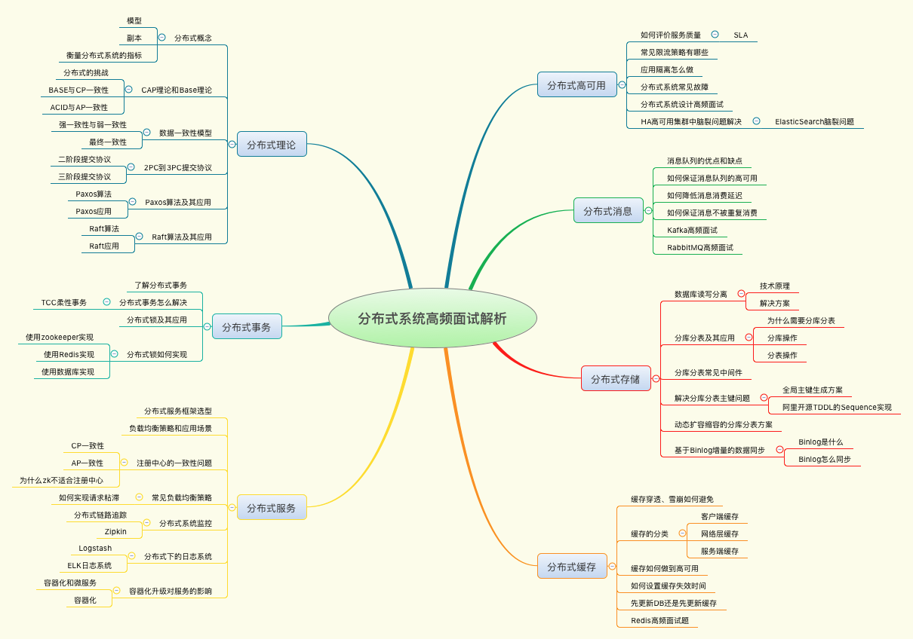
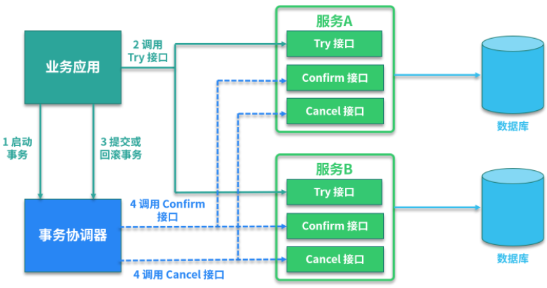
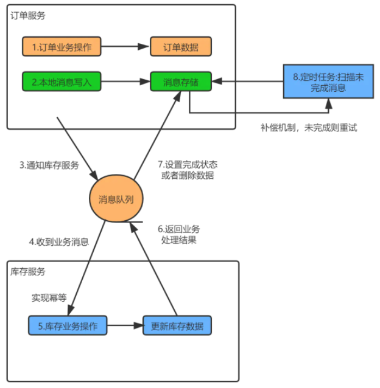

## 开篇

这篇文章主要是学习《分布式技术原理与实战45讲》相关课程之后的学习笔记，并且是以抽记卡的形式进行展示的。

## 01 如何证明分布式系统的 CAP 理论？

- 分布式系统所具有的特点
    - 基于消息传递
    - 单点故障
    - 无状态
- 拜占庭将军问题
    - 拜占庭帝国有许多支军队，不同军队的将军之间必须制订一个统一的行动计划，从而做出进攻或者撤退的决定，同时，各个将军在地理上都是被分隔开来的，只能依靠军队的通讯员来进行通讯。然而，在所有的通讯员中可能会存在叛徒，这些叛徒可以任意篡改消息，从而达到欺骗将军的目的。
    - 理论上，分布式系统中，试图在异步系统和不可靠通道上达到一致性状态是不可能的，但在实际研究中，我们往往假设信道是可靠的，在实际开发中，由于大多数系统部署在同一个局域网，消息被篡改非常罕见，消息不完整也可以通过简单的校验算法进行避免。因此实际工程实践中，可以假设不存在拜占庭将军问题。
- CAP所代表的含义、证明方法
    - 理论内容
        - C： 一致性
        - A： 可用性、SLA
        - P： 分区容忍性
        - 三者不能同时满足，P是客观事实，只能最后CP或AP
    - 证明方法
    - ZK支持CP、Eureka支持AP

## 02 不同数据一致性模型有哪些应用？

- 数据不一致性产生的原因？
    - 网络延迟
    - 系统故障
    - 副本复制延迟时间
- BASE理论
    - 基本可用
    - 软状态
    - 最终一致性
- 最终一致性的前置条件
    - 全局时钟
- 基于BASE理论发展出来的不同的数据一致性模型
    - 强一致性
    - 弱一致性
    - 最终一致性
        - 因果一致性
        - 会话一致性
- CAP及BASE的关系
    - CAP是基础
    - BASE是CP的实践理论

## 03 如何透彻理解 Paxos 算法？

- WARO 机制 （Write All Read One）
    - 更新数据时，需要对集群内所有节点进行更新，所有节点更新完后，读数据时只需要读取其中一个节点就能保证读到最新数据；
    - 但是这种机制只是保证了读操作的可用性，更新操作的可用性较低，因为只要有一个副本没有更新成功，此次更新操作就失败了；
- Quorum 机制
    - 是 WARO 机制在寻求 更新操作 和 读操作 可用性的一种平衡；
    - 一个集群中具有N个数据副本，如果写操作时，至少要写w个副本，那么读操作时，至少要读取N-W+1个副本，才保证能读到最新的数据；
- WARO 与 Quorum 区别
    - CAP中P是客观存在的，那就需要对C和A进行取舍，多发生在更新所有副本数据的业务场景下；
    - WARO 保证了系统具有强一致性（所有的副本数据相同），但是牺牲了可用性（只有所有副本写成功后才算成功，否则就是失败）；
    - Quorum 保证了系统具有一致性（但不需要所有的副本数据相同），又兼顾了可用性（只写n个副本，读m-n+1个副本就可以读出更新后的新数据）；
- Paxos 解决了什么问题？
    - 解决了分布式系统中数据一致性问题；
- Paxos 三种角色的各自作用
    - Proposer 提案者： 负责提出议案；
    - Acceptor 批准者： 负责批准或否决议案；
    - Learner 学习者： 负责对外提供读写能力；
- Paxos 算法过程
    - 准备阶段
        - Proposer 带着 生成的全局唯一的提案ID（ ProposalID ） 发送给所有的 Acceptor ；
        - Acceptor 收到请求后，判断 ProposalID 是否与之前响应过的所有提案的ID还要大：
            - 是：
                - 持久化 ProposalID ，并记录为 最大ID（ Max_N ）；
                - 回复请求，并带上 ProposalID 对应的 value ；
                - 承诺不会接受 ID值 比 ProposalID 还要小的提案，
            - 否：
                - 不回复或回复error
    - 选举阶段
        - Proposer 判断 Acceptor 的回复情况：
            - if （（ 回复数量 > 一半的 Acceptor 数量 ） && （ 所有回复的 value 都为空【这种情况，表明还没有被Accept的提案】 ））： Proposer 带着自己指定的 value 发给 Acceptor ；
            - if （（ 回复数量 > 一半的 Acceptor 数量 ） && （ 有的value不为空 ）） ： Proposer 带上上一步回复的 value 发给 Acceptor； 
            - if （ 回复数量 < 一半的 Acceptor 数量 ） ： 尝试生成更大的 ProposalID ；
        - Acceptor 判断收到的 ProposalID 与本地存储的 Max_N 的大小关系：
            - if（ ProposalID >= Max_N） ： 回复提交成功，并持久化 value；
            - else ： 不回复或回复失败；
        - Proposer 统计提交回复结果 ： 
            - if （ 回复数量 > 一半的 Acceptor 数量 ） ： 表示提交 value 成功，此时回发送广播给所有的 Proposer 、 learner ，通知它们已提交的 value；
            - if （（ 回复数量 <= 一半的 Acceptor 数量 ） || （ 收到一条失败回复 ）） ：  尝试生成更大的 ProposalID ，并转到【准备阶段】；

- Paxos 面试题
    - 半数以内Acceptor失效怎么办？
    - Acceptor需要接受更大的ProposalID的意义是什么？
    - 如何产生唯一的ProposalID？

## 04 ZooKeeper 如何保证数据一致性？

- ZK基本内容
    - 是个啥？【`把复杂且容易出错的分布式一致性服务封装起来，构建一个高效可靠的原语集，并对外提供一系列简单易用的接口的系统，简而言之就是能帮助复杂且容易出错的分布式系统完成分布式一致性的服务，本质上是一个存储型服务`】
    - 有啥特点？【顺序一致性、原子性、单一系统映像、可用性】
    - 能干啥？【应用场景有：发布与订阅、负载均衡、命名服务、分布式协调与通知、集群管理、Master选举、分布式锁、分布式队列等，ZooKeeper 底层其实只提供了两个功能：① 管理（存储、读取）用户程序提交的数据；② 为用户程序提供数据节点监听服务】
    - 相关概念
        - 数据模型： 层次化的多叉树
        - znode（数据节点）的四种分类、数据结构与操作集合
        - 事件监听器：在某个znode上注册事件监听器，并注册到server上，事件到达server后，由server通知znode，znode找到对应的事件并执行回调方法；
    - 集群模式
        - 集群中的角色与各自任务
            - Leader由超过半数的Follower选举产生；可以读写；
            - Follower负责转发写操作、参与选举并完成投票，对外提供读服务；
            - Observer负责转发写操作，对外提供读服务；
        - Leader的产生过程
            - 选举阶段： 由所有节点进行选举，如果超过半数节点同意，这该节点升级为准leader节点；
            - 发现阶段： follower与准leader节点通信，同步follower最近所接受的事务提议；
            - 同步阶段： 准leader节点完成上一阶段同步过来的所有的事务提议后，把数据同步给集群中剩余节点；
            - 广播阶段： 准leader节点变成leader节点，然后对外进行消息广播，才开始对外提供服务；
    - ZAB协议
        - 消息广播可以通过 Quorum 机制解决 Follower 节点异常的情况，但是 Leader 节点异常的情况如何解决？
            - 使用 ZAB 协议的 崩溃恢复 模式进行恢复：
                - 通过事务id的高32位作为 epoch ，低32位作为 zxid ；
                - 先选 epoch 最大的节点，再选 zxid 最大的节点，最后选 server ID 最大的；
        - 选取 Leader 后，之前停工的服务内容怎么办？
            - 使用 ZAB 协议的 数据同步 模式进行恢复：
                - 由Leader节点进行同步；
- ZAB 与 Paxos 联系
    - 都有Leader进行的角色；
    - 都应用了 Quorum 机制
    - Paxos 是理论，Zab 是实践，ZK 是应用了 ZAB 算法的落地软件；

## 05 共识问题：区块链如何确认记账权？

- 拜占庭将军问题与区块链共识

## 06 如何准备一线互联网公司面试？

## 07 分布式事务有哪些解决方案？

- 数据库事务
    - 事务的特性
        - 隔离性： 一个事务的操作，对另一个事务不可见
        - 持久性： 一个事务提交之后，对数据库的修改状态会持久化到磁盘上
        - 原子性： 一个事务要么成功要么失败，没有中间状态
        - 一致性： 事务更新前后，数据库的数据是保持一致的，如转账业务中，总金额不变
    - 并发事务带来的问题
        - 出现问题的本质： 多个事务并发执行
        - 问题分类：
            - 脏读： 事务a读到事务b未提交的数据
            - 丢失更新： 事务a和事务b都读到同一个数据，然后事务a修改了数据，事务b也修改了数据，结果是事务a中的数据与期望值不一样，导致更新的结果丢失
            - 不可重复读： 事务a先读到一个数据，然后事务b对该数据进行修改，之后事务a再次读取该数据，发现前后两次读取结果不一致
            - 幻影读： 事务a读取一个范围的数据数目后，事务b在该范围内添加了一条数据，事务a再次读取该范围的数据数目时发现多了一条数据
        - 关系：脏读>丢失更新>不可重复读>幻影读。
            - 如果数据库发生脏读，那么一定会发生丢失更新、不可重复读、幻影读的问题；如果数据库发生丢失更新，那么一定会发生不可重复读、幻影读的问题，但不会发生脏读的问题；如果数据库发生不可重复读，那么一定会发生幻影读的问题，但是不会发生脏读和丢失更新的问题；脏读的影响范围最大，幻影读的影响范围最小；
    - 解决并发事务带来的问题所提出的规范
        - 隔离级别
            - 是针对“并发事务带来的问题”与“并发度”而制定的一种衡量标准。由于并发事务带来的问题的影响范围不同，因此隔离级别也就不同，隔离级别越高，并发度就越低，所解决的并发事务的范围就越大；
            - 要注意的是，隔离级别只是一种指导具体的数据库实现过程的理论，是人们为了解决并发事务带来的问题而提出的一种标准；
        - 隔离级别分类
            - 读未提交： a事务可以读到b事务没有提交的数据，会出现脏读、不可重复读、幻影读的问题，并发度很高，很少有应用场景；
            - 读已提交： a事务可以读到b事务已经提交后的数据，解决了脏读的问题，但是会出现不可重复读、幻影读的问题，并发度较上一隔离级别有所下降；
            - 可重复读： a事务能够重复读取某个数据，解决了不可重复读的问题，但是会出现幻影读，并发度再次下降，是mysql的默认隔离级别；
            - 串行化： 所有的事务全部串行化执行，并发度最低，但不会出现并发事务带来的问题；
- 分布式事务
    - 产生的原因
        - 服务层隔离
        - 存储层隔离
    - 分布式事务的解决方案
        - 务虚理论基础：
            - XA规范： 起先X/Open组织提出了一种XA规范，就是一套务虚的理论。在这个理论中定义了几个角色，一个是AP，就是我们的应用；一个是TM，就是事务管理器；一个是RM，就是资源管理器；一个是CRM，就是通信资源管理器，可以理解为消息中间件，但是可以没有。`说白了就是TM定义了一套跟RM进行通信和交互的接口规范，然后通过接口来通知RM，来一块做一下提交或回滚`。
        - 具体实现方案
            - 两阶段提交： 
                - 过程： 
                    - 准备阶段： TM告诉所有的RM准备提交事务了，让所有的RM进行准备；如果遇到某一个RM返回异常的数据，TM就会立刻停止事务的提交；
                    - 提交阶段： TM告诉所有的RM开始提交事务了，让所有的RM提交事务；如果遇到某一个RM返回异常的数据，TM也会立刻停止事务的提交；
                - 问题：
                    - 并发度降低：准备阶段RM收到消息后会对资源进行锁定，造成资源的并发度降低；
                    - 单点故障： 如果TM是一个单点，那么如果碰到TM发生故障，就会导致整个系统的分布式事务不可用；
                    - 状态可能丢失： 如果TM是主从，在TM重新选择主节点时，就会发生状态丢失的问题，因为重新选择的从节点并不知道之前的主节点中保存的各RM的状态；
                    - 脑裂问题：主从TM进行切换时，有些RM收到了提交消息，有些RM则没有收到，会导致分布式事务执行状态不一致问题；
            - SAGAS方案
                - 基于两阶段提交方案的提交阶段的长事务，提出SAGAS方案方案，即把长事务拆分成短事务；这样并发度就有所提升，但是会出现有些RM的事务执行成功，有些RM的事务执行失败的问题；
            - 三阶段提交
                - 过程：
                    - 一阶段：TM给RM发送cancommit消息，根据响应消息判断各RM是否正常；
                    - 二阶段：TM给RM发送precommit消息，告知各RM准备相关的sql及请求链接等；该阶段中各RM依然可以完成其他事务的提交；
                    - 三阶段：TM给RM发送docommit消息，通知各RM进行提交；如果TM在这个阶段发生异常，RM没有收到docommit消息也会自动提交；
                - 分析：
                    - TM引入了超时机制
                    - 这种方式解决了两阶段提交方案中TM异常时无法提交事务的问题，也解决了并发度降低的问题；
                    - 这种方案依然会发生脑裂问题，比如当主从切换时，RM没有收到docommit消息依然进行了提交，但是TM完成主从切换后，是要发送docancel消息的，这就导致事务出现异常；
            - TCC
                - 过程： 就是try-confirm-cancel事务机制，也称为柔性事务方案
                    - try阶段： 对转账金额进行锁定；
                    - confirm阶段： 先往本地数据库中插入要锁定的金额的记录，然后调用b银行的扣减金额的接口，再调用c银行的增加金额的接口；
                    - cancel阶段： 先把c的金额给减掉，然后把b的金额再加回去；
                    - 总结： 通俗一点讲就是try阶段准备各服务所需要的资源或对某些资源进行锁定，confirm就是进行各服务的提交，cancel阶段就是进行补偿，把原来成功的事务进行回滚。TCC 的本质是把数据库的二阶段提交上升到微服务来实现，从而避免数据库二阶段中长事务引起的低性能风险。可以让应用自己定义数据库操作的粒度，可以降低锁冲突，提高系统的业务吞吐量。不足是对业务的侵入性较强。
                    - 
                - 分析：
                    - 本质上是把两阶段提交的理论上升到微服务来实现；可以让应用自己定义数据库操作的力度，这样有利于降低锁冲突，提高系统的业务吞吐量；
                    - 这种方案是针对要求强一致性的业务场景，这种方案要求写额外的补偿事务的代码，不利于系统的维护；
                    - 对微服务的侵入性高，业务逻辑的每一个分支都需要实现try、Confirm、Cancel 三个操作，并且Confirm、Cancel 必须保证幂。
                    - 问题： Try 阶段失败可以 Cancel，如果 Confirm 和 Cancel 阶段失败了怎么办？
                        - 回答： TCC 中会添加事务日志，如果 Confirm 或者 Cancel 阶段出错，则会进行重试，所以这两个阶段需要支持幂等；如果重试失败，则需要人工介入进行恢复和处理等。
            - 本地消息表
                - 过程： 
                    - 
                - 分析：
                    - 实现逻辑简单，开发成本低；
                    - 高度耦合业务，通用性差；高并发场景下可用性较差；
            - 最大努力通知方案
                - 过程：
                    - 这种方案是基于本地消息表方案的一种延伸，把写本地消息表的过程也通过mq或内存队列的方式进行削峰，它中间多了一个尽最大努力通知的服务。基本过程是：a服务执行完业务操作后，往mq中发送一条消息，尽最大努力通知服务接收到这条消息后，往本地消息表中添加一条数据，然后调用b服务接口以求完成业务操作，b完成业务操作之后调用尽最大努力通知服务的接口修改本地消息记录的状态。此外，尽最大努力通知服务也会有一个定时任务，会定时查询本地消息表中的消息状态，如果查到未结束的消息，就接着调用b服务接口以完成业务操作，重复n次后就结束。
                - 分析：
                    - 避免了本地消息表高并发场景下流量高峰的情况
            - 可靠消息最终一致性方案

## 08 对比两阶段提交，三阶段协议有哪些改进？

- 两阶段提交是一种比较精简的一致性算法/协议，很多关系型数据库都是采用两阶段提交协议来完成分布式事务处理的，典型的比如 MySQL 的 XA 规范。
- 改进
    - 引入超时机制
    - 引入预准备阶段

## 09 MySQL 数据库如何实现 XA 规范？

- 问题描述
    - 我们知道MySQL是通过记录文件的方式来存储数据的，记录的文件有binlog、redolog、undolog，这就涉及到文件与文件之间不一致的情况。因此我们需要了解MySQL中是如何实现XA规范的。在这里我们主要聊一下MySQL内部的XA规范。
- 解决
    - MySQL中server层产生binlog，InnoDB存储引擎层产生redolog。
    - 
    - Prepare阶段和commit阶段就可以看作是两阶段提交的实现

## 10 如何在业务中体现 TCC 事务模型？

- TCC 对比 2PC 两阶段提交
    - 最主要的区别是 2PC 两阶段是针对数据库应用来做的，但是TCC是针对业务应用做的；
    - 2PC会进行资源的锁定，数据库的性能会因此有所下降，TCC 是在业务服务中实现的，锁定的资源的粒度会更小；

## 11 分布式锁有哪些应用场景和实现？

- 分布式锁出现的背景
    - 分布式系统中，由于有很多个节点，就会出现不同的节点访问同一个资源的情况，这就会导致访问或更新同一个资源时，不同节点会进行争抢，为了解决这个问题引入了分布式锁的概念
    - 实现方式
        - 数据库
            - 过程
                - 创建一个表，表中包括id、方法名等信息；
                - 分布式事务开始时，服务A先使用自己的方法名去数据库中查询是否已经存在，如果存在说明已经有其他服务获取锁了，否则，就插入一条数据，开始执行业务动作，执行完成后删除这条数据，删除数据相当于释放锁；
            - 分析
                - 单点故障
                - 不可重入： 已经获得锁的不能再次获得锁，因为记录已经存在
                - 无法实现阻塞： 没有获取锁的服务，会一直重试插入操作，造成数据库资源的浪费；
        - 缓存
        - zk实现

## 12 如何使用 Redis 快速实现分布式锁？

- 分布式锁的特性
    - 互斥性： 同一时刻只允许一个线程获取成功
    - 高性能： 能够支持高并发场景
    - 可重入： 同一个线程取得锁之后可以再次获取锁
    - 自动超时释放： 线程由于某些原因没有释放锁时，会自动释放锁
    - 支持阻塞/非阻塞： 支持未获取锁的线程处于阻塞状态或非阻塞状态
- setnx命令分析与优化
    - setnx(k, v) == 1： 表示成功，但是不支持超时释放
    - (setnx(k, v) == 1 && expire(k))： 表示成功，但是这两个命令不是原子命令
    - set(k, v, e, nx) == 1： 成功，【多使用此方式】
        - 超时时间要设置得比较合理，要略大于业务执行的时间
        - 释放锁时，需要把比对key和value同时相等时再del
        - 如果出现问题可以通过 完备的日志 + 人工补偿 的方式进行解决
- redis实现分布式锁
    - 单节点方式： 
        - 加锁： set(k, v, e, nx) == 1 即成功；k要保持唯一
        - 放锁： 使用lua进行比对后删除（防止误删和保证删除操作的原子性）
        - 故障： 日志 + 人工补偿
    - 集群方式：
        - 背景： 是为了解决不可重入的问题？
        - 问题： 集群间不同节点需要进行数据的复制，在未完成节点间数据的复制前，其他线程还是可以加锁成功的；
        - 解决： redisson + redis集群方式
        - redlock算法
            - 当且仅当半数以上节点加锁成功 && 每一个节点加锁使用的时间都小于锁失效的时间 ： 加锁成功
            - 否则： 依次删除所有节点上的锁
            - 放锁： 依次删除所有节点上的锁
        - redisson源码分析

## 14 如何理解 RPC 远程服务调用？

- RPC 与 HttpClient 的区别
- RPC 的框架代表及其各自区别
- 设计一个RPC框架需要考虑的要点
    - 通信协议及通信框架
    - 服务注册与发现
    - 序列化协议

## 15 为什么微服务需要 API 网关？

- 一般来说，微服务的调用规范主要有 RPC 和 Restful API 两种，API 网关主要针对的是后面一种，也就是以 Spring Cloud 为代表的微服务解决方案。
- 不使用网关所带来的问题
    - 服务之间调用关系混乱
    - 无法追踪定位调用问题
- API网关具备的功能
    - 

