## 虚拟机安装

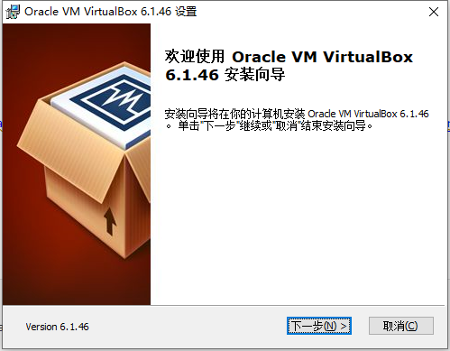

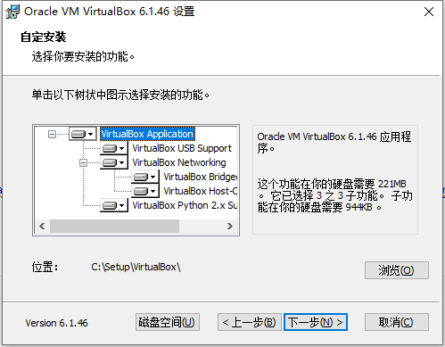

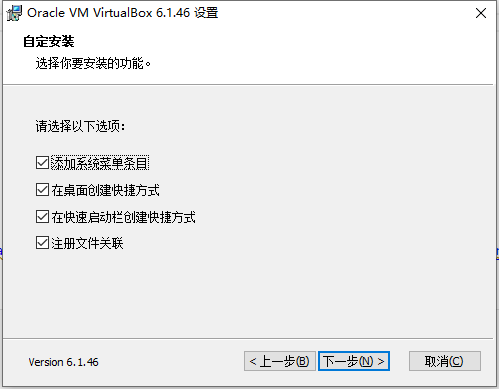

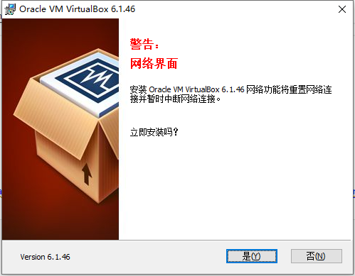

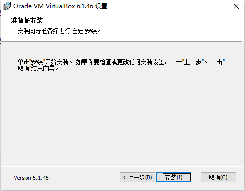

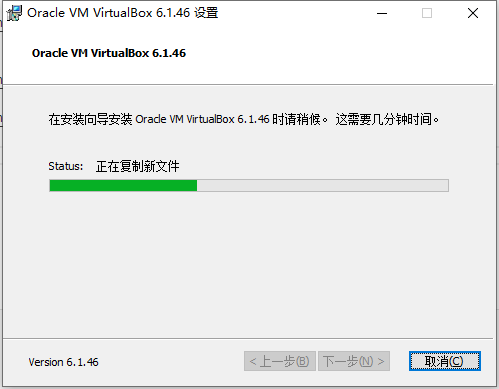

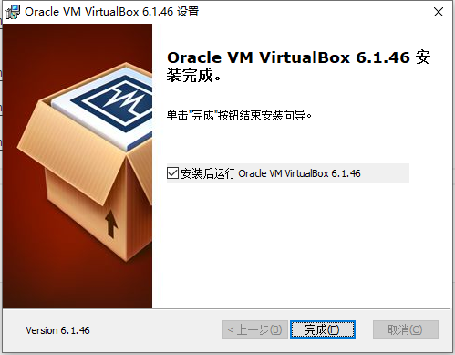

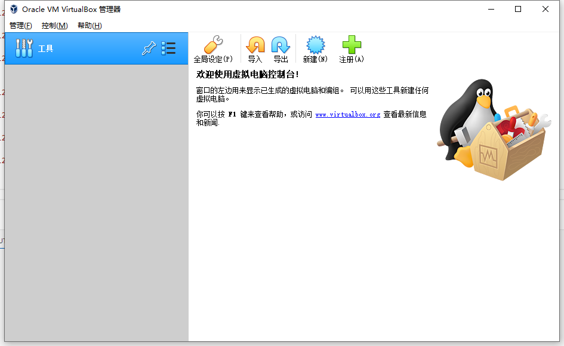

## vagrant 安装

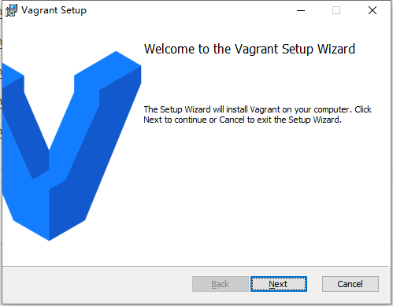


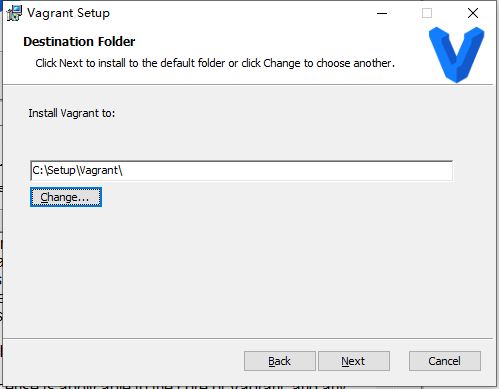

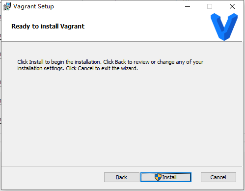

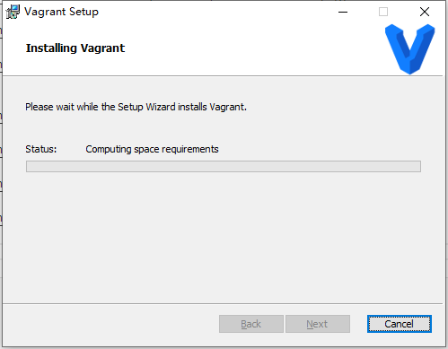


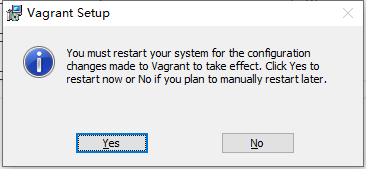

https://app.vagrantup.com/boxes/search

## 安装Linux服务器

### 初始化

vagrant init centos/7

### 修改 vgfile 

config.vm.network "private_network", ip: "192.168.56.10"

### 启动

vagrant up

```
PS D:\VM\vgfiles> vagrant up
No usable default provider could be found for your system.

Vagrant relies on interactions with 3rd party systems, known as
"providers", to provide Vagrant with resources to run development
environments. Examples are VirtualBox, VMware, Hyper-V.

The easiest solution to this message is to install VirtualBox, which
is available for free on all major platforms.

If you believe you already have a provider available, make sure it
is properly installed and configured. You can see more details about
why a particular provider isn't working by forcing usage with
`vagrant up --provider=PROVIDER`, which should give you a more specific
error message for that particular provider.
```

出现上述问题需要排查：

1. virtualBox的版本问题，尽量与视频中的版本信息一致；
2. 排查window的虚拟化设置是否开启，BIOS中的虚拟化需要开启，hyper-v功能也开启；

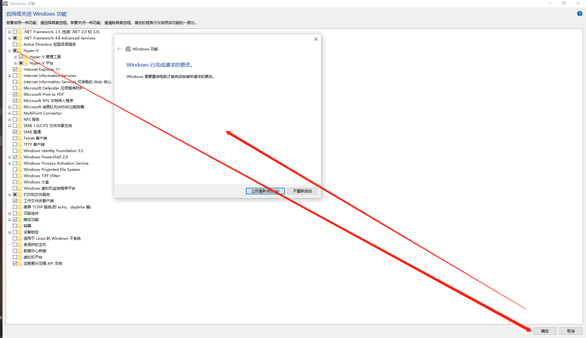


### 登录虚拟服务器

vagrant ssh

### Linux安装docker

```
// 安装yum源的工具包
yum install -y yum-utils

// 配置docker的安装源
yum-config-manager \
--add-repo \
https://download.docker.com/linux/centos/docker-ce.repo

// 安装docker
yum install docker-ce docker-ce-cli containerd.io docker-compose-plugin

// 设置开机自启
systemctl enable docker


sudo mkdir -p /etc/docker
sudo tee /etc/docker/daemon.json <<-'EOF'
{
"registry-mirrors": ["https://hpifphoh.mirror.aliyuncs.com"]
}
EOF
sudo systemctl daemon-reload
sudo systemctl restart docker
```

### 安装MySQL

```
sudo docker pull mysql:5.7

docker run -p 3306:3306 --name mysql \
-v /mydata/mysql/log:/var/log/mysql \
-v /mydata/mysql/data:/var/lib/mysql \
-v /mydata/mysql/conf:/etc/mysql \
-e MYSQL_ROOT_PASSWORD=root \
-d mysql:5.7

[root@localhost vagrant]# cd /mydata/mysql/conf/
[root@localhost conf]# ls
[root@localhost conf]# vi my.cnf


[client]
default-character-set=utf8
[mysql]
default-character-set=utf8
[mysqld]
init_connect='SET collation_connection = utf8_unicode_ci'
init_connect='SET NAMES utf8'
character-set-server=utf8
collation-server=utf8_unicode_ci
skip-character-set-client-handshake
skip-name-resolve


docker update mysql --restart=always

docker restart mysql
```

### 安装redis

```
mkdir -p /mydata/redis/conf
touch /mydata/redis/conf/redis.conf
appendonly yes

docker run -p 6379:6379 --name redis \
-v /mydata/redis/data:/data \
-v /mydata/redis/conf/redis.conf:/etc/redis/redis.conf \
-d redis redis-server /etc/redis/redis.conf

docker update redis --restart=always
```


## 设置开发环境

### maven

```
<mirror>
  <id>nexus-aliyun</id>
  <mirrorOf>central</mirrorOf>
  <name>Nexus Aliyun</name>
  <url>http://maven.aliyun.com/nexus/content/groups/public</url>
</mirror>


<profile>
  <id>jdk-1.8</id>
  <activation>
      <activeByDefault>true</activeByDefault>
      <jdk>1.8</jdk>
  </activation>
  <properties>
      <maven.compiler.source>1.8</maven.compiler.source>
      <maven.compiler.target>1.8</maven.compiler.target>
      <maven.compiler.compilerVersion>1.8</maven.compiler.compilerVersion>
  </properties>
</profile>
```

### idea

1. 修改maven的安装路径及config文件所在位置；
2. 安装lombok插件和mybatisx插件；

### 配置git

找到ssh公钥，然后把公钥里面的内容配置到gitee上面去。

```
PS C:\Users\zeanzai\.ssh> cat .\id_ed25519.pub

```

测试连通性：
```

C:\Users\zeanzai\.ssh> ssh -T git@gitee.com
The authenticity of host 'gitee.com (180.76.198.77)' can't be established.
ECDSA key fingerprint is SHA256:FQGC9Kn/eye1W8icdBgrQp+KkGYoFgbVr17bmjey0Wc.
Are you sure you want to continue connecting (yes/no/[fingerprint])? yes
Warning: Permanently added 'gitee.com,180.76.198.77' (ECDSA) to the list of known hosts.
Hi zeanzai(@zeanzai)! You've successfully authenticated, but GITEE.COM does not provide shell access.
```

gitee上创建仓库：

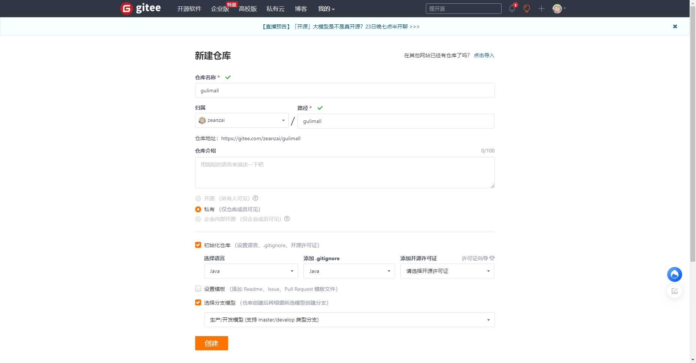

克隆到本地

```
PS D:\Source\Gitee> git clone https://gitee.com/zeanzai/gulimall.git
Cloning into 'gulimall'...
remote: Enumerating objects: 3, done.
remote: Counting objects: 100% (3/3), done.
remote: Compressing objects: 100% (2/2), done.
remote: Total 3 (delta 0), reused 0 (delta 0), pack-reused 0
Receiving objects: 100% (3/3), done.
```

使用idea打开

创建项目；

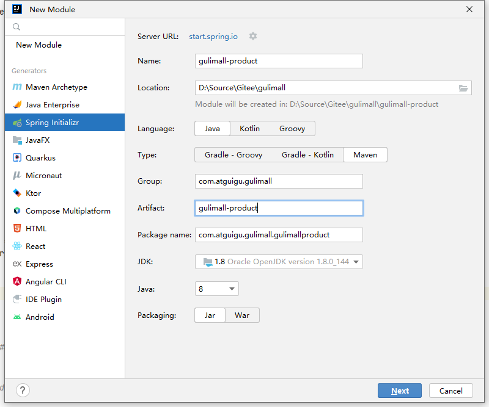

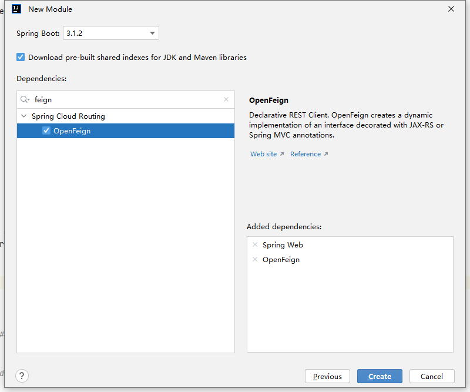


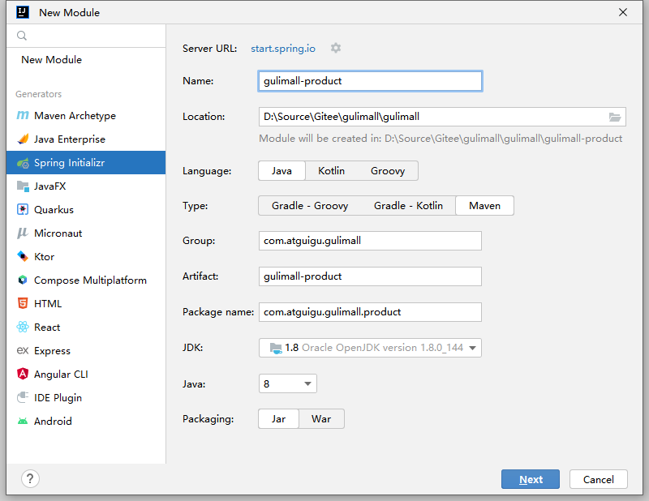
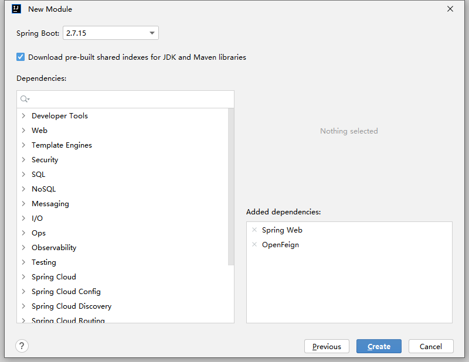


导入MySQL数据文件；


### vscode

1. 安装插件


## 逆向工程启动

1. 启动
2. 生成代码

## 启动renren-fast作为后台管理系统

## 添加nacos作为注册中心

## 使用openfeign

## 使用nacos作为配置中心

1. 传统方式使用配置项；
2. 使用nacos作为配置中心；
3. 使用原则： 服务名作为命名空间，文件名作为dataid，环境名作为groupid；


## 问题集锦

1. test无运行按钮。在使用idea2022版本创建module时，由于版本较新，后面采用的是先选择一个高版本的，之后通过修改pom文件的方式来修改springboot的版本，这就导致idea给我们生成的test不可用，这是因为idea给我们生成的test不完整，需要添加public等关键字。


---

<br /><br /><br />


