## 01 Redis 是如何执行的

- socket 基础知识
- IO多路复用
- redis执行过程


## 02 Redis 快速搭建与使用

- redis特性
  - 支持多种数据存储类型
  - 功能完善
  - 支持多种语言
  - 高性能
  - 社区活跃度高
- 安装过程
- 使用
  - `redis-server`	启动 Redis
  - `redis-cli`	Redis 命令行工具
  - `redis-benchmark`	基准测试工具
  - `redis-check-aof`	AOF 持久化文件检测工具和修复工具
  - `redis-check-dump`	RDB 持久化文件检测工具和修复工具
  - `redis-sentinel`	启动 redis-sentinel
- 启动
  - 使用 `redis-server` 直接启动redis的服务端
- 连接redis
  - 使用 `redis-cli` 进行连接
  - 使用可视化客户端进行连接

## 03 Redis 持久化——RDB

- redis的持久化方式
  - aof
  - rdb
  - 混合模式： 4.0以后加入的新特性，支持两种方式配合使用
- RDB特点
  - 二进制文件
  - 是某一个时刻内存的快照信息
- RDB文件生成的触发条件
  - 手动触发
    - 阻塞触发： 执行 `save` 命令，主进程停止对外服务，开始备份数据生成RDB文件
    - 非阻塞触发： 执行 `bgsave` 命令，主进程fork一个子线程，由子进程执行备份数据工作生成RDB文件【fork子进程过程也是阻塞的，但是子进程备份过程就不阻塞了】
  - 自动触发
    - 配置了 `save m n` 参数，表示当在m秒内，有n个key发生了改变，就会自动触 `bgsave` 命令发生成RDB文件
    - 执行了 flushall 命令，会把RDB文件清空
    - 需要主从复制时，主节点会执行 `bgsave` 命令自动生成一个RDB文件，发送给从节点
- RDB有关的配置参数
  - save 参数： 触发条件
  - rediscompression 参数： 是否开启RDB文件的压缩以节省磁盘空间
  - redischekcsum 参数： 是否校验RDB文件的合法性
- 配置参数的查询
  - 直接查看配置文件
  - 使用 `config get #{key}` 命令查询
- 修改配置文件方式
  - 直接修改config文件，但是需要重启才可以生效，永远生效
  - 使用 `config set #{key}` 命令进行修改，不需要重启即可生效，但是下次启动后失效
- RDB文件恢复
  - 启动时会自动加载rdb文件到内存中，在加载完毕之前无法对外提供服务
- 禁用RDB持久化
  - 使用 `config set save ""` 命令进行修改
- 优缺点
  - 优点
    - RDB文件很小，属于二进制紧凑型的，很适合做备份文件，也可以利用RDB进行快速的恢复和主从复制
    - RDB文件执行 `bgsave` 时，并不会过多影响redis的性能
  - 缺点
    - RDB文件只保存某一个时间间隔的数据，有可能丢失保存之前的数据
    - 如果数据集很大，fork子进程时会造成很大时间的阻塞，对redis有性能影响
    - 只记录redis中已经存在的数据，无法记录redis客户端的操作过程

## 04 Redis 持久化——AOF

- AOF特点
  - 记录了每个键值对的操作命令
- 配置参数的查询
  - 直接查看配置文件
  - 使用 `config get #{key}` 命令查询
- 修改配置文件方式
  - 直接修改config文件，但是需要重启才可以生效，永远生效
  - 使用 `config set #{key}` 命令进行修改，不需要重启即可生效，但是下次启动后失效
- 重写机制
  - 概述： aof文件记录了某一个键值对的多个修改记录，重写过程就是把多个修改记录修改成能表示终态的一个修改记录
  - 过程： 先生成一个新的文件，把当前redis中所有的数据使用最少命令方式保存到新文件中，当所有数据保存完成后，redis会替换新旧aof文件，并把最新的持久化命令追加到aof文件中
  - 【例子】redis对某一个key执行了100次加1的操作，aof就会记录100次加1的命令，重写后aof记录了这个key的最终值
- 触发的条件
  - 自动触发
    - 配置了持久化策略
      - appendfsync always： 记录每条操作命令，最多丢失一条数据，但是损耗性能
      - appendfsync everysec： 每秒写入一次磁盘，最多丢失一秒数据，是默认方式
      - appendfsync no： 不设置持久化策略，让操作系统来决定何时触发，linux默认是30s
    - 配置了重写aof文件的两个参数
      - 两个命令同时满足时才会触发重写
        - auto-aof-rewrite-min-size：重写的最小文件容量，默认是64，表示64MB，即AOF文件超过64MB时就触发重写
        - auto-aof-rewrite-pencentage：重写的大小比例，默认是100，表示100%，即AOF文件大小超过了上次重写后文件的100%（即一倍），就会触发重写
  - 手动触发
    - 命令行执行 `bgrewriteaof` 命令
- 持久化文件加载机制
  - 只开启 AOF ，就只加载 AOF 文件
  - 只开启 RDB ， 就只加载 RDB 文件
  - 开启混合持久化方式， 只会加载 AOF 文件（即便是只有RDB没有AOF，也不会加载RDB），因为混合持久化机制中是把RDB文件写入AOF的首部，之后的数据以AOF的方式追加到AOF文件的尾部
- 异常文件处理
  - 问题： 
    - 如果服务器发生崩溃或者AOF存储已满时，AOF最后一条命令可能会被截断，造成aof文件异常；
    - 也有可能aof文件中间的几条命令被中断，发生异常；
  - 解决方案
    - 如果配置了 `aof-load-truncated yes` 参数，则会自动忽略最后一条命令后启动
    - 使用 `redis-check-aof` 命令，定位到出现问题的命令后手动修复aof文件
    - 使用 `redis-check-aof --fix` 命令，让redis自动修复aof文件
- 优缺点
  - 优点
    - aof文件更容易理解，即使不小心flushall了，只需要找到aof删除最后一条命令再进行恢复即可；
    - aof默认的持久化策略最多丢失一秒的数据，保存的数据更加完整；
  - 缺点
    - 如果aof文件过大，会影响redis的启动速度
    - 相同数据，aof文件比RDB文件要大
    - 在负载较高条件下，RDB性能要强于AOF
  
## 05 Redis 持久化——混合持久化

- Redis 4.0 以后支持的新特性
- 文件存储方式
  - 重写时，先把数据以RDB的方式写到AOF的开头，之后的数据再追加到AOF的末尾
- 手动触发重写
  - 执行 `bgrewriteaof` 命令
- 配置参数
  - aof-use-rdb-preamble
- 修改配置文件
  - 命令行修改
  - 配置文件修改
- 混合持久化方式的加载流程
  - 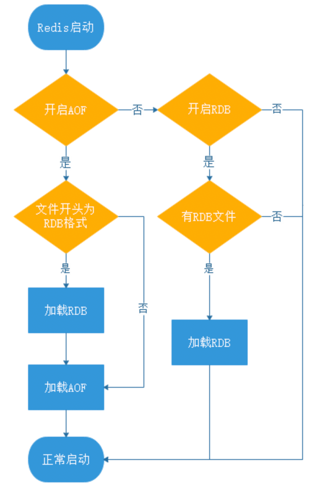
- 优缺点
  - 集合了aof和rdb二者的优点，可以使redis更快的启动，也减少了丢失大量数据的风险
  - AOF文件可读性变差，并且只能在4.0以后的版本中才可以同时开启

## 06 字符串使用与内部实现原理


```c
/*
* Redis 对象
*/
typedef struct redisObject {
  // 类型
  unsigned type:4;
  // 对齐位
  unsigned notused:2;
  // 编码方式
  unsigned encoding:4;
  // LRU 时间（相对于 server.lruclock）
  unsigned lru:22;
  // 引用计数
  int refcount;
  // 指向对象的值
  void *ptr;
} robj;
```

type记录了对象`所保存的值的类型`，其枚举值列表如下：
```c
/*
* 对象类型
*/
#define REDIS_STRING 0    // 字符串
#define REDIS_LIST 1      // 列表
#define REDIS_SET 2       // 集合
#define REDIS_ZSET 3      // 有序集
#define REDIS_HASH 4      // 哈希表
```

encoding记录了对象`所保存的值的编码`，其枚举值列表如下：
```c
/*
* 对象编码
*/
#define REDIS_ENCODING_RAW 0          // 编码为字符串
#define REDIS_ENCODING_INT 1          // 编码为整数
#define REDIS_ENCODING_HT 2           // 编码为哈希表
#define REDIS_ENCODING_ZIPMAP 3       // 编码为 zipmap
#define REDIS_ENCODING_LINKEDLIST 4   // 编码为双端链表
#define REDIS_ENCODING_ZIPLIST 5      // 编码为压缩列表
#define REDIS_ENCODING_INTSET 6       // 编码为整数集合
#define REDIS_ENCODING_SKIPLIST 7     // 编码为跳跃表
```

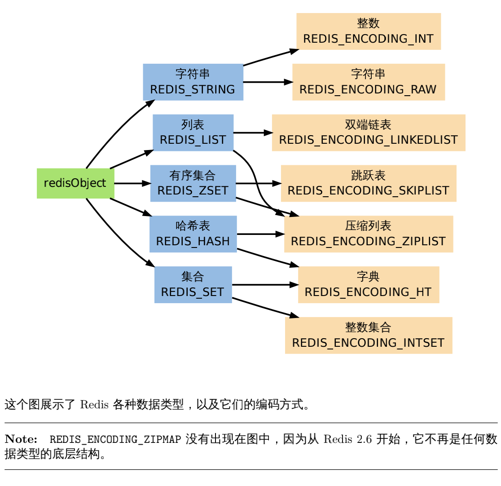


- 功能
  - 字符串存储
  - 数字运算
- 主要应用场景
  - 任何需要存储字符串的场景都可以
  - 特殊场景：页面存储、session集中式存储、数字运算等
- 使用方法
  - CLI命令
    - 单键操作
      - get
      - getrange
      - getset
      - set
      - setrange
      - setnx
      - append
      - strlen 
    - 多键操作
      - mset
      - msetnx
      - mget
    - 数字操作
      - incr
      - decr
      - incrby
      - decrby
      - incrbyfloat
      - decrbyfloat
  - 外部API操作
    - jedis
- 对象存储及内部实现
  - 3.2之前
  - 3.2之后
    - int： 存储的是整数且长度小于20字节
    - embstr： 存储的是字符串且长度小于等于44字节
    - raw： 存储的是动态字符串，且长度大于44字节且小于512Mb
  - 为什么是44字节？
      - 64字节 = redisObject + SDS
      - redisObject = 16字节
      - SDS = 4字节 + 44字节的buf[] 
      - 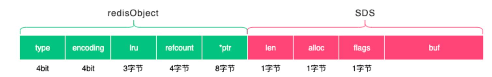
- SDS 内部结构
- SDS与c字符串的优点
  - O(1)的时间获取串的长度，SDS是通过访问length值获取长度，而c是通过遍历所有的字符后得到长度；
  - 防止内存溢出
  - 二进制安全，SDS末端使用0表示串的结束，中间部分可以有任意多的0，而c不可以；

> The command `SET resource-name anystring NX EX max-lock-time` is a simple way to implement a locking system with Redis.     —— 来自官方文档： https://redis.io/commands/set/


> 思考延伸： SDS扩容及回收机制

## 07 附录：更多字符串操作命令

与06进行合并


## 08 字典使用与内部实现原理

- 散列表（哈希表）基本信息
  - 散列表特征： 其思想主要是基于数组支持按照下标随机访问数据时间复杂度为O(1)的特性
  - 散列函数
    - 特征
      - 确定性： key1=key2，那么hash(key1)=hash(key2)
      - 不确定性： key1≠key2，有可能会存在hash(key1)=hash(key2)
    - 问题：
      - 引发哈希冲突
  - 散列表存储方式及哈希冲突解决思路
    - 开放寻址法
      - 线性探测
      - 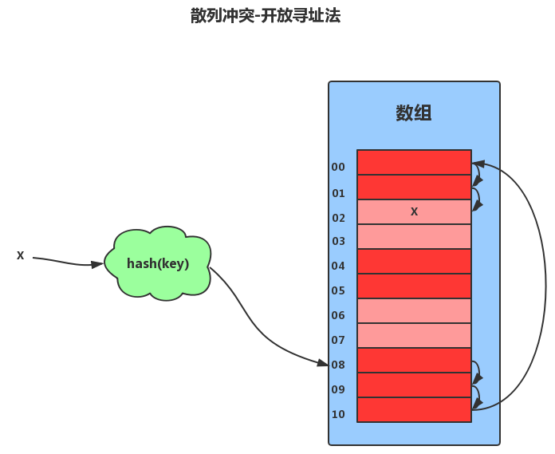
    - 链表法
      - 数组+链表方式实现
      - 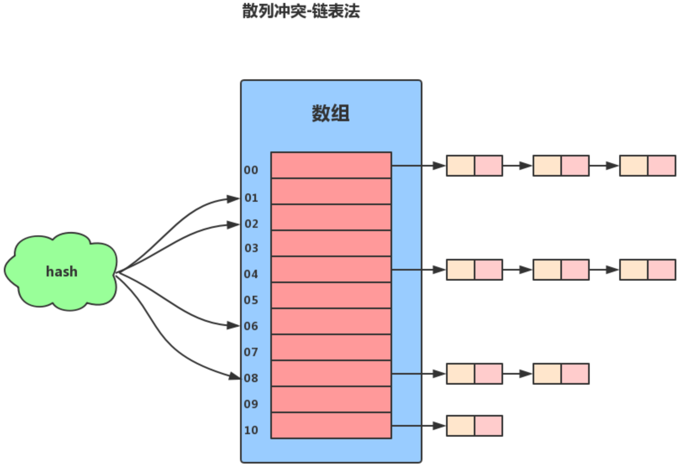
  - 装载因子： 已有的元素个数 / 所有的元素个数， eg：数组长度为10，其中只有2个元素，则装载因子为0.2
    - 装载因子过高容易引起哈希冲突，过低造成存储空间浪费；
    - 为了让装载因子处于一个合适的范围，需要对hashtable进行扩容和缩容；
- dict原理
  - 存储原理
    - ziplist压缩列表
      - 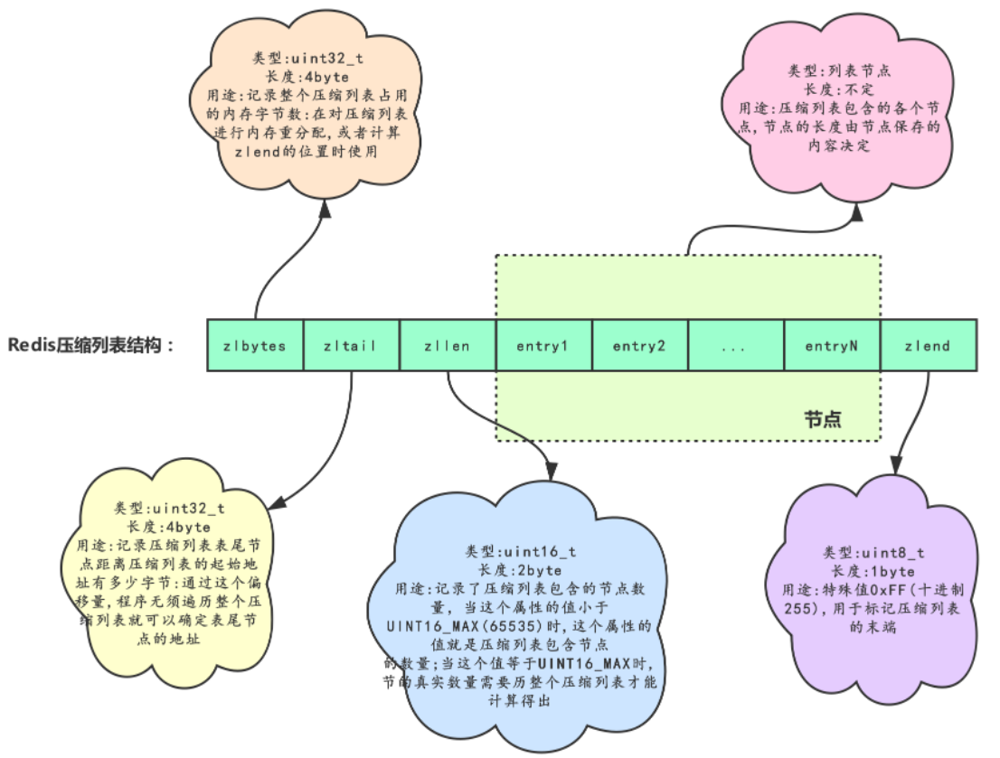
    - 编码转换条件
      - `键值对数量小于512` && `所有键值对的key和value的长度都小于64字节` 时使用ziplist；
      - 否则就使用hashtable
    - hashtable
      - 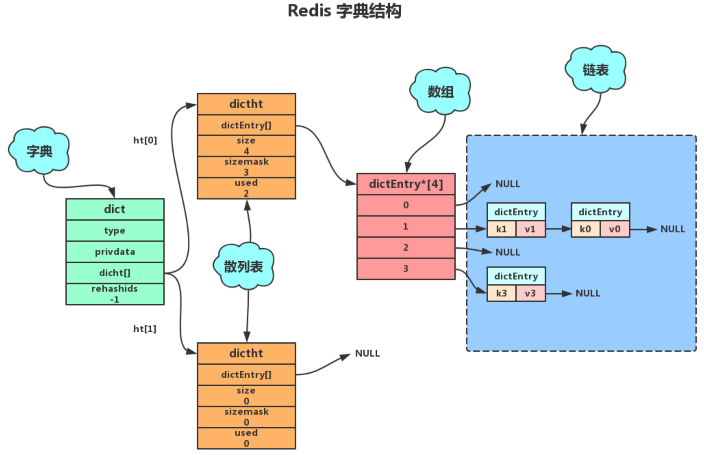
      - 集中式rehash缺点： 一次性的hash，中间不会停止，会影响redis的读写性能，因为要花费资源去进行hash，性能差
      - 渐进式rehash过程：每一次对字典的操作，都顺带rehash一个index，直到rehash完成，最后把ht[1]变成ht[0]，最后再申请一个ht[1]，并把rehashidx置为-1，为下次rehash做准备；
        - 为ht[1]分配空间，让字典同时拥有ht[0]和ht[1]；
        - 让rehashidx=0，表示rehash过程开始
        - 在rehash期间，redis除了对外提供字典的增删改查的数据操作外，还会顺带把ht[0]在rehashidx索引上的所有键值对rehash到ht[1]上，然后再把rehashidx加一；
          - 新增操作：直接将键值对插入到ht[1]上，保证ht[0]的结点不会增加；
          - 删除操作：同时在ht[0]和ht[1]两个哈希表上执行，避免漏删；
          - 修改操作：同时在ht[0]和ht[1]两个哈希表上执行，避免漏改；
          - 查找操作：先从ht[0]查，查不到的话再去ht[1]查；
        - 直到rehash完成后，最后把ht[1]变成ht[0]，最后再申请一个ht[1]，并把rehashidx置为-1，为下次rehash做准备；

      - 扩容
        - 条件： 没有执行BGSAVE或没有执行BGREWRITEAOF命令时负载因子大于等于1 || 执行BGSAVE或执行BGREWRITEAOF命令时负载因子大于等于5
        - 大小： 不小于 dict[0].used*2 的第一个2的n次幂，如 dict[0].used = 3，则扩容大小为不小于6的第一个2的n次幂，不小于6的第一个2的n次幂是8，因此扩容大小为8；如 dict[0].used = 4，则扩容大小为不小于8的第一个2的n次幂，不小于8的第一个2的n次幂是8，因此扩容大小依然是8；
      - 缩容
        - 条件：负载因子小于0.1
        - 大小：不小于 dict[0].used 的第一个2的n次幂，如 dict[0].used = 3，则缩容大小为不小于3的第一个2的n次幂，即4；如 dict[0].used = 4，则缩容大小为不小于4的第一个2的n次幂，即4；
  - 命令
    - hset
    - hsetnx
    - hmset
    - hget
    - hmget
    - hdel
    - hincrby
    - hkeys
    - hvals
    - hgetall
    - hincrbyfloat
    - hexists
    - hlen

::: note 思考题
1. redis中存储对象有几种方式？
    - 第一种：
      - set user:1:name zhangsan
      - set user:1:age 12
    - 第二种： value为序列化后的对象信息
      - set user:1 serialize(userInfo)
    - 第三种： 使用字典
      - hset user:1 name zhangsan age 12
2. 假如hashtable数组上的链表元素有很多，那么rehash过程中，这些链表元素是怎么rehash到ht[1]上的？
3. hashtable扩容时，为什么 BGSAVE 或 BGREWRITEAOF 命令执行时的负载因子要比没有执行这两个命令时的负载因子大？
:::


参考链接：
1. https://www.cnblogs.com/hunternet/p/12651530.html
2. https://www.cnblogs.com/hunternet/p/11306690.html
3. https://www.cnblogs.com/hunternet/p/9989771.html
4. https://juejin.cn/post/7064359936842530830#heading-1
5. 《redis设计与实现》

## 09 附录：更多字典操作命令

与 08 合并

## 10 列表使用与内部实现原理

- 特征
  - 有序集合
  - 元素可以重复
- 基础使用
  - lpush
  - lrange
  - rpush
  - lpop
  - rpop
  - lindex
  - linsert
  - lset
  - ltrim
  - llen
  - lrem
- 使用场景【未找到来源】
  - lpush+lpop=Stack（栈）
  - lpush+rpop=Queue（队列）
  - lpush+ltrim=Capped Collection（有限集合）
  - lpush+brpop=Message Queue（消息队列）
- 内部实现
  - quicklist （ Redis 3.2 引入的数据类型 ，而quicklist底层使用压缩列表和双向列表组成，具体见《Redis设计与实现》第8.3章。）
    - 由双向列表和ziplist构成的复合数据结构
    - 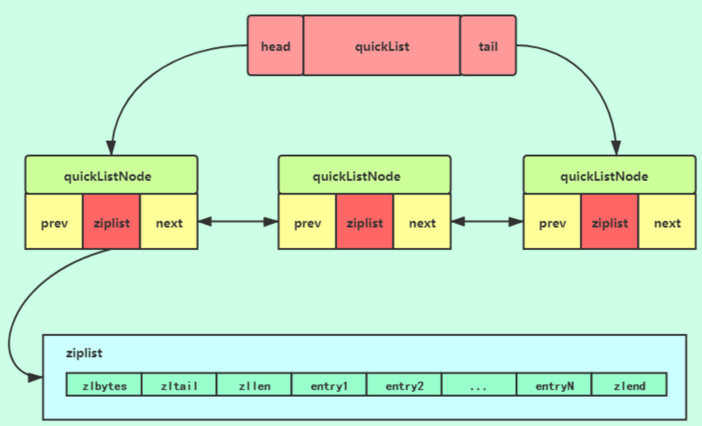
    - 新增
      - 判断 head 节点是否可以插入，可以插入，就在 ziplist 上插入，否则，就新建一个 quickListnode 节点进行插入
    - 删除
      - 单个元素： 遍历索引
      - 区间元素： 先找到start下标的元素所在的quicklistnode，然后删除ziplist上的数据，如果ziplist上能删除的元素个数小于要删除的元素个数，就会移动到下一个quicklistnode，然后进行删除


## 11 附录：更多列表操作命令

与10进行合并

## 12 集合使用与内部实现原理

- 特征
  - 多个相同元素只保存一份，即元素不可重复
  - 没有顺序
- 使用命令
  - sadd
  - smembers
  - scard
  - sismember
  - smove
  - srem
  - spop
  - srandmember
  - sinter
  - sinterstore
  - sunion
  - sunionstore
  - sdiff
  - sdiffstore
- 代码实战
  - 使用jedis来实现并集、差集、交集
- 使用场景
  - 任何用来去重的场景和保证数据唯一性的场景
  - 求交差并补集合
  - 我关注的、关注我的
- 内部实现
  - 当元素都是整型，且元素个数小于 set-max-intset-entries 时会使用intset存储；
  - 其他情况下会使用hashtable进行存储；


## 13 附录：更多集合操作命令

与12合并。

## 14 有序集合使用与内部实现原理

- 特征
  - 元素不能重复，但分数可以重复
- 常用命令
  - zadd
  - zrange
  - zrem
  - zscore
  - zrangebyscore
  - zrank
  - zcard
  - zcount
  - zincrby
  - zrevrank
  - zremrangebyrank
  - zremrangebyscore
  - zinterstore
  - zunionstore
- 内部实现原理
  - skiplist
  - 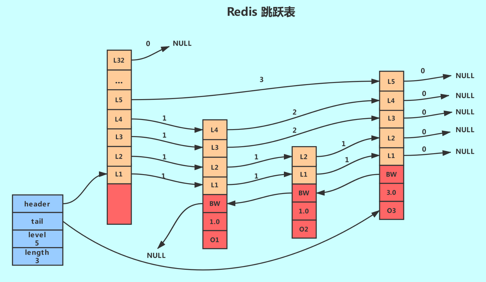
  - 跳跃表基于单链表加索引的方式实现
  - 跳跃表以空间换时间的方式提升了查找速度
  - Redis有序集合在节点元素较大或者元素数量较多时使用跳跃表实现
  - Redis的跳跃表实现由 zskiplist和 zskiplistnode两个结构组成,其中 zskiplist用于保存跳跃表信息(比如表头节点、表尾节点、长度),而zskiplistnode则用于表示跳跃表节点
  - Redis每个跳跃表节点的层高都是1至32之间的随机数
  - 在同一个跳跃表中,多个节点可以包含相同的分值,但每个节点的成员对象必须是唯一的跳跃表中的节点按照分值大小进行排序,当分值相同时,节点按照成员对象的大小进行排序。
- 跳跃表
  - 发展过程
  - 查找过程
  - 与红黑树的对比
- zset内部的数据结构
  - ziplist
  - 转化条件
    - 元素个数小于zset-max-ziplist-entries（默认 128个）
    - 所有元素成员的长度要小于zset-max-ziplist-value（默认 64字节）
  - skiplist
- 使用场景
  - 排行榜
  - 排序

参考链接：
1. [跳跃表](https://www.laoyu.site/2019/%E6%8A%80%E6%9C%AF%E5%AE%9E%E8%B7%B5/redis/Redi%E6%95%B0%E6%8D%AE%E7%BB%93%E6%9E%84%E2%80%94%E2%80%94%E8%B7%B3%E8%B7%83%E8%A1%A8/)
2. 《redis设计与实现》

## 15 附录：更多有序集合操作命令


与14合并。


## 16 Redis 事务深入解析

- 相关命令
  - multi
  - exec
  - discard
  - watch
  - unwatch
- 注意
  - 没有回滚命令


## 17 Redis 键值过期操作

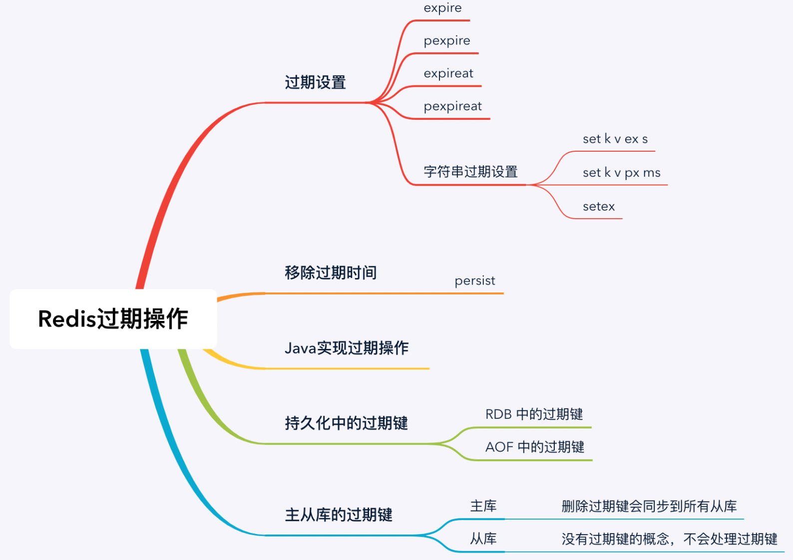

- 相关命令
  - expire
  - pexpire
  - expireat
  - pexpireat
  - persist
- 持久化过程中的过期键
  - AOF文件写入时： 没有过期的键也会写入AOF，在进行恢复时，如果键过期，就往AOF中追加一个DEL命令
  - AOF文件重写时： 会先检查键是否过期，如果过期就不往AOF文件中写，没有过期就写 
  - RDB文件生成时： 不会把过期的键保存到RDB中
  - RDB文件加载时：
    - 主服务器会在加载时对每一个键做过期时间检查，如果发现过期就不加载；
    - 从服务器会把RDB中所有的键都加载到内存中，由主服务器对键的过期时间进行检查并删除，之后再进行主从同步；

## 18 Redis 过期策略与源码分析

- 过期键执行流程
- [key的驱逐策略](https://redis.io/docs/manual/eviction/)
  - 当数据量大于 maxmemory 设置的值时开始执行驱逐策略
  - noeviction： 不驱逐
  - allkeys-lru： 从所有key中找到`最近最少使用key`进行过期操作，当缓存元素某一部分被频繁访问时，建议使用此策略；如果某个键很久没有被使用，但是最近被访问了一次，那它就不会被删除
  - allkeys-lfu： 从所有key中找到`最不经常用到的key`进行过期操作，解决了lru的问题
  - allkeys-random： 从所有的key中`随机选一个`进行过期操作，建议在所有的key被均匀的随机访问时采用此策略
  - volatile-lru： 从所有`设置了过期时间的key中挑选最近最少使用到的`key进行过期操作
  - volatile-lfu： 从所有`设置了过期时间的key中挑选最不经常用到的`key进行过期操作
  - volatile-random： 从所有设置了过期时间的key中`随机`选一个进行过期操作
  - volatile-ttl： 从所有设置了`过期时间的key中挑选一个存活时间`最短的key进行过期操作，建议在人为设置了过期时间时采用此种策略
- 过期原理
  - 定时过期： 在设置过期时间时，创建一个过期事件，到达时间时，执行过期时间主动删除key
    - 优点： 快速回收内存
    - 缺点： 高并发场景下，或者同时有很多key过期时，会造成短暂卡顿，吞吐量下降；
  - 惰性过期： 不主动删除key，在每次使用key时先检查过期时间，如果过期就删除，并返回null
    - 优点： 删除过程可控，只在被使用时删除
    - 缺点： 不能快速回收内存
  - 定期过期： 每隔一段时间，根据驱逐策略执行删除命令
    - 定期执行扫描任务，每次扫描时并不是遍历所有的键，而是随机抽取并判断是否过期的方式进行删除；
    - 先从过期字典中随机挑选20个键，然后从这20个键中挑选过期的键进行删除，如果过期的比例超过四分之一，就再次挑选20个键；
    - 为避免过度扫描，通过判断 timelimit 来确定扫描次数
  - `redis采用惰性过期和定期过期方式进行删除`
- 执行淘汰的机制
  - 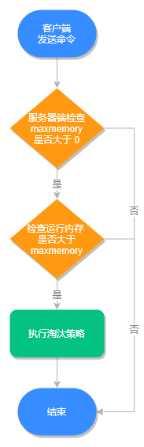
- lru的原理
  - 基于链表结构，链表中的元素按照操作顺序从前往后排列，最新操作的键会被移动到表头，当需要内存淘汰时，只需要删除链表尾部的元素即可
  - 手写算法


https://zhuanlan.zhihu.com/p/105587132
https://www.jianshu.com/p/60cc093d6c36

::: tip 参考

1. http://learn.lianglianglee.com/
2. https://mp.weixin.qq.com/s/Ck0a8Ivjb5qhrOYEAHw-wQ
3. 《redis设计与实现》

:::


## 19 Redis 管道技术——Pipeline

- 解决了什么问题
  - 在操作缓存时，有时候需要执行很多条命令，管道命令就可以让redis一次性执行很多条命令，并把命令的执行结果一并返回
  - 本质上是客户端的功能，不是redis的特性
- 使用Jedis的管道技术
  - 首先先获取 Pipeline 对象，再为 Pipeline 对象设置需要执行的命令，最后再使用 sync() 方法或 syncAndReturnAll() 方法来统一执行这些命令
  - 注意
    - 虽然没有命令数量的限制，但是命令缓冲区大小不能超过1G，超过后redis会断开与客户端的连接
    - 管道数量太多容易给客户端造成阻塞
    - 如果命令没有执行，可以查看客户端的命令缓冲区的大小是否超出限制；

## 20 查询附近的人——GEO

- 作用
  - 地理位置的存储
  - 3.2以后提供的新特性
- 命令
  - geoadd
  - geopos
  - geodist
  - georadius
  - geohash
  - zrem

## 21 游标迭代器（过滤器）——Scan

- 场景
  - 查询出所有的key
  - 在2.8之前，只能使用keys命令，这个命令没有分页功能，时间复杂度是O(n)，也就是说key越多，查询所用时间越长；使用此命令，有可能会造成redis的假死
  - 2.8及以后推出scan命令，解决了这个问题
- 命令：需要客户端进行循环遍历，多次调用，此次遍历结果需要用到上次遍历结果的第一个值作为开始位置。有点像MySQL中的limit的两个游标，但是又不一样。
  - scan 3993 match user_token_9999* count 10000： 表示从3993位置开始查询10000个符合前缀为user_token_9999的key
  - 返回结果为两个内容，第一个是遍历到13773的槽，第二个是结果列表，表示查询到的符合结果的数据集
    - 1) "13773"
    - 2) 1) "user_token_99995"
  - 如果要完成整个遍历，需要用上一次遍历的结果的第一个值作为下一次命令的起始位置，直到再次返回的结果中的第一个参数为0，表示完成一次整个遍历
- 其他命令： 不区分大小写
  - HScan
  - SScan
  - ZScan
- 注意点
  - 生产环境下一定不要使用keys，而是使用scan命令
  - scan返回的结果中可能有重复值，需要客户端自己去重
  - scan不保证能查询出在遍历时修改的数据
  - scan不保证能不会查询出在遍历时删除的数据

> https://redis.io/commands/scan/


## 23 内存淘汰机制与算法

与18进行合并

## 24 消息队列——发布订阅模式

- 消息队列相关概念
  - 消费者
  - 发布者
  - channel： 是现实生活中的频道的抽象
  - 主题： 可以理解为同个类型的消息的集合，是为了解决不能接收不同channel的同类型消息的问题而产生的
  - 好的消息队列的特点
    - 能持久化消息
    - 能重复消费
    - 可以根据业务场景选择是否支持顺序消费
    - 高可用
    - 能存储相同内容的消息
    - 最好是支持能够确认消息是否被消费
- 相关命令
  - publish
    - 返回0~n的整数，表示有多少个消费者接收到了消息
  - subscribe 
    - 可以订阅多个channel
    - 命令会一直阻塞，等待接收消息
  - psubscribe 
    - 可以订阅主题，只能订阅一个主题
- 注意
  - 发布订阅机制是无法持久化消息的，redis重启后，消息会丢失
  - 发布订阅机制是发后即忘的，如果消费者没有收到消息，就再也收不到消息了
  - 5.0之后引入Stream后解决了上面这个问题

## 25 消息队列的其他实现方式

- list
  - 使用方法
    - lpush 
    - rpop 
  - 比发布订阅机制的：
    - 优点
      - 可以持久化消息
      - 可以积压消息
    - 缺点
      - 不能重复消费
      - 消费时还需要遍历所有的消息列表
      - 没有主题订阅的功能
- ZSet 
  - 使用方法
    - 比发布订阅机制的：
      - 优点
        - 支持持久化
        - 比list查询更方便，可以使用score属性来完成遍历
      - 缺点
        - 不能存储相同消息，也就是消息不能重复
        - 不能完成消息队列的有序性
        - 没有弹出功能


## 26 消息队列终极解决方案——Stream（上）

- 命令
  - xadd
  - xread： 循环阻塞读取消息
  - xrange
  - xlen
  - xdel
  - del
  - xgroup 
    - xgroup delconsumer
    - xgroup destroy
  - xreadgroup 
  - xack 
  - xpending 
  - xinfo 
    - xinfo stream
    - xinfo groups
    - xinfo consumers

## 27 消息队列终极解决方案——Stream（下）

与26整合

## 28 实战：分布式锁详解与代码

- 什么是分布式锁
  - 就是分布式场景下并发控制的一种机制，`主要用于控制某一个资源在某一个时刻只能被一个应用所使用`。
- 有哪些实现方案
  - 数据库悲观锁方案
  - Memcached方案
  - ZK方案
  - Redis方案
- redis方案
  - 演进过程
    - setnx(k, v)： 没有超时失效时间，有可能造成死锁的问题；
    - setnx(k, v) + expire(k)： 但是两个命令非原子性，并发时还是有可能出现问题的；
    - set(k, v, nx, ex)： 可以解决上面的问题，但是又引入新的问题
      - 失效时间设置的过短，即业务处理时间长于失效时间，业务还没有处理完成，锁就被释放了，当业务处理完成之后再去删除key时，已经不是自己持有的那个锁了，就会造成误删。
      - 解决方案
        - 1. 失效时间过短： 处理时间过长的业务尽量不要放到锁的逻辑范围内；尽量让锁的失效时间设置的合理一些；
        - 2. 误删：
          - 在获取锁的时候，value要保证唯一，
          - 在删除锁时，可以采用lua脚本先比对再删除的方式（这是因为比对和删除操作不具备原子性）

> 一个系统里面，可能有很多个业务场景需要使用分布式锁，在使用redis作为分布锁的实现方案时，每一个key就代表一个具体的业务场景，而不同的value则是代表着不同的并发请求。
> 这里蕴含着两个个前置知识：
>   1. 例如一个web项目中，有两个controller，这两个controller中都需要使用分布式锁。所谓的并发请求是指，这两个controller一起并发执行，也表示同一个controller并发处理同一个类型的请求；如获取个人信息的controller和登陆的controller，在某一时刻，一个用户调用了获取个人信息的controller接口，而与此同时另外一个用户调用登陆的controller登陆系统，那么这两个接口就是并发请求了；再如登陆的controller，多个用户同时调用登陆接口登陆系统，这是同一个接口的的并发请求；
>   2. 每一个请求对应的都是jvm中的一个栈帧。栈帧里面保存着当前请求的各种信息。（具体可以了解一下JVM的相关知识，我们只需要知道方法区保存着方法的相关内容，而栈帧是方法运行时的内存表现形式）
> 了解到前置知识之后，这就很好理解分布式锁了，如果要针对获取个人信息的接口和登陆的接口同时安排上分布式锁，那么这两个接口的key一定是不同的；对于同一个接口，并发执行时，每次生成的value一定是不同的；value大多采用：`${uuid}:${threadID}` 的形式，如： `b1fcc512-b2df-aa04-b3ab-0bb01d79e216:thread-1`


## 29 实战：布隆过滤器安装与使用及原理分析

- 使用场景
  - 判断一个key是否存在
- 使用过程和相关命令
  - 安装 布隆过滤器 模块
  - 命令
    - bf.add
    - bf.exists
    - bf.madd
    - bf.mexists
    - bf.reserve： reserve 有 2 个重要的参数：错误率和数组大小，错误率设置的越低，数组设置的越大，需要存储的空间就越大，相对来说查询的错误率也越低，需要如何设置需要使用者根据实际情况进行调整
- 基本原理
  - 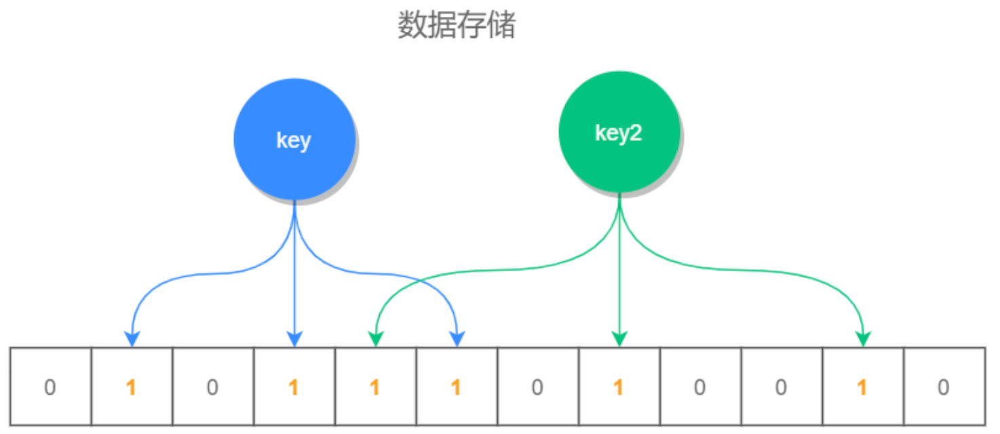
  - 利用几个不同的hash函数，把key均匀的存储在位数组中；
  - 在查找某一个key是否存在时，就去判断这个key的位数组中是否全部为1，如果有一个不为1，则说明这个key一定不存在；但是如果全为1，不能表明这个key一定存在；
  - 分析：当位数组存储的值越稀疏，查询的准确率就越高
- 经典业务场景
  - 垃圾邮件过滤
  - 爬虫URL去重
  - 判断亿级元素集合中是否存在某一个key


## 30 完整案例：实现延迟队列的两种方法

主要使用zset中的score属性来存储延迟执行时间。

## 31 实战：定时任务案例

- 实现思路
  - 通过发布订阅机制完成对某个事件的订阅，当某个事件完成时，消息接收者就会收到这个事件的完成信息，然后根据这个事件的完成信息对业务进行操作；
- 使用方式
  - 1. 开启 config set notify-keyspace-events 参数配置，值为 E 加上下面的几个字母
    - K：键空间通知，所有通知以 `__keyspace@<db>__` 为前缀，db表示redis的数据库索引
    - E：键事件通知，所有通知以 `__keyevent@<db>__` 为前缀
    - g：DEL、EXPIRE、RENAME 等类型无关的通用命令的通知
    - $：字符串命令的通知
    - l：列表命令的通知
    - s：集合命令的通知
    - h：哈希命令的通知
    - z：有序集合命令的通知
    - x：过期事件，每当有过期键被删除时发送
    - e：驱逐（evict）事件，每当有键因为 maxmemory 政策而被删除时发送
    - A：参数 g$lshzxe 的别名
  - 2. 例子： config set notify-keyspace-events El 表示对列表事件进行订阅
  - 3. 使用
    - `psubscribe __keyevent@0__:expired` ： 表示 订阅 0号数据库中过期事件
- 场景
  - 通过上面的例子，我们可以使用redis完成定时任务的业务操作


## 32 实战：RediSearch 高性能的全文搜索引擎

- RediSearch 的功能
  - 像搜索引擎一样完成搜索功能
- 使用
  - 1. 安装模块
    - docker安装
    - mo模块安装
  - 2. 使用
- 相关命令
  - ft.create
  - ft.add
  - ft.search
  - ft.del
  - ft.drop
  - ft.info

## 33 实战：Redis 性能测试

- 为什么要进行性能测试
  - 技术选型需要
  - 评估同一种技术的不同版本的性能差异
  - 评估同一种技术的不同部署模型的性能差异
  - 评估同一种技术的相同部署模型的不同配置的性能差异
  - 评估相同业务场景的不同存储数据结构的性能差异
  - 评估调优前后的性能差异
  - 总之：评估不同条件下的性能差异，以求选择一种更经济、更高效的运行方式
- 对redis的性能测试方式
  - 编写代码实现并发测试
  - 使用redis的工具：redis-benckmark 进行测试
- 测试案例
  - 使用 ./redis-benchmark 命令
  - 结果分析
    - 输出不同命令的在特定条件下的运行结果
    - 结果包括： qps、99.85线、100线等
    - 结论： redis平均的qps为8w
  - 还可以使用管道命令合并多条命令一起执行来进行性能测试

## 34 实战：Redis 慢查询

- 概念
  - 简而言之，就是对查询命令的消耗时间进行统计，筛选出满足条件的查询结果进行优化
- 开启方式
  - slowlog-log-slower-than ： 慢查询时间低于多少 微秒（1s = 1000ms = 1000,000微妙）
  - slowlog-max-len： 满查询日志的最大记录数，只记录最近的n条慢查询日志
- 操作
  - slowlog get n： 查询慢查询日志中的记录
  - slowlog len： 慢查询队列长度
  - slowlog reset： 清空慢查询日志内容


## 35 实战：Redis 性能优化方案

- 背景
  - redis 是内存大小敏感型中间件，要求高性能；
- 优化方案
  - 部署时
    - 尽量采用分布式部署方式
    - 尽量使用物理机部署而非虚拟机`多个虚拟机占用同一个物理机的内存及网络带宽，造成资源浪费`
  - 配置时
    - 限制redis使用的内存大小`当物理内存不足时，如果没有配置redis使用的内存大小，操作系统会把redis使用的内存分页转移到swap空间，这个操作会造成redis的进程出现短暂阻塞`
    - 检查redis的持久化策略`持久化可以进行容灾和备份，但是持久化会对redis的性能有所损耗，如果需要开启持久化时，建议开启混合持久化方式；某些系统可能不需要开启时就需要关闭持久化机制`
    - 尽量配置延迟删除`开启了延迟删除的配置之后，redis会把键值对的删除操作放到BIO单独的子进程中进行，减少对主进程的干扰`
      - lazyfree-lazy-eviction：表示当 Redis 运行内存超过 maxmeory 时，是否开启 lazy free 机制删除；
      - lazyfree-lazy-expire：表示设置了过期时间的键值，当过期之后是否开启 lazy free 机制删除；
      - lazyfree-lazy-server-del：有些指令在处理已存在的键时，会带有一个隐式的 del 键的操作，比如 rename 命令，当目标键已存在，Redis 会先删除目标键，如果这些目标键是一个 big key，就会造成阻塞删除的问题，此配置表示在这种场景中是否开启 lazy free 机制删除；
      - slave-lazy-flush：针对 slave（从节点）进行全量数据同步，slave 在加载 master 的 RDB 文件前，会运行 flushall 来清理自己的数据，它表示此时是否开启 lazy free 机制删除。
  - 使用时的全局注意事项：
    - 客户端尽量使用线程池方式查询``
    - 避免使用时间复杂度为O(N)的命令，如keys
      - 决定禁止使用 keys 命令；
      - 避免一次查询所有的成员，要使用 scan 命令进行分批的，游标式的遍历；
      - 通过机制严格控制 Hash、Set、Sorted Set 等结构的数据大小；
      - 将排序、并集、交集等操作放在客户端执行，以减少 Redis 服务器运行压力；
      - 删除（del）一个大数据的时候，可能会需要很长时间，所以建议用异步删除的方式 unlink，它会启动一个新的线程来删除目标数据，而不阻塞 Redis 的主线程。
    - 避免缓存大面积失效`如果大型系统中某一时刻缓存大面积失效，就会造成redis循环多次的扫描删除过期字典，直到过期字典中的键被删除的比较稀疏为止，整个执行过程会造成内存管理器频繁回收内存页，这会redis的性能急剧下降`
      - 删除原理：默认配置项为 hz 10，表示每秒扫描10次，每次随机挑选20key来判断过期时间，如果发现过期就执行删除操作，并且如果过期的key超过了5个，就会继续执行扫描操作；
  - 具体业务场景应注意：
    - 缩短键值对的存储长度`重点优化内容`
    - 设置过期时间`避免频繁的触发内存淘汰策略`
    - 多使用管道机制执行命令`针对某些业务场景来说`
  - 性能测试
    - 开启慢查询日志，对耗时最长的业务场景进行分析，优化查询命令，生产环境中可以关闭``

## 36 实战：Redis 主从同步

- 主从同步原理
  - 把主节点的数据同步到从节点，使从节点具有跟主节点相同的数据内容；
- 使用方法
  - 启动时： redis-server --port 6380 --replicaof 127.0.0.1 6379
  - 运行时： replicaof 127.0.0.1 6380
- 同步原理
  - 全量同步： 主节点会执行一次bgsave命令生成一个RDB文件，然后以socket的方式把rdb文件发送给从节点，从节点加载到内存中完成全量同步；
  - 增量同步： 2.8之前没有增量同步，2.8之后主节点会记录从节点离线之后的命令，主节点会在从节点恢复上线后把存储的命令发送给从节点，离线命令大小由 repl-backlog-size 配置项控制
  - 零拷贝同步： 主节点fork一个子进程，由子进程通过socket方式，直接把RDB文件写入从节点；把 repl-diskless-sync 配置成true即可开启
- 注意
  - 在同步时会有数据短暂不一致的问题；
  - 从节点只读的配置项： replica-read-only no
  - 5.0 之前使用 slaveof， 之后使用 replicaof


## 37 实战：Redis哨兵模式（上）

- 主从复制的问题： 出现故障时，需要手动切换主从服务器；不能自动化处理；
- 哨兵模式基本原理： 一个哨兵集群去监听一个redis集群，这个redis集群中可以有多台主服务器和多台从服务器，只要主服务器发生故障，哨兵集群就会从主服务器中选举一台服务器重新作为主服务器进行服务。达到了自动化处理主服务器故障的问题。
- 搭建过程
  - 奇数台哨兵服务器
    - 用于 quorum 选取使用，因为这个算法要求大于一半的服务器选举结果才是最终结果；
    - 跟 quorum 参数有关的概念有两个
      - 主观下线： 一个哨兵认为主服务器下线，就标记为主观下线；
      - 客观下线： 一个哨兵发现主服务器下线后，就会询问其他哨兵这台服务器是否下线，如果超过一半的哨兵都认为这台服务器下线，就把这台服务器标记为客观下线；
  - 在配置文件中配置要监听的主服务器相关信息，然后依次启动哨兵服务器，各哨兵服务器会自动发现彼此形成哨兵集群；
  - 3台哨兵+1台主服务器+3台从服务器
- 容灾测试
  - kill掉主服务器进程，一段时间后哨兵集群从3台从服务器中挑选一个作为主服务器重新对外提供服务
- 哨兵原理
  - 每个哨兵会以每秒1次的频率向主服务器、从服务器以及其他哨兵服务器发送一个PING指令；
  - 如果这个哨兵收到的消息超过 down-after-milliseconds 配置的时间，就默认主服务器主管下线，然后向其他哨兵询问此服务器是否下线，如果超过半数哨兵认为此服务器下线，就把此服务器标注为客观下线；
  - 此时，哨兵就启动自动容灾恢复阶段；
    - 会先排除掉所有不符合条件：
      - 排除所有已经下线或长时间没有回复心跳检测的疑似下线服务器；
      - 排除所有很长时间没有跟主服务器通信，获数据状态过时的从服务器；
      - 排除所有优先级（replica-priority，默认为100，数字越小优先级越高）为0的服务器
    - 然后从符合条件的从服务器中挑选，其顺序为：
      - 优先级高的从节点直接晋升为主节点；
      - 优先级相同的从节点，晋升复制偏移量高的从节点为主节点；
      - 如果优先级相同且复制偏移量也一样，就晋升服务器id最小的那个为主节点
    - 哨兵先从所有从服务器中根据  replica-priority  配置来挑选一个服务器升级为主服务器；
  - 旧主节点恢复上线
    - 以从服务节点的角色加入集群

> 如果PING命令回复结果为：PONG、LOADING、MASTERDOWN（三者之一），就说明正常；
> 哨兵集群本质上也是redis集群，只不过只提供哨兵任务；
> TODO： 关注一下哨兵集群具体的容灾恢复过程


## 38 实战：Redis 哨兵模式（下）

- 一些相关命令
  - sentinel masters
  - sentinel master ${masterName}
  - sentinel get-master-addr-by-name 
  - sentinel slaves
  - sentinel replicas
  - sentinel sentinels
  - sentinel ckquorum 
  - sentinel failover
  - sentinel monitor
  - sentinel remove
  - sentinel set master-name quorum n 

## 39 实战：Redis 集群模式（上）

- 集群模式的搭建
- 为搭建好的集群
  - 添加一个从节点
  - 删除一个从节点
  - 从新reshard
  - 负载均衡： 执行 rebalance 命令，但是此命令在redis认为没有必要执行时可能直接退出；
- 槽slot
  - 16384 
  - slot = CRC16(key) % 16383
- 故障发现
- 故障发现里面有两个重要的概念：疑似下线（PFAIL-Possibly Fail）和确定下线（Fail）。
  - 集群中的健康监测是通过定期向集群中的其他节点发送 PING 信息来确认的，如果发送 PING 消息的节点在规定时间内，没有收到返回的 PONG 消息，那么对方节点就会被标记为疑似下线。
  - 一个节点发现某个节点疑似下线，它会将这条信息向整个集群广播，其它节点就会收到这个消息，并且通过 PING 的方式监测某节点是否真的下线了。如果一个节点收到某个节点疑似下线的数量超过集群数量的一半以上，就可以标记该节点为确定下线状态，然后向整个集群广播，强迫其它节点也接收该节点已经下线的事实，并立即对该失联节点进行主从切换。
  - 这就是疑似下线和确认下线的概念，这个概念和哨兵模式里面的主观下线和客观下线的概念比较类似。
- 故障转移
  - 当一个节点被集群标识为确认下线之后就可以执行故障转移了，故障转移的执行流程如下：
    - 从下线的主节点的所有从节点中，选择一个从节点（选择的方法详见下面“新主节点选举原则”部分）；
    - 从节点会执行 SLAVEOF NO ONE 命令，关闭这个从节点的复制功能，并从从节点转变回主节点，原来同步所得的数据集不会被丢弃；
    - 新的主节点会撤销所有对已下线主节点的槽指派，并将这些槽全部指派给自己；
    - 新的主节点向集群广播一条 PONG 消息，这条 PONG 消息是让集群中的其他节点知道此节点已经由从节点变成了主节点，并且这个主节点已经接管了原本由已下线节点负责处理的槽位信息；
    - 新的主节点开始处理相关的命令请求，此故障转移过程完成。
- 新主节点选举原则  
  - 新主节点选举的方法是这样的：
    - 集群的纪元（epoch）是一个自增计数器，初始值为0；
    - 而每个主节点都有一次投票的机会，主节点会把这一票投给第一个要求投票的从节点；
    - 当从节点发现自己正在复制的主节点确认下线之后，就会向集群广播一条消息，要求所有有投票权的主节点给此从节点投票；
    - 如果有投票权的主节点还没有给其他人投票的情况下，它会向第一个要求投票的从节点发送一条消息，表示把这一票投给这个从节点；
    - 当从节点收到投票数量大于集群数量的半数以上时，这个从节点就会当选为新的主节点。

## 40 实战：Redis 集群模式（下）

与 39 合并；

## 41 案例：Redis 问题汇总和相关解决方案


- 缓存击穿
  - 热点缓存恰好在高并发场景下失效，导致大量请求直接打到数据库上的情况；
  - 解决方案
    - 加锁排队
    - 永不过期
- 缓存穿透
  - 请求的数据在数据库和缓存中都不存在，导致每次请求都请求到数据库
  - 解决方案
    - 加过滤器
    - 缓存空结果
- 缓存雪崩
  - 短时间内大量缓存过期，导致请求直接打到数据库上，给数据库造成巨大压力，甚至导致数据库宕机问题；
  - 解决方案
    - 加锁排队
    - 随机化过期时间
    - 设置二级缓存
- 缓存预热
  - 设置启动时自动加载数据到缓存中
  - 设置加载数据的接口，手动触发
  - 设置定时任务


## 42 技能学习指南

## 43 加餐：Redis 的可视化管理工具

- RedisClient
- Redis Desktop Manager
- RedisStudio
- AnotherRedisDesktopManager
- Reids Insight

  

