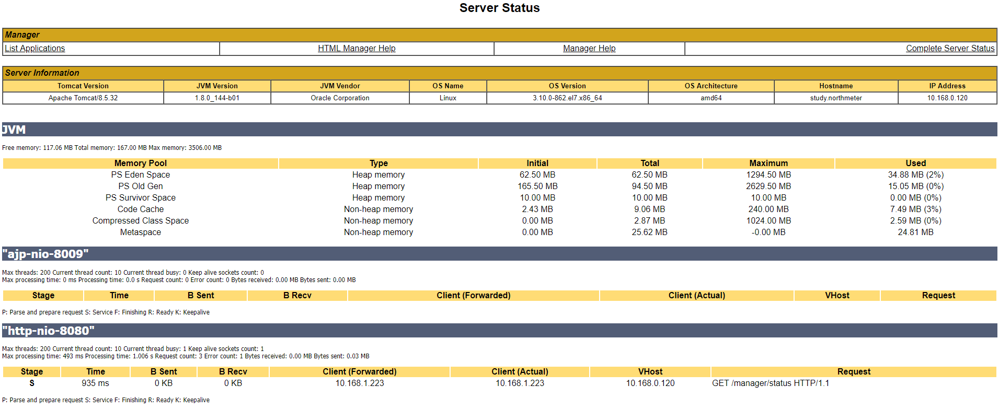
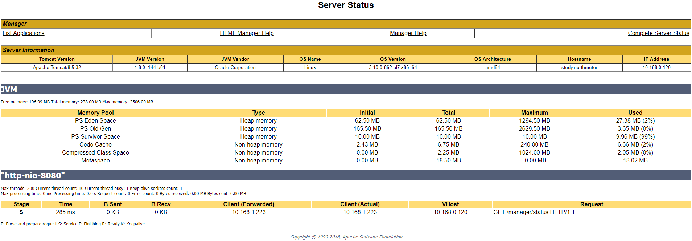

## 前言

tomcat作为javaweb应用服务器，应用广泛，在此不再介绍。

## 信息统计

- 下载地址：https://mirrors.tuna.tsinghua.edu.cn/apache/tomcat/tomcat-8/
- 版本：Tomcat8.5.32
- 依赖：jdk

## 安装

- 解压文件

```
$ tar zxf apache-tomcat-8.5.32.tar.gz -C /usr/setup/
```

- 创建用户，并将home目录放置到安装目录下面

```
$ useradd -m -U -d /usr/setup/apache-tomcat-8.5.32 -s /bin/false tomcat
```
> 附： <br />
> $ useradd --help <br />
> -b, --base-dir BASE_DIR       新账户的主目录的基目录 <br />
> -c, --comment COMMENT         新账户的 GECOS 字段 <br />
> -d, --home-dir HOME_DIR       新账户的主目录 <br />
> -D, --defaults                显示或更改默认的 useradd 配置 <br />
> -e, --expiredate EXPIRE_DATE  新账户的过期日期 <br />
> -f, --inactive INACTIVE       新账户的密码不活动期 <br />
> -g, --gid GROUP               新账户主组的名称或 ID <br />
> -G, --groups GROUPS   新账户的附加组列表 <br />
> -h, --help                    显示此帮助信息并推出 <br />
> -k, --skel SKEL_DIR   使用此目录作为骨架目录 <br />
> -K, --key KEY=VALUE           不使用 /etc/login.defs 中的默认值 <br />
> -l, --no-log-init     不要将此用户添加到最近登录和登录失败数据库 <br />
> -m, --create-home     创建用户的主目录 <br />
> -M, --no-create-home          不创建用户的主目录 <br />
> -N, --no-user-group   不创建同名的组 <br />
> -o, --non-unique              允许使用重复的 UID 创建用户 <br />
> -p, --password PASSWORD               加密后的新账户密码 <br />
> -r, --system                  创建一个系统账户 <br />
> -R, --root CHROOT_DIR         chroot 到的目录 <br />
> -s, --shell SHELL             新账户的登录 shell <br />
> -u, --uid UID                 新账户的用户 ID <br />
> -U, --user-group              创建与用户同名的组 <br />
> -Z, --selinux-user SEUSER             为 SELinux 用户映射使用指定 SEUSER <br />

- 创建快捷方式

```
$ ln -s /usr/setup/apache-tomcat-* /usr/setup/latestTomcat
```

- 改变文件所属组和用户为Tomcat

```
$ chown -R tomcat: /usr/setup/apache-tomcat-*
$ chown -R tomcat: /usr/setup/latestTomcat
```

- 可执行状态

```
$ chmod +x /usr/setup/latestTomcat/bin/*.sh
```

- 创建/etc/systemd/system/tomcat.service文件

```
$ vi /etc/systemd/system/tomcat.service
// 添加以下内容
[Unit]
Description=Tomcat 8.5.32 servlet container
After=network.target
[Service]
Type=forking
User=tomcat
Group=tomcat
Environment="JAVA_HOME=/usr/setup/jdk1.8.0_144"
Environment="CATALINA_BASE=/usr/setup/latestTomcat"
Environment="CATALINA_HOME=/usr/setup/latestTomcat"
Environment="CATALINA_PID=/usr/setup/latestTomcat/temp/tomcat.pid"
ExecStart=/usr/setup/latestTomcat/bin/startup.sh
ExecStop=/usr/setup/latestTomcat/bin/shutdown.sh
[Install]
WantedBy=multi-user.target
```

- 让创建的服务生效，然后启动Tomcat

```
systemctl daemon-reload
systemctl start tomcat
systemctl status tomcat
```

- 加入 automatically started at boot time

```
systemctl enable tomcat
```

- 开放端口

```
firewall-cmd --zone=public --permanent --add-port=8080/tcp
firewall-cmd --zone=public --permanent --add-port=8005/tcp（未执行）
firewall-cmd --zone=public --permanent --add-port=8009/tcp（未执行）
firewall-cmd --reload
```


## 使用

### 配置

#### 配置manager的用户

```
$ vi /usr/setup/latestTomcat/conf/tomcat-users.xml
  // 添加以下内容
  <role rolename="admin-gui"/>
  <role rolename="manager-gui"/>
  <user username="tomcat" password="tomcat" roles="admin-gui, manager-gui"/>
  <!-- <role rolename="manager-script"/>
  <user username="tomcat" password="tomcat" roles="admin-gui, manager-gui, manager-script"/> -->
```

#### 允许远程登录

```
$ vi /usr/setup/latestTomcat/webapps/manager/META-INF/context.xml
	<Context antiResourceLocking="false" privileged="true" >
	    <!-- 把下面一行注释掉 -->
		<!--  <Valve className="org.apache.catalina.valves.RemoteAddrValve" allow="127\.\d+\.\d+\.\d+|::1|0:0:0:0:0:0:0:1" /> -->
		<Manager sessionAttributeValueClassNameFilter="java\.lang\.(?:Boolean|Integer|Long|Number|String)|org\.apache\.catalina\.filters\.CsrfPreventionFilter\$LruCache(?:\$1)?|java\.util\.(?:Linked)?HashMap"/>
	</Context>
```

### tomcat启动慢

```
Tomcat启动慢的解决办法
第一种 :
通过修改Tomcat启动文件 -Djava.security.egd=file:/dev/urandom 通过修改JRE中的java.security文件 securerandom.source=file:/dev/urandom

第二种(推荐):
yum -y install rng-tools
##启动熵服务
systemctl start rngd
systemctl restart rngd
```

### 调优

#### 调优前

调优之前可以通过tomcat自带的管理界面查看服务器、jvm等信息。



#### 调优

##### 修改tomcat配置

###### 打开默认被注释的连接池配置

```
$ vi /usr/setup/latestTomcat/conf/server.xml
默认：【默认是注释的】
<!--
    <Executor name="tomcatThreadPool" namePrefix="catalina-exec-"
        maxThreads="150" minSpareThreads="4"/>
    -->

修改后：
<Executor
        name="tomcatThreadPool"
        namePrefix="catalina-exec-"
        maxThreads="1000"
        minSpareThreads="30"
        maxIdleTime="60000"
        prestartminSpareThreads = "true"
        maxQueueSize = "100"
/>

参数解释：
maxThreads，最大并发数，默认设置 200，一般建议在 500 ~ 800，根据硬件设施和业务来判断
minSpareThreads，Tomcat 初始化时创建的线程数，默认设置 25
prestartminSpareThreads，在 Tomcat 初始化的时候就初始化 minSpareThreads 的参数值，如果不等于 true，minSpareThreads 的值就没啥效果了
maxQueueSize，最大的等待队列数，超过则拒绝请求
maxIdleTime，如果当前线程大于初始化线程，那空闲线程存活的时间，单位毫秒，默认60000=60秒=1分钟。
```

###### 修改默认的连接器参数配置

```
$ vi /usr/setup/latestTomcat/conf/server.xml
默认值：
<Connector port="8080" protocol="HTTP/1.1"
               connectionTimeout="20000"
               redirectPort="8443" />

修改后：
<Connector
   executor="tomcatThreadPool"
   port="8080"
   protocol="org.apache.coyote.http11.Http11Nio2Protocol"
   connectionTimeout="20000"
   maxConnections="10000"
   redirectPort="8443"
   enableLookups="false"
   acceptCount="100"
   maxPostSize="10485760"
   maxHttpHeaderSize="8192"
   disableUploadTimeout="true"
   URIEncoding="utf-8"
/>

参数解释：
protocol，Tomcat 8 设置 nio2 更好：org.apache.coyote.http11.Http11Nio2Protocol（如果这个用不了，就用下面那个）
protocol，Tomcat 6、7 设置 nio 更好：org.apache.coyote.http11.Http11NioProtocol
enableLookups，禁用DNS查询，tomcat 8 默认已经是禁用了。
maxConnections，最大连接数，tomcat 8 默认设置 10000
acceptCount，指定当所有可以使用的处理请求的线程数都被使用时，可以放到处理队列中的请求数，超过这个数的请求将不予处理，默认设置 100
maxPostSize，以 FORM URL 参数方式的 POST 提交方式，限制提交最大的大小，默认是 2097152(2兆)，它使用的单位是字节。10485760 为 10M。如果要禁用限制，则可以设置为 -1。
maxHttpHeaderSize，http请求头信息的最大程度，超过此长度的部分不予处理。一般8K。
```

###### 禁用 AJP（如果你服务器没有使用 Apache）

```
$ vi /usr/setup/latestTomcat/conf/server.xml
默认：
<Connector port="8009" protocol="AJP/1.3" redirectPort="8443" />

修改后：【注释掉】
<!-- <Connector port="8009" protocol="AJP/1.3" redirectPort="8443" /> -->
```

###### 关闭自动部署功能

```
$ vi /usr/setup/latestTomcat/conf/server.xml
默认值：
<Host name="localhost"  appBase="webapps" unpackWARs="true" autoDeploy="true">

修改后：
<Host name="localhost"  appBase="webapps" unpackWARs="true" autoDeploy="false">
```

###### 启动慢的解决问题

```
第一种 :
1. 修改Tomcat启动文件 -Djava.security.egd=file:/dev/urandom
2. 修改JRE中的java.security文件 securerandom.source=file:/dev/urandom

第二种(推荐):
1. 安装rng工具包，执行“yum -y install rng-tools”
2. 启动熵服务，执行：“systemctl start rngd”和“systemctl restart rngd”
```

###### 日志分割

```
out日志过大
https://github.com/judasn/Linux-Tutorial/blob/master/markdown-file/Tomcat-Install-And-Settings.md

日志位置修改
https://blog.csdn.net/lyf844692713/article/details/81510816

日志压缩
https://my.oschina.net/u/3715199/blog/1574974  第二种方法
```

##### 修改jvm配置

- 配置内存

修改$CATALINA_HOME/bin/catalina.sh

```
CATALINA_OPTS="-Dfile.encoding=UTF-8 -server -Xms32g -Xmx32g"

-Dfile.encoding=UTF-8 -server -Xms2048m -Xmx2048m -Xmn1024m -XX:PermSize=2g -XX:MaxPermSize=4g -XX:SurvivorRatio=10 -XX:MaxTenuringThreshold=15 -XX:NewRatio=2 -XX:+DisableExplicitGC


参数详解：
-server  启用jdk 的 server 版；
-Xms    java虚拟机初始化时的最小内存；
-Xmx    java虚拟机可使用的最大内存；
-Xmn    jvm最小内存
-XX:PermSize    内存永久保留区域
-XX:MaxPermSize   内存最大永久保留区域
```

#### 调优后



## 参考

1. https://github.com/judasn/Linux-Tutorial/blob/master/markdown-file/Tomcat-Install-And-Settings.md

