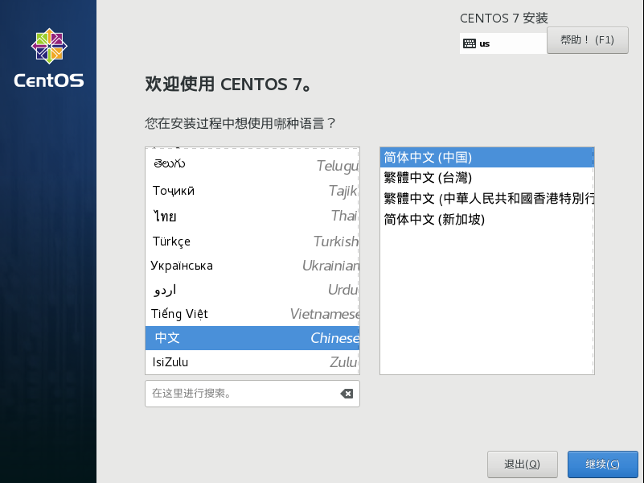
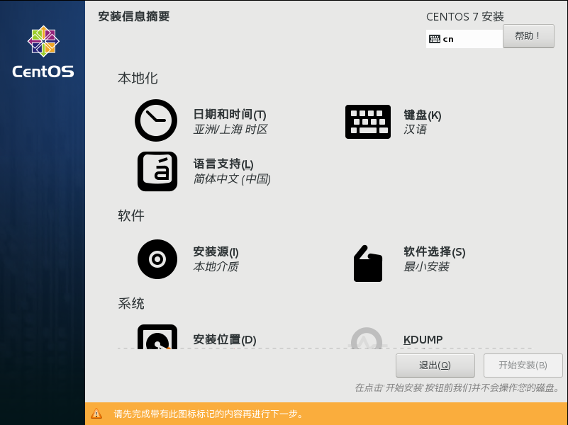
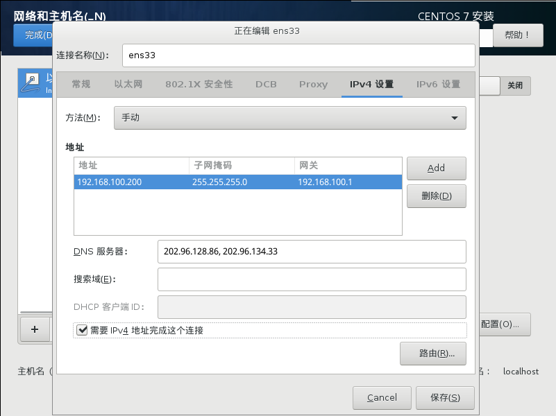
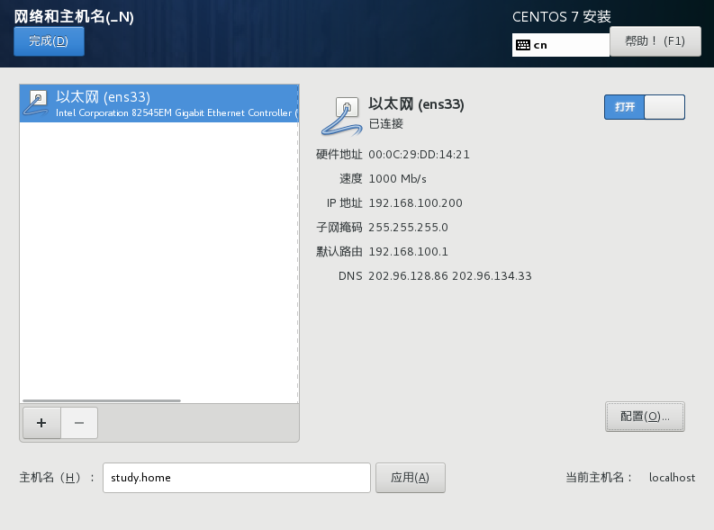
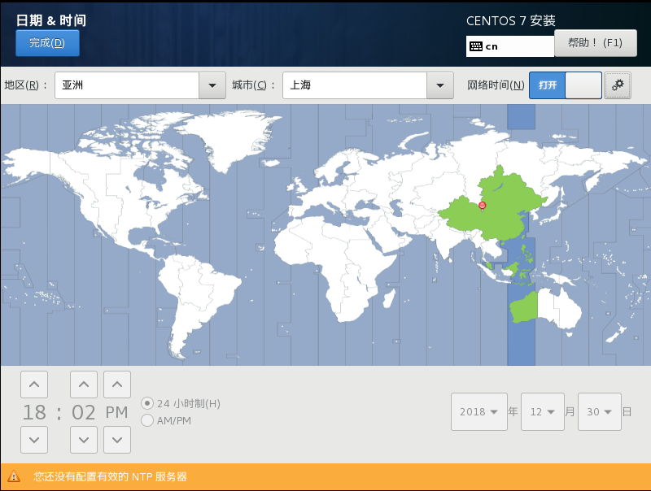
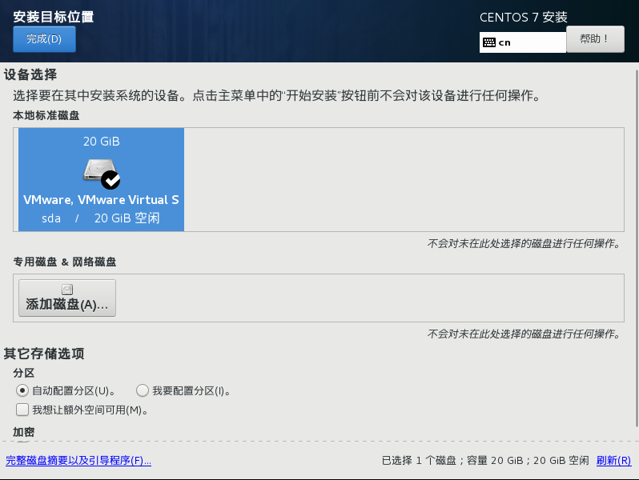
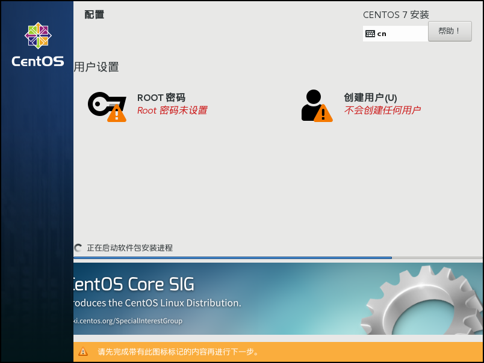
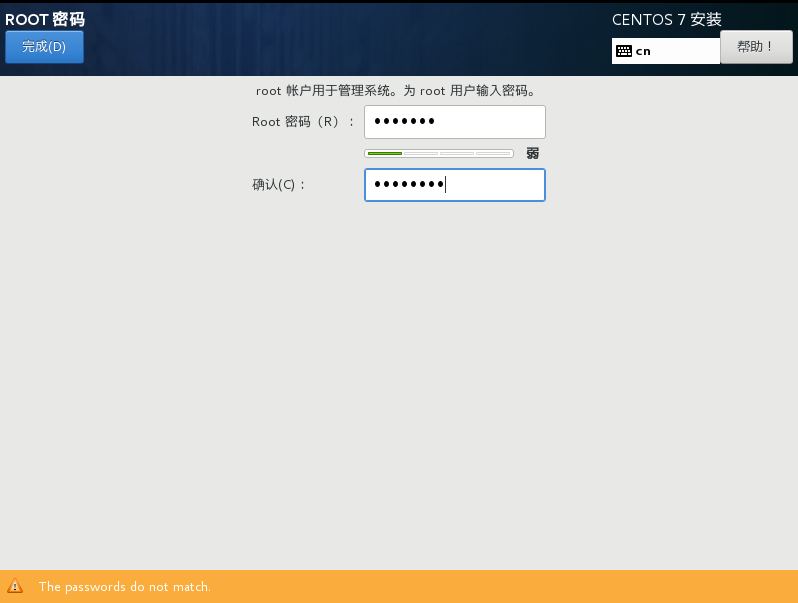
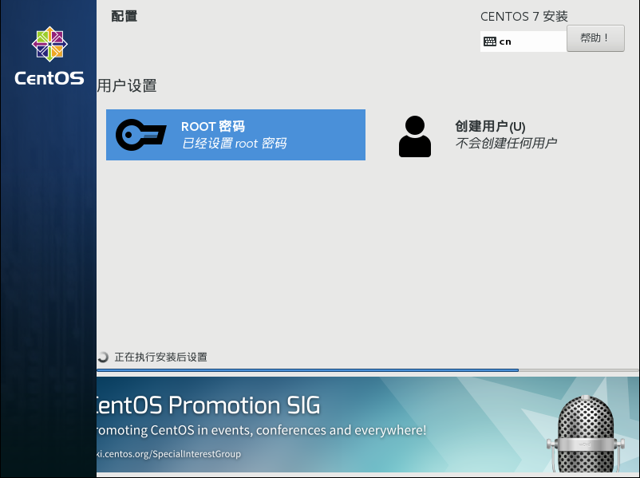

1. 提示

请在安装之前，先查看最下面的提示。本文档是在vm12虚拟机上面做的实验，读者的安装过程如果跟笔者不一致，则工具软件的安装过程也可能略有差异。

2. 选择语言

3. 安装信息摘要

4. 配置网络和主机名

选择：“IPV4设置”选项卡、选择“方法（手动）”、编辑信息（地址、子网掩码、网关、DNS服务器）、勾选“需要IPV4完成这个连接”、保存。

打开网络连接、修改主机名，点击完成，返回“安装信息摘要”界面。

5. 设置时间

确保使用的是网络时间，点击完成，返回“安装信息摘要”界面。

6. 设置安装位置

选中磁盘，点击完成，返回“安装信息摘要”界面。

7. 点击“开始安装”

8. 设置root密码

9. 等待

10. 重新启动

11. 完成

> 注意：
> 1. 选择“软件安装”的时候，并未做任何操作，选择的是默认，默认是只最小化安装，即只安装系统基本软件。
> 2. 设置“日期与时间”的时候，选择网络时间，要确保网络时间的按键处于打开状态。
> 3. 执行安装过程时，不要忘记创建root密码。

