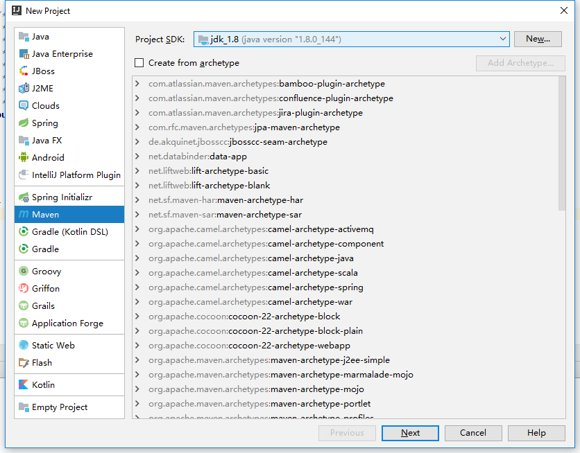
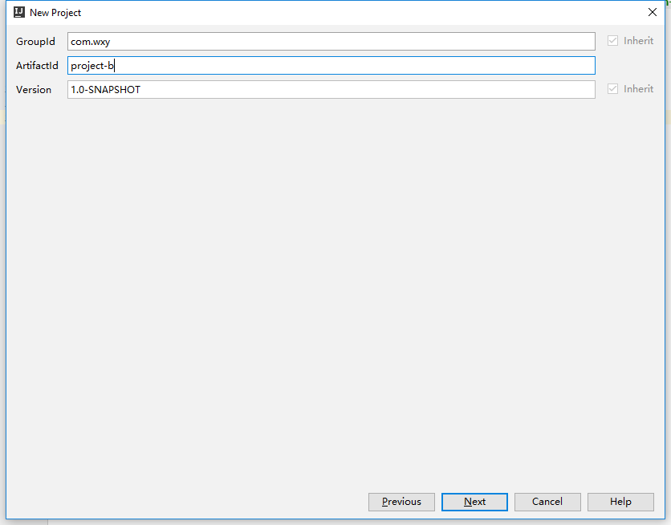
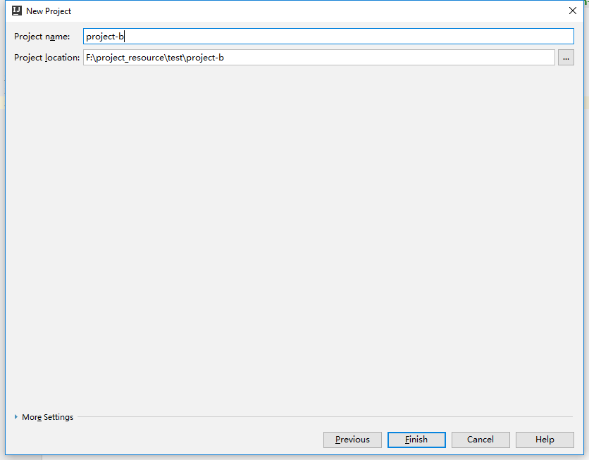
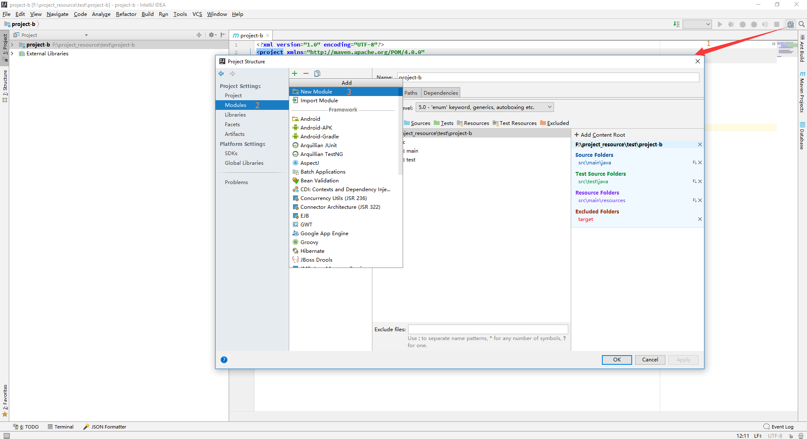
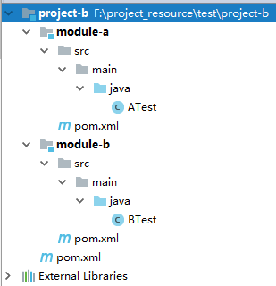

## 1. 场景

项目a和项目b都是maven工程。项目a需要使用到项目b的代码，项目b中又有很多子模块，而项目a中又不想一个一个的引入项目b中的jar包，只想在项目中引入一个依赖，就能使用到项目b中的每一个jar。那如何实现呢？


## 2. 实现步骤

- 搭建nexus私服

- 创建项目b






- 效果图

创建后把多余的文件夹删除后的效果图：



- project-b

project-b是一个聚合工程，所以它没有源代码，只有一个pom文件。文件内容如下

```
<?xml version="1.0" encoding="UTF-8"?>
<project xmlns="http://maven.apache.org/POM/4.0.0"
         xmlns:xsi="http://www.w3.org/2001/XMLSchema-instance"
         xsi:schemaLocation="http://maven.apache.org/POM/4.0.0 http://maven.apache.org/xsd/maven-4.0.0.xsd">
    <modelVersion>4.0.0</modelVersion>

    <groupId>com.wxy</groupId>
    <artifactId>project-b</artifactId>
    <version>1.0-SNAPSHOT</version>
    <packaging>pom</packaging> <!--pom项目，因为聚合了module-a和module-b-->

    <dependencies>
        <!--a模块的依赖-->
        <dependency>
            <groupId>com.wxy</groupId>
            <artifactId>module-a</artifactId>
            <version>1.0-SNAPSHOT</version>
        </dependency>

        <!--b模块的依赖-->
        <dependency>
            <groupId>com.wxy</groupId>
            <artifactId>module-b</artifactId>
            <version>1.0-SNAPSHOT</version>
        </dependency>
    </dependencies>


    <!--添加发布插件的依赖-->
    <distributionManagement>
        <repository>
            <id>nexus-releases</id>
            <url>http://10.168.0.120:8081/nexus/content/repositories/releases/</url>
        </repository>
        <snapshotRepository>
            <id>nexus-releases</id>
            <url>http://10.168.0.120:8081/nexus/content/repositories/snapshots/</url>
        </snapshotRepository>
    </distributionManagement>

</project>
```

- module-a

module-a实现两个整数的相加。里面包括了两个重要的文件：一个是pom.xml文件，一个是ATest.java文件。

```
// pom.xml文件内容

<?xml version="1.0" encoding="UTF-8"?>
<project xmlns="http://maven.apache.org/POM/4.0.0"
         xmlns:xsi="http://www.w3.org/2001/XMLSchema-instance"
         xsi:schemaLocation="http://maven.apache.org/POM/4.0.0 http://maven.apache.org/xsd/maven-4.0.0.xsd">
    <modelVersion>4.0.0</modelVersion>

    <groupId>com.wxy</groupId>
    <artifactId>module-a</artifactId>
    <version>1.0-SNAPSHOT</version>
    <packaging>jar</packaging> <!--jar项目-->

    <!--添加发布插件的依赖-->
    <distributionManagement>
        <repository>
            <id>nexus-releases</id>
            <url>http://10.168.0.120:8081/nexus/content/repositories/releases/</url>
        </repository>
        <snapshotRepository>
            <id>nexus-releases</id>
            <url>http://10.168.0.120:8081/nexus/content/repositories/snapshots/</url>
        </snapshotRepository>
    </distributionManagement>

</project>
```

```
// ATest.java内容
public class ATest {

    public int add(int a, int b) {
        return a + b;
    }
}
```

- module-b

module-b实现两个整数的相加。里面包括了两个重要的文件：一个是pom.xml文件，一个是BTest.java文件。

```
// pom.xml文件内容

<?xml version="1.0" encoding="UTF-8"?>
<project xmlns="http://maven.apache.org/POM/4.0.0"
         xmlns:xsi="http://www.w3.org/2001/XMLSchema-instance"
         xsi:schemaLocation="http://maven.apache.org/POM/4.0.0 http://maven.apache.org/xsd/maven-4.0.0.xsd">
    <modelVersion>4.0.0</modelVersion>

    <groupId>com.wxy</groupId>
    <artifactId>module-b</artifactId>
    <version>1.0-SNAPSHOT</version>
    <packaging>jar</packaging> <!--jar项目-->

    <!--添加发布插件的依赖-->
    <distributionManagement>
        <repository>
            <id>nexus-releases</id>
            <url>http://10.168.0.120:8081/nexus/content/repositories/releases/</url>
        </repository>
        <snapshotRepository>
            <id>nexus-releases</id>
            <url>http://10.168.0.120:8081/nexus/content/repositories/snapshots/</url>
        </snapshotRepository>
    </distributionManagement>

</project>
```
```
// ATest.java内容
public class BTest {

    public int sub(int a, int b) {
        return a - b;
    }
}
```

- 打包发布子模块

需要对每一个子模块进行打包发布。具体过程是：点击maven project窗口，找到每一个子模块的LifeCycle中的deploy，右键 create... ，在弹出的窗口的 Command line 处填写 `clean deploy -DskipTests`，然后ok。会在该子模块的plugins下面生成一个 Run Configurations，展开双击即可发布到私服。

对每一个模块都执行同样的步骤，即可将所有子模块都发布到私服上面。

- 打包发布聚合工程

等所有的子模块都发布成功后，对聚合工程执行打包发布过程，发布过程和上面发布子模块的步骤一致。

## 3. 使用

- 添加依赖

```
<dependency>
    <groupId>com.wxy</groupId>
    <artifactId>project-b</artifactId>
    <version>2.2-RELEASE</version>
    <type>pom</type>
</dependency>
```

- 使用

```
public class ProjectATest {

    public static void main(String[] args) {
        ATest aTest = new ATest();
        System.out.println(aTest.add(1, 2));

        BTest bTest = new BTest();
        System.out.println(bTest.sub(10, 9));
    }
}
```

## 4. 注意

每次更新project-b的时候，都需要更新每一个模块的版本，同样，project-b的版本也需要更新，不然，会出现发布的错误。

## 5. 项目源码

[test-nexus.rar](../source/test-nexus.rar)

