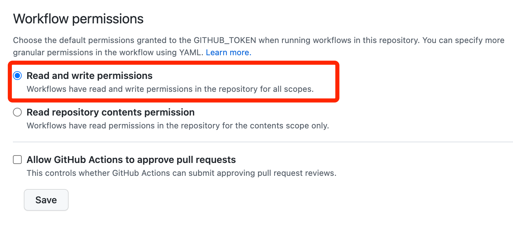
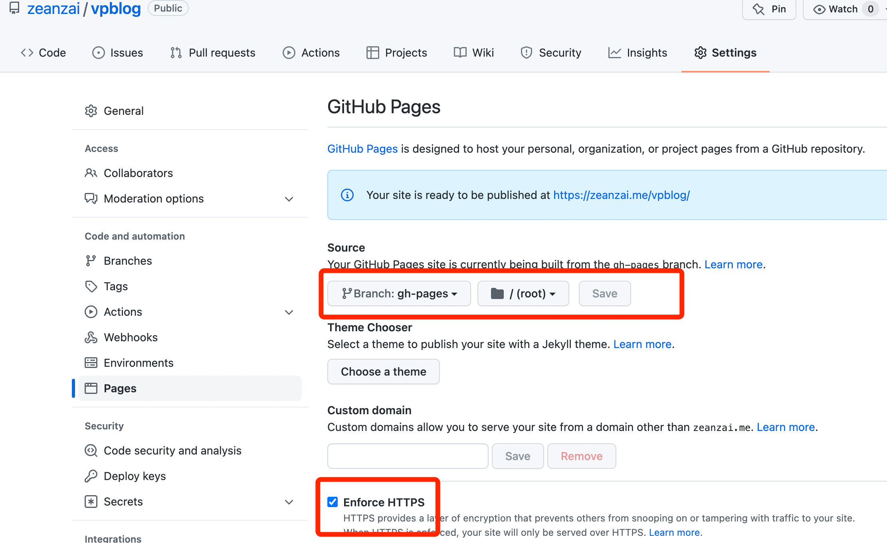

## 1. 为什么要搭建个人网站

- 新媒体时代，`巨大红利`
- `个人IP`，提高自己行业话语权及影响力
- 最好的学习方法就是输出，个人网站是一个`输出展示的窗口`
- 可以当作一个`免费的笔记本📓`，不但可以免费，更重要的是每一篇文章都可以查看提交记录、回滚等


## 2. 博客工具对比

参见： [11个最流行的静态(博客)网站生成工具](https://www.cnblogs.com/buyz/p/10935831.html)


## 3. 规划

已经有一个个人网站了， https://zeanzai.me ，现在把项目放到 https://zeanzai.me/vpblog 下。因此，我们现在GitHub上创建一个空仓库。

此外，这个仓库还引用了GitHub用来自动集成的工作流，想要实现只要提交了代码，就自动发布到对应分支、并完成网站部署的功能。


## 4. 环境准备

- 准备工作
  - node版本： v16.15.0
  - npm版本： 8.5.5
  - yarn版本： 1.22.15
  - vscode版本： 安装能使用即可
  - git： 工具，安装能使用即可
  - github账号： 这就不用多说了吧
  - 域名： [optional] 这个看自己需要，如果觉得GitHubPages也可以使用的，不注册也行
  - vscode 插件列表： `markdown all in one` 和 `markdown-index`


## 5. 初始化项目

### 5.1. 克隆仓库

```
git clone git@github.com:zeanzai/vpblog.git
```

### 5.2. 生成项目文件

进入vpblog文件夹内，执行命令

```
➜  vpblog git:(master) npm create vuepress-theme-hope@next docs
? Select a language to display / 选择显示语言 简体中文
获取依赖的最新版本...
生成 package.json...
? 设置应用名称 vpblog
? 设置应用版本号 2.0.0
? 设置应用描述 zeanzai's vpblog
? 设置协议 MIT
? 项目需要用到多语言么? No
? 是否需要一个自动部署文档到 GitHub Pages 的工作流？ Yes
生成模板...
? 选择你想使用的源 国内镜像源
安装依赖...
这可能需要数分钟，请耐心等待.
我们无法正确输出子进程的进度条，所以进程可能会看似未响应
```

选择“简体中文”，并自动运行。发现运行出错

```
(node:39578) UnhandledPromiseRejectionWarning: Error: Command failed with exit code 1: npm run docs:dev
TypeError: createBundler is not a function
    at resolveBundler (/Users/shawnwang/Documents/Source/Temp/zeanzai/node_modules/@vuepress/core/lib/app/resolveBundler.js:8:12)
    at Object.app.dev (/Users/shawnwang/Documents/Source/Temp/zeanzai/node_modules/@vuepress/core/lib/app/createDevApp.js:11:57)
    at dev (/Users/shawnwang/Documents/Source/Temp/zeanzai/node_modules/@vuepress/cli/lib/commands/dev/createDev.js:51:33)
    at St (/Users/shawnwang/.npm/_npx/0c8cce8a7eeb7e99/node_modules/create-vuepress-theme-hope/lib/index.js:2:29971)
    at /Users/shawnwang/.npm/_npx/0c8cce8a7eeb7e99/node_modules/create-vuepress-theme-hope/lib/index.js:2:40141
    at processTicksAndRejections (internal/process/task_queues.js:97:5)
    at async re.<anonymous> (/Users/shawnwang/.npm/_npx/0c8cce8a7eeb7e99/node_modules/create-vuepress-theme-hope/lib/index.js:9:23325)
```

### 5.3. 修改工程配置文件


修改package.json文件

```
-"vuepress": "^2.0.0-beta.41",  
+"vuepress": "2.0.0-beta.39",  
```

### 5.4. 改用yarn

先删除原来的自动生成的模块，之后在清理npm缓存，之后全部使用yarn作为包管理工具（会生成yarn.lock文件）

```
rm -rf node_modules package-lock.json && npm cache clean --force
yarn install
```


### 5.5. 修改网站配置文件

由于要把项目放到 https://zeanzai.me/vpblog 这个路径下，因此要修改 config.ts 中配置：

```
// 根路径，即url上都会加上这个
base: "/vpblog/",
```

### 5.6. 查看本地效果

浏览器中输入： localhost:8080/vpblog 即可预览效果

## 6. 迁移文章

这一步骤需要注意两个地方，一个是要在每一个md文件中添加好fontfomatter，另一个是要提前规划好每一篇文章中可能需要添加的公共部分，比如我要在每一篇文章最下面添加一个公众号的二维码。

第二步骤中，可以先在某一个页面中调整好要添加的图片的样式，然后使用熟悉的Java写一个程序，为每一个md文件的末尾添加一行代码即可。


## 7. 推送至远端

### 7.1. 修改自动生成的集成配置文件

替换 deploy-docs.ym 。

### 7.2. 推送到远程仓库并验证工作流

然后查看 action 发现执行时报错：

```
...
/usr/bin/git add --all .
/usr/bin/git checkout -b github-pages-deploy-action/znzqityw6
Switched to a new branch 'github-pages-deploy-action/znzqityw6'
/usr/bin/git commit -m Deploying to gh-pages from @ zeanzai/vpblog@067754a2e5ca6e12dc4e502b74cc9d26c997b4e9 🚀 --quiet --no-verify
Force-pushing changes...
/usr/bin/git push --force ***github.com/zeanzai/vpblog.git github-pages-deploy-action/znzqityw6:gh-pages
remote: Permission to zeanzai/vpblog.git denied to github-actions[bot].
fatal: unable to access 'https://github.com/zeanzai/vpblog.git/': The requested URL returned error: 403
Running post deployment cleanup jobs… 🗑️
/usr/bin/git checkout -B github-pages-deploy-action/znzqityw6
Reset branch 'github-pages-deploy-action/znzqityw6'
/usr/bin/chmod -R +rw github-pages-deploy-action-temp-deployment-folder
/usr/bin/git worktree remove github-pages-deploy-action-temp-deployment-folder --force
Error: The deploy step encountered an error: The process '/usr/bin/git' failed with exit code 128 ❌
Notice: Deployment failed! ❌

```

修改 工作流 权限



发现执行成功

::: tip 详见：
https://github.com/zeanzai/vpblog/settings/actions
:::

### 7.3. 配置仓库

- 修改pages的配置



### 7.4. 验证

访问网址，成功。


## 8. [optional]解析域名

`// TODO`

我们已经使用GitHub Pages完成了个人博客网站的搭建，也有了属于自己的域名。如果我们想要自定义域名，那我们应该怎么办呢？


## 9. 总结

- 创建项目并完成配置，本地进行验证
- 推送至远端
- 解析域名
- 发布文章流程总结
  1. 打开vscode，创建一个md文件
  2. 书写文档后保存
  3. 执行部署脚本
  4. 查看部署效果


## 10. 参考

- https://docs.github.com/cn/actions/security-guides/encrypted-secrets
- https://github.com/zeanzai/vuepress/settings/actions

## Appendix 01：文章编写规范

参见： [这里](./writearticle.md)

## Appendix 02：多台电脑协作

如果上面的配置是在我们的一台电脑上完成的，但是我们现在想要在另外一台电脑上重新安装环境，这样我们就可以使用两台电脑进行协作了，那我们应该怎么办呢？换句话来说，如果你想要在新的电脑上协作，需要执行下面的命令。以后就都可以使用yarn进行包的管理了。

```
rm -rf node_modules package-lock.json && npm cache clean --force
yarn install
```

## Appendix 03：Git使用

- 在windows上提交时，出现22端口拒绝服务【原因是梯子安装成了服务模式导致dns出现异常】
  - 排查梯子的影响，应该是装了服务之后，导致网络异常；
  - 重新生成公钥；
  - 重新测试： ssh -T git@github.com 然后yes即可


---


