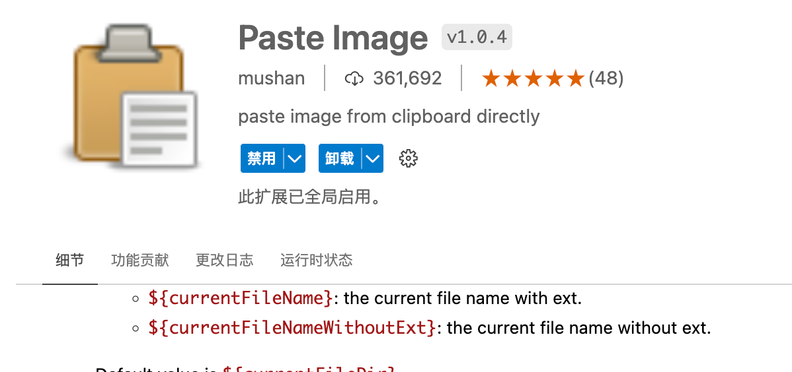
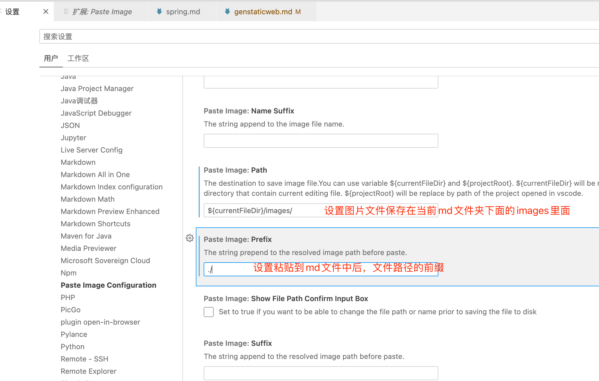

## 1. 为什么要搭建个人网站

- 新媒体时代，`巨大红利`
- `个人IP`，提高自己行业话语权及影响力
- 最好的学习方法就是输出，个人网站是一个`输出展示的窗口`
- 可以当作一个`免费的笔记本📓`，不但可以免费，更重要的是每一篇文章都可以查看提交记录、回滚等


## 2. 博客工具对比

参见： [11个最流行的静态(博客)网站生成工具](https://www.cnblogs.com/buyz/p/10935831.html)


## 3. 规划

已经有一个个人网站了， https://zeanzai.me ，现在把项目放到 https://zeanzai.me/vpblog 下。因此，我们现在GitHub上创建一个空仓库。

此外，这个仓库还引用了GitHub用来自动集成的工作流，想要实现只要提交了代码，就自动发布到对应分支、并完成网站部署的功能。


## 4. 环境准备

- 准备工作
  - node版本： v16.15.0
  - npm版本： 8.5.5
  - yarn版本： 1.22.15
  - vscode版本： 安装能使用即可
  - git： 工具，安装能使用即可
  - github账号： 这就不用多说了吧
  - 域名： [optional] 这个看自己需要，如果觉得GitHubPages也可以使用的，不注册也行
  - vscode 插件列表： `markdown all in one` 和 `markdown-index`

说明：

1. 使用 node.msi 安装包的方式进行安装，安装完node之后，npm会自动安装，并且 msi 的安装方式会自动添加环境变量；
2. 设置好 node_global 和 node_cache 的位置，这里有点类似于 maven 的 repository 的意思，[参考这里](https://juejin.cn/post/7034705127868989447)，由于科学上网已设置，因此没有必要使用淘宝源；
  a. 先创建 node_global 和 node_cache 这两个文件夹；
  b. 用户变量的 path 变量中增加 node_global 的地址；
  c. 修改系统环境变量，移除 msi 添加的node的环境变量，添加 NODE_PATH 变量，并把 NODE_PATH 添加到 path 中；
  d. 管理员角色打开 cmd ，执行 `npm config set prefix "D:\work\node\node_global"` 和 `npm config set cache "D:\work\node\node_cache"` ， 并替换自己的路径；
3. 使用管理员角色打开 cmd ，并执行 `npm i yarn -g` 安装 yarn 包管理工具，安装完成之后会在上一步骤中配置的 node_global 文件夹中找到 yarn 文件；
4. 使用管理员角色打开 Windows PowerShell ， 输入命令： `set-ExecutionPolicy RemoteSigned` ；
5. 在系统环境变量path中添加 yarn 的路径，使 yarn 全局可用；
6. 重启vscode；
7. 执行 yarn install 完成依赖的安装；
8. 执行 yarn docs:dev 进行启动；

注意：
1. 如果报错： `yarn : 无法将“yarn”项识别为 cmdlet、函数、脚本文件或可运行程序的名称。请检查名称的拼写，如果包括路径，请确保路径正确，然后再试一次。 + yarn install ... ` ，就需要检查是否没有使用管理员角色安装 yarn ，同时检查是否已经完成yarn的系统变量的配置；
2. 如果报错： `yarn : 无法加载文件 E:\Node\node_global\yarn.ps1，因为在此系统上禁止运行脚本。有关详细信息，请参阅 https:/go.microsoft.com/fwlink/?LinkID=135170 中的 about_Execution_Policies。所在位置 行:1 字符: 1` ， 就需要检查是否使用管理员角色在 Windows PowerShell 中执行了 `set-ExecutionPolicy RemoteSigned` ；

参考：
1. [PowerShell : 无法加载文件 C:\Users\huyn\AppData\Roaming\npm\ng.ps1，因为在此系统上禁止运行脚本](https://blog.csdn.net/weixin_38883338/article/details/100054550)
2. [安装node.js，npm，yarn环境](https://juejin.cn/post/7034705127868989447)
3. [安装完，运行yarn报错:无法将“yarn”项识别为 cmdlet、函数、脚本文件或可运行程序的名称。请检查名称的拼写，如果包括路径，请确保路径正确，然后再试一次。 所在位置 行:1 字符: 1](https://www.cnblogs.com/fujijill/p/16080641.html)

```
PS E:\Source\Github\zeanzai.github.io> yarn docs:dev
yarn : 无法加载文件 E:\Node\node_global\yarn.ps1，因为在此系统上禁止运行脚本。有关详细信息，请参阅 https:/go.microsoft.com/fwlink/?LinkID=135170 中的 about_Execution_Policies。
所在位置 行:1 字符: 1
+ ~~~~
    + CategoryInfo          : SecurityError: (:) []，PSSecurityException
    + FullyQualifiedErrorId : UnauthorizedAccess
PS E:\Source\Github\zeanzai.github.io> yarn docs:dev
yarn run v1.22.19
$ vuepress dev docs
'vuepress' 不是内部或外部命令，也不是可运行的程序
或批处理文件。
error Command failed with exit code 1.
info Visit https://yarnpkg.com/en/docs/cli/run for documentation about this command.
PS E:\Source\Github\zeanzai.github.io> yarn install
yarn install v1.22.19
[1/4] Resolving packages...
[2/4] Fetching packages...
info There appears to be trouble with your network connection. Retrying...
[3/4] Linking dependencies...
warning "vuepress-theme-hope > vuepress-plugin-sass-palette > sass-loader@12.6.0" has unmet peer dependency "webpack@^5.0.0".
warning "vuepress-theme-hope > vuepress-plugin-md-enhance > mermaid > cypress-image-snapshot@4.0.1" has unmet peer dependency "cypress@^4.5.0".
warning "vuepress-theme-hope > vuepress-plugin-md-enhance > mermaid > cypress-image-snapshot > jest-image-snapshot@4.2.0" has unmet peer dependency "jest@>=20 <=26".
[4/4] Building fresh packages...
Done in 94.78s.
PS E:\Source\Github\zeanzai.github.io> yarn docs:dev
yarn run v1.22.19
$ vuepress dev docs
info Initializing VuePress and preparing data...
warning Broken links found in java/core/collections.md: ../cscore/dsa/hashtable.md
warning Broken links found in java/distribute/cache.md: ../middleware/redis.md

  vite v2.9.6 dev server running at:

  > Network:  http://192.168.1.104:8080/
  > Local:    http://localhost:8080/
13:33:11 [vite] ✨ optimized dependencies changed. reloading
Browserslist: caniuse-lite is outdated. Please run:
  npx browserslist@latest --update-db
  Why you should do it regularly: https://github.com/browserslist/browserslist#browsers-data-updating
info page slashteen\web\genstaticweb.md is modified

```


PicGo的配置
1. 安装vscode的插件：

特舒坦 

2. 完成配置：


使用截图或者复制一个图片，均可以使用此插件；





## 5. 初始化项目

### 5.1. 克隆仓库

```
git clone git@github.com:zeanzai/vpblog.git
```

### 5.2. 生成项目文件

进入vpblog文件夹内，执行命令

```
➜  vpblog git:(master) npm create vuepress-theme-hope@next docs
? Select a language to display / 选择显示语言 简体中文
获取依赖的最新版本...
生成 package.json...
? 设置应用名称 vpblog
? 设置应用版本号 2.0.0
? 设置应用描述 zeanzai's vpblog
? 设置协议 MIT
? 项目需要用到多语言么? No
? 是否需要一个自动部署文档到 GitHub Pages 的工作流？ Yes
生成模板...
? 选择你想使用的源 国内镜像源
安装依赖...
这可能需要数分钟，请耐心等待.
我们无法正确输出子进程的进度条，所以进程可能会看似未响应
```

选择“简体中文”，并自动运行。发现运行出错

```
(node:39578) UnhandledPromiseRejectionWarning: Error: Command failed with exit code 1: npm run docs:dev
TypeError: createBundler is not a function
    at resolveBundler (/Users/shawnwang/Documents/Source/Temp/zeanzai/node_modules/@vuepress/core/lib/app/resolveBundler.js:8:12)
    at Object.app.dev (/Users/shawnwang/Documents/Source/Temp/zeanzai/node_modules/@vuepress/core/lib/app/createDevApp.js:11:57)
    at dev (/Users/shawnwang/Documents/Source/Temp/zeanzai/node_modules/@vuepress/cli/lib/commands/dev/createDev.js:51:33)
    at St (/Users/shawnwang/.npm/_npx/0c8cce8a7eeb7e99/node_modules/create-vuepress-theme-hope/lib/index.js:2:29971)
    at /Users/shawnwang/.npm/_npx/0c8cce8a7eeb7e99/node_modules/create-vuepress-theme-hope/lib/index.js:2:40141
    at processTicksAndRejections (internal/process/task_queues.js:97:5)
    at async re.<anonymous> (/Users/shawnwang/.npm/_npx/0c8cce8a7eeb7e99/node_modules/create-vuepress-theme-hope/lib/index.js:9:23325)
```

### 5.3. 修改工程配置文件


修改package.json文件

```
-"vuepress": "^2.0.0-beta.41",  
+"vuepress": "2.0.0-beta.39",  
```

### 5.4. 改用yarn

先删除原来的自动生成的模块，之后在清理npm缓存，之后全部使用yarn作为包管理工具（会生成yarn.lock文件）

```
rm -rf node_modules package-lock.json && npm cache clean --force
yarn install
```


### 5.5. 修改网站配置文件

由于要把项目放到 https://zeanzai.me/vpblog 这个路径下，因此要修改 config.ts 中配置：

```
// 根路径，即url上都会加上这个
base: "/vpblog/",
```

### 5.6. 查看本地效果

浏览器中输入： localhost:8080/vpblog 即可预览效果

## 6. 迁移文章

这一步骤需要注意两个地方，一个是要在每一个md文件中添加好fontfomatter，另一个是要提前规划好每一篇文章中可能需要添加的公共部分，比如我要在每一篇文章最下面添加一个公众号的二维码。

第二步骤中，可以先在某一个页面中调整好要添加的图片的样式，然后使用熟悉的Java写一个程序，为每一个md文件的末尾添加一行代码即可。


## 7. 推送至远端

### 7.1. 修改自动生成的集成配置文件

替换 deploy-docs.ym 。

### 7.2. 推送到远程仓库并验证工作流

然后查看 action 发现执行时报错：

```
...
/usr/bin/git add --all .
/usr/bin/git checkout -b github-pages-deploy-action/znzqityw6
Switched to a new branch 'github-pages-deploy-action/znzqityw6'
/usr/bin/git commit -m Deploying to gh-pages from @ zeanzai/vpblog@067754a2e5ca6e12dc4e502b74cc9d26c997b4e9 🚀 --quiet --no-verify
Force-pushing changes...
/usr/bin/git push --force ***github.com/zeanzai/vpblog.git github-pages-deploy-action/znzqityw6:gh-pages
remote: Permission to zeanzai/vpblog.git denied to github-actions[bot].
fatal: unable to access 'https://github.com/zeanzai/vpblog.git/': The requested URL returned error: 403
Running post deployment cleanup jobs… 🗑️
/usr/bin/git checkout -B github-pages-deploy-action/znzqityw6
Reset branch 'github-pages-deploy-action/znzqityw6'
/usr/bin/chmod -R +rw github-pages-deploy-action-temp-deployment-folder
/usr/bin/git worktree remove github-pages-deploy-action-temp-deployment-folder --force
Error: The deploy step encountered an error: The process '/usr/bin/git' failed with exit code 128 ❌
Notice: Deployment failed! ❌

```

修改 工作流 权限


发现执行成功

::: tip 详见：
https://github.com/zeanzai/vpblog/settings/actions
:::

### 7.3. 配置仓库

- 修改pages的配置


### 7.4. 验证

访问网址，成功。


## 8. [optional]解析域名

`// TODO`

我们已经使用GitHub Pages完成了个人博客网站的搭建，也有了属于自己的域名。如果我们想要自定义域名，那我们应该怎么办呢？


## 9. 总结

- 创建项目并完成配置，本地进行验证
- 推送至远端
- 解析域名
- 发布文章流程总结
  1. 打开vscode，创建一个md文件
  2. 书写文档后保存
  3. 执行部署脚本
  4. 查看部署效果


## 10. 参考

- https://docs.github.com/cn/actions/security-guides/encrypted-secrets
- https://github.com/zeanzai/vuepress/settings/actions

## Appendix 01：文章编写规范

参见： [这里](./writearticle.md)

## Appendix 02：多台电脑协作

如果上面的配置是在我们的一台电脑上完成的，但是我们现在想要在另外一台电脑上重新安装环境，这样我们就可以使用两台电脑进行协作了，那我们应该怎么办呢？换句话来说，如果你想要在新的电脑上协作，需要执行下面的命令。以后就都可以使用yarn进行包的管理了。

```
rm -rf node_modules package-lock.json && npm cache clean --force
yarn install
```

## Appendix 03：Git使用

- 在windows上提交时，出现22端口拒绝服务【原因是梯子安装成了服务模式导致dns出现异常】
  - 排查梯子的影响，应该是装了服务之后，导致网络异常；
  - 重新生成公钥；
  - 重新测试： ssh -T git@github.com 然后yes即可


---


