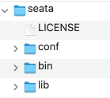
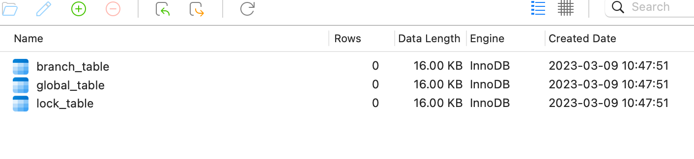
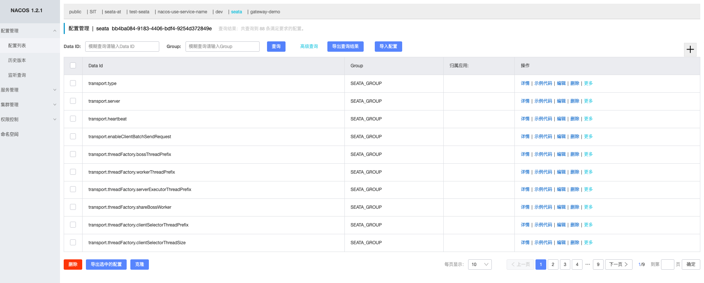
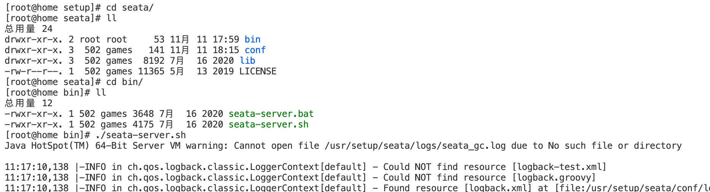
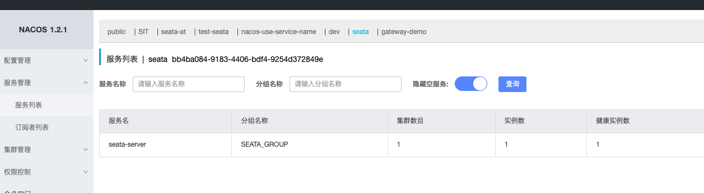

## 前置知识

在了解Seata之前，请先熟悉一下分布式事务的相关知识——[分布式事务概述](./distribute-transaction.md)。简单熟悉一下XA模式、两阶段提交、三阶段提交、TCC、Seaga等概念及原理。

关于Seata的相关知识，可以先去官网了解一下。简单介绍一下，seata支持多种分布式事务，如AT模式、TCC模式、Sega模式等。[官网在这](https://seata.io)

Seata的用法其实很简单，我们类比于在SpringBoot项目中使用Mysql的方式——先部署一个Mysql服务器实例，然后SpringBoot项目中引入依赖，之后在配置文件中配置好Mysql的相关连接信息，之后启动即可使用，在SpringBoot项目中使用Seata的方式也很简单：

1. 搭建一个Seata的服务器实例，这个服务器实例承担的角色是TC的角色，即事务管理器的角色；
2. 在SpringBoot项目中引入依赖；
3. 在配置文件中配置好Seata的相关信息；

我们结合XA理论可知，Seata服务器端实例承载着事务管理器的角色，它承担着统一管理各个『参与者』提交事务、回滚事务的职责；而参与分布式事务的各个『参与者』就是AP的角色，它们则是具体的业务实现，底层连接着数据库，而数据库就是资源管理器（CRM）的角色。

因此，要基于Seata完成分布式事务的实现，就必须先要搭建一个Seata服务端实例。

由于Seata也是JAVA项目，并且支持多种配置方式和持久化方式，这里我们选择基于Nacos和Mysql的方式。其他方式可以自行查看官网。

因此有一个前置条件，要先把Mysql和Nacos启动起来。此外，我们还需要用到源码文件夹下面的一些脚本。因此我们还需要下载相对应版本的源代码。

服务端版本及下载地址： [1.3.0](https://github.com/seata/seata/releases/download/v1.3.0/seata-server-1.3.0.tar.gz) 。

源代码版本及下载地址： [1.3.0](https://github.com/seata/seata/tree/master/script)

总结一下：

1. 启动Mysql
2. 启动Nacos
3. 下载服务器端压缩包
4. 下载源代码中的脚本

## 搭建

### 1. 解压

安装包下载完成之后，上传到服务器上，并完成解压。解压后的文件目录如下：



### 2. 执行脚本

Seata本身也是一个项目，这个执行脚本的过程，本质上就是对Seata进行一个配置。执行脚本有两个步骤，一个是Seata在管理分布式事务时，需要依赖数据库保存一些关键信息；一个是需要导入Seata项目的一些配置信息。**此外，这两个脚本都是在源码项目下面的。**

步骤一，在下载下来的源代码目录下，找到/script/server/db/下面的mysql的脚本，并在mysql中进行执行。

```
-- -------------------------------- The script used when storeMode is 'db' --------------------------------
-- the table to store GlobalSession data
CREATE TABLE IF NOT EXISTS `global_table`
(
    `xid`                       VARCHAR(128) NOT NULL,
    `transaction_id`            BIGINT,
    `status`                    TINYINT      NOT NULL,
    `application_id`            VARCHAR(32),
    `transaction_service_group` VARCHAR(32),
    `transaction_name`          VARCHAR(128),
    `timeout`                   INT,
    `begin_time`                BIGINT,
    `application_data`          VARCHAR(2000),
    `gmt_create`                DATETIME,
    `gmt_modified`              DATETIME,
    PRIMARY KEY (`xid`),
    KEY `idx_gmt_modified_status` (`gmt_modified`, `status`),
    KEY `idx_transaction_id` (`transaction_id`)
) ENGINE = InnoDB
  DEFAULT CHARSET = utf8;

-- the table to store BranchSession data
CREATE TABLE IF NOT EXISTS `branch_table`
(
    `branch_id`         BIGINT       NOT NULL,
    `xid`               VARCHAR(128) NOT NULL,
    `transaction_id`    BIGINT,
    `resource_group_id` VARCHAR(32),
    `resource_id`       VARCHAR(256),
    `branch_type`       VARCHAR(8),
    `status`            TINYINT,
    `client_id`         VARCHAR(64),
    `application_data`  VARCHAR(2000),
    `gmt_create`        DATETIME(6),
    `gmt_modified`      DATETIME(6),
    PRIMARY KEY (`branch_id`),
    KEY `idx_xid` (`xid`)
) ENGINE = InnoDB
  DEFAULT CHARSET = utf8;

-- the table to store lock data
CREATE TABLE IF NOT EXISTS `lock_table`
(
    `row_key`        VARCHAR(128) NOT NULL,
    `xid`            VARCHAR(96),
    `transaction_id` BIGINT,
    `branch_id`      BIGINT       NOT NULL,
    `resource_id`    VARCHAR(256),
    `table_name`     VARCHAR(32),
    `pk`             VARCHAR(36),
    `gmt_create`     DATETIME,
    `gmt_modified`   DATETIME,
    PRIMARY KEY (`row_key`),
    KEY `idx_branch_id` (`branch_id`)
) ENGINE = InnoDB
  DEFAULT CHARSET = utf8;

```



步骤二，导入Seata项目的一些配置信息到nacso上去，由于配置项比较多，官方提供了使用脚本进行导入的方式，这个过程可能需要具备一些Nacos的基本知识。

但是由于我们使用的配置方式是基于mysql和nacos的，因此，我们还需要先修改一下配置信息。我们打开 /script/config-center/ 下面的 config.txt 文件，之后修改下面的几项内容：

```

store.mode=db ## 采用db的存储形式 
store.db.datasource=druid ## druid数据源 
store.db.dbType=mysql ## mysql数据库 
store.db.driverClassName=com.mysql.jdbc.Driver ## mysql驱动 
store.db.url=jdbc:mysql://192.168.1.150:3306/seata_server?useUnicode=true ## TC的数据库url 
store.db.user=root ## 用户名 
store.db.password=root ## 密码 

```

最后只需要在 /script/config-center/nacos/ 目录下执行下面命令即可。Windows平台下面，可以使用gitbash执行。

```
sh nacos-config.sh -h 192.168.1.150 -p 8848 -g SEATA_GROUP -t bb4ba084-9183-4406-bdf4-9254d372849e -u nacos -w nacos
```

执行后的效果如下：




### 3. 修改项目中的配置文件

完成上面的两个步骤之后，Seata的基础环境已经完成了，下面需要配置Seata项目的启动信息，主要是： 让Seata服务实例注册到nacos上 和 让Seata找到Nacos上的配置信息 ，也很简单，**只需要修改安装包下面的 conf/registry.conf 文件中的nacos部分即可**。修改后的结果如下：

```
## 【说明】文件有两部分，一个是registry，表示Seata服务端程序注册到哪里，这里我们把type配置成nacos，然后修改nacos的连接信息即可。
##      另一部分是config，表示Seata服务端程序的配置信息放在哪里，同样的，我们把type改成nacos，然后修改nacos的连接信息即可。

registry {
  # file 、nacos 、eureka、redis、zk、consul、etcd3、sofa
  type = "nacos"

  nacos {
    application = "seata-server"
    serverAddr = "192.168.1.150:8848"
    group = "SEATA_GROUP"
    namespace = "bb4ba084-9183-4406-bdf4-9254d372849e"
    cluster = "default"
    username = "nacos"
    password = "nacos"
  }
  eureka {
    serviceUrl = "http://localhost:8761/eureka"
    application = "default"
    weight = "1"
  }
  redis {
    serverAddr = "localhost:6379"
    db = 0
    password = ""
    cluster = "default"
    timeout = 0
  }
  zk {
    cluster = "default"
    serverAddr = "127.0.0.1:2181"
    sessionTimeout = 6000
    connectTimeout = 2000
    username = ""
    password = ""
  }
  consul {
    cluster = "default"
    serverAddr = "127.0.0.1:8500"
  }
  etcd3 {
    cluster = "default"
    serverAddr = "http://localhost:2379"
  }
  sofa {
    serverAddr = "127.0.0.1:9603"
    application = "default"
    region = "DEFAULT_ZONE"
    datacenter = "DefaultDataCenter"
    cluster = "default"
    group = "SEATA_GROUP"
    addressWaitTime = "3000"
  }
  file {
    name = "file.conf"
  }
}

config {
  # file、nacos 、apollo、zk、consul、etcd3
  type = "nacos"

  nacos {
    serverAddr = "192.168.1.150:8848"
    namespace = "bb4ba084-9183-4406-bdf4-9254d372849e"
    group = "SEATA_GROUP"
    username = "nacos"
    password = "nacos"
  }
  consul {
    serverAddr = "127.0.0.1:8500"
  }
  apollo {
    appId = "seata-server"
    apolloMeta = "http://192.168.1.204:8801"
    namespace = "application"
  }
  zk {
    serverAddr = "127.0.0.1:2181"
    sessionTimeout = 6000
    connectTimeout = 2000
    username = ""
    password = ""
  }
  etcd3 {
    serverAddr = "http://localhost:2379"
  }
  file {
    name = "file.conf"
  }
}
```

### 4. 启动

进入安装包下面的bin目录，在命令行里面直接运行 seata-server.sh 即可。



查看日志中，已经成功启动。


再去nacos上看看，服务实例已经启动，并注册到了Nacos上了。




---


