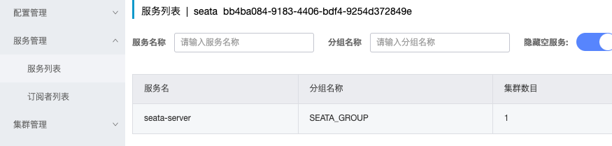

## 使用场景

举一个简单的应用场景：电商系统中，一个用户发起购买商品的动作，后端业务逻辑是

- 扣减库存
- 扣减个人账户上的余额
- 创建一个订单

只要上面有一个步骤没有执行成功，就回滚已经执行成功的其他步骤。为了模拟分布式事务的效果，我们采用创建三个微服务的方式实现。

1. seata-at-storage 库存服务
2. seata-at-account 账户服务
3. seata-at-order 订单服务

所以上面的业务逻辑就变成了，用户发起一个购买商品的服务，直接调用后端 订单服务 ，由订单服务分别调用 库存服务 完成扣减库存功能，然后再调用 账户服务 完成扣减账户金额功能，最后本地生成一个订单。

这里我们需要一个注册中心，把三个服务注册到上面，这样配合OpenFeign完成相互调用，此外我们还需要MySQL作为数据存储，最后我们需要Seata作为我们的事务管理器。

## 搭建seata-at-storage服务模块

1. 先创建数据库

```
-- 仓储
CREATE TABLE `storage` (
  `id` bigint(11) NOT NULL AUTO_INCREMENT,
  `name` varchar(100) DEFAULT NULL,
  `num` bigint(11) DEFAULT NULL COMMENT '数量',
  `create_time` timestamp NOT NULL DEFAULT CURRENT_TIMESTAMP COMMENT '创建时间',
  `price` bigint(10) DEFAULT NULL COMMENT '单价，单位分',
  PRIMARY KEY (`id`) USING BTREE
) ENGINE=InnoDB DEFAULT CHARSET=utf8mb4 ROW_FORMAT=COMPACT;

CREATE TABLE `undo_log` (
  `branch_id` bigint(20) NOT NULL COMMENT 'branch transaction id',
  `xid` varchar(100) NOT NULL COMMENT 'global transaction id',
  `context` varchar(128) NOT NULL COMMENT 'undo_log context,such as serialization',
  `rollback_info` longblob NOT NULL COMMENT 'rollback info',
  `log_status` int(11) NOT NULL COMMENT '0:normal status,1:defense status',
  `log_created` datetime(6) NOT NULL COMMENT 'create datetime',
  `log_modified` datetime(6) NOT NULL COMMENT 'modify datetime',
  UNIQUE KEY `ux_undo_log` (`xid`,`branch_id`) USING BTREE
) ENGINE=InnoDB DEFAULT CHARSET=utf8 ROW_FORMAT=COMPACT COMMENT='AT transaction mode undo table';
```

2. 使用idea工具中的initializer工具，生成模块的骨架，这里不再赘述。

3. 修改pom文件，添加上 nacos注册中心、Mybatis、MySQL、Seata的相关依赖。

```
<dependency>
    <groupId>com.alibaba.cloud</groupId>
    <artifactId>spring-cloud-starter-alibaba-nacos-discovery</artifactId>
  </dependency>

  <dependency>
    <groupId>com.baomidou</groupId>
    <artifactId>mybatis-plus-boot-starter</artifactId>
  </dependency>

  <!-- mysql -->
  <dependency>
    <groupId>mysql</groupId>
    <artifactId>mysql-connector-java</artifactId>
  </dependency>

  <!--seata-->
  <dependency>
    <groupId>com.alibaba.cloud</groupId>
    <artifactId>spring-cloud-starter-alibaba-seata</artifactId>
    <exclusions>
      <!-- 排除依赖 指定版本和服务器端一致 -->
      <exclusion>
        <groupId>io.seata</groupId>
        <artifactId>seata-all</artifactId>
      </exclusion>
      <exclusion>
        <groupId>io.seata</groupId>
        <artifactId>seata-spring-boot-starter</artifactId>
      </exclusion>
    </exclusions>
  </dependency>

  <dependency>
    <groupId>io.seata</groupId>
    <artifactId>seata-all</artifactId>
  </dependency>

  <dependency>
    <groupId>io.seata</groupId>
    <artifactId>seata-spring-boot-starter</artifactId>
  </dependency>
```

4. 修改项目的配置： application.yml

```
server:
  port: 10902

spring:
  application:
    name: seata-at-storage
  datasource:
    url: jdbc:mysql://192.168.1.150:3306/seata_storage?useUnicode=true&characterEncoding=UTF-8&serverTimezone=Asia/Shanghai
    username: root
    password: root
    driver-class-name: com.mysql.cj.jdbc.Driver
    hikari:
      auto-commit: true
      connection-test-query: SELECT 1
      connection-timeout: 30000
      idle-timeout: 180000
      max-lifetime: 0
      maximum-pool-size: 30
      minimum-idle: 10
      pool-name: hikari-pool
  cloud:
    nacos:
      discovery:
        server-addr: 192.168.1.150:8848
        namespace: 2cbceeeb-22f5-40d6-b65c-47f673e79f29


mybatis:
  mapper-locations: classpath:/mapper/*.xml

# 配置日志级别
logging:
  level:
    root: debug

```

5. 之后再使用idea中的easycode插件生成业务代码，关键方法是： `me.zeanzai.seataatstorage.service.impl.StorageServiceImpl#deduct`

```
@Transactional
@Override
public boolean deduct(Long id, Long num) {
    //todo 模拟扣减库存，具体业务逻辑自己完善
    Storage storage = this.storageDao.queryById(id);
    if (Objects.isNull(storage))
        throw new RuntimeException();

    storage.setNum(storage.getNum()-num);

    return this.storageDao.update(storage) > 0;
}
```


## 搭建seata-at-account和seata-at-order服务模块

搭建过程与上面的seata-at-storage服务模块的过程基本类似。

seata-at-account的表结构： 

```sql 

-- 账户余额
CREATE TABLE `account` (
	`id` BIGINT ( 11 ) NOT NULL AUTO_INCREMENT,
	`user_id` VARCHAR ( 32 ) CHARACTER SET utf8mb4 COLLATE utf8mb4_general_ci NULL DEFAULT NULL COMMENT '用 户userId',
	`money` BIGINT ( 11 ) NULL DEFAULT NULL COMMENT '余额，单位分',
  `create_time` timestamp NOT NULL DEFAULT CURRENT_TIMESTAMP COMMENT '创建时间',
	PRIMARY KEY ( `id` ) USING BTREE 
) ENGINE = INNODB CHARACTER SET = utf8mb4 COLLATE = utf8mb4_general_ci ROW_FORMAT = Compact;

CREATE TABLE `undo_log` (
  `branch_id` bigint(20) NOT NULL COMMENT 'branch transaction id',
  `xid` varchar(100) NOT NULL COMMENT 'global transaction id',
  `context` varchar(128) NOT NULL COMMENT 'undo_log context,such as serialization',
  `rollback_info` longblob NOT NULL COMMENT 'rollback info',
  `log_status` int(11) NOT NULL COMMENT '0:normal status,1:defense status',
  `log_created` datetime(6) NOT NULL COMMENT 'create datetime',
  `log_modified` datetime(6) NOT NULL COMMENT 'modify datetime',
  UNIQUE KEY `ux_undo_log` (`xid`,`branch_id`) USING BTREE
) ENGINE=InnoDB DEFAULT CHARSET=utf8 ROW_FORMAT=COMPACT COMMENT='AT transaction mode undo table';
```

seata-at-order服务模块的表结构： 

```


-- 订单
CREATE TABLE `ordertb` (
  `id` bigint(11) NOT NULL AUTO_INCREMENT,
  `product_id` bigint(11) DEFAULT NULL COMMENT '商品Id',
  `num` bigint(11) DEFAULT NULL COMMENT '数量',
  `user_id` varchar(32) DEFAULT NULL COMMENT '用户唯一Id',
  `create_time` timestamp NOT NULL DEFAULT CURRENT_TIMESTAMP COMMENT '创建时间',
  `status` int(1) DEFAULT NULL COMMENT '订单状态 1 未付款 2 已付款 3 已完成',
  PRIMARY KEY (`id`) USING BTREE
) ENGINE=InnoDB CHARACTER SET = utf8mb4 COLLATE = utf8mb4_general_ci  ROW_FORMAT=COMPACT;

CREATE TABLE `undo_log` (
  `branch_id` bigint(20) NOT NULL COMMENT 'branch transaction id',
  `xid` varchar(100) NOT NULL COMMENT 'global transaction id',
  `context` varchar(128) NOT NULL COMMENT 'undo_log context,such as serialization',
  `rollback_info` longblob NOT NULL COMMENT 'rollback info',
  `log_status` int(11) NOT NULL COMMENT '0:normal status,1:defense status',
  `log_created` datetime(6) NOT NULL COMMENT 'create datetime',
  `log_modified` datetime(6) NOT NULL COMMENT 'modify datetime',
  UNIQUE KEY `ux_undo_log` (`xid`,`branch_id`) USING BTREE
) ENGINE=InnoDB DEFAULT CHARSET=utf8 ROW_FORMAT=COMPACT COMMENT='AT transaction mode undo table';
```

扣减金额的关键代码， `me.zeanzai.seataataccount.service.impl.AccountServiceImpl#deduct` ： 

```
@Transactional
@Override
public boolean deduct(String userId, Long money) {
    Account account = this.accountDao.queryByUserId(userId);
    if (Objects.isNull(account)) {
        return false;

    }
    account.setMoney(account.getMoney()-money);
    return this.accountDao.update(account)>0;
}
```

由于 seata-at-order 服务模块中需要使用OpenFeign来调用仓储和账户服务，因此还需要创建两个接口： 


```
@FeignClient(value = "seata-at-account")
public interface AccountFeignClient {

    @PostMapping("/account/deduct")
    boolean deduct(@RequestParam("userId") String userId,
                   @RequestParam("money") Long money);

}
```

```
@FeignClient(value = "seata-at-storage")
public interface StorageFeignClient {

    @GetMapping("/storage/{id}")
    ResponseEntity<Storage> queryById(@PathVariable("id") Long id);

    @PostMapping("/storage/deduct")
    boolean deduct(@RequestParam("id") Long id,
                   @RequestParam("num") Long num);
}

```

之后就是生成订单的关键代码， `me.zeanzai.seataatorder.service.impl.OrdertbServiceImpl#createOrder` ：

```
@Transactional
@Override
public boolean createOrder(String userId, Long productId, Long num) {
    // 1. 扣减库存
    storageFeignClient.deduct(productId, num);

    // 2. 扣减余额
    ResponseEntity<Storage> storageResponseEntity = storageFeignClient.queryById(productId);
    Storage body = storageResponseEntity.getBody();
    accountFeignClient.deduct(userId, body.getPrice() * num);
    // 3. 创建订单
    Ordertb ordertb = new Ordertb();
    ordertb.setNum(num);
    ordertb.setUserId(userId);
    ordertb.setProductId(productId);
    ordertb.setStatus(2);
    return this.ordertbDao.insert(ordertb)>0;
}
```

## 启动并测试

分别启动 seata-at-storage 、 seata-at-account 、seata-at-order 模块，我们会发现已经注册到nacos上了。


之后我们只需要调用订单模块中的createOrder接口就行了。

特别注意的点：三个服务模块中都只是使用`@Transactional`标注了本地事务，并没有开始分布式事务。


## 整合Seata

直到这一步，我们跟Seata没有任何关系，因为我们生成订单的方法中并没有定义事务，只是简单的本地事务，在生成订单的接口中，如果扣减库存的接口出现超时等异常错误信息，扣减金额和生成订单的逻辑并不会回滚。下面我们来说整合Seata的过程。安装和配置Seata这里就不再赘述。

1. 首先要先启动Seata



2. 在三个模块中分别添加Seata的配置

```
seata:
  enabled: true
  application-id: ${spring.application.name}
  tx-service-group: ${spring.application.name}-tx-group
  config:
    type: nacos
    nacos:
      namespace: bb4ba084-9183-4406-bdf4-9254d372849e
      server-addr: 192.168.1.150:8848
      group: SEATA_GROUP
      username: nacos
      password: nacos
  registry:
    type: nacos
    nacos:
      application: seata-server
      namespace: bb4ba084-9183-4406-bdf4-9254d372849e
      server-addr: 192.168.1.150:8848
      group: SEATA_GROUP
      username: nacos
      password: nacos
```

3. 创建Seata服务端配置，这里要特别注意：值均为default。


4. 修改业务代码，在订单模块中设置生成订单的方法为全局事务

```
@Override
@GlobalTransactional
public boolean createOrder(String userId, Long productId, Long num) {
    // 1. 扣减库存
    storageFeignClient.deduct(productId, num);

    // 2. 扣减余额
    ResponseEntity<Storage> storageResponseEntity = storageFeignClient.queryById(productId);
    Storage body = storageResponseEntity.getBody();
    accountFeignClient.deduct(userId, body.getPrice() * num);
    // 3. 创建订单
    Ordertb ordertb = new Ordertb();
    ordertb.setNum(num);
    ordertb.setUserId(userId);
    ordertb.setProductId(productId);
    ordertb.setStatus(2);
    return this.ordertbDao.insert(ordertb)>0;
}
```

5. 启动测试 


---


